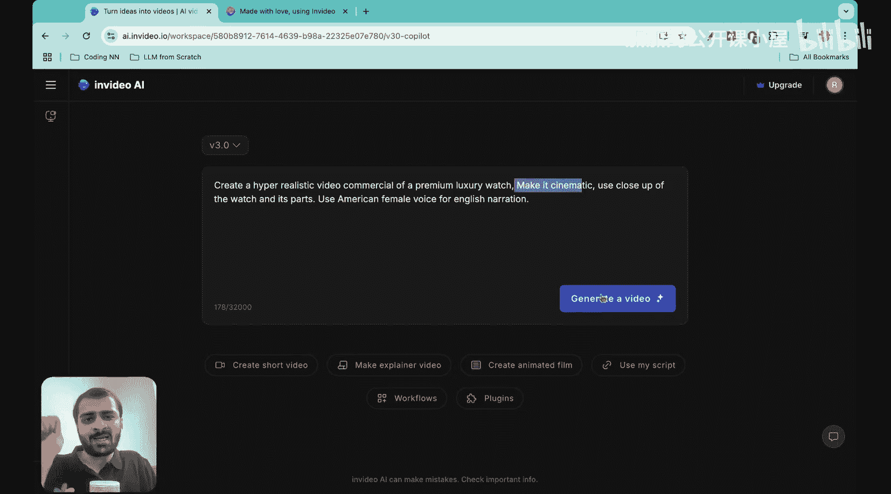
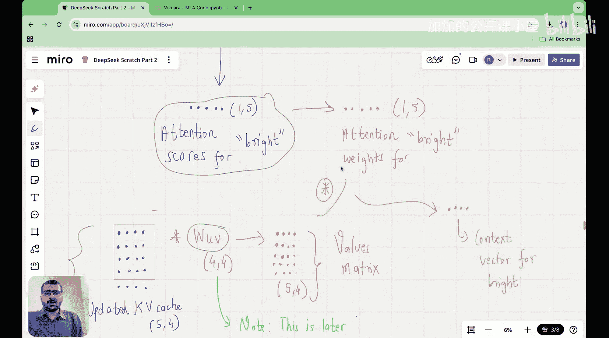

#  013：用Python从零编写多头潜在注意力机制

在本节课中，我们将学习并动手编写DeepSeek架构中引入的多头潜在注意力机制。我们将从最基础的版本开始，理解其核心概念和数学原理，并最终用代码实现它。

## 概述

在上一节课中，我们初步了解了潜在注意力机制。本节我们将深入探讨其最基础的多头版本，并完成从零开始的代码实现。核心在于理解两个关键点：**潜在矩阵** 和 **吸收技巧**。



## 潜在注意力机制回顾

首先，让我们快速回顾潜在注意力机制的基本原理。请始终从大语言模型推理的角度来思考潜在注意力。

假设我们有一个输入序列，包含四个令牌，每个令牌的嵌入维度为八。这可以表示为一个输入嵌入矩阵 `X`。

在潜在注意力中，第一步是将这个输入嵌入矩阵投影到一个潜在空间。为此，我们将输入矩阵 `X` 乘以一个下投影矩阵 `W_DKV`。这个矩阵将我们的输入从八维空间投影到一个更低维的空间，例如四维。

这个乘积的结果是一个我们称之为 `C_KV` 的矩阵。在潜在注意力中，你只需要缓存这一个矩阵。你不需要分别缓存键矩阵和值矩阵，只需缓存 `C_KV`，这大大减少了KV缓存的内存占用。


获得这个缓存的潜在矩阵后，我们将其分别乘以键上投影矩阵 `W_UK` 和值上投影矩阵 `W_UV`，从而得到键矩阵和值矩阵。机制的其余部分与传统的多头注意力块非常相似。

## 理解吸收技巧

你可能会问，增加这个额外的矩阵究竟实现了什么？为了真正理解这一点，我们需要学习一个巧妙的数学技巧，即将查询权重矩阵 `W_Q` 和键上投影矩阵 `W_UK` 合并。

传统上，查询向量是通过输入 `X` 乘以 `W_Q` 计算得到的。但我们将把 `W_Q` 与 `W_UK` 合并，这样我们只需要缓存 `C_KV`。

以下是具体过程：
*   查询：`Q = X * W_Q`
*   潜在矩阵：`C_KV = X * W_DKV`
*   键矩阵：`K = C_KV * W_UK`
*   值矩阵：`V = C_KV * W_UV`

由于 `C_KV = X * W_DKV`，我们可以将键矩阵重写为 `K = X * W_DKV * W_UK`，值矩阵重写为 `V = X * W_DKV * W_UV`。

吸收技巧出现在计算注意力分数时。注意力分数是查询与键转置的乘积：
`注意力分数 = Q * K^T = (X * W_Q) * (X * W_DKV * W_UK)^T`

我们可以将 `W_UK^T` 与 `W_Q` 合并成一个矩阵，即 `W_Q * W_UK^T`。这个合并后的矩阵在训练时是固定的，我们只需要计算一次。而括号中剩下的 `X * W_DKV` 正是我们需要缓存的 `C_KV`。

因此，我们得到了一个“吸收查询”：`吸收查询 = X * (W_Q * W_UK^T)`。我们只需将这个吸收查询向量与缓存的 `C_KV` 相乘即可得到注意力分数。

## 计算流程总结

让我们总结一下整个计算流程，以清晰理解缓存如何发挥作用。

当一个新的令牌（例如“bright”）到来时，我们首先计算它的吸收查询向量。如果新令牌是一个 `d` 维向量 `x_bright`，我们将其与合并后的矩阵 `(W_Q * W_UK^T)` 相乘，得到吸收查询向量。

为了计算注意力分数，我们只需将这个吸收查询向量与更新后的KV缓存相乘。

同时，我们计算新令牌的潜在向量：`c_kv_new = x_bright * W_DKV`，并将其追加到先前的KV缓存中，形成更新后的KV缓存。

获得注意力分数后，我们进行缩放和softmax操作得到注意力权重。

为了得到上下文向量，我们将注意力权重与值矩阵相乘。而值矩阵可以通过更新后的KV缓存乘以 `W_UV` 得到：`V = C_KV * W_UV`。

最后，为了得到逻辑矩阵（用于预测下一个令牌），我们将上下文向量矩阵与输出投影矩阵 `W_O` 相乘。这里，`C_KV` 是缓存的，而 `W_UV * W_O` 也是在训练时固定的，只需计算一次。

以上过程表明，即使我们只缓存了潜在矩阵 `C_KV`，我们仍然可以计算出逻辑矩阵并进行下一个令牌的预测。

## 代码实现步骤

现在，我们将把上述理论转化为代码。以下是实现多头潜在注意力机制的关键步骤。

首先，我们需要初始化所有必要的权重矩阵。

```python
import torch
import torch.nn as nn
import torch.nn.functional as F

class MultiHeadLatentAttention(nn.Module):
    def __init__(self, d_model, num_heads, latent_dim):
        super().__init__()
        self.d_model = d_model
        self.num_heads = num_heads
        self.latent_dim = latent_dim
        self.head_dim = d_model // num_heads

        # 投影矩阵
        self.W_q = nn.Linear(d_model, d_model)  # 查询投影
        self.W_dkv = nn.Linear(d_model, latent_dim)  # 下投影到潜在空间
        self.W_uk = nn.Linear(latent_dim, d_model)  # 键上投影
        self.W_uv = nn.Linear(latent_dim, d_model)  # 值上投影
        self.W_o = nn.Linear(d_model, d_model)  # 输出投影

        # 吸收技巧：预先计算合并的矩阵 (W_q * W_uk^T)
        # 注意：在实际训练中，这通常通过重参数化实现，这里为清晰起见分开表示。
        self.absorbed_W_q = None # 将在后续计算
```

接下来，实现前向传播逻辑，包括吸收技巧和缓存机制。

```python
    def forward(self, x, past_kv_cache=None):
        batch_size, seq_len, _ = x.shape

        # 1. 计算吸收查询 (应用吸收技巧)
        # 首先计算标准查询
        q = self.W_q(x)  # [batch, seq, d_model]
        # 将查询重塑为多头格式
        q = q.view(batch_size, seq_len, self.num_heads, self.head_dim).transpose(1, 2)  # [batch, heads, seq, head_dim]

        # 2. 计算潜在KV缓存 C_KV = X * W_DKV
        c_kv = self.W_dkv(x)  # [batch, seq, latent_dim]

        # 处理缓存：如果提供了过去的缓存，则与当前计算的结果拼接
        if past_kv_cache is not None:
            # past_kv_cache: [batch, past_seq, latent_dim]
            c_kv = torch.cat([past_kv_cache, c_kv], dim=1)  # [batch, total_seq, latent_dim]

        current_kv_cache = c_kv  # 用于返回，供下一个时间步使用

        total_seq_len = c_kv.size(1)

        # 3. 从潜在缓存计算键和值 (K = C_KV * W_UK, V = C_KV * W_UV)
        # 为高效计算，先投影再重塑为多头
        k = self.W_uk(c_kv)  # [batch, total_seq, d_model]
        v = self.W_uv(c_kv)  # [batch, total_seq, d_model]

        # 重塑为多头格式
        k = k.view(batch_size, total_seq_len, self.num_heads, self.head_dim).transpose(1, 2)  # [batch, heads, total_seq, head_dim]
        v = v.view(batch_size, total_seq_len, self.num_heads, self.head_dim).transpose(1, 2)  # [batch, heads, total_seq, head_dim]

        # 4. 计算注意力分数: Q * K^T / sqrt(d_k)
        attn_scores = torch.matmul(q, k.transpose(-2, -1)) / (self.head_dim ** 0.5)  # [batch, heads, seq, total_seq]

        # 5. 应用注意力掩码（防止看到未来令牌）并计算softmax
        # 生成一个下三角掩码（包括对角线）
        mask = torch.tril(torch.ones(seq_len, total_seq_len, device=x.device)).view(1, 1, seq_len, total_seq_len)
        attn_scores = attn_scores.masked_fill(mask == 0, float('-inf'))
        attn_weights = F.softmax(attn_scores, dim=-1)  # [batch, heads, seq, total_seq]

        # 6. 计算上下文向量: AttnWeights * V
        context = torch.matmul(attn_weights, v)  # [batch, heads, seq, head_dim]

        # 7. 合并多头输出并应用输出投影
        context = context.transpose(1, 2).contiguous().view(batch_size, seq_len, self.d_model)  # [batch, seq, d_model]
        output = self.W_o(context)  # [batch, seq, d_model]

        return output, current_kv_cache
```

## 模拟推理过程

为了展示该机制在自回归生成中如何工作，我们可以模拟一个简单的步骤。

```python
# 模拟参数
d_model = 512
num_heads = 8
latent_dim = 128  # 小于 d_model
batch_size = 2
seq_len = 1  # 模拟生成下一个令牌

# 初始化注意力模块
attn = MultiHeadLatentAttention(d_model, num_heads, latent_dim)

# 初始输入（例如，起始令牌）
x_step0 = torch.randn(batch_size, 5, d_model)  # 假设已有5个令牌的序列
output_step0, kv_cache = attn(x_step0)  # 初始调用，无过去缓存
print(f"初始输出形状: {output_step0.shape}, KV缓存形状: {kv_cache.shape}")

# 模拟生成下一个令牌（步骤1）
x_step1 = torch.randn(batch_size, 1, d_model)  # 新生成的1个令牌
output_step1, kv_cache = attn(x_step1, past_kv_cache=kv_cache) # 传入上一步的缓存
print(f"步骤1输出形状: {output_step1.shape}, 更新后KV缓存形状: {kv_cache.shape}")
```

## 总结



本节课中，我们一起学习了DeepSeek中使用的多头潜在注意力机制。我们从最基础的版本入手，深入理解了其两个核心：**潜在KV缓存矩阵** 和 **吸收技巧**。潜在缓存将输入投影到低维空间，只需缓存此单一矩阵，显著降低了内存占用。吸收技巧通过合并矩阵，使得在推理时只需用新令牌计算吸收查询，并与缓存相乘即可高效完成注意力计算。最后，我们通过代码逐步实现了该机制，并模拟了其自回归推理过程。掌握这一机制是理解现代高效大语言模型推理优化的关键一步。