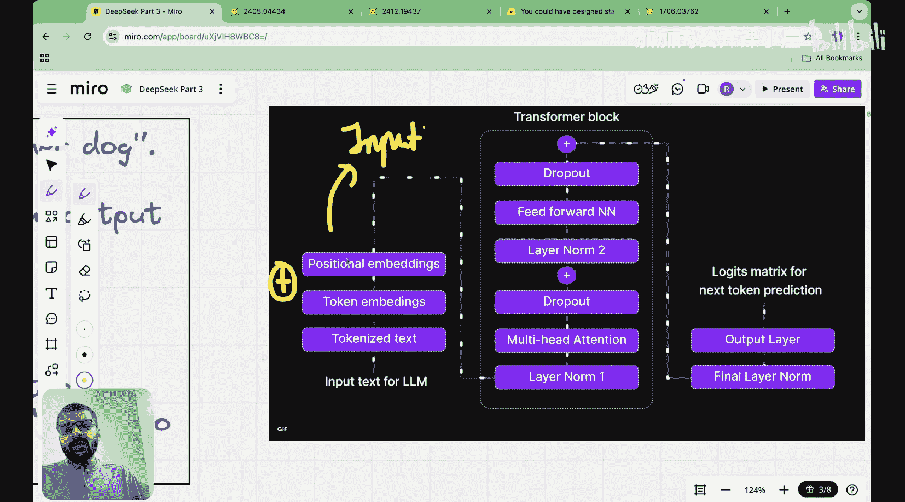
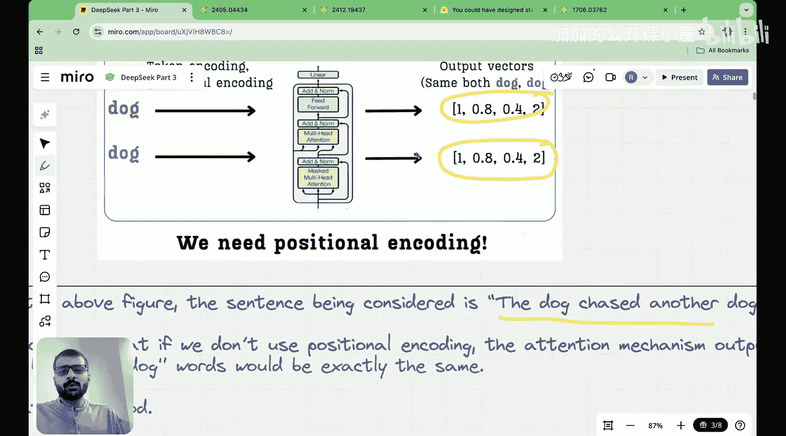
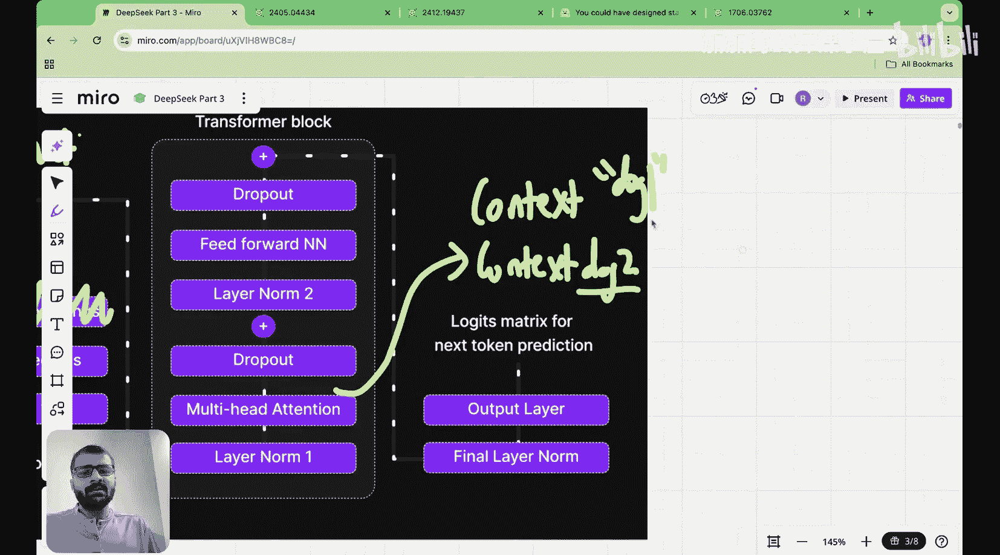
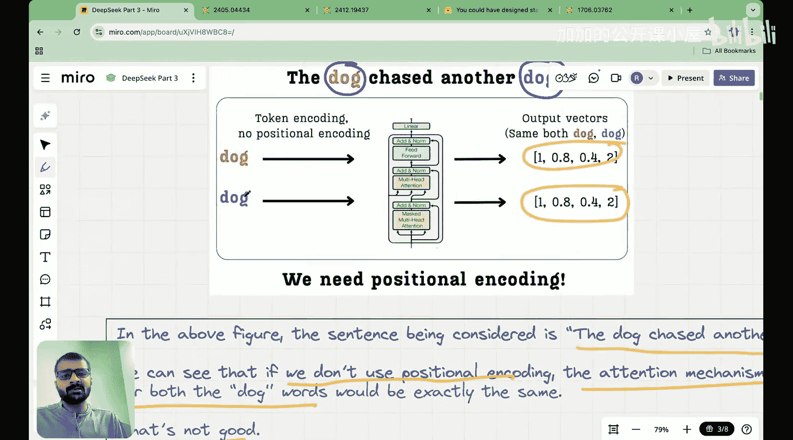

#  014：整数与二进制位置编码 | 通往旋转位置编码之路

在本节课中，我们将开始学习位置编码。我们将首先理解为什么在Transformer模型中需要位置编码，然后介绍两种基础的位置编码方法：整数位置编码和二进制位置编码。这些知识是理解后续更高级的旋转位置编码的基础。

## 为什么需要位置编码？

在上一节课中，我们学习了多头潜在注意力机制。我们开启这个系列课程的目的是深入理解DeepSeek的架构，并最终从零开始构建其各个组件。


那么，为什么现在要开始学习位置编码呢？让我们了解一下背景。这是2024年6月发布的DeepSeek-V2论文。如果你查看其中的多头潜在注意力部分，他们首先介绍了简化的多头潜在注意力，也就是我们上节课看到的内容。但在此之后，在第2.1.3节，他们引入了一种称为“解耦旋转位置嵌入”的技术。

他们在解耦旋转位置嵌入中所做的，是将多头潜在注意力与一种叫做旋转位置嵌入的技术结合起来。这导致了潜在注意力机制中一个更强大的多头潜在注意力版本。在我们之前看到的潜在注意力机制中，我们并没有包含位置嵌入，特别是旋转位置嵌入。

为了理解这个高级的多头潜在注意力机制，我们确实需要理解旋转位置嵌入的含义。如果你查看2025年发布的DeepSeek-V3论文，它最终引发了整个DeepSeek革命，并催生了DeepSeek-R1等模型，你会发现他们直接从这个默认使用旋转位置编码的多头潜在注意力开始。

因此，我们现在用两到三节课来讲解位置嵌入或位置编码的原因，是我们最终想要理解旋转位置编码是什么，然后我们将理解多头潜在注意力是如何与旋转位置嵌入结合，以创建一个更高级的潜在注意力机制版本。

我计划这样划分课程：在今天的课程中，我将向你介绍什么是位置嵌入。然后，我们将看看两种类型的位置编码：整数位置编码和二进制位置编码。这就是今天课程的目的。在下一节课中，我们将学习正弦位置编码，这种编码是在《Attention Is All You Need》论文中引入的。然后，在之后的课程中，我们最终将学习旋转位置嵌入，这将帮助我们理解这些旋转位置嵌入是如何与潜在注意力结合的。


我之所以想按这个顺序进行，是希望你能从零开始了解每一个细节。如果我们直接开始讲旋转位置嵌入，可能会丢失一些理解和概念。我想带你了解这些进步是如何被发现的，所以我会从今天课程的第一步，走到第二步，再到第三步。

好了，让我们开始今天的课程，我们将涵盖以下三部分内容：位置编码介绍、整数位置编码和二进制位置编码。

## 什么是位置编码？

首先，什么是位置编码，以及为什么我们首先需要位置嵌入或位置编码？

主要原因是，一个词在句子中出现的位置对于句子的上下文非常重要。

让我澄清这一点。假设有一个句子：“The dog chased another dog”。这里有两个“dog”。假设我完全不考虑位置嵌入或位置编码，这意味着什么？这意味着通常在Transformer架构的输入块中，当给定的输入文本进入时，它首先被分词，转换成词元嵌入，然后我们将位置嵌入加到词元嵌入上，这就产生了所谓的输入嵌入，然后被传递到Transformer块。

假设我们根本没有这个位置嵌入层，只有词元嵌入。现在，如果我输入这个句子“The dog chased another dog”，并通过输入块传递。会发生的情况是，这两个“dog”都会被转换成词元嵌入。这两个词的词元嵌入是相同的，因为它们是同一个单词。所以，第一个“dog”的词元嵌入向量是这个，第二个“dog”的词元嵌入向量也是这个，这两个是完全相同的向量。现在，这两个向量将直接传递到Transformer层，而不添加任何类型的位置信息。这意味着对于这两个词元，输入到Transformer块的内容是完全相同的。

这进一步意味着，当我们从注意力块出来并获得上下文向量时，我们得到第一个“dog”的上下文向量和第二个“dog”的上下文向量，这两个上下文向量将完全相同。因为现在Transformer块对这两个“dog”的输入是完全相同的，所以它们将在Transformer块中经历完全相同的操作，导致这两个“dog”的上下文向量完全相同。

这完全不是我想要的。我希望我的Transformer块能够捕捉到这两个是不同的“dog”这一事实。我不希望我的Transformer认为它们是相同的狗，我希望这个“dog”和那个“dog”的上下文向量完全不同。这就是位置非常重要的原因。如果我们不使用位置编码，注意力机制对这两个“dog”的输出将完全相同。这不好。

从注意力块出来后，我们希望模型能够理解句子的上下文。我们希望模型理解，正在追逐的第一个“dog”与被追逐的第二个“dog”是不同的。因此，在我们进入Transformer块之前，我们想在这个“dog”和那个“dog”之间创建一些区别。我们实现这一点的方法是在词元嵌入向量上添加另一个向量，这就是位置嵌入向量。

## 整数位置编码

现在，让我们看看第一种简单的位置编码方法：整数位置编码。

以下是整数位置编码的基本思想：我们为序列中的每个位置分配一个唯一的整数。例如，在句子“The dog chased another dog”中：
*   “The”在位置0
*   “dog”在位置1
*   “chased”在位置2
*   “another”在位置3
*   “dog”在位置4

然后，我们不是直接使用这些整数，而是将它们转换为一个向量。一种简单的方法是使用一个可学习的嵌入层，类似于词元嵌入层。这个嵌入层将整数位置索引映射到一个固定维度的向量。


**公式表示：**
假设我们的位置嵌入维度是 `d_model`，我们有一个可学习的嵌入矩阵 `P`，其形状为 `(max_seq_len, d_model)`。对于序列中位置为 `pos` 的词元，其位置编码向量 `PE(pos)` 就是矩阵 `P` 的第 `pos` 行。


**代码描述：**
```python
import torch
import torch.nn as nn

# 假设最大序列长度为512，模型维度为768
max_seq_len = 512
d_model = 768

# 定义一个可学习的位置嵌入层
position_embedding = nn.Embedding(max_seq_len, d_model)

# 为一个长度为5的序列生成位置索引
positions = torch.tensor([0, 1, 2, 3, 4])
# 获取位置编码向量
pos_embeddings = position_embedding(positions) # 形状: (5, 768)
```

这种方法简单直观。然而，它有一个主要的局限性：它无法处理训练时未见过的、超过 `max_seq_len` 的序列长度。模型无法为位置512生成有意义的嵌入，因为它只学习到了0到511的位置。

## 二进制位置编码

为了克服整数编码的长度限制，人们提出了二进制位置编码。其核心思想是使用二进制表示来编码位置。


二进制位置编码的工作原理如下：首先，将位置索引转换为二进制形式。然后，将这个二进制表示的每一位都视为一个独立的特征维度。由于二进制表示是确定性的，模型理论上可以泛化到任意长的序列，只要二进制位数足够。

**步骤说明：**
1.  确定位置编码的维度 `d_model`。这决定了我们用多少位二进制数来表示位置。
2.  对于给定的位置 `pos`，将其转换为一个 `d_model` 位的二进制数。
3.  将这个二进制数的每一位（0或1）作为位置编码向量的一个元素。



**示例：**
假设 `d_model = 3`，我们想编码位置 `pos = 5`。
*   5的二进制是 `101`。
*   那么位置编码向量就是 `[1, 0, 1]`。

如果 `d_model` 更大，比如8，位置5（二进制`00000101`）的编码就是 `[0, 0, 0, 0, 0, 1, 0, 1]`。

**公式表示：**
对于位置 `pos` 和维度索引 `i`（从0开始），位置编码的第 `i` 个元素 `PE(pos)[i]` 可以通过以下方式计算：
`PE(pos)[i] = (pos >> i) & 1`
其中 `>>` 是右移位运算符，`&` 是按位与运算符。



**代码描述：**
```python
import torch

def binary_positional_encoding(positions, d_model):
    """
    生成二进制位置编码。
    Args:
        positions: 位置索引的张量，形状为 (seq_len,)
        d_model: 位置编码的维度
    Returns:
        位置编码张量，形状为 (seq_len, d_model)
    """
    seq_len = positions.shape[0]
    # 创建一个形状为 (seq_len, d_model) 的零张量
    encoding = torch.zeros((seq_len, d_model), dtype=torch.float32)
    for i in range(d_model):
        # 计算每个维度的二进制位
        encoding[:, i] = (positions >> i) & 1
    return encoding



# 示例：为位置 [0, 1, 2, 3, 4, 5] 生成3维二进制编码
positions = torch.tensor([0, 1, 2, 3, 4, 5])
d_model = 3
binary_pe = binary_positional_encoding(positions, d_model)
print(binary_pe)
# 输出可能类似于：
# tensor([[0., 0., 0.], # 位置0: 000
#         [1., 0., 0.], # 位置1: 001
#         [0., 1., 0.], # 位置2: 010
#         [1., 1., 0.], # 位置3: 011
#         [0., 0., 1.], # 位置4: 100
#         [1., 0., 1.]])# 位置5: 101
```

二进制编码解决了长度泛化问题，但它引入了新的问题：向量表示是离散的（只有0和1），并且相邻位置（如7`111`和8`1000`）的编码可能发生剧烈的汉明距离变化，这与位置关系的平滑性直觉不符。此外，高维二进制向量非常稀疏。

## 总结

在本节课中，我们一起学习了位置编码的基础知识及其重要性。我们了解到，位置编码是为了让Transformer模型能够区分序列中不同位置的相同词元，从而更好地理解上下文。

我们详细探讨了两种基础的位置编码方法：
1.  **整数位置编码**：为每个位置分配一个可学习的唯一向量。优点是简单，但无法处理超过训练时最大长度的序列。
2.  **二进制位置编码**：将位置索引用二进制表示，每一位作为编码的一个维度。优点是理论上可以无限扩展长度，但表示是离散且不平滑的，相邻位置的编码变化可能很大。



这两种方法虽然各有优缺点，但它们为我们理解位置编码问题奠定了重要的基础。在下一节课中，我们将学习一种更优雅、更强大的位置编码方法——正弦位置编码，它由《Attention Is All You Need》论文提出，并成为后续许多模型（包括通向旋转位置编码）的基石。