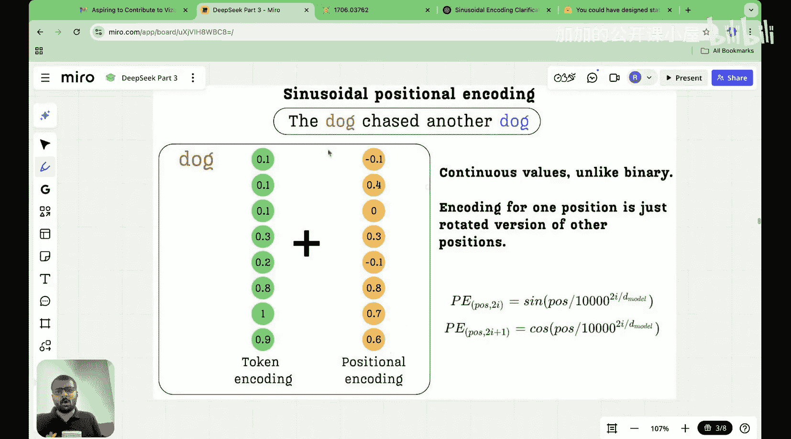

#  015：关于正弦位置编码的一切

在本节课中，我们将深入探讨Transformer架构中一个关键但可能令人困惑的组件：**正弦位置编码**。我们将了解它为何被提出，它如何工作，以及它如何优雅地解决了之前位置编码方案（整数和二进制编码）的局限性。

## 概述

在上一节中，我们介绍了两种基本的位置编码方法：整数编码和二进制编码。整数编码简单但会污染词嵌入的语义信息，而二进制编码解决了数值范围问题，却引入了不连续的跳跃，不利于模型优化。本节中，我们来看看**正弦位置编码**如何通过引入连续、平滑的函数来解决这些问题。

## 回顾：整数与二进制位置编码

首先，让我们快速回顾一下之前的内容，以便更好地理解正弦编码的动机。

**整数位置编码**：为每个位置分配一个整数向量。例如，位置200的编码向量是 `[200, 200, ..., 200]`。这种方法的主要问题是，位置编码的值可能非常大（取决于上下文长度），从而完全稀释了词嵌入所携带的语义信息。

**二进制位置编码**：将位置索引转换为二进制表示。例如，位置200（二进制11001000）的8维编码可能是 `[1, 1, 0, 0, 1, 0, 0, 0]`。这解决了数值范围问题（值被限制在0和1之间），但我们观察到一个关键模式：**低位索引（最低有效位）在位置之间变化最快，而高位索引（最高有效位）变化最慢**。然而，二进制编码的值是离散的（非0即1），这种不连续性在模型预训练期间会给优化过程带来困难。

那么，我们能否有一种编码，既保留二进制编码中“不同频率变化”的特性，又能使数值变化平滑连续呢？这就是正弦位置编码的出发点。

## 正弦位置编码的核心思想

正弦位置编码的设计目的是解决二进制编码的不连续性问题，并使其变得连续。它基于一个深刻的观察：我们可以用不同频率的正弦和余弦函数来模拟二进制编码中不同比特的振荡行为。

以下是正弦位置编码的核心公式。对于给定位置 `pos` 和编码向量中的维度索引 `i`，其编码值计算如下：

*   如果 `i` 是偶数（即 `i % 2 == 0`）：
    `PE(pos, i) = sin(pos / 10000^(i / d_model))`

*   如果 `i` 是奇数（即 `i % 2 == 1`）：
    `PE(pos, i) = cos(pos / 10000^((i-1) / d_model))`

其中：
*   `pos` 是单词在序列中的位置（0, 1, 2, ...）。
*   `i` 是编码向量的维度索引（0, 1, 2, ..., d_model-1）。
*   `d_model` 是词嵌入和位置编码的维度。

### 公式解析与直观理解

这个公式可能看起来复杂，但我们可以从几个关键角度来理解它：

1.  **连续性与平滑性**：`sin` 和 `cos` 函数的值域是连续的 `[-1, 1]`。这完美替代了二进制编码中离散的 `{0, 1}`，使得编码值的变化是平滑的，极大地方便了基于梯度的优化算法。

2.  **频率随维度变化**：注意公式中的分母 `10000^(i / d_model)`。随着维度索引 `i` 的增大，这个分母会以指数方式增长，导致 `pos` 除以一个更大的数。这意味着：
    *   对于较小的 `i`（低位维度），`pos / 大数` 变化相对较快，因此 `sin/cos` 函数的振荡频率**高**（变化快）。
    *   对于较大的 `i`（高位维度），`pos / 超大数` 变化非常缓慢，因此 `sin/cos` 函数的振荡频率**低**（变化慢）。
    *   这精确地模拟了我们在二进制编码中观察到的模式：**低维编码细粒度变化（高频），高维编码粗粒度变化（低频）**。

3.  **正弦与余弦交替使用**：交替使用 `sin` 和 `cos` 函数为每个位置提供了一个唯一且丰富的表示。它确保了即使模型遇到比训练时更长的序列，基于三角函数的性质，编码也能在一定程度上外推。

### 可视化理解

想象一下，我们将位置编码向量的每一个维度（共 `d_model` 个）都画成一条随着位置 `pos` 变化的曲线。
*   维度0（`i=0`）的曲线会像高频波一样快速上下摆动。
*   维度 `d_model-1`（`i` 最大）的曲线则会像一条非常平缓、几乎像直线一样的低频波。
*   中间的维度则具有介于两者之间的频率。

所有这些都是平滑、连续的曲线，没有跳跃。模型可以轻松地学习这些模式。

## 总结

本节课中，我们一起学习了Transformer中至关重要的**正弦位置编码**。

*   **动机**：为了解决二进制位置编码的**不连续性**问题，同时保留其**不同维度以不同频率变化**的优点。
*   **核心方法**：使用不同频率的**正弦（sin）** 和**余弦（cos）** 函数来生成位置编码。公式确保了低维度高频率（细粒度变化），高维度低频率（粗粒度变化）。
*   **优势**：
    1.  **值域合适**：编码值被限制在 `[-1, 1]` 的连续区间内，不会像整数编码那样淹没词嵌入信息。
    2.  **平滑连续**：`sin/cos` 函数是平滑的，便于模型优化。
    3.  **蕴含相对位置信息**：由于三角函数的性质，模型有可能学习到如“位置5和位置7的距离与位置20和位置22的距离相似”这样的相对位置关系。

正弦位置编码是Transformer能够有效处理序列顺序的基础。理解了它，就为我们下一节探讨更先进的**旋转位置编码**奠定了坚实的基础。旋转位置编码正是为了解决正弦编码在自注意力机制中的某些局限性而诞生的。