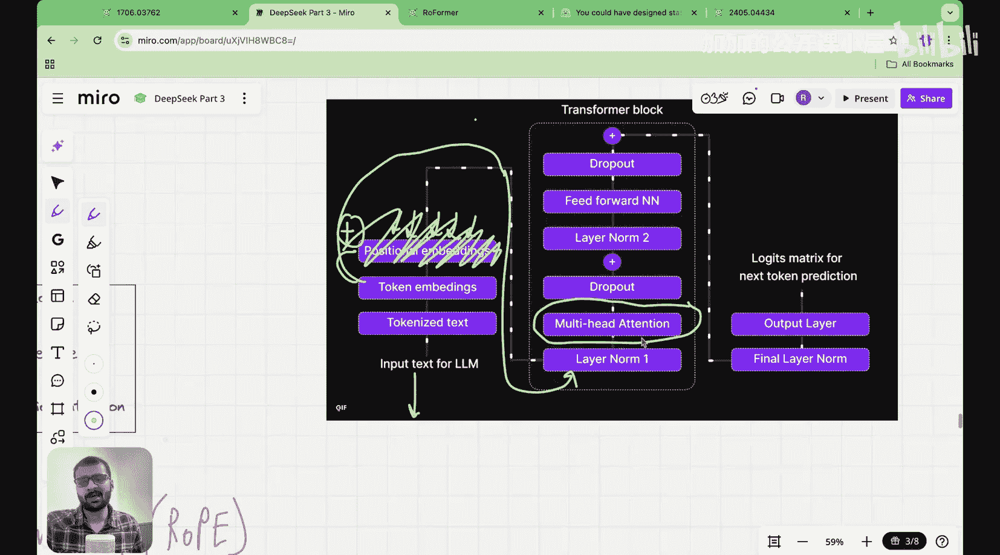
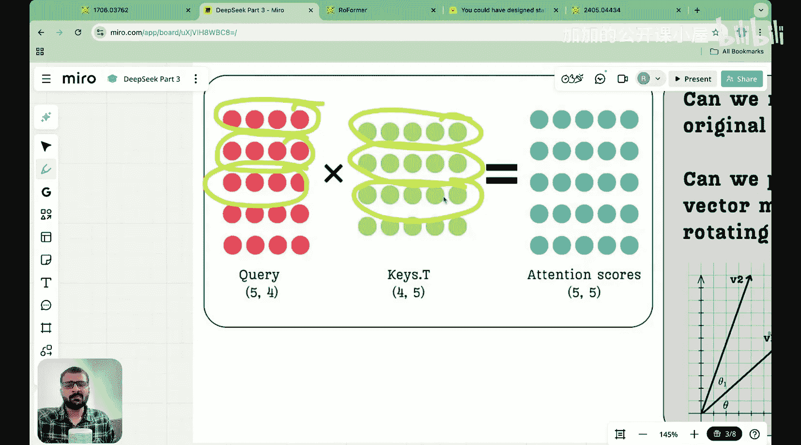
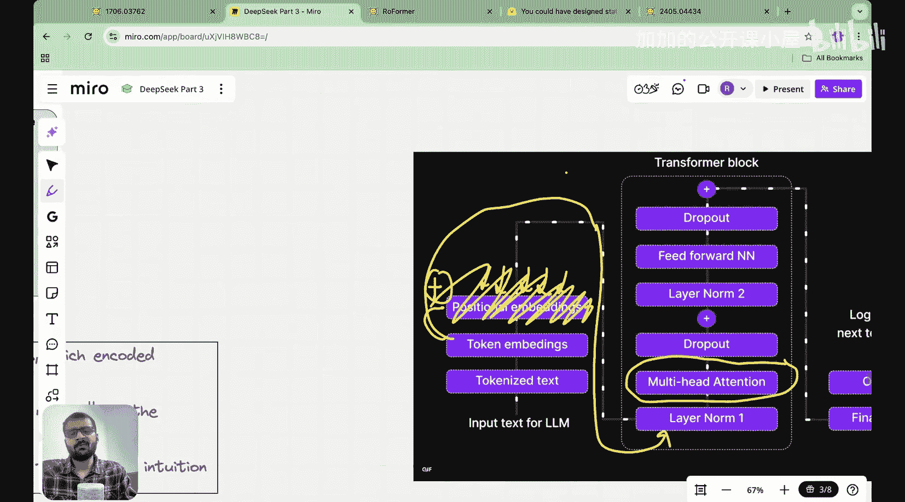
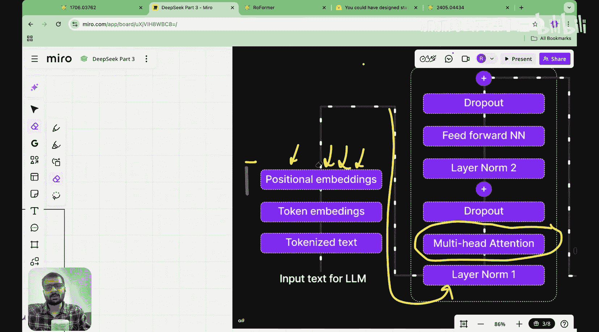
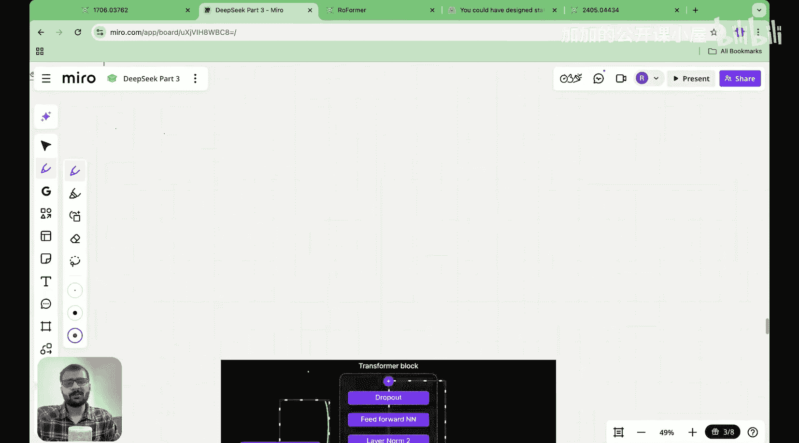
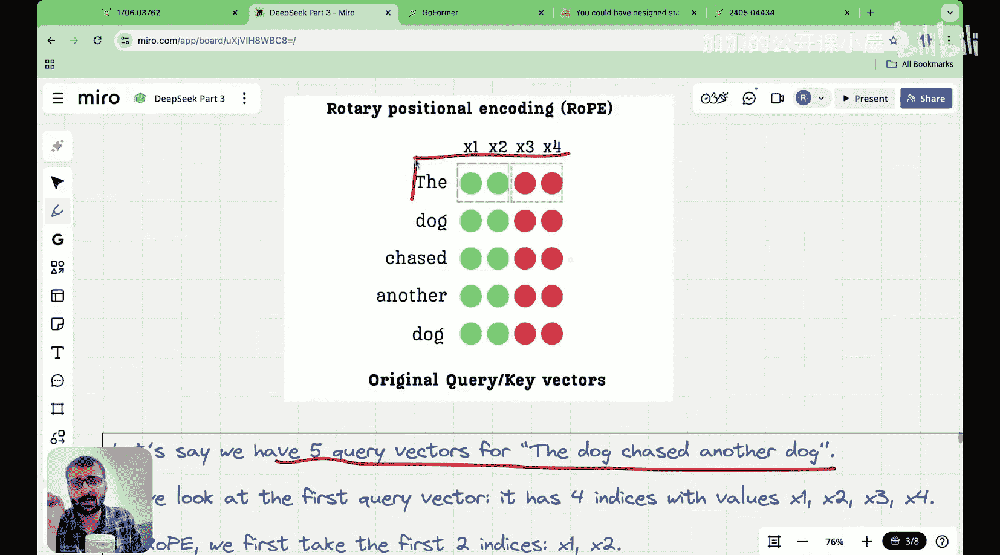

#  016：旋转位置编码详解 👁️

在本节课中，我们将要学习一种称为旋转位置编码（Rotary Positional Encoding, RoPE）的技术。这是理解DeepSeek等现代大型语言模型架构的关键组成部分。

---

## 课程概述

在之前的课程中，我们开始研究不同类型的位置编码。特别是在上一讲中，我们详细研究了正弦位置编码。在那之前的课程中，我们研究了整数和二进制位置编码。你可能会想，为什么我们要在“从零开始构建DeepSeek”系列中花时间讲解位置编码。

主要原因是，如果你查看DeepSeek的论文，会发现它们使用了多头潜在注意力机制。我们已经介绍了MLA最基本的形式。但2025年发布的DeepSeek-R1和DeepSeek-V3，将多头潜在注意力与一种特殊类型的位置嵌入相结合，这种嵌入被称为旋转位置编码。如果不理解旋转位置编码，我们就无法理解它如何与多头潜在注意力相结合。这就是为什么我们在过去几讲中一直在学习不同类型的位置编码。现在我们已经积累了足够的知识，可以最终探讨旋转位置编码究竟是什么。

---

## 回顾正弦位置编码的局限性

上一讲末尾，我们看到了正弦位置编码的一些局限性。一个主要的限制是，在正弦位置编码中，我们将位置编码值直接添加到词元嵌入中。我们知道，词元嵌入本质上捕获了语义信息。通过将位置信息直接添加到语义中，我们污染了词元嵌入所携带的语义信息。

理想情况下，我们希望的是以下情况。让我们看看整个LLM架构。目前，对于正弦位置编码，我们正在将词元嵌入与位置编码相加。理想情况下，我不希望这样。理想情况下，我希望我的词元嵌入能够不受干扰地传递到Transformer块中，这样它们的语义含义就不会被稀释。我们在上一讲末尾提出的问题是，我们能否以某种方式在注意力机制本身中注入关于词元位置的信息。

与其在第一个数据预处理步骤中将位置嵌入添加到词元嵌入中，为什么不在多头注意力机制中包含位置嵌入的信息呢？这就是旋转位置编码思想的诞生之处。

---

## 旋转位置编码的核心思想

上一讲我们看到，如果你查看多头注意力机制，它由计算注意力分数组成。我们有查询矩阵和键矩阵，查询与键的转置相乘得到注意力分数。正是在这个机制中，我们考虑了不同词元的位置并计算注意力分数。

那么，为什么我们不将位置信息添加到这些向量中呢？为什么我们不将位置信息注入到查询向量和键向量中？这是第一个问题。我们在上一讲末尾提出的第二个问题是，如果你看到词元嵌入只是被添加到位置嵌入中，词元嵌入在此步骤中被添加到位置嵌入中，这改变了词元嵌入本身的大小，这并不理想。

理想情况下，我希望的是不改变原始向量的大小。假设这是我的原始查询向量，与其添加另一个向量并形成一个新的向量，为什么不旋转这个向量呢？如果我想捕获信息或注入关于位置的信息，为什么不取一个查询向量或键向量，简单地将其旋转一个角度θ来注入位置信息呢？如果一个词元的位置较高，我将以不同的角度旋转它；如果它的位置索引较低或位置较小，我以较小的角度旋转它。本质上，角度将量化关于我位置的一些信息，但向量的大小不会改变，因为我只是进行旋转。查询向量或键向量的大小不会改变，这将确保我的原始向量大小保持不变。

因此，我们从今天这堂课开始，有两个核心思想：
1.  与其在数据预处理块中添加位置嵌入，为什么不在注意力机制中添加它，特别是修改查询向量和键向量？
2.  与其简单地将我的位置编码向量添加到查询向量和键向量中，为什么不直接旋转这些向量，使原始向量的大小保持不变？

---

## 旋转位置编码的直观理解

有了这两个想法，我们开始今天关于理解旋转位置编码的课程。如果你理解了旋转位置编码，你将永远不会忘记它，因为它是一个非常直观的概念。但如果你直接进入数学部分，一开始可能会觉得困难甚至令人生畏。我将尽力使这堂课尽可能直观。

旋转位置编码的主要思想是获取我的查询向量和键向量，并对这些向量应用正弦位置编码。这意味着，在上一讲中我们看到，正弦位置编码有这个公式，其中任何给定位置的偶数索引由正弦值给出，奇数索引由余弦值给出。那么，如果我们使用相同的公式，但现在将其应用于查询向量和键向量，并且不是将其添加到向量中，而是进行旋转，让我们看看如何做到这一点。

现在，我将通过一个视觉示例来演示旋转位置编码在实践中是如何工作的。

为了演示的目的，假设我有这些查询向量，对应五个词元。你也可以想象这是查询或键向量。第一个查询向量是一个四维向量。第二个查询向量是“dog”，也是一个四维向量。第三个是“chased”，另一个“dog”。所以，我输入序列中的每个词元现在都是一个四维查询向量。你也可以将其视为键向量。我现在为查询向量展示的内容同样适用于键向量。

假设我们有五个查询向量，对应“The dog chased another dog”。现在，我将只关注第一个查询向量。我们将对第一个查询向量执行的操作，与我们将对后面的词元执行的操作相同。因此，我将只在我的第一个词元上展示这个操作。

---

## 总结

本节课中，我们一起学习了旋转位置编码的基本概念和核心思想。我们了解到，旋转位置编码旨在解决传统位置编码（如正弦编码）中语义信息被“污染”以及向量大小改变的问题。其核心思想是将位置信息通过旋转操作注入到注意力机制的查询和键向量中，而不是在预处理阶段直接相加。这种方法保持了原始向量的长度，并更自然地将位置信息整合到模型对词元关系的理解中。在接下来的课程中，我们将深入探讨其数学实现和具体应用。