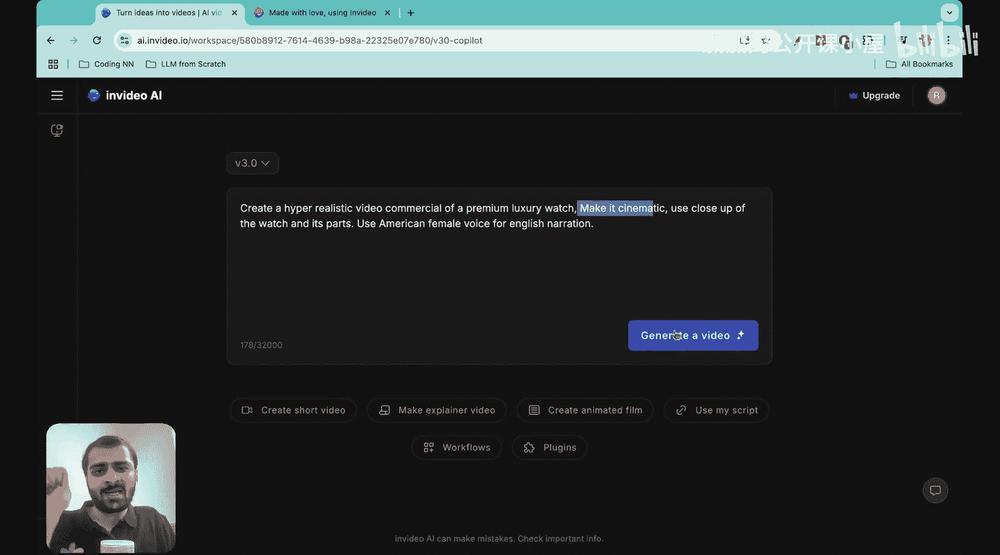
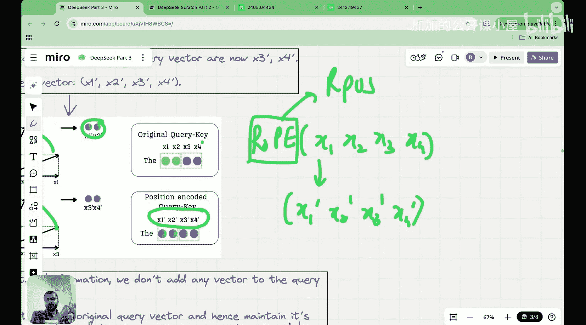

#  017：DeepSeek如何精确实现潜在注意力（MLA + RoPE）

在本节课中，我们将要学习DeepSeek V3和DeepSeek R1模型如何实现一个结合了多头潜在注意力与旋转位置编码的先进版本。我们将深入探讨其背后的数学原理和实现细节，让复杂的公式变得清晰易懂。

## 概述

大家好，我是Raj Dunecker博士，于2022年从麻省理工学院获得机器学习博士学位，也是“从零开始构建DeepSeek”系列的创作者。在开始之前，我想介绍一下本系列的赞助商和合作伙伴——V AI。

V AI与我们秉持着相似的原则和理念，致力于从基本原理构建AI模型。让我向你们展示一下。

这是V AI的网站。凭借一个小型工程团队，他们构建了一个令人惊叹的产品，你可以仅通过文本提示来创建高质量的AI视频。

如你所见，我输入了一个文本提示：“创建一个超写实的豪华手表视频广告，并使其具有电影感”。点击生成视频后，很快我就得到了这个高度逼真的精彩视频。

这个视频让我着迷的是它对细节的关注。看这里，质量和纹理简直不可思议，而这一切都仅从一个文本提示创建而来。这就是V AI产品的力量。

你们刚才看到的精彩视频背后的支柱，是V AI的视频创作流程。他们正在从第一性原理重新思考视频生成和编辑。为了实验和调整基础模型，他们拥有印度最大的H100和H200集群之一，并且也在试验B200。

V AI是印度发展最快的AI初创公司，面向全球构建产品，这也是我如此认同他们的原因。好消息是，他们目前有多个职位空缺，你可以加入他们优秀的团队。我在下面的描述中发布了更多详细信息。

大家好，欢迎来到“从零开始构建DeepSeek”系列的这一讲。

今天我们将学习DeepSeek V3和DeepSeek R1如何实际实现了一个结合了多头潜在注意力与旋转位置编码的先进版本。

在之前的课程中，我们已经学习了潜在注意力和旋转位置编码。因此，在本节课中，我将假设你已经了解这两个概念。如果你还没有看过关于这两个概念的课程，请返回复习，因为它们对今天的课程至关重要。

那么，让我们开始吧。

## 为何需要将RoPE融入潜在注意力

首先，我们需要理解为什么需要调整潜在注意力机制以包含旋转位置编码。要理解这一点，我们必须先明白潜在注意力为何有效。

回顾一下我们之前在潜在注意力中见过的示意图。输入嵌入乘以这个 **`W_DKV`** 矩阵，将我的输入向量投影到一个潜在维度。在多头潜在注意力中，我们只需要缓存这个潜在矩阵。

这种缓存之所以有效，是因为潜在注意力实现了一种称为**吸收技巧**的方法。

如果你计算注意力分数，它将是查询向量乘以键向量的转置。因此，查询可以表示为 **`x * W_Q`**，这是一个可训练的权重矩阵。而键可以表示为：如果你看这里，键是 **`C_KV * W_UK`**。所以键可以表示为，键的转置是 **`W_UK^T * W_DKV^T * x^T`**。

这里我希望你关注的主要点是，在潜在注意力机制中，这两个矩阵被吸收成一个单一的矩阵。因此，**`W_Q`** 和 **`W_UK^T`** 变成了一个单一的矩阵，剩下的就是 **`x * W_DKV^T`**，而只有这个需要被缓存。

这被称为吸收技巧。每当一个新的查询到来时，它乘以 **`W_Q`**，同时也乘以 **`W_UK^T`**。这两个矩阵在训练时是固定的，所以我们不需要再次缓存或计算它们。唯一需要缓存的是输入的潜在矩阵。

这就是你需要理解的关于潜在注意力及其工作原理的主要内容。如果你还没有学习过多头潜在注意力机制，请去学习，因为我们在那里详细介绍了这个吸收技巧。

为了让潜在注意力工作，我们需要 **`W_Q`** 和 **`W_UK^T`** 在一起，这样它们才能相乘并吸收成一个矩阵。

请记住这一点。

现在，想象一下我们想要将旋转位置编码添加到我的查询和键中。假设我想在潜在注意力中做完全相同的吸收技巧，但我希望我的查询被注入旋转位置编码。我称之为 **`RPE`**，这是我的查询 **`x * W_Q`**。同时，我也希望我的键被注入旋转位置编码，所以对于这个键矩阵，我应用旋转位置编码。

让我简要回顾一下旋转位置编码中到底发生了什么。

假设我们正在看一个特定位置的一个查询向量或键向量。我们将其分成两个一组，然后每一组两个元素被旋转以形成另一个向量。例如，这里我们有两组：**`[x1, x2]`** 和 **`[x3, x4]`**，这是第一个位置或第一个查询向量。发生的情况是，这个 **`[x1, x2]`**（这是我这里的原始向量）被旋转，形成 **`[x1', x2']`**。然后 **`[x3, x4]`**（这是我的原始向量）被旋转，形成 **`[x3', x4']`**。

因此，如果我原始的查询向量是 **`[x1, x2, x3, x4]`**，那么当你应用旋转位置编码时，它就变成了 **`[x1', x2', x3', x4']`**。所以，如果我对 **`x1, x2, x3, x4`** 应用RoPE，它就变成了 **`x1', x2', x3', x4'`**。

因此，每当我稍后在描述中使用这个 **`RPE`** 操作或 **`RoPE`** 操作时，这就是将要发生的事情。我们接收完整的向量，将其分成若干对，然后旋转。

## 总结

本节课中，我们一起学习了DeepSeek模型如何将旋转位置编码整合到多头潜在注意力机制中。我们首先回顾了潜在注意力的核心——吸收技巧，然后探讨了引入RoPE后带来的挑战。理解这些基础概念是读懂DeepSeek V2和V3论文中复杂公式的关键。下一节，我们将具体分析DeepSeek论文中的公式，并一步步拆解其实现逻辑。