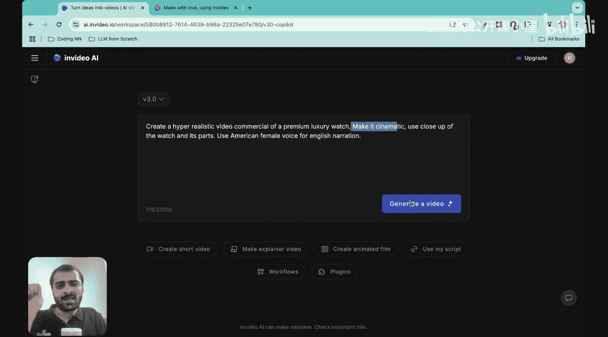
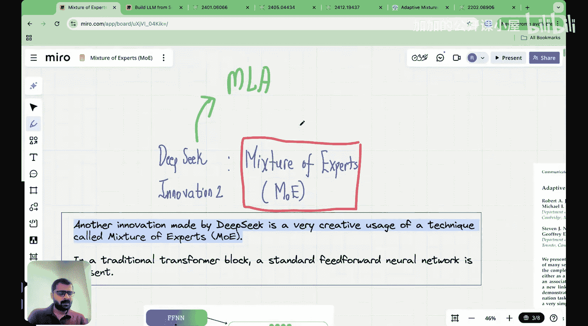
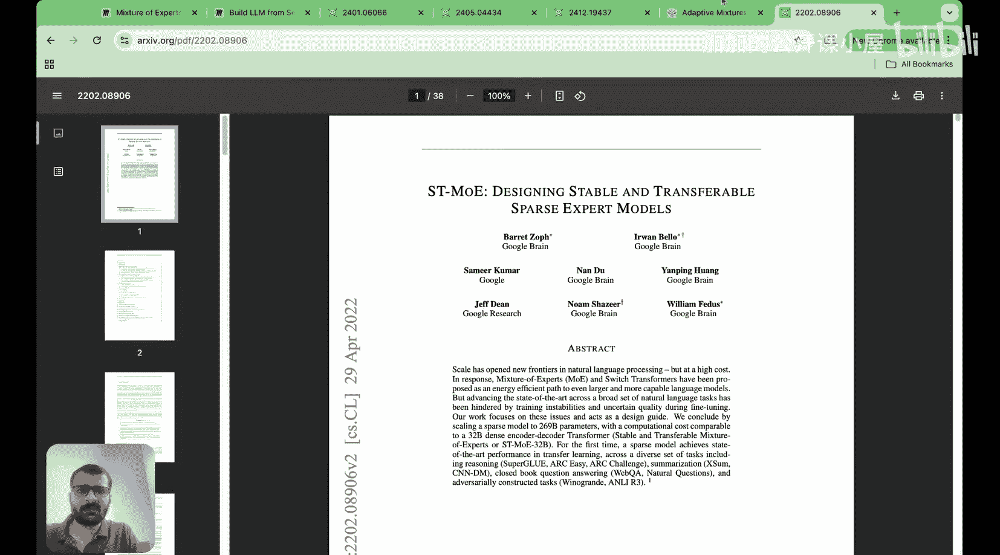
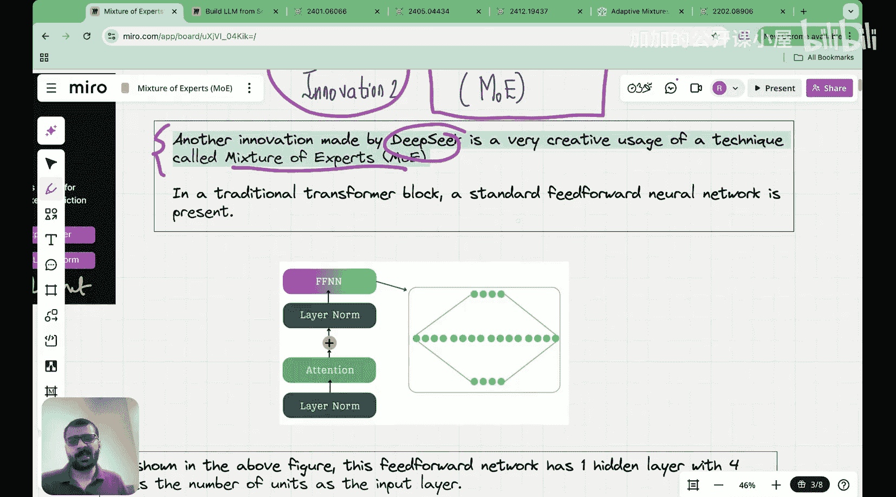
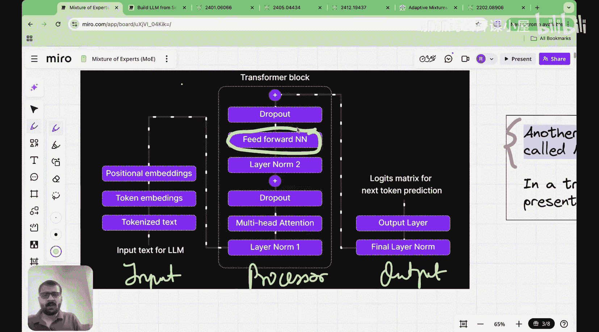
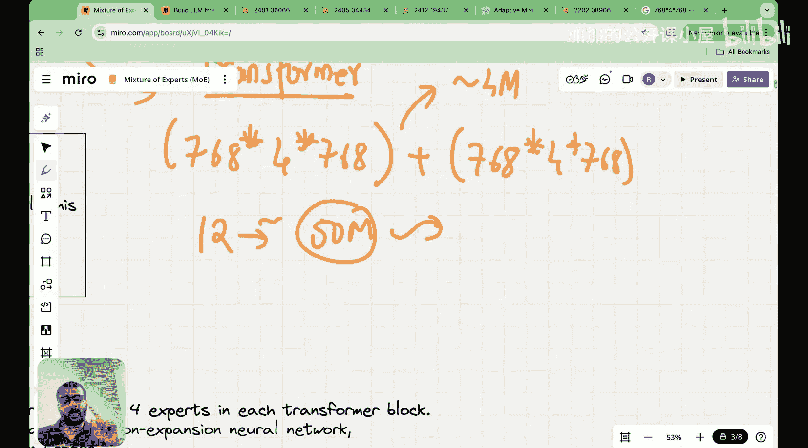

#  018：混合专家模型（MoE）简介 🧠

在本节课中，我们将学习DeepSeek模型架构中的另一项核心创新：混合专家模型。我们将了解它的基本概念、它在Transformer架构中的位置，以及它如何优化模型性能。

---

在之前的课程中，我们深入探讨了DeepSeek的主要创新之一：多头潜在注意力。它通过减少KV缓存大小同时保持语言性能，取得了两全其美的效果。

除了潜在注意力，DeepSeek的另一项重大创新就是混合专家模型。本节课我们将介绍混合专家模型的核心思想。在后续课程中，我们将深入其数学原理，并探讨DeepSeek在此基础上的新贡献。

需要指出的是，混合专家模型作为一个概念已经存在很长时间。第一篇引入此概念的论文发表于1991年的《Neural Computation》期刊，题为“Adaptive Mixtures of Local Experts”。作者之一Geoffrey Hinton是机器学习多个领域的先驱。因此，混合专家模型并非全新概念，在DeepSeek之前，它已在其他语言模型架构中有所应用。

DeepSeek在此基础上进行了创新，加入了他们自己的新技巧。我认为DeepSeek做得非常出色的一点在于，他们没有重新发明轮子，而是借鉴了已有的成果，并在此基础上构建了真正酷炫且创新的东西。

这篇1991年的论文并非专门针对语言建模，而是将混合局部专家模型用于监督学习任务。后来，该思想才通过Mistral等模型逐渐引入语言建模领域。最终，DeepSeek利用了所有这些知识，构建了更强大的模型。

我在此简要介绍混合专家模型的历史背景，是为了说明为何我称其为DeepSeek的一项创新。请注意，他们并非此概念的首创者。

---

接下来，我将通过直观的方式介绍混合专家模型的整体思想。

DeepSeek的另一项创新，是对混合专家模型技术的创造性运用。首先，我们来理解混合专家模型在语言建模中是如何应用的。

由于本系列课程专注于大语言模型，我将直接从其在语言模型中的应用开始讲解，而不追溯其完整历史背景。

观察Transformer模块，其结构大致如下：输入块包含分词、词嵌入和位置嵌入；Transformer模块是核心，包含层归一化、多头注意力、Dropout、另一个层归一化、前馈神经网络、Dropout；输出层将输入嵌入转换为逻辑矩阵，并预测下一个词元。

混合专家模型这项创新，主要关注整个架构中的一个特定模块：**前馈神经网络**。

仔细观察这个前馈神经网络，其结构类似这样：假设输入嵌入维度为 `d_model`，它首先将输入投影到一个隐藏层，该隐藏层的维度通常是输入维度的4倍（即 `4 * d_model``），然后再投影回原始的输入维度 `d_model`。

我喜欢称这个网络为“扩展-收缩”神经网络。从初始层到隐藏层是扩展过程，从隐藏层回到原始维度是收缩过程。使用这样的网络可以在保留原始维度的同时，让输入嵌入经历扩展和收缩。

此处使用前馈神经网络的原因在于，它允许语言模型探索更丰富的空间，极大地增加了维度数量。因此，它是Transformer架构的关键组成部分。实验表明，如果移除该组件，语言模型的性能会下降。前馈神经网络是语言建模架构的关键组件之一。

但需要注意前馈神经网络实际占用的参数量。让我们估算一下：假设一个Transformer模块的输入嵌入维度为768。在扩展层，我们有768个输入和 `4 * 768` 个隐藏层维度。因此，扩展层的权重参数量为 `768 * (4 * 768)`。收缩层的参数量类似，也是 `768 * (4 * 768)`。

计算一下：`768 * (4 * 768) = 2,359,296`。将其乘以2（扩展层和收缩层），得到约4.7百万参数。这仅是一个Transformer模块的前馈网络参数量。如果有12个这样的Transformer模块，前馈网络部分的总参数量将达到约56百万。

我展示这个计算是为了说明，前馈神经网络拥有大量参数。这会影响整个语言模型的训练时间，也会增加模型的推理时间。

**混合专家模型通过减少预训练时间和推理时间来优化这一点。**

---

现在，让我们看看混合专家模型是如何实现这一优化的。

首先，我们称这个神经网络为压缩-扩展或扩展-收缩网络。

本节课我们一起学习了混合专家模型的基本介绍。我们了解了它的历史渊源，明确了它在DeepSeek创新中的位置，并分析了其在Transformer架构中针对前馈神经网络进行优化的动机。下一节课，我们将深入探讨混合专家模型的具体工作机制和数学原理。