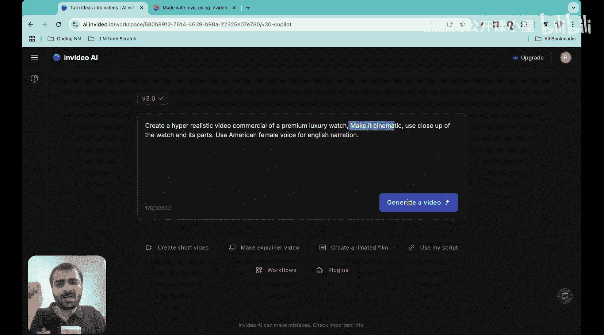
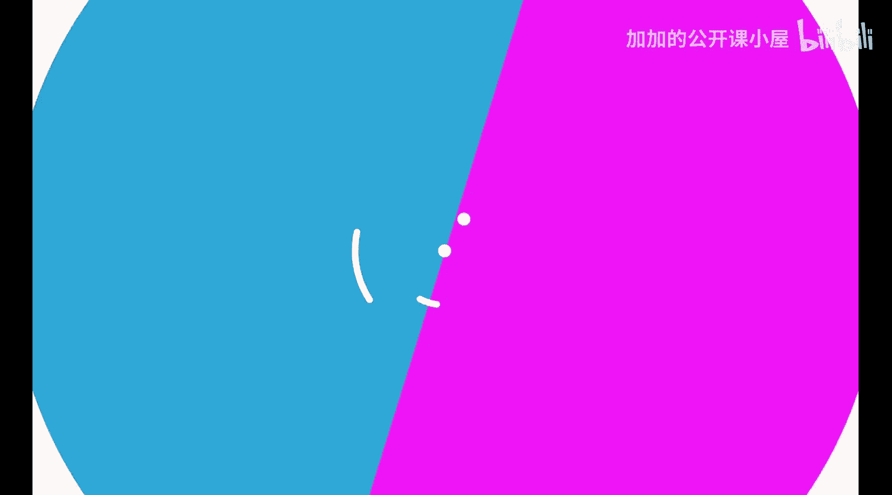
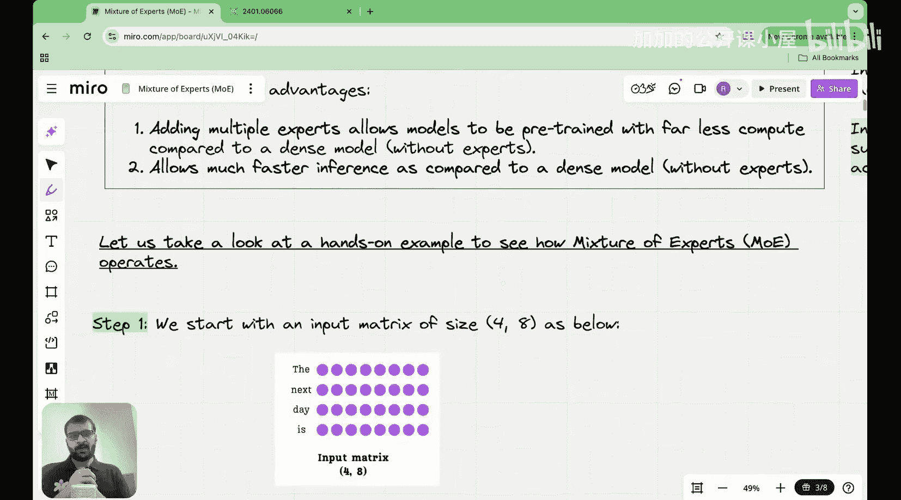
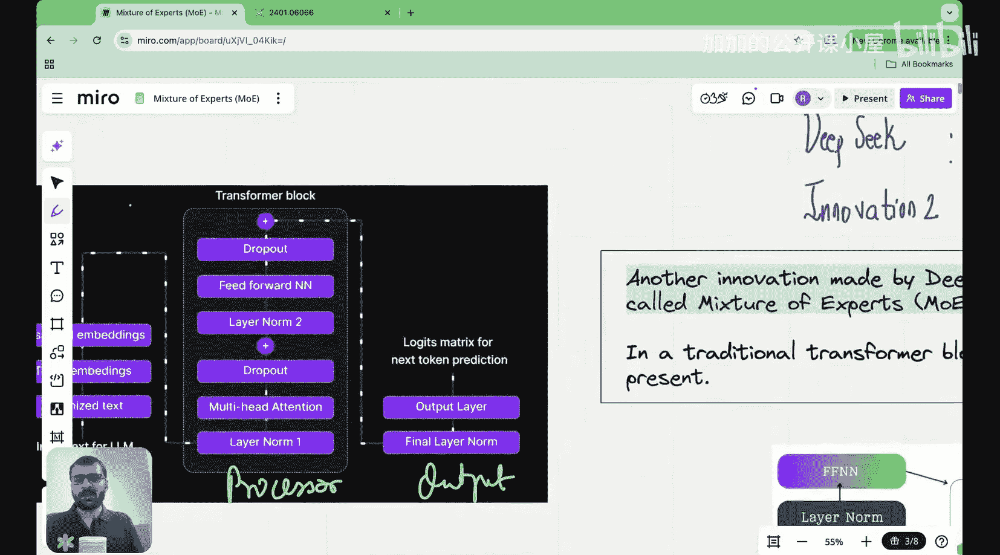
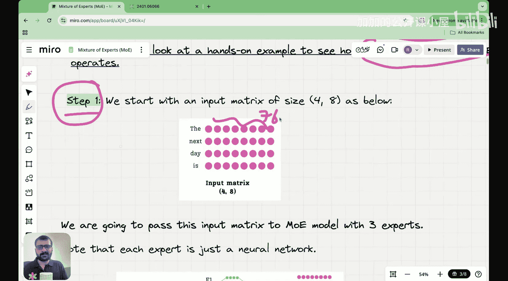
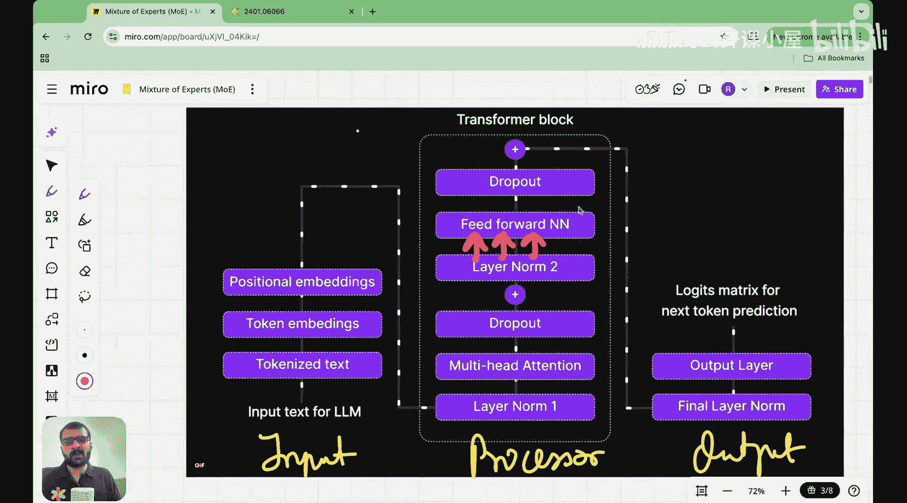
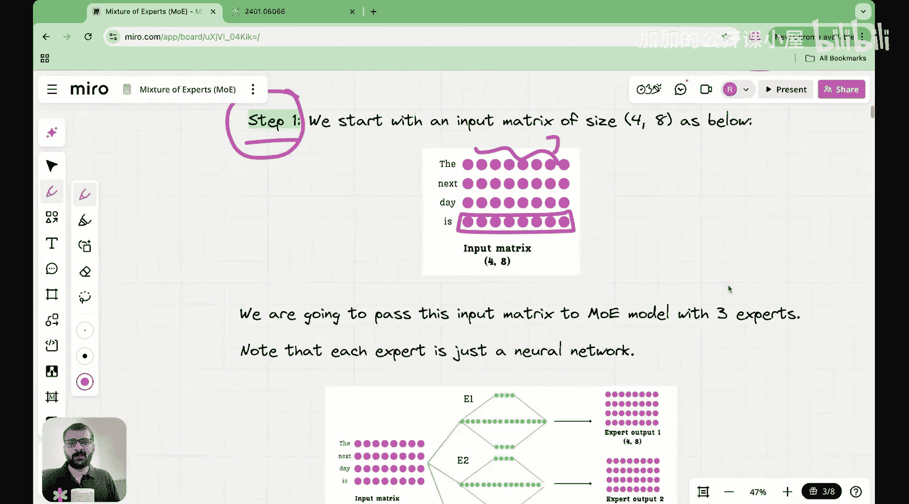
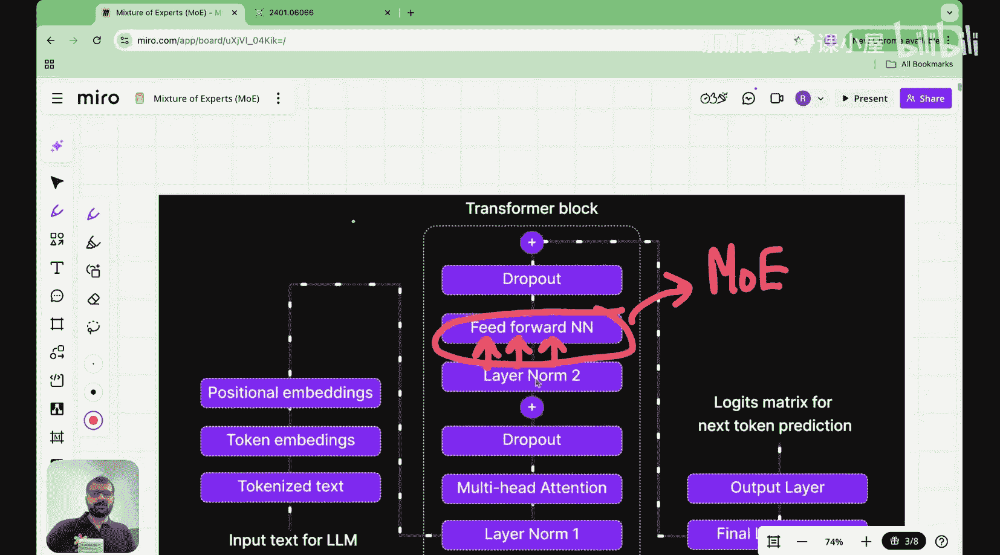
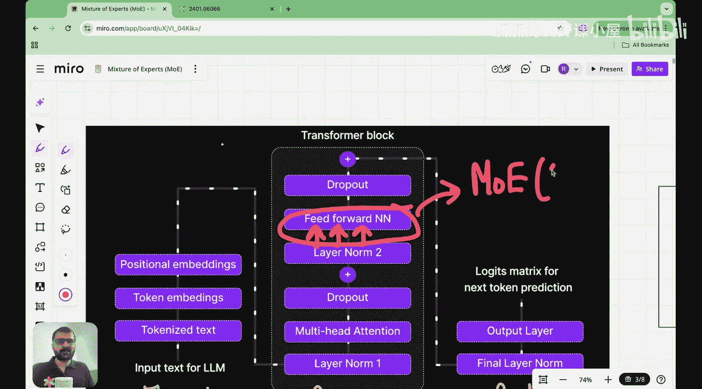
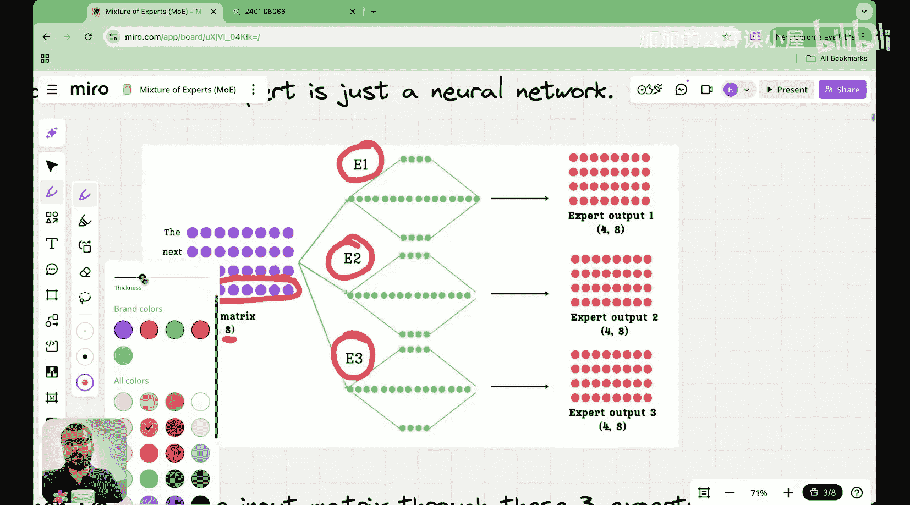

#  019：混合专家模型动手演示与视觉解析 🧠

在本节课中，我们将继续学习混合专家模型。我们将通过一个手把手的视觉化示例，深入理解其核心概念——稀疏性与路由机制——是如何在数学上实现的。

---

## 课程概述

上一节我们介绍了混合专家模型的基本思想。本节中，我们将通过一个循序渐进的视觉化演示，具体展示混合专家模型是如何工作的。我们将重点关注两个核心概念：**稀疏性**和**路由机制**。

---

## 回顾：混合专家模型的核心思想

在标准的Transformer架构中，每个前馈神经网络层只有一个网络。混合专家模型的主要思想是，将这个单一的前馈神经网络替换为多个并行的神经网络，我们称这些网络为“专家”。

你可能会想，为什么要用一个更复杂的机制来替代简单的单一网络？混合专家模型的主要优势在于，它允许以更少的计算资源进行预训练，这意味着预训练和推理过程都能更快地完成。

混合专家模型能够实现这一点的关键，在于一个简单的概念：**稀疏性**。稀疏性的核心思想是，当一组输入令牌进入多个专家网络时，并非所有专家都会被激活。这意味着，当一个令牌输入时，它不会被路由到所有专家，而是有选择地只路由到特定的专家。

这进一步意味着，在预训练和推理过程中，所有专家不需要同时处于活跃状态。根据令牌的类型，会激活一组特定的、专门的专家。这种不激活所有专家的概念，就称为稀疏性。

稀疏性是混合专家模型背后的主要思想之一。在今天的课程中，我们将看到稀疏性是如何在数学上实现的。

在上一讲中，我们还探讨了模型的可解释性。事实证明，每个专家本质上都学习了一些特定的知识。例如，在某个Transformer层中，可能有一个专门处理标点符号的专家。这意味着，当输入包含标点符号令牌时，它会被路由到这些专门的专家。当输入包含动词时，它被路由到处理动词的专家；当输入包含视觉描述时，它被路由到处理视觉描述的专家。

因此，根据令牌的类型，我们选择它应该被路由到哪些专家。这减少了预训练时间，也加速了推理过程。这就是混合专家模型背后的主要思想。

我们还看到，模型中有多个Transformer块，每个Transformer块都有不同的专家。对于一个给定的令牌，并不意味着如果在第一个Transformer块中激活了专家一，在第二个Transformer块中也会激活同一个专家。对于一个给定的令牌，在不同的Transformer块中可能会激活不同的专家。

---

## 本节目标：逐步解析实现过程

今天的主要目的是向你逐步展示混合专家模型是如何实际实现的。这意味着，给定任何一个令牌（例如，一个维度为768的令牌），在它通过所有专家处理后，它仍然应该保持其768的维度。在这个过程中发生了什么？我们如何利用所有专家来最终输出一个与输入维度相同的输出？

在这个过程中，我们将看到几个关键思想：
1.  **稀疏性**：并非所有专家会同时被激活。
2.  **路由机制**：一个基于给定令牌来决定将其路由到哪个专家的机制。

我们将按照以下七个步骤来解析这个过程：
1.  输入嵌入矩阵
2.  路由计算
3.  选择Top-K专家
4.  创建掩码
5.  专家前向传播
6.  加权组合输出
7.  最终输出

我们将以完全视觉化的方式规划这堂课，以便你准确理解混合专家模型的实现。让我们从第一步开始。

---

## 第一步：输入嵌入矩阵

这是最简单的一步。在这一步中，我们本质上是从输入嵌入矩阵开始的。假设我们有四个令牌：“The”、“next”、“day”、“is”。每个令牌的维度是768。

每个令牌在到达这个前馈神经网络阶段之前，都经历了一整个流程：令牌化、转换为令牌嵌入、添加位置嵌入、进入Transformer层、经过层归一化、多头注意力、Dropout、另一层层归一化等等。在经历了所有这些序列之后，我们得到了这些输入嵌入，现在它们是我们前馈神经网络的输入。在这里，我们将看到如何用多个神经网络（专家）来实现混合专家模块，而不是一个单一的前馈神经网络。

所以，这是我的输入矩阵，有四个令牌，每个令牌的嵌入维度为8。接下来我们要做的是，将这个输入矩阵传递给一个拥有三个专家的混合专家模型。

---

## 第二步：路由计算与专家选择

我们的主要想法是，假设你有这个输入嵌入矩阵，我有专家一号、专家二号和专家三号。每个专家都是一个神经网络，一个保持输入维度的“扩展-收缩”神经网络。当输入嵌入矩阵通过专家网络时，每个令牌的初始维度（例如8）会被保留。

当输入嵌入矩阵通过专家一（即第一个前馈神经网络）时，我们得到专家输出一，这是一个4x8的矩阵。为什么是4x8？这一点稍后会变得清晰，请尝试理解其背后的直觉。

在下一步中，我们将看到路由机制是如何决定每个令牌应该去往哪个专家的。