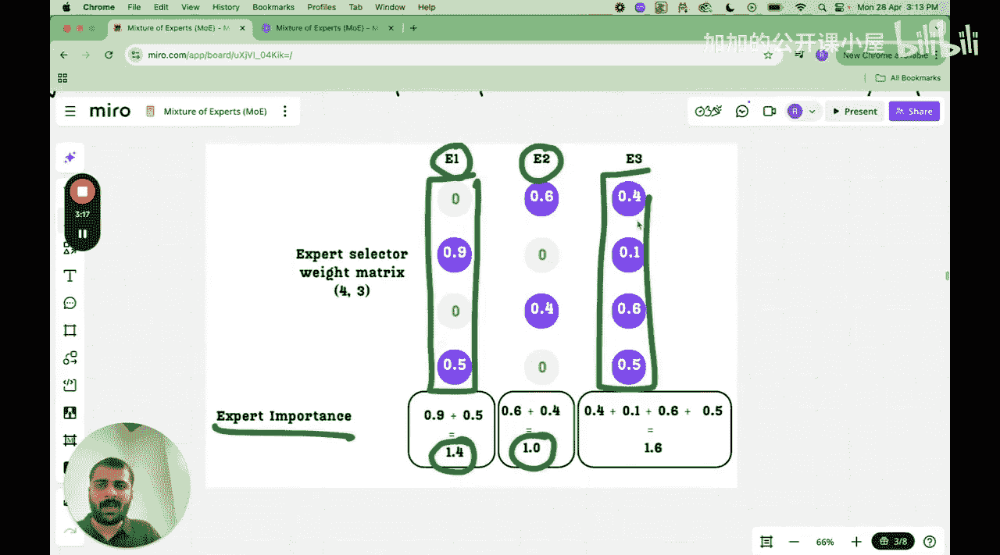

#  020：混合专家平衡技术

在本节课中，我们将学习混合专家模型中两种关键的平衡技术：辅助损失和负载均衡。这些技术旨在确保所有专家都能被有效利用，避免某些专家被过度使用而另一些被闲置，从而提升模型的学习效率和性能。

## 课程概述

上一节我们介绍了混合专家的实现细节，特别是路由机制。本节中，我们来看看如何确保路由的平衡性。我们将深入探讨两种方法：辅助损失和负载均衡。

## 辅助损失

在混合专家模型中，路由机制为每个令牌选择一部分专家。到目前为止，我们尚未引入确保这种路由平衡的机制。这可能导致某些专家被频繁选择，而其他专家则很少被使用，从而造成学习效率低下和性能不理想。理想情况下，我们希望所有专家都能为模型做出贡献。

为了确保专家选择不会失衡，我们在训练过程中引入了一个称为**辅助损失**的项。大型语言模型的主要任务是下一个令牌预测，其训练过程包含一个主要的训练损失。辅助损失项被添加到这个主训练损失中，用于惩罚不平衡的专家选择，并推动路由函数朝着更均匀的令牌路由分布发展。也就是说，在路由完成后，我们希望看到每个专家处理的令牌数量大致相同。

现在，让我们逐步说明辅助损失是如何计算的。我们从**专家选择权重矩阵**开始理解。

以下是专家选择权重矩阵的一个示例：

| 令牌/专家 | 专家1 (E1) | 专家2 (E2) | 专家3 (E3) |
| :--- | :--- | :--- | :--- |
| 令牌1 | 0.0 | 0.6 | 0.4 |
| 令牌2 | 0.9 | 0.0 | 0.1 |
| 令牌3 | 0.0 | 0.4 | 0.6 |
| 令牌4 | 0.5 | 0.5 | 0.0 |

这个矩阵的每一行表示分配给该特定令牌的专家及其权重。例如：
*   第一行表示令牌1将被路由到专家2和专家3，权重分别为0.6和0.4。
*   第二行表示令牌2将被路由到专家1和专家3，权重分别为0.9和0.1。

这个矩阵的每一列对应一个特定的专家，包含了所有令牌被路由到该专家的概率。例如，第一列（专家1）包含数值 `[0.0, 0.9, 0.0, 0.5]`。

为了计算每个专家的总体重要性（称为**专家重要性**），我们将该专家对应列的所有概率值相加。

以下是计算过程：
*   **专家1的重要性**： `0.0 + 0.9 + 0.0 + 0.5 = 1.4`
*   **专家2的重要性**： `0.6 + 0.0 + 0.4 + 0.5 = 1.5`
*   **专家3的重要性**： `0.4 + 0.1 + 0.6 + 0.0 = 1.1`

这些重要性分数反映了所有令牌在路由过程中对每个专家的“关注”程度总和。

接下来，我们计算一个称为**专家负载**的指标。专家负载衡量的是每个专家实际被“激活”（即被选择）的频率，而不考虑权重。我们通过检查专家选择权重矩阵中每个元素是否大于0来计算。

以下是专家负载的计算过程：
1.  将权重矩阵转换为二进制矩阵（大于0则为1，否则为0）。
2.  对每一列（即每个专家）的二进制值求和。

对于我们的示例矩阵：
*   **专家1的负载**： `0 + 1 + 0 + 1 = 2` （令牌2和令牌4选择了专家1）
*   **专家2的负载**： `1 + 0 + 1 + 1 = 3` （令牌1、令牌3和令牌4选择了专家2）
*   **专家3的负载**： `1 + 1 + 1 + 0 = 3` （令牌1、令牌2和令牌3选择了专家3）

现在，我们有了两个关键向量：
*   **重要性向量**： `[1.4, 1.5, 1.1]`
*   **负载向量**： `[2, 3, 3]`

辅助损失的目标是鼓励这两个向量都尽可能均匀。一个完美的平衡状态是所有专家的重要性相等，且所有专家的负载也相等。

辅助损失的计算公式结合了这两个向量的变异系数（标准差除以均值），旨在最小化这种不平衡性。其核心公式可以表示为：

**辅助损失 = α * (专家重要性的变异系数 + 专家负载的变异系数)**

其中，α 是一个超参数，用于控制辅助损失项在总损失中的权重。

通过将这个辅助损失项添加到模型的主训练损失（如下一个令牌预测的交叉熵损失）中，反向传播过程会同时优化模型参数和路由机制，促使路由网络更公平地分配令牌给各个专家。

## 负载均衡

除了辅助损失，另一种直接促进专家间负载均衡的技术称为**负载均衡**。这种方法的核心思想是在训练过程中，动态地调整路由决策，以防止任何专家过载或欠载。

一种常见的负载均衡实现是在路由函数的Softmax操作中加入一个与专家历史使用频率成反比的偏置项。其思路是：如果一个专家在过去被选择得较多，那么在后续的路由决策中，它被选中的“得分”会被适当降低，从而给其他专家更多机会。

负载均衡的调整可以体现在路由权重的计算中。修改后的路由得分公式可能如下所示：

**调整后的路由得分 = 原始路由得分 - λ * 专家历史使用率**

其中，λ 是一个控制平衡强度的超参数，**专家历史使用率**是该专家在近期批次中被选择的频率。

通过这种方式，负载均衡机制在训练过程中实时地、显式地干预路由决策，与辅助损失（一种通过损失函数隐式引导的、更全局的平衡目标）相辅相成，共同确保混合专家模型的高效运行。

## 课程总结

本节课中，我们一起学习了混合专家模型中两种至关重要的平衡技术。

首先，我们深入探讨了**辅助损失**。它是一种通过修改损失函数来鼓励平衡的方法。我们学习了如何从专家选择权重矩阵中计算**专家重要性**和**专家负载**，并理解了辅助损失如何通过最小化这两个向量的不均匀性，来惩罚不平衡的路由，从而确保所有专家都能被有效利用。

接着，我们介绍了**负载均衡**技术。这是一种在训练过程中动态调整路由决策的方法，通过根据专家的历史使用情况来微调其被选中的概率，直接防止某些专家过载而另一些闲置。

这两种技术通常结合使用，共同作用于混合专家模型的路由机制，是构建高效、可扩展的大型语言模型的关键组成部分。理解了这些平衡技术，我们就更清楚地掌握了如何让混合专家模型中的每一个“专家”都能发挥其应有的作用。