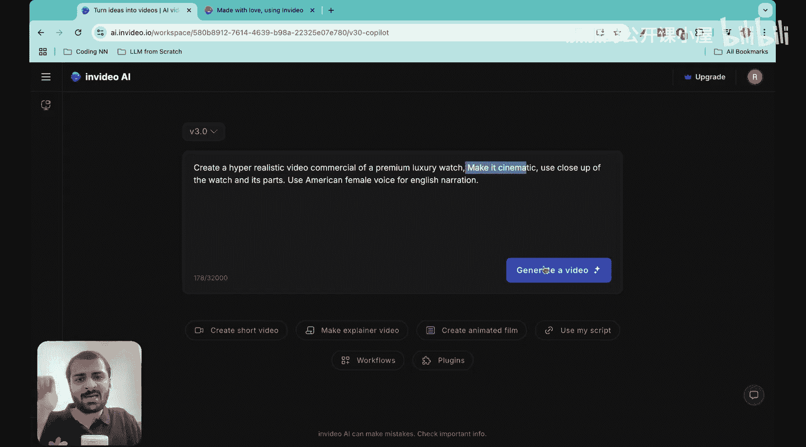
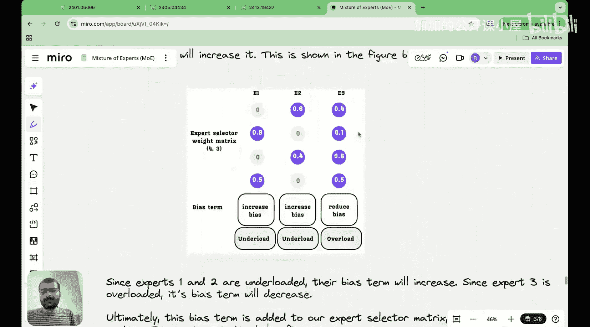

#  021：DeepSeek如何改写混合专家模型？

在本节课中，我们将要学习DeepSeek在混合专家架构中实现的主要创新。我们将探讨他们如何修改现有的损失函数，使其更高效，并介绍三个核心创新点。

---



## 概述

混合专家模型通过用一组称为“专家”的神经网络替换传统Transformer架构中的前馈神经网络来提高效率。其核心思想是稀疏性，即每个令牌只被路由到所有专家中的一个子集。在前几讲中，我们介绍了MoE的基本原理、实现步骤以及用于确保专家负载均衡的技术，如辅助损失和负载均衡损失。

上一节我们介绍了用于平衡专家负载的损失函数，本节中我们来看看DeepSeek如何对这些损失函数进行创新性改进，以构建更高效的模型。

---


## 创新一：无辅助损失的负载均衡

在传统的MoE模型中，负载均衡通过添加一个额外的损失项来实现，该损失项旨在确保令牌均匀地路由到不同的专家。这个损失项包含两个关键部分：`F_i` 和 `P_i`。

以下是负载均衡损失的传统公式：

`L_balance = α * N_experts * Σ_i (F_i * P_i)`

其中：
*   `F_i` 表示路由到第 `i` 个专家的令牌比例。
*   `P_i` 表示分配给第 `i` 个专家的概率比例。
*   `α` 是一个缩放因子。
*   `N_experts` 是专家总数。

最小化这个损失函数，可以使具有更高重要性的专家按比例处理更多令牌，而重要性较低的专家则处理更少的令牌，从而实现均衡。

然而，DeepSeek提出了一种更简洁的方法。他们发现，可以移除复杂的辅助损失，仅通过精心设计路由机制本身来隐式地实现负载均衡。这意味着模型在训练过程中无需额外计算和优化一个独立的负载均衡损失项，从而简化了训练流程并可能提高效率。

---

## 创新二：共享专家

DeepSeek引入的第二个关键创新是“共享专家”的概念。在标准MoE中，每个令牌仅由被选中的少数几个专家处理。但有些基础能力或通用知识可能是所有令牌都需要的。

为了解决这个问题，DeepSeek在MoE层中除了常规的“专属专家”外，还设置了一个或多个“共享专家”。

以下是其工作方式的简化描述：

```python
# 伪代码示意
def moe_layer_with_shared_experts(x, top_k=2):
    # x: 输入令牌
    # 1. 路由逻辑：为每个令牌选择top_k个专属专家
    selected_expert_indices, gate_scores = router(x, top_k)

    # 2. 处理专属专家路径
    expert_outputs = []
    for i, idx in enumerate(selected_expert_indices):
        out = expert_layers[idx](x[i])
        expert_outputs.append(out * gate_scores[i]) # 加权

    # 3. **关键创新：始终通过共享专家处理**
    shared_output = shared_expert_layer(x)

    # 4. 合并输出：专属专家加权和 + 共享专家输出
    final_output = sum(expert_outputs) + shared_output
    return final_output
```

共享专家就像一个始终处于激活状态的公共处理器，确保所有令牌都能获得一些通用的、基础的特征变换。这有助于模型稳定训练，并可能提升其泛化能力。

---

## 创新三：细粒度专家分割

第三个创新是“细粒度专家分割”。在传统MoE中，每个专家通常是一个完整的、参数规模较大的前馈神经网络。

DeepSeek对此进行了更细致的划分。他们不是将整个FFN作为一个专家单元，而是将单个FFN内部的权重矩阵（例如，上投影矩阵或下投影矩阵）进行分割，每个分割后的部分可以作为一个独立的“子专家”或“专家片段”。

这个概念可以通过一个公式来理解。一个标准FFN层通常表示为：

`FFN(x) = σ(x * W_up) * W_down`

其中 `W_up` 和 `W_down` 是权重矩阵。在细粒度分割中，我们可以将 `W_up` 矩阵沿某个维度分割成 `E` 个块：

`W_up = [W_up_1, W_up_2, ..., W_up_E]`

然后，路由机制不再选择整个FFN作为专家，而是选择使用哪个 `W_up_i` 块（以及可能对应的 `W_down_i` 块）来处理当前令牌。

这种方法的好处在于：
1.  **更高的灵活性**：专家单元更小，允许更精细化和多样化的能力分配。
2.  **降低通信开销**：在分布式训练中，由于每个专家单元的数据量变小，专家之间交换数据（令牌和激活值）的开销可能降低。
3.  **更好的负载均衡**：更小、更多的专家单元使得负载分布更容易均匀。

---

## 总结

本节课中我们一起学习了DeepSeek为混合专家模型带来的三项重要创新：
1.  **无辅助损失的负载均衡**：通过改进路由机制本身来简化训练目标，移除了独立的负载均衡损失项。
2.  **共享专家**：引入一个始终激活的公共专家层，为所有令牌提供通用处理，增强模型稳定性和基础能力。
3.  **细粒度专家分割**：将大型专家网络拆分为更小的、更灵活的专家单元，以提高模型的灵活性、降低通信成本并改善负载均衡。



这些创新体现了DeepSeek团队“从第一性原理重新思考”的设计理念，通过对基础架构的深入优化，最终构建出更强大、更高效的DeepSeek模型。