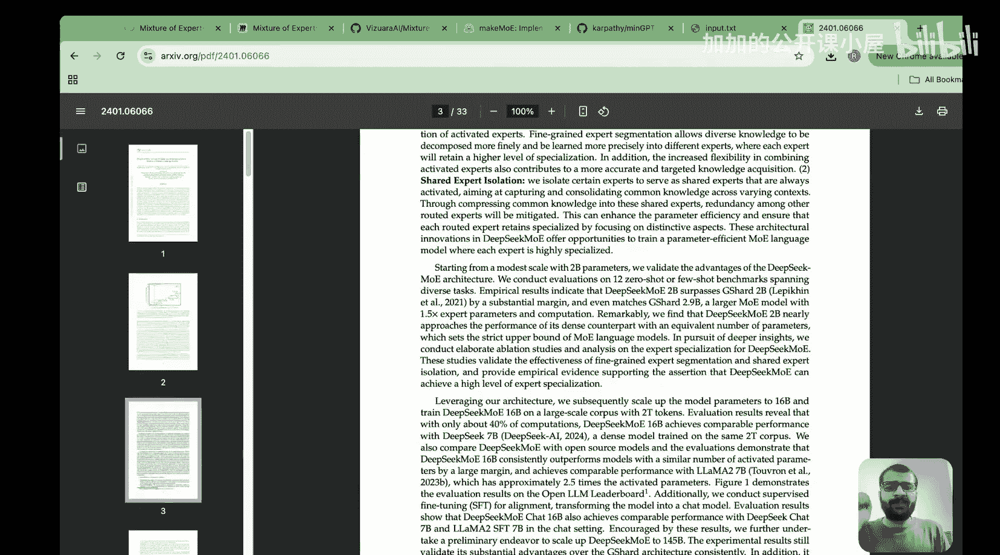
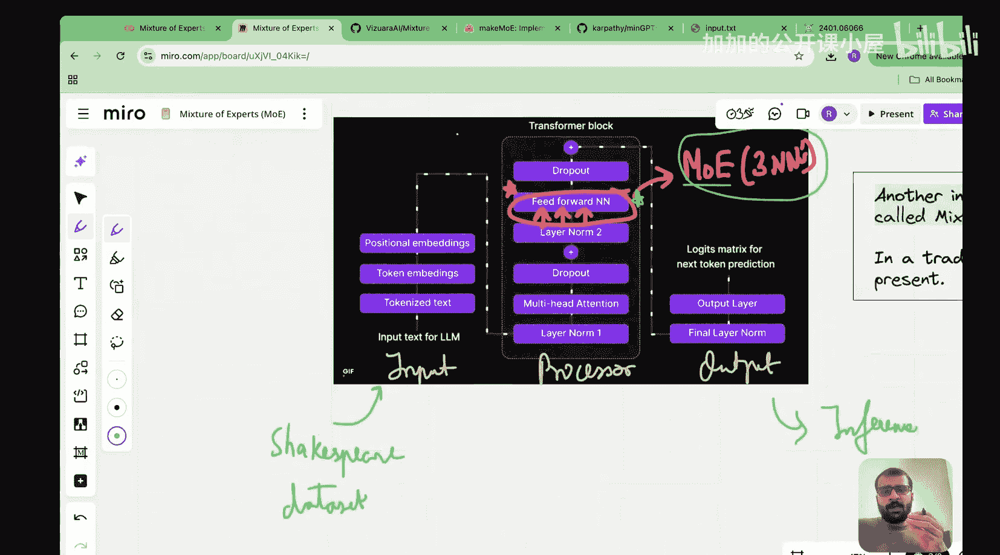
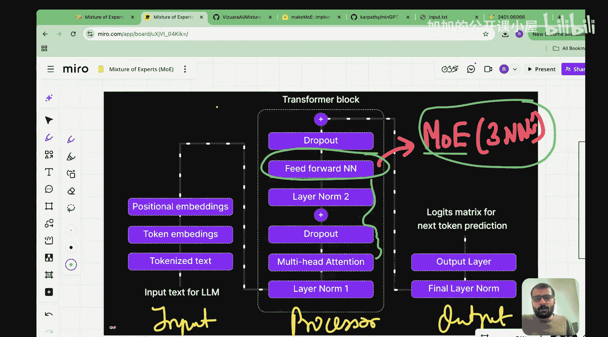

#  022：用Python从零实现混合专家模型（MoE）

在本节课中，我们将学习如何从零开始用Python和PyTorch实现一个混合专家模型。我们将基于之前课程中介绍的数学原理和DeepSeek的创新点，构建一个完整的MoE层，并将其集成到一个简化的Transformer架构中，用于文本生成任务。

## 概述

在之前的四节课中，我们介绍了混合专家模型的基本概念、直观理解、数学工作原理，并深入探讨了DeepSeek在MoE架构中的创新。本节课，我们将通过动手编码来总结整个MoE模块的学习。我们将使用一个简单的莎士比亚文本数据集，构建一个包含MoE层的完整模型，并进行预训练和推理。

## 代码实现步骤

以下是实现混合专家模型的16个步骤。我们将重点关注MoE模块的构建，同时也会简要介绍整个架构的其他部分。


### 步骤1：加载必要的包

我们仅使用PyTorch库，不依赖其他高级框架，以确保从零开始构建。

```python
import torch
import torch.nn as nn
import torch.nn.functional as F
```

### 步骤2：加载数据集

我们使用一个包含大量莎士比亚文学作品的数据集，文件名为`input.txt`。这个数据集将用于模型的训练。

### 步骤3：定义专家网络


每个专家本质上是一个前馈神经网络。它采用扩展-收缩架构：首先将输入维度扩展到四倍，然后使用ReLU激活函数，最后收缩回原始维度。

```python
class Expert(nn.Module):
    def __init__(self, embed_dim, dropout_rate=0.1):
        super().__init__()
        # 扩展层：embed_dim -> 4 * embed_dim
        self.expansion = nn.Linear(embed_dim, 4 * embed_dim)
        # 收缩层：4 * embed_dim -> embed_dim
        self.contraction = nn.Linear(4 * embed_dim, embed_dim)
        self.dropout = nn.Dropout(dropout_rate)

    def forward(self, x):
        x = self.expansion(x)
        x = F.relu(x)
        x = self.contraction(x)
        x = self.dropout(x)
        return x
```

### 步骤4：实现路由器（Router）


路由器是MoE中最关键的组件。它接收输入矩阵（来自多头注意力块的输出），并通过一个路由权重矩阵计算每个token应该分配给哪些专家。



```python
class Router(nn.Module):
    def __init__(self, embed_dim, num_experts):
        super().__init__()
        # 路由层：决定每个token应路由到哪个专家
        self.gate = nn.Linear(embed_dim, num_experts, bias=False)

    def forward(self, x):
        # x shape: (batch_size, seq_len, embed_dim)
        # 计算路由逻辑，得到每个token对每个专家的“偏好分数”
        logits = self.gate(x)  # shape: (batch_size, seq_len, num_experts)
        return logits
```

### 步骤5：实现Top-K选择与负载均衡

路由器为每个token计算所有专家的分数后，我们通常只选择分数最高的前K个专家（例如Top-2）。同时，为了实现负载均衡，确保所有专家都能被充分利用，我们需要引入辅助损失函数。

```python
def top_k_gating(logits, k=2):
    # logits shape: (batch_size, seq_len, num_experts)
    batch_size, seq_len, num_experts = logits.shape

    # 获取每个token的前k个最高分数和对应的专家索引
    top_k_vals, top_k_indices = torch.topk(logits, k, dim=-1)

    # 应用softmax，将分数转换为权重（概率分布）
    top_k_weights = F.softmax(top_k_vals, dim=-1)

    # 创建一个掩码，标记哪些专家被选中
    expert_mask = torch.zeros(batch_size, seq_len, num_experts, device=logits.device)
    expert_mask.scatter_(-1, top_k_indices, top_k_weights)

    return expert_mask, top_k_indices, top_k_weights
```

### 步骤6：计算辅助损失（负载均衡）

为了防止少数专家主导整个模型，我们需要一个辅助损失来鼓励均匀的路由分布。这里我们实现DeepSeek V3架构中提到的辅助损失。

```python
def load_balancing_loss(expert_mask, num_experts):
    # expert_mask shape: (batch_size, seq_len, num_experts)
    batch_size, seq_len, _ = expert_mask.shape

    # 计算每个专家被选中的总概率（跨批次和序列）
    expert_usage = expert_mask.sum(dim=(0, 1))  # shape: (num_experts,)

    # 计算每个专家被选中的频率
    expert_freq = expert_usage / (batch_size * seq_len)

    # 计算辅助损失：鼓励所有专家的使用频率接近均匀分布
    # 使用平方变异系数（Coefficient of Variation squared）
    mean_freq = expert_freq.mean()
    var_freq = expert_freq.var()
    cv_squared = var_freq / (mean_freq ** 2 + 1e-6)

    return cv_squared
```

### 步骤7：构建完整的MoE层

现在我们将专家网络、路由器和路由逻辑组合成一个完整的MoE层。

```python
class MoELayer(nn.Module):
    def __init__(self, embed_dim, num_experts, k=2, dropout_rate=0.1):
        super().__init__()
        self.embed_dim = embed_dim
        self.num_experts = num_experts
        self.k = k

        # 创建专家池
        self.experts = nn.ModuleList([Expert(embed_dim, dropout_rate) for _ in range(num_experts)])
        # 创建路由器
        self.router = Router(embed_dim, num_experts)

    def forward(self, x):
        # x shape: (batch_size, seq_len, embed_dim)
        batch_size, seq_len, _ = x.shape

        # 1. 路由计算
        router_logits = self.router(x)  # (batch_size, seq_len, num_experts)

        # 2. Top-K选择
        expert_mask, top_k_indices, top_k_weights = top_k_gating(router_logits, self.k)

        # 3. 初始化输出张量
        output = torch.zeros_like(x)

        # 4. 对于每个被选中的专家，处理分配给它的token
        for expert_idx in range(self.num_experts):
            # 找出哪些token的Top-K中包含当前专家
            expert_selected = (top_k_indices == expert_idx).any(dim=-1)  # (batch_size, seq_len)

            if expert_selected.any():
                # 获取需要当前专家处理的token
                expert_input = x[expert_selected]  # (num_selected_tokens, embed_dim)

                # 通过当前专家网络
                expert_output = self.experts[expert_idx](expert_input)  # (num_selected_tokens, embed_dim)

                # 获取这些token对当前专家的权重
                # 我们需要从expert_mask中提取对应位置的权重
                selected_mask = expert_mask[expert_selected]  # (num_selected_tokens, num_experts)
                expert_weight = selected_mask[:, expert_idx].unsqueeze(-1)  # (num_selected_tokens, 1)

                # 加权求和
                weighted_output = expert_output * expert_weight

                # 将结果累加到输出张量的对应位置
                output[expert_selected] += weighted_output

        # 5. 计算辅助损失（用于训练）
        aux_loss = load_balancing_loss(expert_mask, self.num_experts)

        return output, aux_loss
```

### 步骤8：构建Transformer块（集成MoE）

现在我们将MoE层集成到一个标准的Transformer块中，替换原来的前馈网络部分。

```python
class TransformerBlockWithMoE(nn.Module):
    def __init__(self, embed_dim, num_heads, num_experts, dropout_rate=0.1):
        super().__init__()
        # 层归一化
        self.ln1 = nn.LayerNorm(embed_dim)
        self.ln2 = nn.LayerNorm(embed_dim)

        # 多头注意力机制
        self.attention = nn.MultiheadAttention(embed_dim, num_heads, dropout=dropout_rate, batch_first=True)

        # MoE层（替代标准的前馈网络）
        self.moe = MoELayer(embed_dim, num_experts, k=2, dropout_rate=dropout_rate)

        # Dropout
        self.dropout = nn.Dropout(dropout_rate)

    def forward(self, x):
        # 残差连接1：注意力层
        attn_input = self.ln1(x)
        attn_output, _ = self.attention(attn_input, attn_input, attn_input)
        x = x + self.dropout(attn_output)

        # 残差连接2：MoE层
        moe_input = self.ln2(x)
        moe_output, aux_loss = self.moe(moe_input)
        x = x + self.dropout(moe_output)

        return x, aux_loss
```

### 步骤9：构建完整的Transformer模型

我们将多个Transformer块堆叠起来，形成完整的模型。

```python
class TransformerWithMoE(nn.Module):
    def __init__(self, vocab_size, embed_dim, num_layers, num_heads, num_experts, max_seq_len, dropout_rate=0.1):
        super().__init__()
        self.vocab_size = vocab_size
        self.embed_dim = embed_dim

        # 词嵌入层
        self.token_embedding = nn.Embedding(vocab_size, embed_dim)
        # 位置编码
        self.position_embedding = nn.Embedding(max_seq_len, embed_dim)

        # Transformer块堆叠
        self.blocks = nn.ModuleList([
            TransformerBlockWithMoE(embed_dim, num_heads, num_experts, dropout_rate)
            for _ in range(num_layers)
        ])

        # 输出层
        self.ln_final = nn.LayerNorm(embed_dim)
        self.output_layer = nn.Linear(embed_dim, vocab_size)

        # 辅助损失权重
        self.aux_loss_weight = 0.01

    def forward(self, tokens):
        batch_size, seq_len = tokens.shape

        # 1. 创建词嵌入
        token_embeds = self.token_embedding(tokens)  # (batch_size, seq_len, embed_dim)

        # 2. 创建位置编码
        positions = torch.arange(seq_len, device=tokens.device).unsqueeze(0).expand(batch_size, seq_len)
        position_embeds = self.position_embedding(positions)  # (batch_size, seq_len, embed_dim)

        # 3. 组合嵌入
        x = token_embeds + position_embeds

        # 4. 通过所有Transformer块
        total_aux_loss = 0
        for block in self.blocks:
            x, aux_loss = block(x)
            total_aux_loss += aux_loss

        # 5. 最终层归一化和输出
        x = self.ln_final(x)
        logits = self.output_layer(x)  # (batch_size, seq_len, vocab_size)

        return logits, total_aux_loss * self.aux_loss_weight
```

### 步骤10：数据预处理

我们需要将文本数据转换为模型可以处理的token序列。

```python
def preprocess_text(text, vocab, max_seq_len):
    # 创建字符到索引的映射
    chars = sorted(list(set(text)))
    vocab_size = len(chars)
    char_to_idx = {ch: i for i, ch in enumerate(chars)}
    idx_to_char = {i: ch for i, ch in enumerate(chars)}

    # 将文本转换为索引序列
    data = torch.tensor([char_to_idx[ch] for ch in text], dtype=torch.long)

    # 创建训练样本（输入-目标对）
    inputs = []
    targets = []
    for i in range(0, len(data) - max_seq_len, max_seq_len):
        chunk = data[i:i + max_seq_len + 1]
        inputs.append(chunk[:-1])
        targets.append(chunk[1:])

    inputs = torch.stack(inputs)
    targets = torch.stack(targets)

    return inputs, targets, vocab_size, char_to_idx, idx_to_char
```

### 步骤11：训练循环

现在我们实现模型的训练循环，包括主损失和辅助损失。

```python
def train_model(model, inputs, targets, num_epochs, batch_size, learning_rate):
    device = torch.device('cuda' if torch.cuda.is_available() else 'cpu')
    model = model.to(device)
    inputs, targets = inputs.to(device), targets.to(device)

    optimizer = torch.optim.AdamW(model.parameters(), lr=learning_rate)
    criterion = nn.CrossEntropyLoss()

    num_batches = len(inputs) // batch_size

    for epoch in range(num_epochs):
        model.train()
        total_loss = 0
        total_aux_loss = 0

        for batch_idx in range(num_batches):
            # 获取当前批次数据
            start_idx = batch_idx * batch_size
            end_idx = start_idx + batch_size
            batch_inputs = inputs[start_idx:end_idx]
            batch_targets = targets[start_idx:end_idx]

            # 前向传播
            logits, aux_loss = model(batch_inputs)

            # 计算主损失（交叉熵损失）
            main_loss = criterion(logits.view(-1, model.vocab_size), batch_targets.view(-1))

            # 总损失 = 主损失 + 辅助损失
            loss = main_loss + aux_loss

            # 反向传播和优化
            optimizer.zero_grad()
            loss.backward()
            optimizer.step()

            total_loss += main_loss.item()
            total_aux_loss += aux_loss.item()

        # 打印每个epoch的损失
        avg_loss = total_loss / num_batches
        avg_aux_loss = total_aux_loss / num_batches
        print(f'Epoch {epoch + 1}/{num_epochs}, Loss: {avg_loss:.4f}, Aux Loss: {avg_aux_loss:.4f}')

    return model
```

### 步骤12：推理（文本生成）

训练完成后，我们可以使用模型生成新的文本。

```python
def generate_text(model, prompt, char_to_idx, idx_to_char, max_new_tokens=100, temperature=0.8):
    device = next(model.parameters()).device
    model.eval()

    # 将提示转换为token序列
    tokens = torch.tensor([char_to_idx[ch] for ch in prompt], dtype=torch.long, device=device).unsqueeze(0)

    generated = prompt

    with torch.no_grad():
        for _ in range(max_new_tokens):
            # 获取模型预测
            logits, _ = model(tokens[:, -model.max_seq_len:])
            # 取最后一个token的预测
            next_token_logits = logits[0, -1, :] / temperature

            # 应用softmax得到概率分布
            probs = F.softmax(next_token_logits, dim=-1)

            # 从分布中采样下一个token
            next_token = torch.multinomial(probs, num_samples=1)

            # 将token转换为字符
            next_char = idx_to_char[next_token.item()]
            generated += next_char

            # 将新token添加到序列中
            tokens = torch.cat([tokens, next_token.unsqueeze(0)], dim=1)

    return generated
```

### 步骤13：模型配置与初始化

我们需要设置模型的超参数并初始化模型。

```python
def initialize_model(text, max_seq_len=128):
    # 数据预处理
    inputs, targets, vocab_size, char_to_idx, idx_to_char = preprocess_text(text, None, max_seq_len)

    # 模型超参数
    embed_dim = 256
    num_layers = 4
    num_heads = 8
    num_experts = 8

    # 初始化模型
    model = TransformerWithMoE(
        vocab_size=vocab_size,
        embed_dim=embed_dim,
        num_layers=num_layers,
        num_heads=num_heads,
        num_experts=num_experts,
        max_seq_len=max_seq_len,
        dropout_rate=0.1
    )

    return model, inputs, targets, char_to_idx, idx_to_char
```

### 步骤14：训练配置与执行

配置训练参数并开始训练。

```python
def main():
    # 加载数据
    with open('input.txt', 'r', encoding='utf-8') as f:
        text = f.read()

    # 初始化模型和数据
    model, inputs, targets, char_to_idx, idx_to_char = initialize_model(text, max_seq_len=128)

    # 训练参数
    num_epochs = 10
    batch_size = 32
    learning_rate = 3e-4

    # 训练模型
    print("开始训练模型...")
    trained_model = train_model(model, inputs, targets, num_epochs, batch_size, learning_rate)

    # 保存模型
    torch.save({
        'model_state_dict': trained_model.state_dict(),
        'char_to_idx': char_to_idx,
        'idx_to_char': idx_to_char,
        'config': {
            'vocab_size': trained_model.vocab_size,
            'embed_dim': trained_model.embed_dim,
            'num_layers': len(trained_model.blocks),
            'num_heads': trained_model.blocks[0].attention.num_heads,
            'num_experts': trained_model.blocks[0].moe.num_experts,
            'max_seq_len': 128
        }
    }, 'moe_model.pth')

    print("模型训练完成并已保存！")

    return trained_model, char_to_idx, idx_to_char
```

### 步骤15：加载模型与生成文本

训练完成后，我们可以加载模型并生成新的文本。

```python
def load_and_generate(model_path, prompt):
    # 加载保存的模型
    checkpoint = torch.load(model_path, map_location='cpu')

    # 从检查点获取配置
    config = checkpoint['config']
    char_to_idx = checkpoint['char_to_idx']
    idx_to_char = checkpoint['idx_to_char']

    # 重新初始化模型
    model = TransformerWithMoE(
        vocab_size=config['vocab_size'],
        embed_dim=config['embed_dim'],
        num_layers=config['num_layers'],
        num_heads=config['num_heads'],
        num_experts=config['num_experts'],
        max_seq_len=config['max_seq_len']
    )

    # 加载模型权重
    model.load_state_dict(checkpoint['model_state_dict'])
    model.eval()

    # 生成文本
    generated_text = generate_text(model, prompt, char_to_idx, idx_to_char, max_new_tokens=200)
    print(f"提示: {prompt}")
    print(f"生成文本: {generated_text}")

    return generated_text
```



### 步骤16：模型评估与分析

最后，我们可以评估模型的性能并分析MoE层的工作情况。

```python
def analyze_moe_layer(model, sample_input):
    device = next(model.parameters()).device
    model.eval()

    with torch.no_grad():
        # 获取第一个Transformer块的MoE层
        moe_layer = model.blocks[0].moe

        # 前向传播
        router_logits = moe_layer.router(sample_input)
        expert_mask, top_k_indices, top_k_weights = top_k_gating(router_logits, moe_layer.k)

        # 分析专家使用情况
        expert_usage = expert_mask.sum(dim=(0, 1))
        print("专家使用情况:")
        for i, usage in enumerate(expert_usage):
            print(f"专家 {i}: {usage.item():.4f}")

        # 计算负载均衡指标
        aux_loss = load_balancing_loss(expert_mask, moe_layer.num_experts)
        print(f"负载均衡损失: {aux_loss.item():.4f}")

        return expert_usage, aux_loss
```



## 总结

在本节课中，我们一起学习了如何从零开始实现一个混合专家模型。我们从定义单个专家网络开始，逐步构建了路由器、Top-K选择机制、负载均衡辅助损失，最终将这些组件集成为一个完整的MoE层。我们将这个MoE层集成到Transformer架构中，替换了标准的前馈网络，并实现了完整的训练和推理流程。

通过这个实践项目，我们深入理解了MoE模型的核心概念：
1. **专家网络**：每个专家是一个独立的前馈神经网络
2. **路由器**：决定每个输入token应该分配给哪些专家
3. **Top-K选择**：只使用分数最高的K个专家，提高计算效率
4. **负载均衡**：通过辅助损失确保所有专家都能被充分利用
5. **加权组合**：将多个专家的输出按权重组合，形成最终输出


这个实现虽然简化，但包含了MoE模型的所有关键要素。你可以在此基础上进一步优化，比如实现更复杂的路由机制、增加更多专家、或者尝试不同的负载均衡策略。希望这个实践能帮助你更好地理解混合专家模型的工作原理和实现细节。