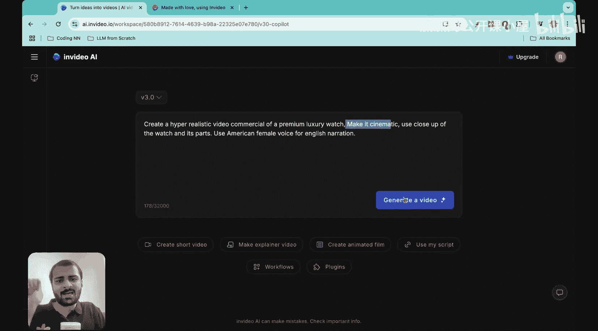
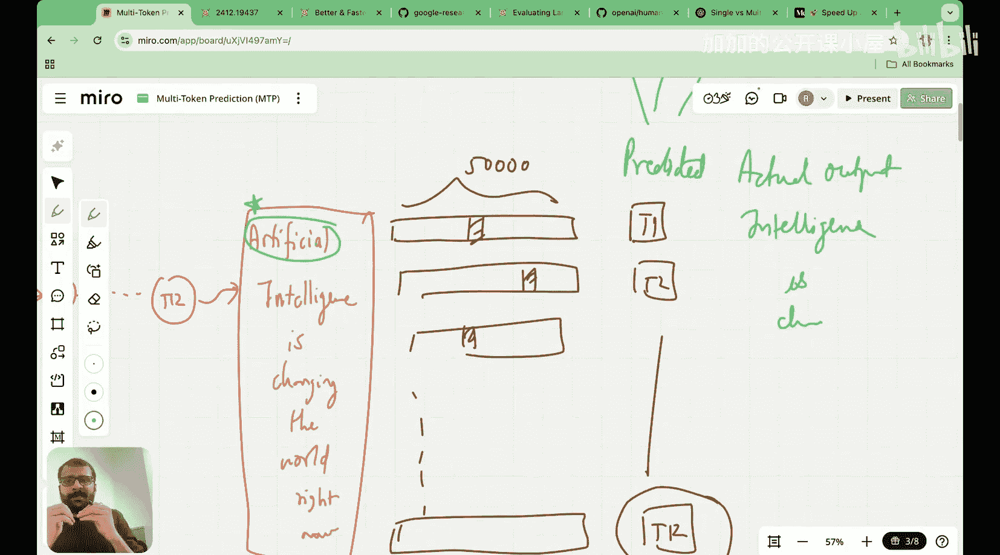

#  023：多令牌预测简介 🚀

在本节课中，我们将要学习DeepSeek架构中的第三个重要创新：多令牌预测。我们将了解它与传统单令牌预测的区别，并初步探讨其优势。

## 概述

大家好，我是Raj Duneja博士，于2022年从麻省理工学院获得机器学习博士学位，也是“从零开始构建DeepSeek”系列的创作者。在开始之前，我想介绍一下本系列的赞助商和合作伙伴：Invideo AI。

我们非常重视基础性内容，即从最基础的原理构建AI模型。Invideo AI的理念与我们非常相似。让我来展示一下。

这是Invideo AI的网站。凭借一个小型工程团队，他们构建了一个出色的产品，你可以仅通过文本提示创建高质量的AI视频。

如图所示，我输入了一个文本提示：“创建一个超现实的豪华手表视频广告，并使其具有电影感”。点击生成视频后，不久我便看到了这个令人惊叹的、高度逼真的视频。

这个视频让我着迷的是它对细节的关注。看这里，质量和纹理都非常出色，而这一切仅从一个文本提示创建。这就是Invideo产品的力量。您刚才看到的精彩视频背后的支柱是Invideo AI的视频创作流程，他们正在从第一性原理重新思考视频生成和编辑。

为了实验和调整基础模型，他们拥有印度最大的H100和H200集群之一，并且也在试验B200。Invideo AI是印度发展最快的AI初创公司，面向全球构建产品，这也是我如此认同他们的原因。好消息是，他们目前有多个职位空缺，您可以加入他们优秀的团队。更多详情我将在下方描述中发布。

## 课程引入

大家好，欢迎来到“从零开始构建DeepSeek”系列的这一讲。今天，我们将开始学习一个非常重要的模块，称为多令牌预测。

当你审视DeepSeek架构时，会发现他们在架构上有三个主要的革新：第一个是多头潜在注意力，第二个是在混合专家模块上的创新，第三个则是一个非常巧妙的实现，称为多令牌预测。今天我们将学习这第三个技术。在之前的课程中，我们已经涵盖了DeepSeek在多头潜在注意力和混合专家方面实现的所有内容。

如果你查阅DeepSeek在2025年1月发布的、引发了整个DeepSeek革命的论文，即DeepSeek-V3技术报告，并向下滚动，你会看到：首先，在他们的架构部分，有多头潜在注意力示意图。之后，有一个关于混合专家模块的完整章节，其中包含了诸如无辅助损失负载均衡、共享专家、细粒度专家分割等创新。最后，他们拥有的最后一个内容就是这个多令牌预测。这就是我们今天要看的。

这是DeepSeek关于多令牌预测模块的示意图。这看起来很简单，通常我们在语言模型中执行单令牌预测，那么这个多令牌预测是什么？也许我们是在预测多个令牌。但实际上，这个过程涉及很多复杂性，这就是为什么我们将花费大约两到三讲的时间，非常详细地向你解释多令牌预测的整个概念。一如既往，我们将在白板上展示所有内容，然后我也会带你了解如何从零开始编写多令牌预测模块的代码。

这就是接下来两到三讲的计划。首先，让我带你了解一下多令牌预测的历史。实际上，多令牌预测并非由DeepSeek发明，DeepSeek只是在其基础上进行构建，就像他们对许多其他架构创新所做的那样。

多令牌预测首次在这篇名为《通过多令牌预测实现更好更快的语言模型》的论文中实现。这篇论文由一组研究人员贡献，其中一组来自Meta。DeepSeek基于这篇论文，该论文于2024年4月发表，DeepSeek立即采纳了它，在其基础上构建，并将其应用于他们的V3架构中。

如果你查看摘要，这些作者说：大型语言模型使用下一个令牌预测损失进行训练。在这项工作中，我们建议训练语言模型一次预测多个未来令牌，会带来更高的样本效率。这就是多令牌预测的本质：我们将一次预测多个未来令牌。

## 单令牌预测与多令牌预测

让我们开始理解单令牌预测和多令牌预测之间的区别。在本讲中，我将只是引出多令牌预测的概念，展示它与单令牌预测的不同之处，然后我们还将讨论多令牌预测的一些优势。我将在这节课中建立你的直觉。下一讲我们将看到DeepSeek究竟是如何实现多令牌预测架构的，再下一讲我们将在代码中实现多令牌预测。

让我们开始今天的课程。如果你看一下单令牌预测，其流程大致如下：假设我们有一批输入令牌，看起来像这样。让我实际取一批8个输入令牌：“Artificial”、“Intelligence”、“is”、“changing”、“the”、“world”、“right”、“now”。假设我有这批8个输入令牌。单令牌预测的工作方式是：整个批次通过多个Transformer块的序列。这里我展示了三个Transformer块，实际上可能有24个甚至36个Transformer块。这些被称为共享Transformer主干。这是第一篇多令牌预测论文中引入的术语。我将使用相同的术语。这本质上意味着一系列Transformer块链接在一起。

假设我有这一系列Transformer块D1、D2……直到T3，它们链接在一起。之后，我有我的逻辑矩阵，它将每个令牌从嵌入维度转换到词汇表大小。现在，当这8个令牌从Transformer块输出时，最终输出是逻辑矩阵。如果词汇表大小是50,000，那么现在每个令牌都有一个对应的50,000维向量。所有这些令牌现在都有一个对应的50,000维向量。然后，我们查看具有最高关联概率的令牌索引，从而得到为所有输入令牌预测的下一个令牌。

在推理时，唯一重要的下一个令牌是最后一个令牌，那是推断出的新令牌。但在训练时，所有预测出的这些令牌都将用于计算我的训练损失。例如，对于预测出的第一个令牌，实际预测应该是“Intelligence”。如果输入是“Artificial”，实际输出应该是“Intelligence”。对于第二个输入“Artificial Intelligence”，实际输出应该是“is”。这里是实际输出，实际输出应该是“changing”等等。所以我们有实际输出和预测输出。在训练期间，损失是在实际输出和预测输出之间计算的。这本质上是单令牌预测任务。

在多令牌预测任务中，变化在于：对于我正在查看的每个令牌，假设我正在查看“Artificial”。在单令牌预测中，只预测一个令牌。在多令牌预测中，不是预测一个令牌，而是预测三个令牌。假设我称它们为S1、S2和S3。对于每个输入令牌，在预测期间预测这三个令牌。对于这三个令牌，我有我的实际令牌，即S1’、S2’和S3’。然后，我得到每个输入令牌的预测三个令牌和实际三个令牌之间的损失。所以，如果你现在看“Artificial”，你首先定义未来的视野。

## 总结

本节课我们一起学习了多令牌预测的基本概念。我们了解到，与传统的单令牌预测不同，多令牌预测旨在一次预测多个未来的令牌，这有望提高模型的样本效率。我们还简要回顾了其历史渊源，并初步对比了两种预测方式的流程差异。在接下来的课程中，我们将深入探讨DeepSeek的具体实现方式，并最终动手编写代码。