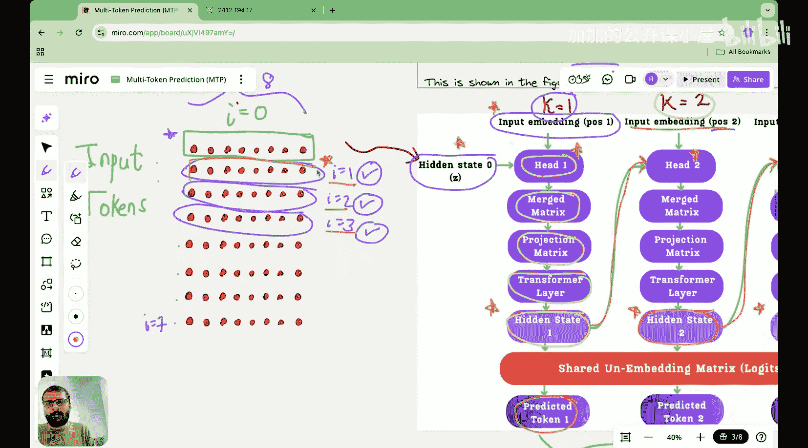

#  024：DeepSeek如何实现多令牌预测？🚀

在本节课中，我们将深入探讨DeepSeek如何具体实现多令牌预测。上一节我们介绍了多令牌预测的基本概念及其与单令牌预测的区别。本节中，我们将详细解析DeepSeek论文中的示意图和公式，理解其实现细节。

## 概述

多令牌预测的核心思想是，对于一个输入令牌，模型同时预测未来多个位置的令牌，而不仅仅是下一个。这带来了训练信号密集化、数据效率提升、更好的规划能力和更高的推理速度等优势。DeepSeek仅在预训练阶段使用多令牌预测，推理时则切换回单令牌预测。

## 单令牌预测回顾

上一节我们介绍了单令牌预测。在单令牌预测中，多个输入令牌经过一系列Transformer块处理后，其维度保持不变。例如，假设我们有3个维度为8的输入令牌，经过Transformer块后，输出仍为3x8的矩阵。这个矩阵随后通过一个输出头，被转换为一个3x50,000的矩阵（假设词汇表大小为50,000）。对于每个输入令牌（如令牌1、2、3），我们查看其对应行中概率最高的索引，从而预测出下一个令牌。

关键点在于，**一个输出头帮助每个输入令牌预测一个未来令牌**。

## 多令牌预测的直观理解

自然地，如果我们希望为每个输入令牌预测多个未来令牌，就需要多个输出头。

在今天的讲解中，我们假设预测深度为3，即**为每个输入令牌预测未来3个令牌**。因此，我们需要三个头：头1、头2和头3。对于每个输入令牌，头1预测第一个未来令牌，头2预测第二个，头3预测第三个。

接下来，我们将通过数学直觉来详细说明这个过程。

## 多令牌预测的数学流程

假设我们有8个输入令牌（i=0到7），每个令牌的维度为8。我们将以第一个输入令牌（i=0）为例进行说明，但请注意，**此流程适用于所有输入令牌**。

我们预测的深度K=3，即预测K=1， K=2， K=3时的未来令牌。

对于每个预测深度K，我们需要两个输入：
1.  **该深度下的隐藏状态**
2.  **该深度下的输入嵌入**

**输入嵌入**比较容易理解，它就是未来位置令牌的嵌入向量。例如，对于i=0的令牌，我们预测未来位置i=1， 2， 3的令牌。因此：
*   预测深度K=1时，输入嵌入是位置i=1的嵌入向量。
*   预测深度K=2时，输入嵌入是位置i=2的嵌入向量。
*   预测深度K=3时，输入嵌入是位置i=3的嵌入向量。

**隐藏状态**的获取则稍复杂。对于第一个预测步骤（K=1），其隐藏状态就是输入令牌经过所有Transformer块处理后得到的输出。在我们的例子中，i=0的输入令牌经过Transformer块后，输出的第一行向量就是`hidden_state_0`。

因此，对于第一个预测头（K=1），我们有两个输入：位置i=1的`input_embedding`和`hidden_state_0`。

以下是每个预测头内部发生的操作流程：

1.  **合并操作**：首先，将输入嵌入和隐藏状态这两个向量以某种方式合并。
2.  **投影操作**：对合并后的结果进行线性投影。
3.  **Transformer层**：将投影后的结果通过一个Transformer层进行处理。
4.  **输出隐藏状态**：经过上述步骤后，得到当前预测深度下的新隐藏状态（例如`hidden_state_1`）。

这个新产生的隐藏状态（`hidden_state_1`）将成为下一个预测深度（K=2）的输入之一。具体来说：
*   预测深度K=2时，输入是：位置i=2的`input_embedding`和上一步产生的`hidden_state_1`。
*   同样经过合并、投影、Transformer层处理后，得到`hidden_state_2`。
*   预测深度K=3时，输入是：位置i=3的`input_embedding`和`hidden_state_2`。

如此，**不同深度的预测通过隐藏状态串联起来**，形成了一个链式结构。

最后，每个预测深度产生的隐藏状态（`hidden_state_1`， `hidden_state_2`， `hidden_state_3`）会分别通过一个逻辑矩阵（logits matrix， 即输出头）进行投影，映射到词汇表维度，从而生成对应位置的令牌预测概率分布。

## 总结

本节课我们一起学习了DeepSeek实现多令牌预测的具体架构。核心在于为每个输入令牌使用多个预测头，每个头负责预测一个特定未来深度的令牌。预测过程是链式的：每个头的计算依赖于前一个头产生的隐藏状态以及对应位置的输入嵌入。这种设计使得模型能够在预训练阶段学习更丰富的序列结构信息，为下游任务打下坚实基础。