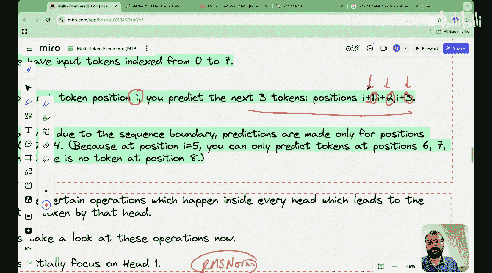

#  025：从零开始编写多令牌预测 (MTP)


在本节课中，我们将学习并动手编写DeepSeek模型所使用的多令牌预测机制。我们将从零开始，一步步实现这个核心组件。

上一节我们介绍了多令牌预测的理论机制，本节中我们来看看如何用代码实现它。

## 概述

多令牌预测是一种训练技术，它让模型在每一步同时预测未来的多个令牌，而不仅仅是下一个令牌。这能带来更密集的训练信号、更高的数据效率、更好的规划能力以及更快的推理速度。DeepSeek仅在预训练阶段使用此技术，推理时仍使用单令牌预测。

## 步骤0：导入包

我们首先需要导入必要的库。在这个简单的演示中，我们只需要PyTorch。

```python
import torch
```

## 步骤1：定义RMSNorm类

在将隐藏状态和输入令牌嵌入向量连接之前，我们需要对向量进行RMS归一化处理。这是DeepSeek论文中提到的步骤。

RMS归一化的计算步骤如下：
1.  计算向量中每个元素的平方。
2.  求这些平方值的和。
3.  计算平方和的平均值。
4.  取该平均值的平方根，得到RMS值。
5.  将向量中的每个元素除以这个RMS值。

公式表示为：`x_i' = x_i / sqrt(mean(x^2) + epsilon)`

以下是RMSNorm类的实现代码：

```python
class RMSNorm:
    def __init__(self, dim, eps=1e-8):
        self.eps = eps

    def __call__(self, x):
        # 计算平方和
        sum_of_squares = torch.sum(x * x, dim=-1, keepdim=True)
        # 计算均值
        mean_of_squares = sum_of_squares / x.size(-1)
        # 计算RMS值（均方根）
        rms = torch.sqrt(mean_of_squares + self.eps)
        # 归一化
        return x / rms
```

## 步骤2：定义多令牌预测类

这是本教程最核心的部分。我们将定义一个类来实现多令牌预测机制。其核心思想是：对于输入序列中的每个位置`i`，我们预测其后续的`k`个令牌（`i+1`, `i+2`, ..., `i+k`）。

以下是该类的初始化部分，定义了所需的矩阵：

```python
class MultiTokenPrediction:
    def __init__(self, d_model, depth, n_heads):
        self.depth = depth  # 预测深度，例如3
        self.d_model = d_model  # 模型维度
        # 合并矩阵：用于合并隐藏状态和输入嵌入
        self.merge_matrices = torch.nn.ModuleList([
            torch.nn.Linear(2 * d_model, d_model) for _ in range(depth)
        ])
        # 投影矩阵
        self.projection_matrices = torch.nn.ModuleList([
            torch.nn.Linear(d_model, d_model) for _ in range(depth)
        ])
        # Transformer层（简化版，此处用线性层示意）
        self.transformer_layers = torch.nn.ModuleList([
            torch.nn.Linear(d_model, d_model) for _ in range(depth)
        ])
        # 逻辑矩阵（反嵌入矩阵），用于生成词汇表概率分布
        self.logits_matrices = torch.nn.ModuleList([
            torch.nn.Linear(d_model, vocab_size) for _ in range(depth)
        ])
        self.rms_norm = RMSNorm(d_model)
```

接下来是前向传播方法，它实现了多令牌预测的计算流程：

```python
    def forward(self, hidden_states, input_embeddings):
        batch_size, seq_len, _ = hidden_states.shape
        all_predictions = []

        # 外层循环：遍历序列中的每个令牌位置 i
        for i in range(seq_len - self.depth):
            predictions_at_i = []
            prev_hidden = hidden_states[:, i, :]  # 第一个头的隐藏状态来自主模型

            # 内层循环：对于位置 i，预测后续 depth 个令牌 (k=1,2,...,depth)
            for k in range(self.depth):
                # 1. 获取未来第k个位置的输入嵌入
                future_embed = input_embeddings[:, i + k + 1, :]
                # 2. 对隐藏状态进行RMS归一化
                normed_hidden = self.rms_norm(prev_hidden)
                # 3. 合并归一化后的隐藏状态与未来输入嵌入
                combined = torch.cat([normed_hidden, future_embed], dim=-1)
                merged = self.merge_matrices[k](combined)
                # 4. 线性投影
                projected = self.projection_matrices[k](merged)
                # 5. 通过Transformer层（简化）
                transformed = self.transformer_layers[k](projected)
                # 6. 更新隐藏状态，传递给下一个预测头
                prev_hidden = transformed
                # 7. 生成逻辑值（预测分数）
                logits = self.logits_matrices[k](transformed)
                predictions_at_i.append(logits)

            all_predictions.append(predictions_at_i)

        # 调整输出形状: [batch, seq_len, depth, vocab_size]
        return torch.stack(all_predictions, dim=1)
```

关键点在于，每个预测头（对应一个未来的位置k）的隐藏状态输入依赖于前一个头的输出。这建立了从近到远的因果依赖关系，是DeepSeek实现的一个创新点，不同于传统独立预测每个未来令牌的方法。

## 步骤3：生成下一个令牌

定义好类之后，我们可以用它来进行预测。以下是生成预测的示例代码：

```python
# 假设参数
d_model = 512
depth = 3
vocab_size = 10000
batch_size = 2
seq_len = 10

# 初始化模型
mtp_model = MultiTokenPrediction(d_model, depth, vocab_size)

# 创建模拟的隐藏状态和输入嵌入（随机值）
hidden_states = torch.randn(batch_size, seq_len, d_model)
input_embeddings = torch.randn(batch_size, seq_len, d_model)

# 前向传播，获得预测
predictions = mtp_model(hidden_states, input_embeddings)
print(f"预测张量形状: {predictions.shape}")  # 应为 [2, 7, 3, 10000]
```

## 步骤4：计算损失函数

最后，我们需要计算预测令牌与目标令牌之间的损失。对于每个输入位置`i`和每个预测深度`k`，我们都有一个预测值和一个对应的真实未来令牌。

以下是损失计算的示例：

```python
def calculate_mtp_loss(predictions, targets):
    """
    predictions: 形状为 [batch, seq_len, depth, vocab_size] 的张量
    targets: 形状为 [batch, seq_len, depth] 的张量，包含真实的未来令牌ID
    """
    total_loss = 0
    batch_size, seq_len, depth, vocab_size = predictions.shape

    # 遍历批次、序列位置和预测深度
    for b in range(batch_size):
        for i in range(seq_len):
            for k in range(depth):
                # 获取第k个头的预测逻辑值
                logits = predictions[b, i, k, :]
                # 获取对应的真实令牌ID
                target_token = targets[b, i, k]
                # 计算交叉熵损失（PyTorch内置函数）
                loss = torch.nn.functional.cross_entropy(logits.unsqueeze(0), target_token.unsqueeze(0))
                total_loss += loss

    # 计算平均损失
    average_loss = total_loss / (batch_size * seq_len * depth)
    return average_loss

# 创建模拟的目标令牌（随机整数）
target_tokens = torch.randint(0, vocab_size, (batch_size, seq_len - depth, depth))

# 计算损失
loss = calculate_mtp_loss(predictions, target_tokens)
print(f"计算得到的多令牌预测损失: {loss.item()}")
```

## 总结

本节课中我们一起学习了如何从零开始编写DeepSeek的多令牌预测机制。我们回顾了其核心思想：为每个输入令牌同时预测多个未来令牌以提升训练效率。我们逐步实现了四个部分：
1.  导入必要的PyTorch库。
2.  实现了RMS归一化层，用于稳定训练。
3.  构建了核心的`MultiTokenPrediction`类，其中关键点在于预测头之间的隐藏状态传递，形成了因果依赖。
4.  演示了如何使用模型进行预测并计算损失函数。



通过本教程，你不仅理解了多令牌预测的原理，也掌握了将其转化为可运行代码的实践能力。这个机制是使DeepSeek模型高效预训练的关键组件之一。