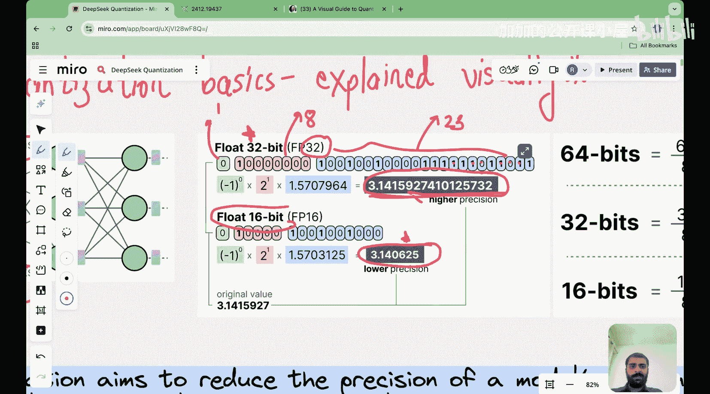

#  026：大语言模型量化简介 🧮

在本节课中，我们将开始学习一个重要的主题——量化。这是构建DeepSeek架构的最后一个支柱。

在之前的课程中，我们已经介绍了多头潜在注意力、专家混合模型以及多令牌预测这三个主要的架构部分。现在，我们将转向量化，这是DeepSeek技术报告中基础设施部分的核心内容，特别是其FP8训练方案。

## 什么是量化？

量化是一个在大型语言模型中至关重要的概念。要理解它，我们首先需要了解模型参数在内存中是如何表示的。

大型语言模型的基本构建模块包括输入和权重。输入与权重相乘，然后通过激活函数。这些激活值又作为后续模块的输入。在整个过程中，有大量的参数需要相互乘加运算。

模型中的每个参数，无论是词嵌入、位置嵌入、注意力机制、前馈神经网络，还是层归一化或输出层中的参数，都会占用内存。参数占用的内存量取决于其表示方式。

## 参数表示与精度

最常见的默认参数表示方式是32位浮点数（FP32）。一个FP32数字由三部分组成：
*   **符号位**：1位，控制数字的正负。
*   **指数位**：8位。
*   **尾数位**：23位。

这三部分共同决定了数字的精确值。尾数位的位数直接决定了数字的表示精度。

**公式**：一个浮点数可以表示为：`(-1)^符号位 × 2^(指数 - 偏移量) × (1 + 尾数)`

如果同一个参数用16位浮点数（FP16）表示，则它只占用16位内存。其结构变为：
*   **符号位**：1位。
*   **指数位**：5位。
*   **尾数位**：10位。

显然，使用FP16表示可以显著减少内存占用。然而，代价是精度降低，因为用于表示数字细节的尾数位变少了。

## 量化的核心思想

简单来说，**量化就是使用更低精度的数据类型（如FP16、INT8甚至FP8）来表示模型参数和计算中间结果的过程**。其主要目的是：
1.  **减少内存占用**：使大型模型能在内存有限的设备上运行。
2.  **加速计算**：低精度运算通常在硬件上执行得更快。
3.  **降低功耗**：减少数据传输和计算所需的能量。

然而，量化也带来了挑战，即如何在不显著损失模型性能的前提下实现这些好处。这正是DeepSeek在其量化方案中通过一系列创新来解决的问题。

## DeepSeek的量化创新

在DeepSeek的技术报告中，他们提出了五项关键的量化创新。在接下来的课程中，我们将逐一深入探讨：

以下是DeepSeek量化方案的五项核心创新：
1.  **混合精度框架**：在不同部分灵活使用不同精度的数据类型。
2.  **细粒度量化**：对张量的不同部分采用不同的量化策略。
3.  **提高累加精度**：在计算中间累加时使用更高精度以保持数值稳定性。
4.  **尾数与指数处理**：优化浮点数的尾数和指数部分的表示。
5.  **在线量化**：在训练过程中动态地进行量化。

直接阅读论文中的相关图表和描述可能会感到复杂。在后续课程中，我将逐一拆解这些概念，用简单直白的方式解释每个部分的作用和原理。

## 总结

本节课我们一起学习了量化的基本概念。我们了解到，量化是通过降低参数和计算的数据精度来减少模型内存占用和加速计算的技术。其核心是在精度损失和效率提升之间取得平衡。

我们还预览了DeepSeek为实现高效量化所引入的五项关键技术。在下一节课中，我们将首先深入探讨**混合精度框架**、**细粒度量化**和**提高累加精度**这三个部分，理解它们如何共同工作以在降低精度的同时保持模型性能。