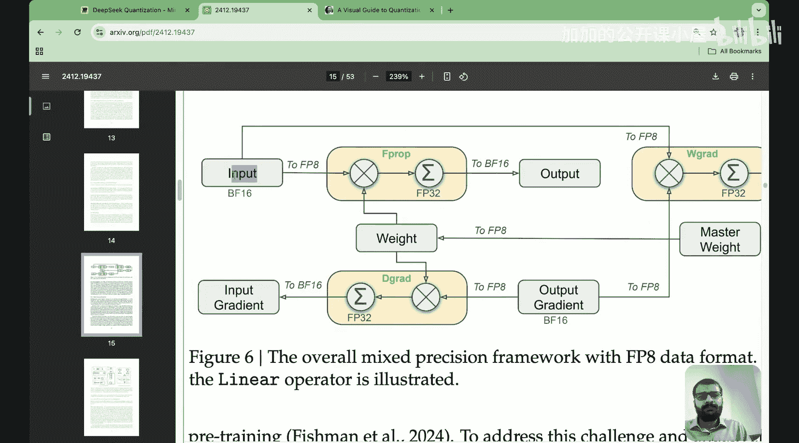

#  027：DeepSeek如何重写量化（第一部分）｜混合精度｜细粒度量化

在本节课中，我们将开始理解DeepSeek在其版本3技术报告中实际实现的量化方法。我们将重点探讨混合精度框架和细粒度量化这两个核心概念。

## 概述

量化是一种降低模型参数精度的技术，旨在减少模型的内存占用，同时尽可能保持模型的准确性。DeepSeek在其技术报告中提出了多项量化相关的创新，我们将其归纳为五个主要方面：混合精度框架、细粒度量化、增加累加精度、尾数与指数处理以及在线量化。本节课我们将聚焦于前两个方面。

## 量化基础回顾

在上一讲中，我们初步了解了量化。其核心思想是：模型中的每个参数都会占用存储空间。如果一个参数用32位浮点数（FP32）表示，那么它占用的空间会比用16位浮点数（FP16）或8位整数（INT8）表示时更多。量化的主要目标就是将参数从高精度（如32位）降低到低精度（如8位或16位），从而显著减少内存需求。虽然精度降低会轻微影响模型准确性，但对于大型语言模型而言，这种性能下降通常是可以接受的。

以下是本节课将涉及的数据格式：
*   **FP32**：32位浮点数。
*   **FP16**：16位浮点数，其数值范围远小于FP32。
*   **BF16**：脑浮点16位，其数值范围与FP32相同，但位数与FP16相同，仍为16位。
*   **INT8**：8位整数，数值范围非常小（-127 到 127）。

一个关键的量化操作是：当需要将一组FP32数值量化为INT8时，通常的做法是先将所有数值除以该序列中的最大值，然后再乘以127（INT8的最大正数值）。这个操作可以表示为：
`量化值 = round(原始值 / 最大值 * 127)`

## 混合精度框架 🧩

现在，让我们深入探讨DeepSeek实现的第一个核心概念：混合精度框架。在DeepSeek论文的3.3.1节中，他们提出了一个框架，其示意图如下所示。

要理解这个框架，我们首先需要回顾神经网络中的基本运算。在一个简单的神经网络层中，典型的前向传播操作是：
`y = w * x`
其中，`x`是输入，`w`是权重，`y`是输出。

接下来，我们将解释DeepSeek如何在这个公式中，以不同的量化格式存储权重、输入和输出。

### 前向传播

在前向传播（F Prop）过程中：
1.  **输入（x）**：从BF16格式转换为FP8格式。
2.  **权重（w）**：本身以高精度（BF16或FP32）存储，但在计算时即时转换为FP8格式。
3.  **计算**：FP8格式的权重与FP8格式的输入相乘。
4.  **输出（y）**：计算结果最初以FP32精度获得，以确保数值稳定性。随后，为了优化内存，该输出被转换并存储为BF16格式。

这样，在前向传播中，DeepSeek通过使用FP8进行计算，显著减少了内存占用，同时利用FP32进行中间计算和BF16进行存储，在内存效率和数值精度之间取得了平衡。

### 反向传播

在反向传播过程中，对于某一层，我们需要计算两个梯度：
1.  **权重梯度（W Grad）**：用于更新该层的权重。公式为：`dL/dw = x^T * (dL/dy)`
2.  **输入梯度（B Grad）**：作为上一层的“输出梯度”传递回去。公式为：`dL/dx = (dL/dy) * w^T`

以下是DeepSeek在反向传播中的处理方式：
*   **计算输入梯度（B Grad）**：
    *   权重（w）在计算时即时转换为FP8。
    *   来自上一层的输出梯度（dL/dy）以BF16存储，但在计算时转换为FP8。
    *   两者的乘法计算最初以FP32精度进行，结果随后存储为BF16。
*   **计算权重梯度（W Grad）**：
    *   输入（x）以FP8格式参与计算。
    *   输出梯度（dL/dy）同样从BF16转换为FP8进行计算。
    *   权重梯度（dL/dw）的计算结果以FP32精度存储，这是为了确保后续权重更新时的数值稳定性，因此**不**会转换为低精度格式。

通过这种方式，DeepSeek的混合精度框架在训练的不同阶段（前向和反向传播）智能地分配不同精度的数据类型，最大化内存利用率和计算效率。

## 细粒度量化 🔬

上一节我们介绍了DeepSeek如何在操作层面混合使用不同精度。本节中，我们来看看他们如何对模型的不同部分进行更精细的量化处理，即细粒度量化。

标准的量化方法通常对整个张量（Tensor）或整个层使用相同的量化参数（如缩放因子）。然而，模型的不同部分对量化的敏感度可能不同。细粒度量化旨在为模型的不同组件应用不同精度或量化策略，以在保持精度的同时获得更大的压缩收益。

以下是DeepSeek可能采用的几种细粒度量化策略：

*   **分层量化**：对网络中不同的层使用不同的位宽。例如，靠近输入的层和靠近输出的层可能对精度更敏感，因此保持较高精度（如BF16），而中间层可以使用更低的精度（如FP8或INT8）。
*   **分组量化**：在一个权重张量内部进行分组，每组使用独立的量化参数。这比整个张量使用单一缩放因子能更好地保留信息。
*   **敏感度分析**：通过分析各层或各参数对最终输出损失的贡献（敏感度），对敏感度高的部分保留高精度，对敏感度低的部分进行激进量化。

细粒度量化的核心思想是**区别对待**，而不是“一刀切”。通过这种精细控制，可以在整体压缩率不变甚至更高的情况下，比均匀量化获得更好的模型性能。

## 总结

本节课我们一起学习了DeepSeek量化方案中的两个重要部分。
1.  **混合精度框架**：DeepSeek在前向和反向传播中，动态地将数据在BF16、FP8和FP32之间转换。在计算密集型操作中使用FP8节省内存和计算量，在需要数值稳定性的地方（如梯度累加、权重更新）使用FP32，并以BF16作为主要存储格式来平衡范围和内存占用。
2.  **细粒度量化**：其思想是根据模型不同部分对量化的敏感度，施加不同精度或策略的量化，从而实现更优的精度-压缩比权衡。

理解这些基础概念，为我们后续深入探讨增加累加精度、尾数与指数优化以及在线量化等高级主题打下了坚实的基础。在下节课中，我们将继续探索DeepSeek在量化方面的其他创新。