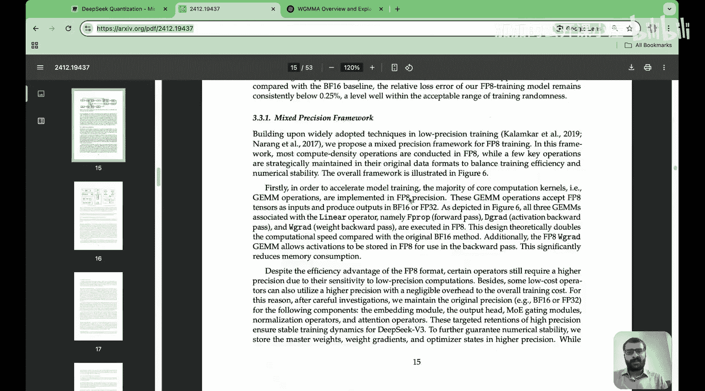
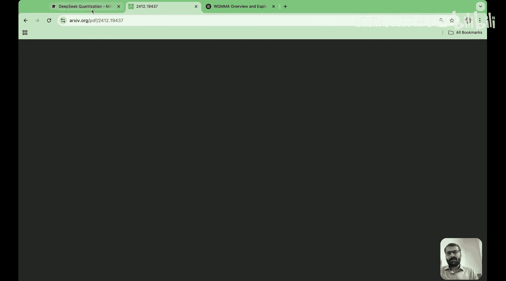
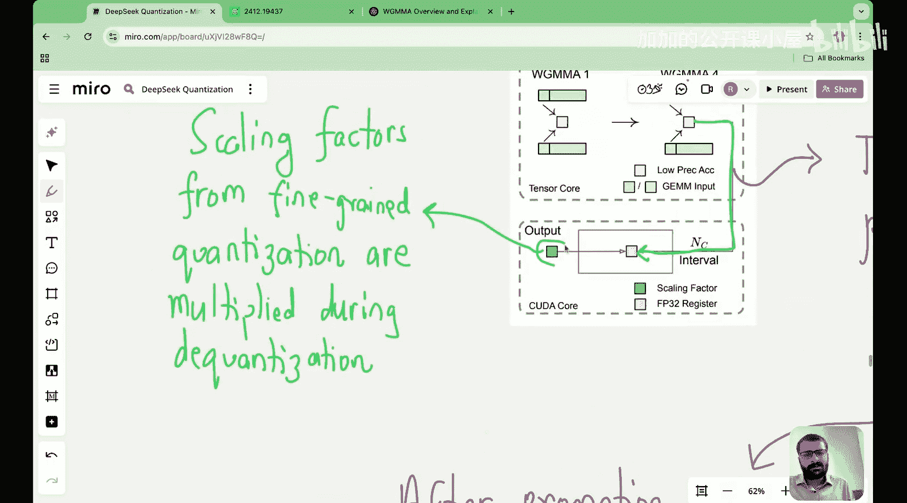

#  028：DeepSeek量化技术第二部分 - 累积精度提升与在线量化


## 概述
在本节课中，我们将继续探索DeepSeek的量化实现。我们将重点学习三个关键技术：提升累积精度、尾数覆盖指数技术以及在线量化。这些技术共同解决了低精度计算中的数值稳定性问题。

上一节我们介绍了混合精度框架和细粒度量化，本节中我们来看看DeepSeek如何通过创新方法进一步提升量化效果。

---





## 累积精度提升 ⚡

在矩阵乘法运算中，当我们使用低精度数据类型（如FP8）进行计算时，会遇到累积精度有限的问题。具体来说，张量核心内部使用约14位精度进行中间结果的累加，这远低于FP32的32位精度。

### 问题分析
考虑标准的矩阵乘法公式：
```
Y = W × X + B
```
当W和X都是FP8精度时，多个低精度数值相乘累加会导致中间结果过小，引发下溢问题。这种有限的累积精度在大型矩阵运算（如K=4096的内积维度）中可能产生高达2%的误差，严重影响模型精度。

### 解决方案原理
DeepSeek提出的解决方案基于一个关键观察：张量核心（低精度计算单元）和CUDA核心（高精度计算单元）可以协同工作。

以下是解决方案的两个步骤：

**步骤一：低精度MMA累积**
- 初始阶段在张量核心上使用FP8精度执行矩阵乘积累加操作
- 中间结果以有限精度（约14位）在内部累加
- 这对应图中的浅紫色部分，表示低精度累积

**步骤二：提升到CUDA核心**
- 每处理128个元素后，将部分低精度累积结果复制到高精度寄存器
- 这些结果在CUDA核心上以完整的FP32精度进行累加
- 这对应图中的深紫色部分，表示高精度累积

### 技术实现
这种“提升到CUDA核心”的操作通过特定的GPU指令实现。图中的箭头清晰地展示了从低精度张量核心到高精度CUDA核心的数据流动路径。通过这种方式，部分和始终存储在高精度内存中，有效避免了累积误差。

---

## 尾数覆盖指数技术 🔢

现在让我们看看DeepSeek如何通过尾数覆盖指数技术进一步优化量化过程。这项技术解决了动态范围与精度之间的平衡问题。

### 浮点数表示基础
在深入技术细节前，我们需要理解浮点数的基本结构。一个浮点数通常由三部分组成：
```
[符号位] [指数部分] [尾数部分]
```
其中指数部分控制数值的范围，尾数部分控制数值的精度。

### 技术原理
DeepSeek发现，在某些情况下，可以通过“借用”指数位来增加尾数位的数量。具体来说：

**标准FP8格式**：
- 通常配置为：1位符号 + 5位指数 + 2位尾数
- 这种配置提供较大的动态范围但精度有限

**优化后的格式**：
- 重新分配为：1位符号 + 4位指数 + 3位尾数
- 通过减少指数位增加尾数位，提升精度

### 数学表达
这种位重分配可以形式化表示为：
```
原格式：FP8(s=1, e=5, m=2)
新格式：FP8(s=1, e=4, m=3)
```
其中s表示符号位，e表示指数位，m表示尾数位。

### 应用场景
这种技术特别适用于权重分布相对集中的情况。当模型参数的值域范围不需要太大动态范围时，牺牲一些范围来换取精度是更优的选择。DeepSeek通过分析模型各层的数值特性，智能地应用这种位重分配策略。

---

## 在线量化技术 🔄

最后，我们探讨DeepSeek的在线量化技术。这项技术解决了静态量化在动态数据分布下的局限性。

### 静态量化的挑战
传统的离线量化方法基于校准数据集确定量化参数（如缩放因子和零点）。然而，在实际推理过程中，输入数据的分布可能发生变化，导致固定的量化参数不再最优。

### 在线量化原理
DeepSeek的在线量化在推理过程中动态计算量化参数。具体流程如下：

以下是在线量化的关键步骤：

**步骤一：实时统计**
- 在推理过程中收集当前输入数据的统计信息
- 包括最小值、最大值、均值等分布特征

**步骤二：动态计算参数**
- 基于实时统计计算缩放因子和零点
- 使用公式：scale = (max - min) / (2^n - 1)

**步骤三：即时量化**
- 使用动态计算的参数对权重和激活进行量化
- 确保量化过程适应当前输入特性

### 代码示例
在线量化的核心计算可以用以下伪代码表示：
```python
def online_quantize(tensor, bits=8):
    # 步骤1：计算动态范围
    min_val = tensor.min()
    max_val = tensor.max()
    
    # 步骤2：计算量化参数
    scale = (max_val - min_val) / (2**bits - 1)
    zero_point = round(-min_val / scale)
    
    # 步骤3：执行量化
    quantized = round(tensor / scale) + zero_point
    quantized = clamp(quantized, 0, 2**bits - 1)
    
    return quantized, scale, zero_point
```

### 优势分析
在线量化的主要优势在于其适应性。它能够：
1. 处理分布变化的输入数据
2. 减少分布偏移引起的误差
3. 在动态环境中保持量化精度

这项技术特别适合处理多样化、非平稳的输入数据，在实际部署场景中表现出色。

---

## 总结
本节课中我们一起学习了DeepSeek量化技术的三个关键创新：

1. **累积精度提升**：通过定期将低精度张量核心的中间结果转移到高精度CUDA核心，有效避免了累积误差，在大型矩阵运算中特别重要。

2. **尾数覆盖指数技术**：智能地重新分配浮点数的指数位和尾数位，在动态范围和精度之间找到最优平衡，适应不同层的数值特性。

3. **在线量化**：在推理过程中动态计算量化参数，适应输入数据分布的变化，提高量化模型在实际场景中的鲁棒性。



这些技术共同构成了DeepSeek高效量化的核心，使其能够在保持精度的同时大幅降低计算和存储开销。下一节课我们将探讨这些技术在实际模型中的集成与应用。