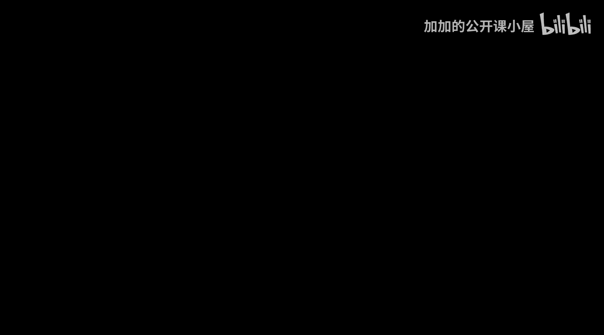
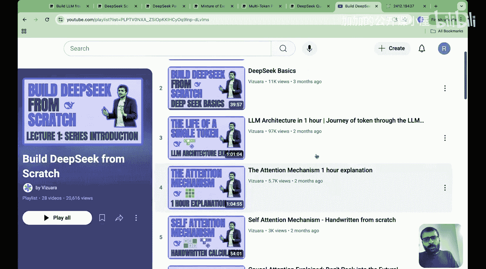
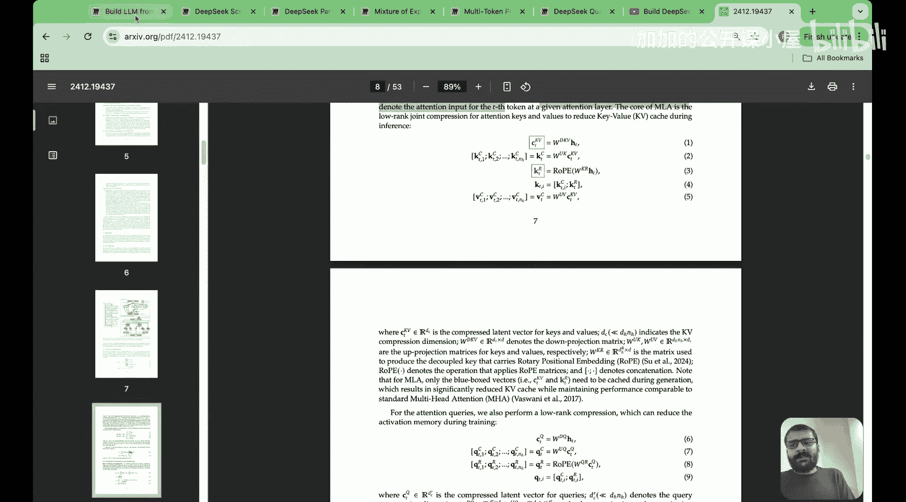
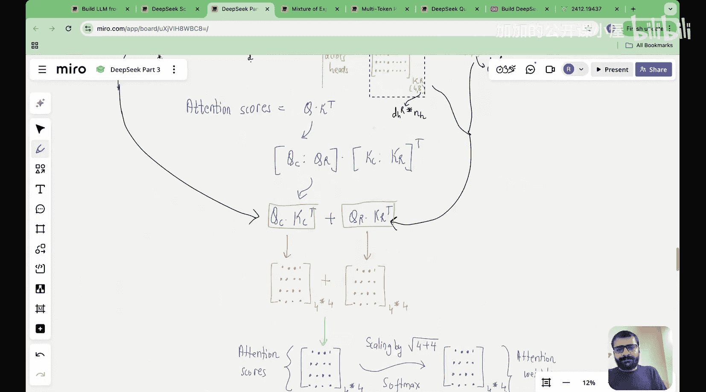

#  029：20分钟总结

大家好，欢迎来到“从零开始构建DeepSeek”系列讲座。

如果你已经坚持学习到这个阶段，我想花点时间祝贺你。因为你已经学习了一些大型语言模型中最先进的概念，这些概念正是DeepSeek在其架构中所使用的。

在本视频中，我计划对本系列讲座迄今为止所学内容进行一次快速总结。我将带你回顾我们何时覆盖了特定的讲座，该讲座具体覆盖了哪些内容，以及它如何融入DeepSeek V3论文中。

如果你在谷歌搜索“DeepSeek V3 Paper”，你会找到这份技术报告。我们整个系列的目标，就是尽可能多地为你解读DeepSeek架构的各个方面，并希望通过白板演示和Google Colab代码来实现。这是我们的播放列表，目前包含大约30个讲座。总的来说，我们在这个系列中覆盖了大量内容。

## 概述

在本节课中，我们将回顾整个系列的核心内容，总结我们如何从基础概念逐步深入到DeepSeek架构的关键创新点，并理解这些部分是如何组合在一起的。

最初，我们从了解DeepSeek是什么、什么是大型语言模型、什么是涌现特性，以及DeepSeek为何如此受欢迎开始。具体来说，我们将这些讲座的范围缩小到以下几个方面：

1.  多头潜在注意力
2.  专家混合
3.  多令牌预测
4.  量化
5.  旋转位置编码

这五个方面是DeepSeek在其架构中的主要创新，它们彻底改变了其预训练和推理的方式。关于DeepSeek的一个非常酷的地方在于，这篇论文非常精炼，但如果你仔细阅读，会发现他们确实解释了一切。例如，论文中只用一两页解释的元素，我们可能需要两到三个讲座来阐述，因为它确实很密集。但如果你学完了这30个讲座，我相信你会对我们迄今为止涵盖的所有架构概念有非常深入的理解。

我们花了30个讲座来涵盖这些概念，从注意力的基础，到多头潜在注意力、专家混合、多令牌预测、量化、旋转位置编码等。现在，让我带你回顾一下我们规划讲座的思路流程。

## 从基础架构到注意力机制

在进入潜在注意力部分之前，我需要向你解释LLM架构的基础。因此，我们最初开始了这个系列讲座。你会看到，我们最初的视频是关于DeepSeek基础、LLM架构本身、注意力机制、注意力机制的核心、因果注意力机制以及多头注意力机制。

在讲义中，你会看到我们描述了令牌在LLM架构中的旅程、对注意力机制的需求、我们如何从RNN、LSTM发展到注意力机制。然后我们涵盖了自注意力的概念，之后我们研究了带有可训练权重的自注意力概念。在这里，我介绍了可训练查询矩阵、可训练键矩阵、可训练值矩阵的概念，以及我们如何从输入嵌入矩阵计算上下文向量。

在此之后，我们学习了因果注意力机制。其核心思想是，为了预测下一个令牌，我们不能窥视未来。在了解了因果注意力之后，我们看到注意力分数或注意力权重矩阵中对角线以上的元素基本上被设为零，它们不产生影响，因为我们不能窥视未来。

然后，我们涵盖了一个关于多头注意力机制的重要讲座。拥有多个头的主要思想是捕捉多个视角。自注意力在给定的输入序列中只能捕捉单一视角，无法捕捉多个视角。因此，我们了解了为什么需要多头注意力，我们研究了其理论，并查看了代码实现。

通往多头注意力的旅程始于自注意力，然后发展到因果注意力，再到多头注意力。所有这些内容都在第8个讲座“从零开始实现多头注意力”中涵盖完毕。

## 通往潜在注意力的旅程

接下来，我们开始理解潜在注意力的旅程。理解潜在注意力的整个旅程涵盖四个方面：

1.  键值缓存
2.  多查询注意力
3.  分组查询注意力
4.  多头潜在注意力

这个多头潜在注意力正是DeepSeek彻底改变注意力机制的方式。

我们首先研究了键值缓存，这是整个故事的起点。主要问题是，当我们通过LLM进行推理时，似乎做了很多重复计算，因此键和值需要被缓存，这就是所谓的键值缓存。但键值缓存的缺点是它占用空间，占用大量空间。

为了缓解这些缺点或解决KV缓存内存问题，人们提出了不同的机制，例如多查询注意力和分组查询注意力，在这些机制中，注意力权重基本上在所有头或头组之间共享。但这导致了语言性能的下降。因此，DeepSeek开始思考：我们能否两全其美？我们能否拥有较低的缓存大小，同时获得良好的语言模型性能？这就是潜在注意力思想的诞生之处。

他们引入了一个潜在矩阵。他们获取输入嵌入矩阵，并将其投影到一个维度低得多的潜在矩阵中。这看起来很简单，但实际上它确实解决了KV缓存内存问题，同时我们没有降低语言性能。他们还有一个称为“吸收技巧”的方法，其中查询矩阵（更准确地说是Wq）与WUK合并。这里涉及投影矩阵和下投影矩阵。我们实际上花了很多时间来理解潜在注意力。

首先，我们学习了键值缓存，然后是多查询注意力，接着是分组查询注意力，最后我们准备好理解多头潜在注意力。我们还在Python中从零开始实现了多头潜在注意力。为了达到第13讲，我们必须经历第12讲到第13讲。而如果你看DeepSeek论文的架构部分，他们确实解释了多头潜在注意力，但只用10行文字就解释完了。

## 整合旋转位置编码

这里的主要问题是，我们看到的第一个版本的多头潜在注意力并不是DeepSeek实际使用的版本。DeepSeek实际做的是，他们添加了旋转位置编码，而不是传统的位置编码。

因此，我们必须学习什么是旋转位置编码。我采用了一种非常不同的方法来展示旋转位置编码的旅程。我首先向你展示了什么是整数位置编码、什么是二进制位置编码，以及什么是正弦位置编码。只有在那之后，我才涵盖了什么是旋转位置编码。

我们看到，在旋转位置编码中，我们操作查询和键，而不是操作令牌嵌入。我们分割查询和键，然后旋转它们，再将其添加到查询和键向量中。这不会像原始位置嵌入那样污染令牌嵌入矩阵或向量。

那么，我们为什么要研究旋转位置编码？原因是我们研究旋转位置编码是因为DeepSeek将多头潜在注意力与RoPE整合在一起，所以我们最终必须朝这个方向发展。

如果你看讲座流程，我们有整数和二进制位置编码、正弦位置编码、旋转位置编码，最后我们有了关于DeepSeek如何精确实现潜在注意力的讲座。在这里，我演示了他们如何将潜在注意力与旋转位置编码整合。

这个讲座花了我两个月的时间来准备，因为这不容易解释。在论文中，他们有这9个方程（1，2，3，4，5，6，7，8，9，10，11）来解释潜在注意力。从这些方程中很难理解发生了什么。所以我的任务是将其分解到一个简单的层次，并向你展示他们如何将潜在注意力与旋转位置编码整合，以及为什么这是一项具有挑战性的事情。

本质上，他们所做的是将问题分为两部分，这就是为什么他们称之为解耦RoPE。他们本质上添加了新的矩阵，其中一个矩阵应用了旋转位置编码，另一个矩阵没有应用旋转位置编码。因此，他们通过将一个矩阵分为带RoPE和不带RoPE的两个矩阵来解决这个问题。

## 总结

本节课中，我们一起回顾了整个“从零开始构建DeepSeek”系列的核心脉络。我们从LLM和注意力的基础概念出发，逐步深入到多头注意力、键值缓存优化，最终抵达DeepSeek的核心创新——多头潜在注意力及其与旋转位置编码的整合。我们还简要提及了后续将涵盖的专家混合、多令牌预测和量化等主题。这个总结旨在帮助你串联起所有知识点，理解DeepSeek架构中各个关键部分的设计动机与相互关系。