# 01：系列介绍 🚀

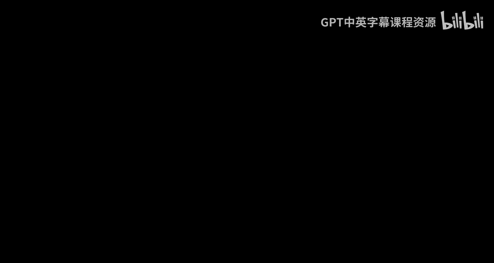

大家好。欢迎来到本系列课程的第一讲，课程名为《从零开始搭建大语言模型》。我是 Raj Danecker 博士。我于 2070 年从印度理工学院马德拉斯分校毕业，获得机械工程学士学位。之后，我在麻省理工学院攻读机器学习博士学位，并于 2022 年毕业。此后我回到印度，我们的使命是让每个人都能接触人工智能。在我们的 YouTube 频道 Vizuara 上，我们已经制作了多个关于机器学习和深度学习的系列课程。我们教学的主要方法或理念是从基础开始教授一切，不做任何假设，并讲解每个概念的核心细节。

制作本系列课程的真实原因是，众所周知，大语言模型和生成式人工智能正在改变我们周围的一切。这个领域的初创公司正在涌现，企业正在转向使用大语言模型处理各种任务，相关工作岗位也在大幅增加。但许多人在学习这个领域时犯了一个常见的错误。他们直接转向应用层面，直接运行一些 Google Colab 笔记本，或跟随某些 YouTube 视频直接运行代码。但很少有人真正理解大语言模型是如何工作的。很少有人真正了解使大语言模型如此强大的核心细节。

如果你能完全从零开始构建一个大语言模型，那不是很棒吗？这难道不会让你对这个主题充满信心吗？目前拥有这种知识的人很少，我正在制作这个 YouTube 系列课程，它将是一个非常全面的系列，向你展示关于从零开始构建 LLM 的一切。

我制作这个系列课程的方式是，从基础开始，以初学者为对象，不做任何假设。在本系列课程结束时，你将完全靠自己成功地从零开始构建一个 LLM。你会发现，在此之后，所有后续内容，所有的应用部分，对你来说都会变得极其简单。

这就是制作这个系列课程的全部理念。制作这个系列需要我们付出巨大的努力，因为正如你将看到的，为了制作每一讲，我们都会制作详细的讲义，我会与你分享这些讲义，并且本系列的所有视频都将完全免费提供。

现在，我将告诉你一些我学习 LLM 的经历。然后，我将告诉你一些关于目前互联网上已有的学习 LLM 的资料，为什么这些资料如此不足，以及我们试图通过这个系列课程做些什么新的事情。让我们开始视频内容。

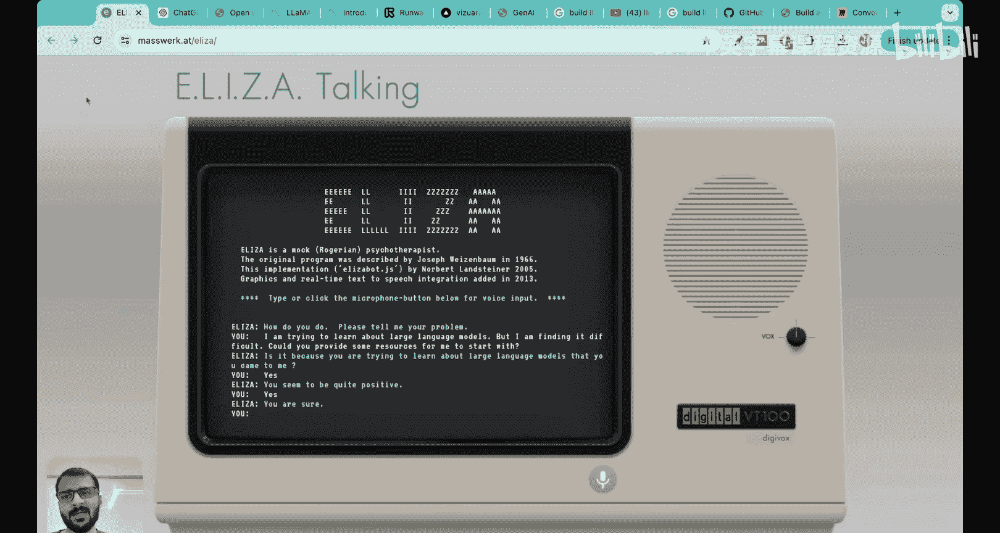

让我带你回到过去，看看大约在 1960 年代，大语言模型是什么样子，或者说大约 50 到 60 年前自然语言处理领域的情况。这是人类开发的最早的聊天机器人之一，名为 Eliza，它被设计成一名治疗师。让我们看看它是如何工作的。首先，这个界面让我选择语言，我选择英语。然后 Eliza 告诉我：“你好，请告诉我你的问题。” 让我输入：“我正在尝试学习关于大语言模型的知识。但是，我发现这很困难。你能为我提供一些入门资源吗？” 然后 Eliza 问：“是因为你正在尝试学习大语言模型，所以你来找我吗？” 我说：“是的。” 然后 Eliza 说：“你似乎相当积极。” 接着 Eliza 说：“你确定吗？” 你看，这段对话毫无进展。这就是 50 到 60 年前大语言模型的状态。它并不好。

快进到 ChatGPT，你问：“什么是大语言模型？” 或者让我问同样的问题：“我正在尝试学习关于大语言模型的知识。告诉我一些资源。” 然后你会看到 ChatGPT 的回应，它非常有用，切中要害，它给我推荐书籍、在线课程、研究论文，这正是我需要的。这个简单的例子表明，我们生活在一个非常幸运的时代，自然语言处理和大语言模型的研究已经达到了一个阶段，像 GPT 这样的 LLM 非常强大和复杂。如果你不熟悉 ChatGPT，没关系，我们将在本系列课程中构建我们自己的 GPT，你会在学习过程中了解它。但我展示这个演示是为了让你认识到我们现在所处的时代，LLM 已经变得非常强大。这是学习它们的第一个动机。

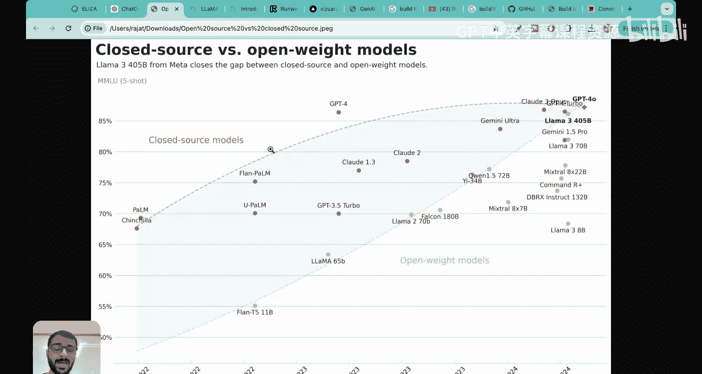

在我制作这个视频时，还发生了更多事情。Facebook 发布了他们的 Llama 3.1，这是他们迄今为止最强大的大语言模型之一。这是一个开源模型，这意味着模型的整个架构是免费提供的，或者说对公众开放，任何人都可以查看其架构。而 OpenAI 发布的模型通常是闭源的，这意味着他们不发布权重、架构，关于模型本身的许多信息并不为人所知。

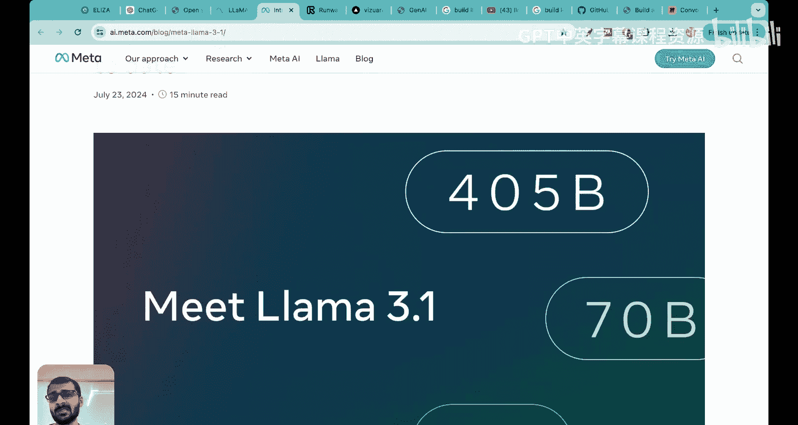

这里有一张图表显示了闭源与开源模型的对比。在 2022 年大语言模型领域蓬勃发展时，大多数模型都是闭源的。当 GPT-4 在 2023 年发布时，它震惊了世界，每个人都感到惊讶和高兴，但它仍然是一个闭源模型。现在到了 2024 年，你可以看到开源模型和闭源模型之间的差距正在慢慢缩小，当 Llama 3.1 发布时，你可以看到它的性能与闭源的 GPT-4 处于同一水平。这说明你现在需要的所有信息都可以通过开源模型获得，你只需要愿意学习。如果你不确定什么是开源、闭源模型，什么是 Llama 3、40B、5B，我会在后续课程中向你解释所有这些内容。

文本只是一方面，生成式人工智能作为一个领域还能做很多事情。许多人对什么是生成式人工智能、LLM 到底是什么感到困惑。但生成式人工智能是一个更广泛的子集，它包括语言、视频、音频、3D 模型等所有内容。看看这些视频。这些视频看起来不是非常逼真吗？这个视频，那个视频，海浪视频，这个特定的视频。你会惊讶地发现，所有这些视频都是由人工智能制作的。这些视频不是用摄像机拍摄的，它们是由 AI 生成的。这就是目前生成式人工智能的力量。

最后，当我们与学校合作时，我们开发了自己的 AI 应用程序，这是 Vizuara 的 AI 应用程序，或者说是一个基于 LLM 的应用程序。在这里你可以看到大量的功能，例如，你可以点击“MCQ 生成器”。然后你可以输入主题，比如“重力”，然后点击“生成”。现在你会看到，在几秒钟内，为这个应用程序提供支持的大语言模型就会在这里生成一套多项选择题。我们正在向教师提供这个应用程序。所有这些在四五年前甚至都难以想象，但现在大语言模型和生成式人工智能正在改变我们周围的每一件事。

事实上，对观看此视频的所有人来说，可能更相关的是全球生成式人工智能就业市场。看看这个增长，它令人难以置信。这是预测的就业市场，预计在未来五年内将增长约五到六倍。生成式人工智能和大语言模型是一项非常有用的技能，未来对这种技能的需求只会增加。

这又让我回到了这个问题：如果有人想学习大语言模型，他们该如何着手？

假设你上谷歌搜索“学习构建 LLM”，这意味着你想学习大语言模型，这里会出现许多课程。如果你去查看其中许多课程，比如“构建 LLM 应用程序”，它是关于应用开发的，它并不教你如何从零开始构建大语言模型。

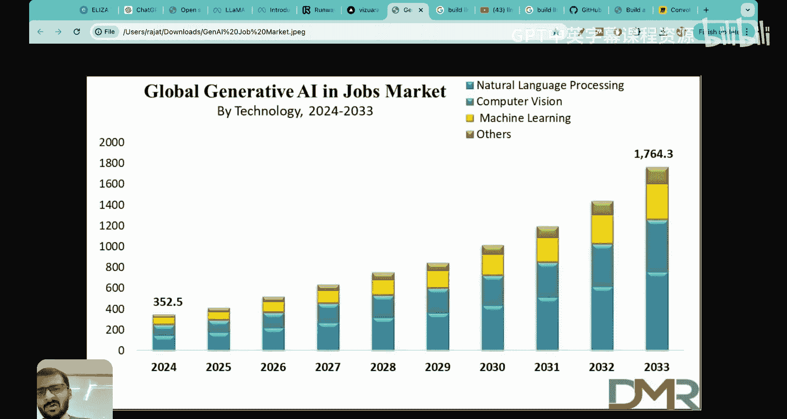

这是另一个课程“掌握大语言模型概念”。如果你看这个课程描述，他们根本不教你如何从零开始构建 LLM，也不教你核心细节，这是一个相当快速的课程。

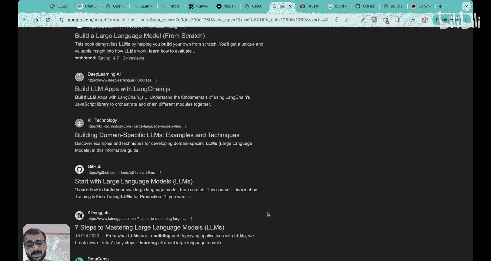

这也不是我想要的。我想要的是一门课程，它能非常详细和深入地教授基础知识。我想了解基础，因为我想从零开始构建一个 LLM，以提高我的技能，并让我有信心面对生成式人工智能甚至 LLM 的工作面试。这才是我真正想要的。我不想要快速的速成课程，我想要一些深入的内容。

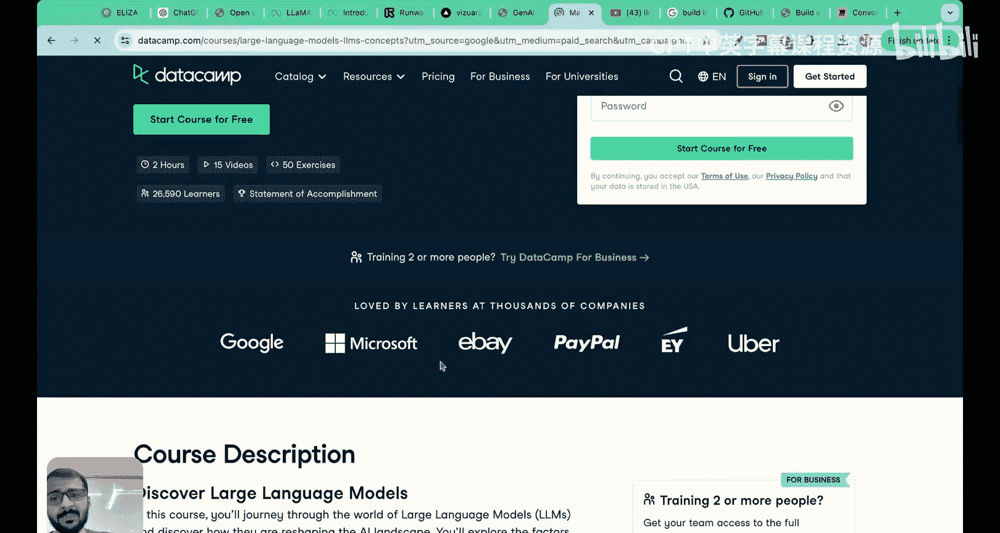

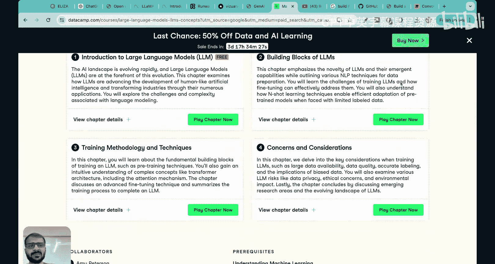

然后我上 YouTube 搜索“从零开始 LLM”。这是第一个出现的视频，或者说是第一个播放列表。你会看到这个播放列表有 18 章，但每一章又只有 10 到 15 分钟。看到这个我又有点泄气，因为我也不是在找这个。我在寻找一个庞大的、深入的技术课程，从最基础开始教我如何构建 LLM。

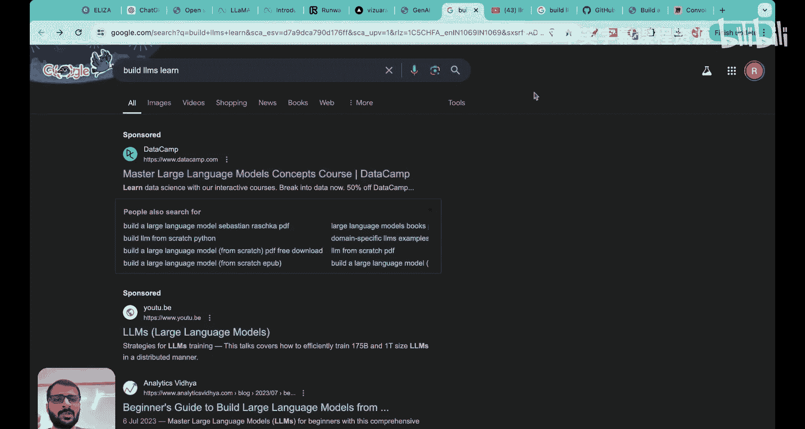

Andrej Karpathy 有一个构建 GPT 的课程，但如果你看这个课程，它实际上相当复杂，一点也不容易。他直接从一个概念的中间开始讲起，并不适合初学者，而且只有 90 分钟。这也不是我想要的。这是另一位创作者的“从零开始大语言模型”课程，但你看到红色的障碍了吗？我尝试学习这个课程，完成了三个小时，但同样，它解释得不好，不是从零开始解释的。我想制作一门人们能从最基础开始理解的课程，而 YouTube 和谷歌上的课程都无法满足这个需求。

很偶然地，我遇到了 Sebastian Raschka 写的一本书。我认为这是关于大语言模型最好的书之一。我购买了这本书，它将作为我们课程的参考材料。

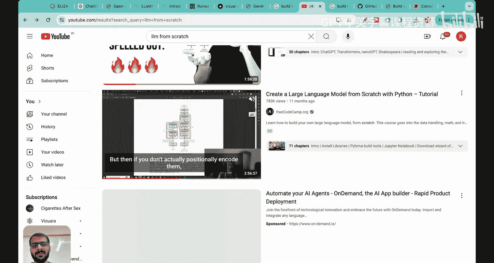

我打算做的是，将这本 408 页的书中的每一个方面都转换成一系列视频。我可能会在这个播放列表中有 35、40 或 50 个视频。类似于我的机器学习和深度学习播放列表，我会把这里给出的所有内容转换成视频格式。例如，这里有一些我已经开始制作的笔记，我们将在下一讲开始讲解这些内容。看看这些笔记，我在这里所做的是，我从这本书中建立了我的理解，为了将我的理解传递给你们所有人，我已经开始在白板上详细写下每一件事。

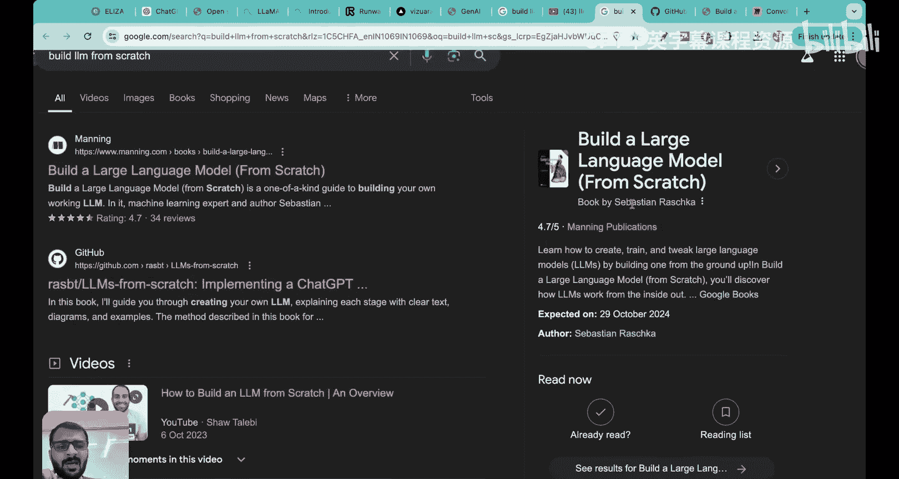

看看这个，我试图让它尽可能有趣和基础。所以这将是下一讲“LLM 简介”的内容。我已经完成了这一讲的笔记，也完成了之后“构建 LLM 的各个阶段”这一讲的笔记。基本上，我正在制作所有这些笔记，但同时也在制作视频，这样我也能保持动力和进度。最终，这将是一份可能长达 200 到 300 页的庞大讲义。并且将会有 50 到 60 个基于此的视频。你将从最基础开始学习一切，不做任何假设，所有内容都会详细说明。这套视频非常适合那些认真想转型到大语言模型领域，并想以正确方式理解 LLM 的人。

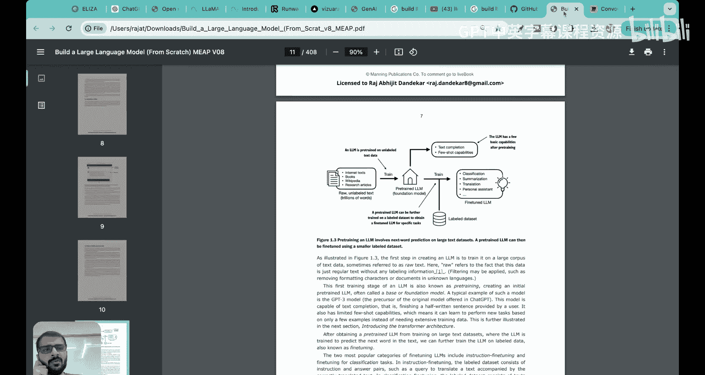

这就是本课程的主要构想。我想说的另一件事是，你可能听说过像 LangChain 这样的应用程序，这是一个帮助你构建 LLM 应用程序的工具，但同样，如果你不知道如何自己构建 LLM，它就没有用。正如我之前提到的，许多学生直接开始部署应用程序，但我个人认为这不是学习 LLM 的正确方式。你需要知道如何从零开始构建整个大语言模型，我们将在本系列课程中教你这一点。

最终，目标是让你们所有人做好准备，以便在面试官面前充满信心。如果你只是通过克隆某个 GitHub 仓库来部署应用程序，那么如果有人问你关于键、查询和值的详细问题，或者位置嵌入或位置编码，你需要能够说，我是从零开始构建这个的，所以我比任何人都更了解细节。这真的会让你与其他人处于不同的境地。

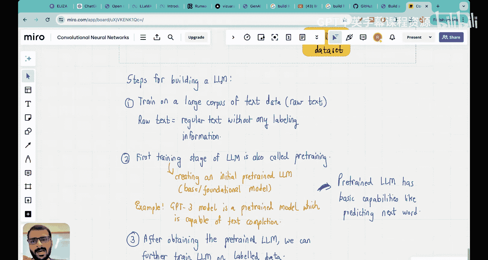

这就是本课程的主要目标。这将是本课程的大纲，我们将遵循这里提到的所有目录，并将它们转换成视频讲座格式。这将是一个很棒的系列，一个详细的系列。

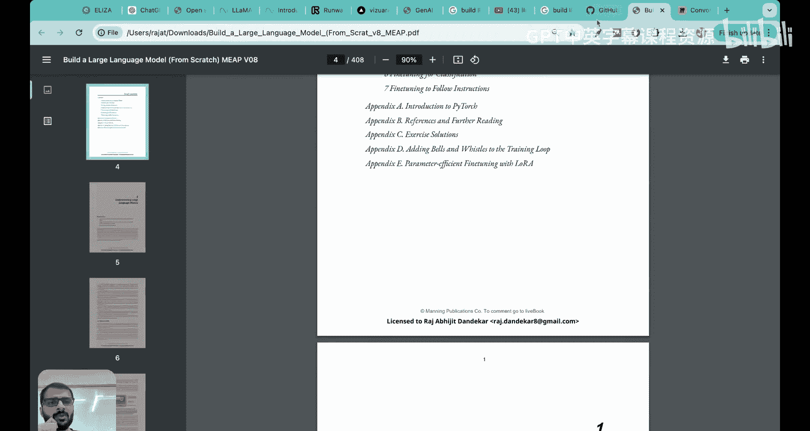

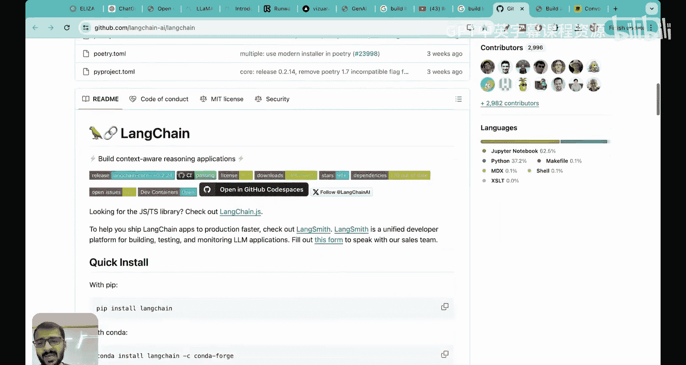

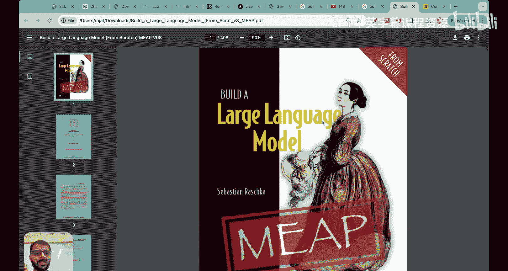

如果这让你感兴趣，请在评论中告诉我，这样我也会更有动力制作后续视频。正如我提到的，计划是免费发布所有这些内容，以便你们都能从中受益。

非常感谢大家，我期待在下一讲中见到你，我们将介绍大语言模型简介，并涵盖你现在在白板上看到的所有内容。

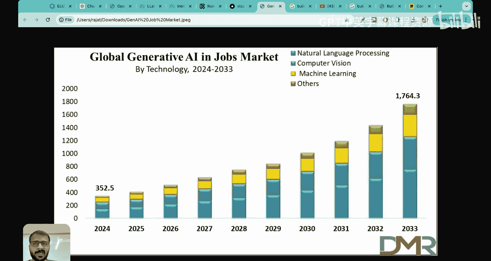

谢谢大家，下个视频见。

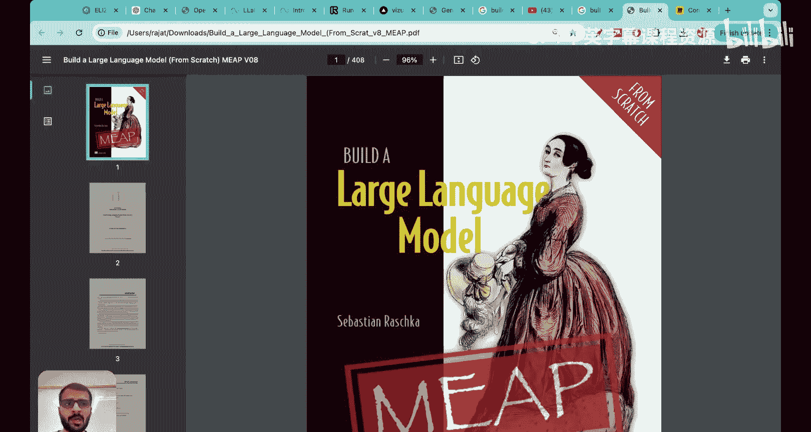

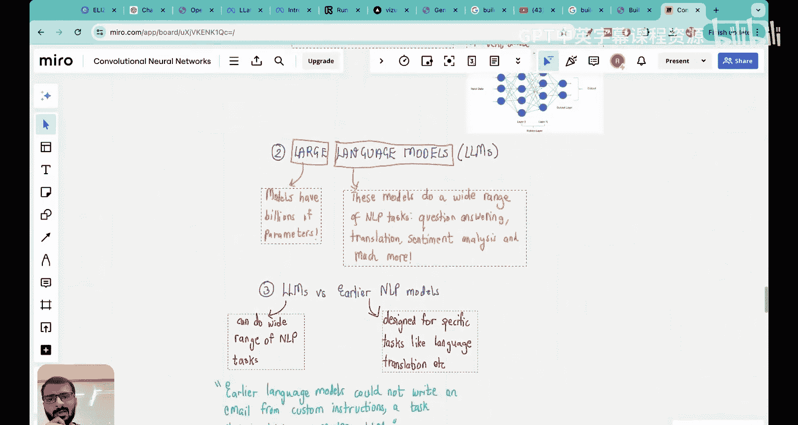

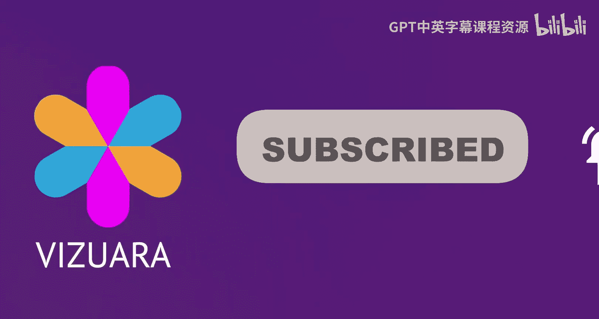

