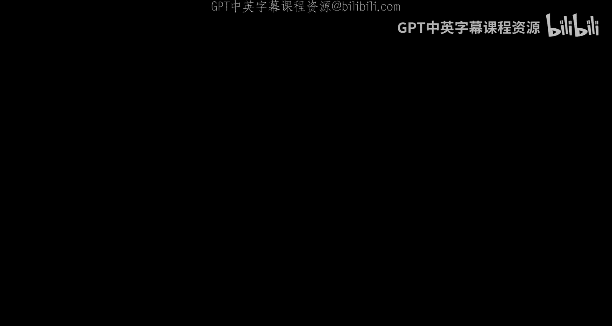
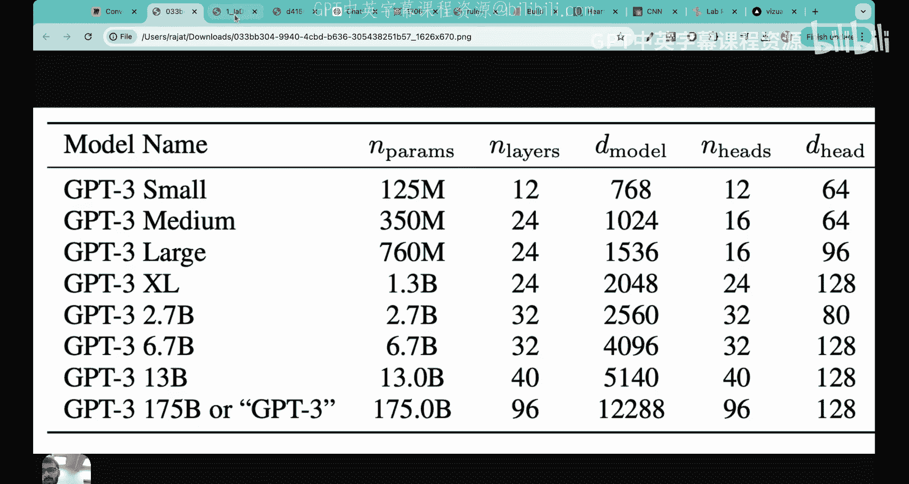
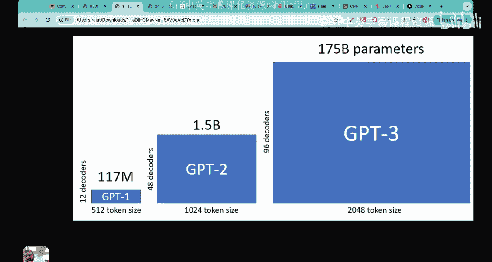
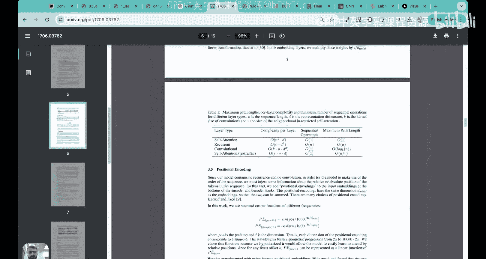
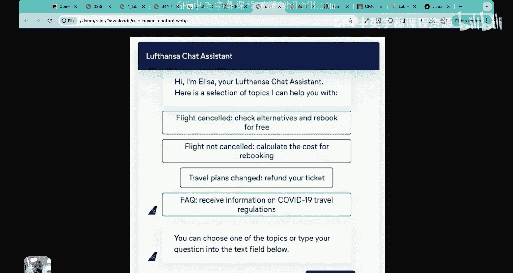
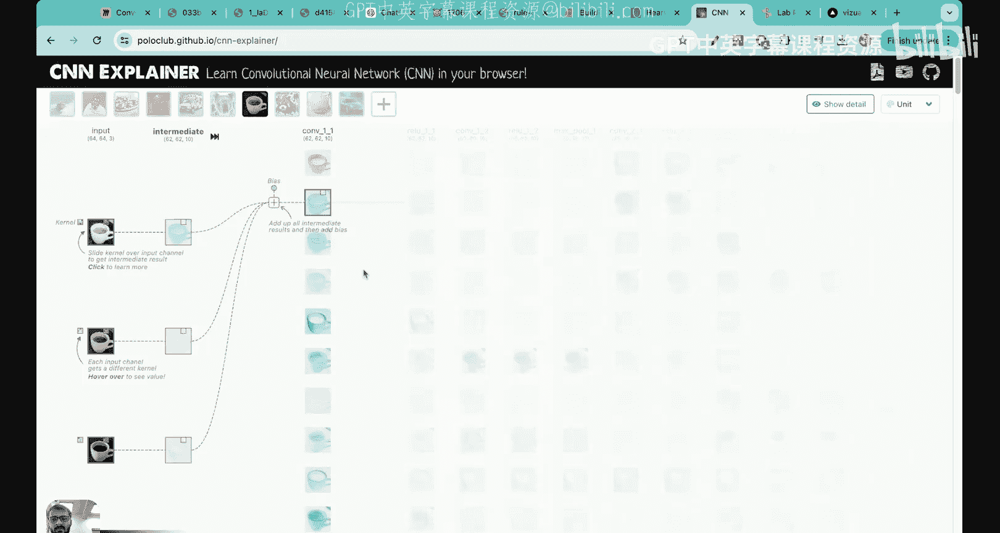
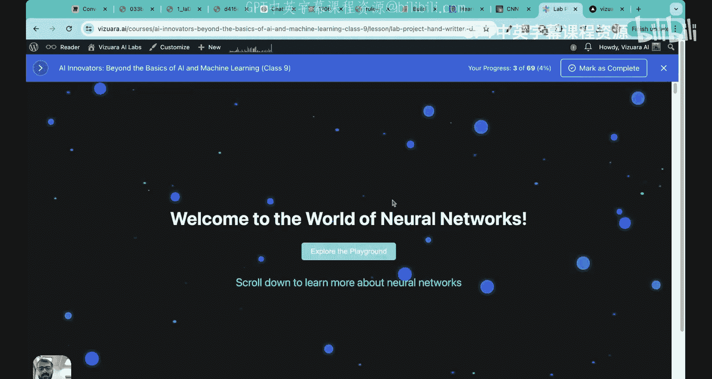
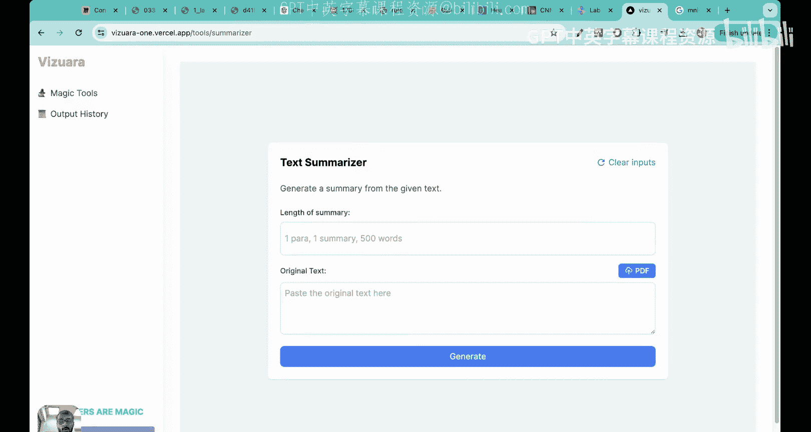

# 02：大语言模型基础

在本节课中，我们将要学习大语言模型的基础知识。我们将探讨什么是大语言模型、其“大”的含义、它与早期自然语言处理模型的区别、其成功的核心秘诀、相关术语的辨析，以及其广泛的应用场景。

## 什么是大语言模型？

上一讲我们介绍了整个系列的计划。本节中，我们来看看大语言模型究竟是什么。

大语言模型本质上是一个**神经网络**，其设计目标是理解、生成和回应类人文本。这里有两个关键点：首先，它是一个神经网络；其次，它专门处理与语言相关的任务。

神经网络的结构通常包含输入层、多个隐藏层和输出层，其灵感来源于人脑的神经元连接。大语言模型就是专门为广泛的文本任务（如问答、翻译、情感分析等）而设计的深度神经网络。

一个直观的例子是 ChatGPT。你可以向它提问，它会像人类一样理解和回应。例如，当你要求它“帮我规划一个放松身心的日子”时，它会询问你的偏好，并生成详细的计划。这展示了大语言模型理解和生成类人文本的能力。

## “大”在何处？

了解了基本定义后，你可能会问：为什么叫“大”语言模型？本节中我们来看看这个“大”字意味着什么。

“大”主要指模型的**参数量**极其庞大。参数是模型在训练过程中学习到的内部变量，其数量决定了模型的复杂度和能力。

大语言模型通常拥有**数十亿**甚至**上万亿**个参数。例如，GPT-3 的不同版本参数量从 1.25 亿到 1750 亿不等，而 GPT-4 的参数量更大。相比之下，2020年之前的模型参数量大多在百万或千万级别。

以下是 GPT 系列模型参数量的增长示例（单位：百万/十亿）：
*   GPT-1: ~110M
*   GPT-2: ~1.5B
*   GPT-3: 最高达 175B

这种参数规模的爆炸式增长是前所未有的，因此这些模型被称为“大”语言模型。同时，它们专门处理语言任务，故合称为“大语言模型”。

## 与早期 NLP 模型的区别

我们已经知道大语言模型规模巨大。那么，它与早期的自然语言处理模型有何根本不同呢？

主要有两点核心区别：

1.  **任务通用性 vs. 任务特定性**：早期的 NLP 模型通常为特定任务（如翻译或情感分析）专门设计和训练。而现代大语言模型经过训练后，能够执行广泛的 NLP 任务，如翻译、总结、创作、代码生成等，具有极强的通用性。

2.  **能力边界**：早期模型难以完成许多对人类而言简单的任务。例如，根据自定义指令起草一封完整的邮件，对过去的模型非常困难，但对现代大语言模型如 ChatGPT 来说则轻而易举。大语言模型的应用可能性远多于早期模型。

## 成功的秘诀：Transformer 架构

大语言模型功能如此强大，其背后的“秘密武器”是什么？本节我们来揭示这个核心。

大语言模型卓越性能的核心在于其基础架构——**Transformer**。这不是电影里的变形金刚，而是一种革命性的神经网络设计。

Transformer 架构首次在 2017 年谷歌发表的论文《Attention Is All You Need》中提出。这篇论文彻底改变了自然语言处理领域，至今已被引用超过 10 万次。

Transformer 的核心创新是“**自注意力机制**”，它允许模型在处理一个词时，权衡句子中所有其他词的重要性。这种机制让模型能更好地理解上下文和长距离依赖关系。

一个简化的 Transformer 编码器层包含以下主要组件：
*   **输入嵌入**：将词汇转换为向量。
*   **位置编码**：为向量添加位置信息。
*   **多头注意力层**：计算自注意力。
*   **前馈神经网络层**：进行非线性变换。
*   **残差连接与层归一化**：稳定训练过程。

公式 `Attention(Q, K, V) = softmax(QK^T / √d_k)V` 描述了注意力计算的基本形式，其中 Q（查询）、K（键）、V（值）是输入的不同表示。

正是 Transformer 架构的强大能力，使得训练包含海量参数的模型成为可能，并最终催生了如今的大语言模型。我们将在后续课程中深入探讨这一架构的每一个细节。

## 术语辨析：AI, ML, DL, LLM, GenAI

面对人工智能领域纷繁复杂的术语，你是否感到困惑？本节我们一起来厘清它们之间的关系。

这些术语可以被看作一组嵌套的集合，范围从宽到窄：

*   **人工智能**：最广泛的范畴。任何让机器表现出智能行为（如解决问题、理解语言）的系统都属于 AI。例如，一个基于固定规则的聊天机器人（如航空公司的菜单式客服）就属于 AI，但不一定属于 ML。

*   **机器学习**：AI 的一个子集。ML 系统能够从数据中**学习**并改进其性能，而无需为每个任务明确编程。例如，用于预测心脏病风险的决策树模型就是一个 ML 系统。

*   **深度学习**：ML 的一个子集。DL 特指使用深层**神经网络**进行学习的模型。例如，用于图像识别的卷积神经网络或用于手写数字分类的神经网络都属于深度学习。

*   **大语言模型**：DL 的一个子集。LLM 是专门为处理和生成**人类语言**而设计和训练的深度神经网络。它们只处理文本模态。

*   **生成式人工智能**：可以看作是 **LLM + 其他模态的深度学习**。GenAI 利用深度学习模型（包括 LLM）来创造全新的内容，如文本、图像、音频、视频等。当 LLM 生成文本时，它本身就是 GenAI 的一部分；但 GenAI 的范围更广，还包括像 DALL-E 生成图像这样的应用。

总结一下关系：**AI ⊃ ML ⊃ DL ⊃ LLM**。而 **GenAI ≈ LLM + 其他模态的 DL 应用**。

## 大语言模型的应用

掌握了基本概念后，我们来看看大语言模型能做什么。以下是其主要应用类别：

*   **内容创作**：生成全新的文本内容，如诗歌、故事、新闻稿、营销文案等。
*   **聊天机器人与虚拟助手**：提供智能对话、客户支持、个性化推荐等服务。
*   **机器翻译**：在多种语言之间进行高质量、上下文准确的翻译。
*   **文本生成与改写**：协助写作、总结长文档、润色文字、改变风格等。
*   **情感分析与内容审核**：分析文本情感倾向，检测有害或不当言论。

这些应用正在改变教育、医疗、金融、娱乐等各行各业。例如，教师可以利用 LLM 快速生成课程计划、测验题目；开发者可以借助 LLM 辅助编写和调试代码。

## 总结

本节课中我们一起学习了大语言模型的基础知识。我们首先定义了大语言模型是用于理解和生成类人文本的深度神经网络。然后，我们探讨了其“大”体现在海量的模型参数上，并比较了它与早期任务特定型 NLP 模型的通用性优势。我们揭示了其成功的核心在于 **Transformer 架构**，特别是自注意力机制。接着，我们辨析了人工智能、机器学习、深度学习、大语言模型和生成式 AI 这些关键术语之间的层次关系。最后，我们展望了大语言模型在内容创作、对话交互、翻译等多方面的广泛应用。

理解这些基础是深入探索大语言模型内部机制的第一步。在接下来的课程中，我们将逐步深入 Transformer 的细节，并最终动手构建我们自己的模型。请记住，扎实的基础知识是进行创新和解决实际问题的关键。