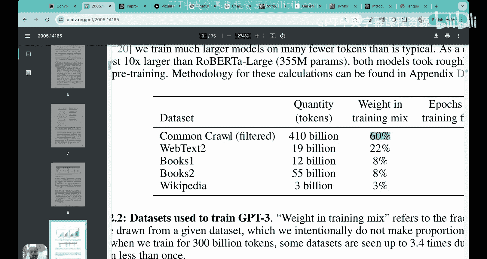
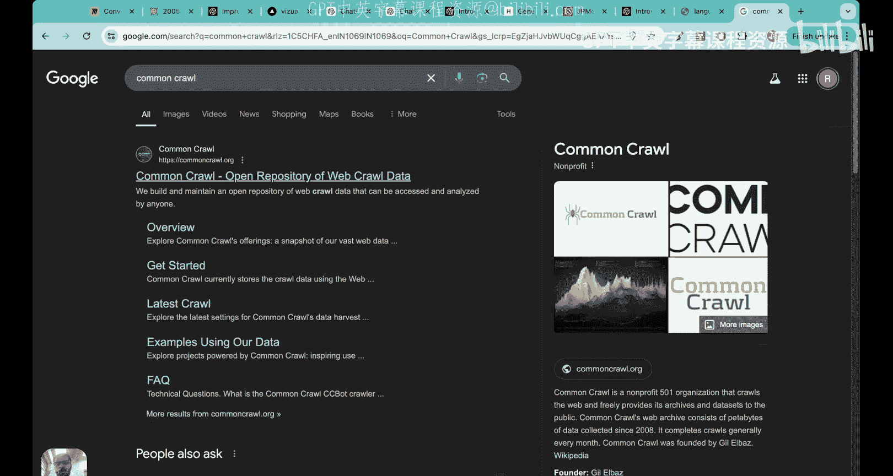
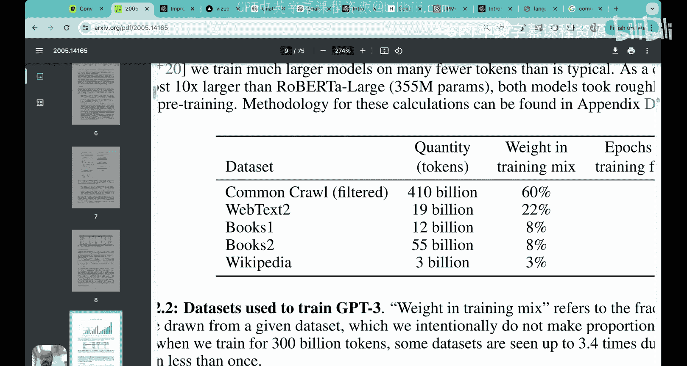
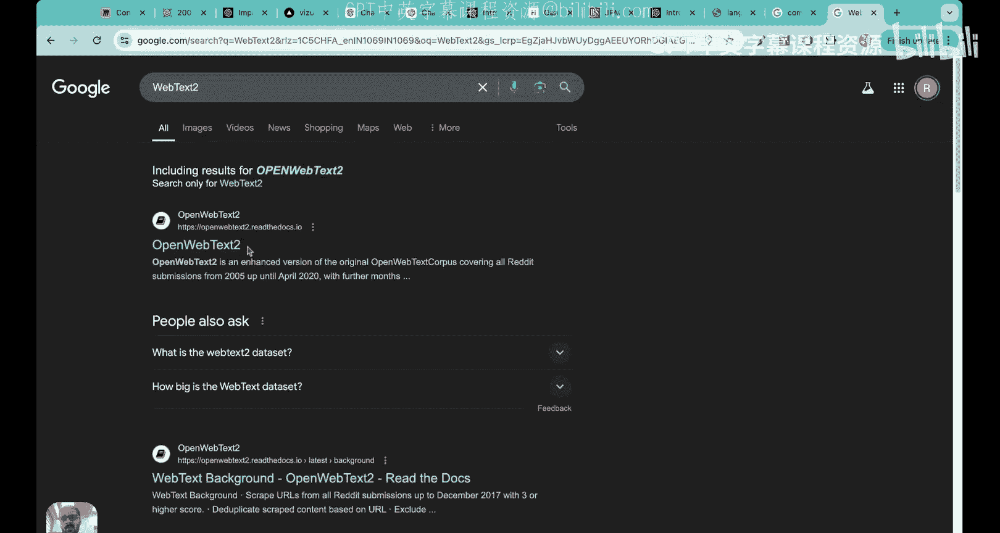
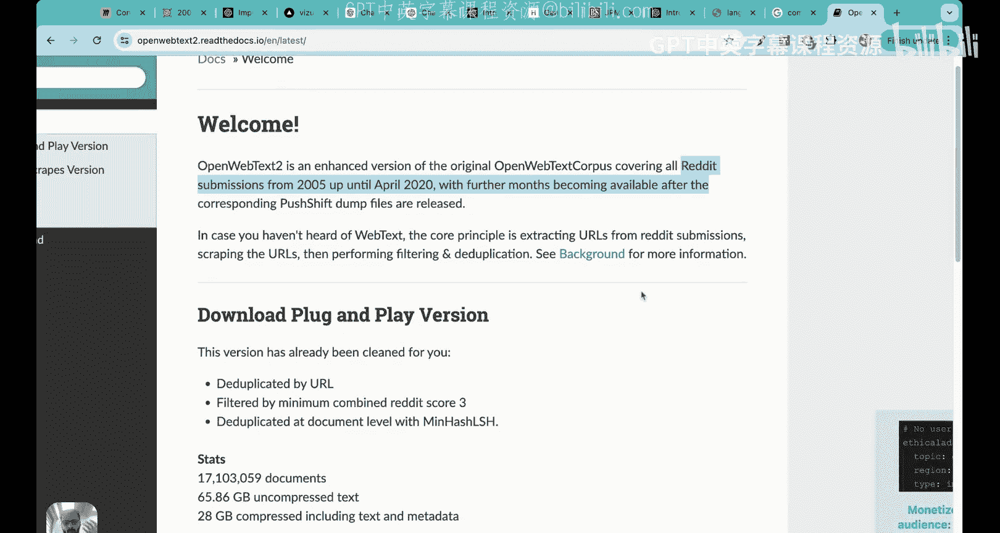
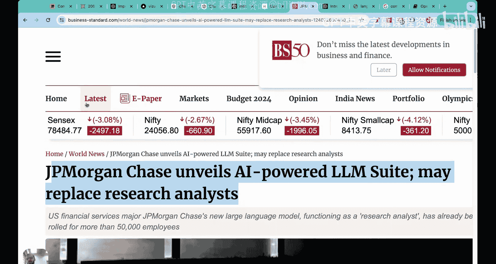

# 03：大语言模型的构建阶段——预训练与微调 🏗️

在本节课中，我们将学习构建大语言模型的两个核心阶段：预训练与微调。我们将探讨它们各自的定义、目的、区别以及在实际应用中的重要性。

在之前的课程中，我们介绍了大语言模型的基础知识、其背后的“秘密配方”以及相关术语的区别与应用。本节我们将深入探讨构建LLM的具体步骤。

## 概述：构建LLM的两大阶段

构建一个大语言模型主要涉及两个阶段：**预训练** 和 **微调**。理解这两个阶段对于掌握LLM的工作原理至关重要。

### 什么是预训练？🤔

预训练是指在**大规模、多样化数据集**上训练模型的过程。这回答了“像ChatGPT这样的LLM为何能如此有效地与人交互”的问题。

其核心在于，LLM之所以表现优异，是因为它们在**海量数据**上进行了训练。例如，GPT-3拥有1750亿参数，其训练数据来源广泛。

以下是GPT-3训练数据的主要构成：
*   **Common Crawl**：一个开放的互联网数据仓库，提供了约4100亿单词（约410亿个句子）。
*   **WebText2**：一个包含Reddit提交、博客文章、Stack Overflow问答等内容的庞大语料库，提供了约190亿单词。
*   **书籍**：从大量书籍中获取了约670亿单词。
*   **维基百科**：提供了约30亿单词作为训练数据。

总计，GPT-3在约3000亿个标记（可近似理解为单词）上进行了训练。

### 预训练的核心任务与“涌现能力”

最初，LLM被训练用于一个看似简单的任务：**词语补全**。例如，给定句子“The lion is in the ____”，模型需要预测下一个词（如“forest”）。

令人惊讶的是，即使仅为此任务进行训练，模型也展现出执行多种其他任务的强大能力，例如翻译、总结、情感分析和问答。这种能力被称为**涌现能力**。

这意味着，通过预训练，我们得到一个**基础模型**，它无需针对特定任务进行专门训练，就能广泛处理各种语言任务。

### 为什么需要微调？🎯

既然预训练模型已经如此强大，为何还需要微调？关键在于**特定性与专业性**。

预训练模型基于通用互联网数据，其回答是**通用**的。然而，许多实际应用需要**特定领域**或**定制化**的响应。

以下是需要微调的几个场景：
*   **航空公司客服**：用户询问“晚上6点起飞的汉莎航空航班价格是多少？”。通用模型可能无法提供基于该公司实时数据库的准确、具体答案。
*   **高质量教育内容生成**：大型教育公司若想生成极高品质的题目，仅依赖通用模型可能不够，需要在其专业题库数据上微调模型以获得更优结果。
*   **专业领域工具**：例如为律师设计的AI法律工具，需要理解大量非公开的法律案例历史，这超出了通用预训练模型的知识范围。

微调的本质是：在预训练得到的**基础模型**之上，使用**更窄、更专业、通常带有标签的数据集**进行进一步训练，使其适应特定任务或领域。

### 预训练与微调流程图示 📊

为了更好地理解整个过程，我们可以将其可视化为一个三步流程：

1.  **数据收集**：获取海量、多样化的原始文本数据（互联网文本、书籍、媒体、研究文章等）。这是所有步骤的基石。
2.  **预训练/基础模型训练**：在未标注的原始文本数据上训练模型，形成**基础模型**。此步骤计算成本极高（例如GPT-3预训练耗资约460万美元），需要强大的GPU算力。
3.  **微调**：在基础模型之上，使用特定任务的**标注数据集**进行进一步训练，得到**微调模型**，用于构建具体的应用程序（如个人助理、翻译机器人、摘要工具、分类器）。

**关键区别**：预训练通常使用**未标注数据**，而微调通常使用**标注数据**。

### 构建LLM的步骤总结 📝

以下是构建一个大语言模型的关键步骤总结：

1.  **在大规模原始文本语料库上训练**：使用海量、无标签的文本数据。
2.  **预训练阶段**：此阶段产出初始的预训练LLM，即**基础模型**。它具备文本补全能力，并展现出多种涌现能力。
3.  **微调阶段**：在获得预训练LLM后，使用**标注数据**对其进行进一步训练。微调主要分为两类：
    *   **指令微调**：用于任务如翻译、客服问答，需要“指令-回答”配对数据。
    *   **分类任务微调**：用于任务如垃圾邮件分类、情感分析，需要“文本-标签”配对数据。

微调对于将LLM投入实际生产环境、满足特定领域的高质量需求至关重要。大型公司或专业应用很少直接使用基础模型，都会进行某种程度的微调。

## 总结

本节课我们一起学习了构建大语言模型的两个核心阶段。

*   **预训练**：在大规模、多样化数据集上训练模型，使其获得通用的语言理解和生成能力，形成**基础模型**。这个过程计算成本高昂。
*   **微调**：在基础模型之上，使用特定领域、带标签的数据进行针对性训练，使模型适应**专业化、定制化**的任务需求，是模型投入实际应用的关键步骤。

理解预训练和微调的区别与联系，是掌握大语言模型应用和开发的基础。在接下来的课程中，我们将开始学习Transformer架构的基本介绍，并简要了解著名的《Attention Is All You Need》论文。