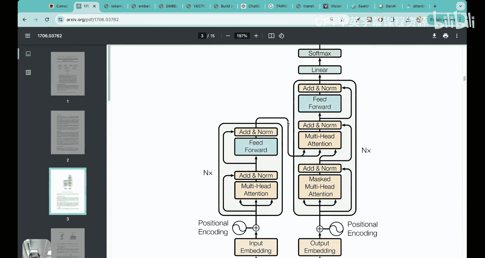
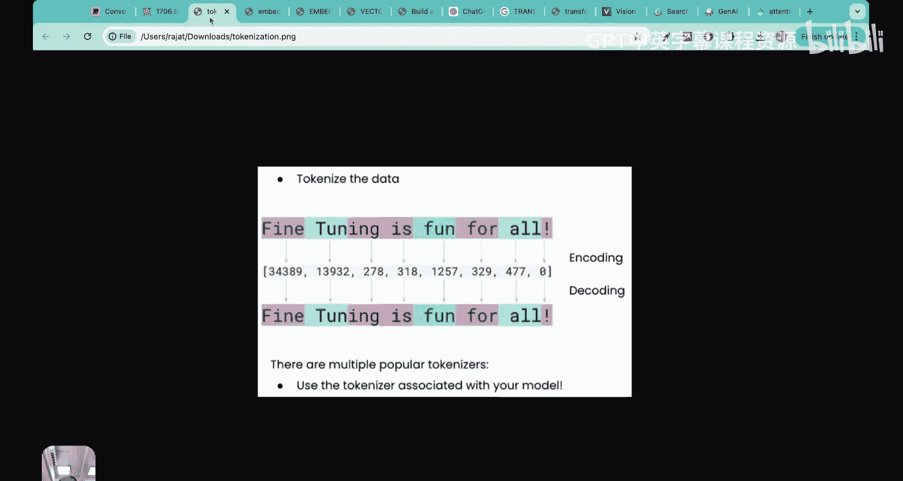
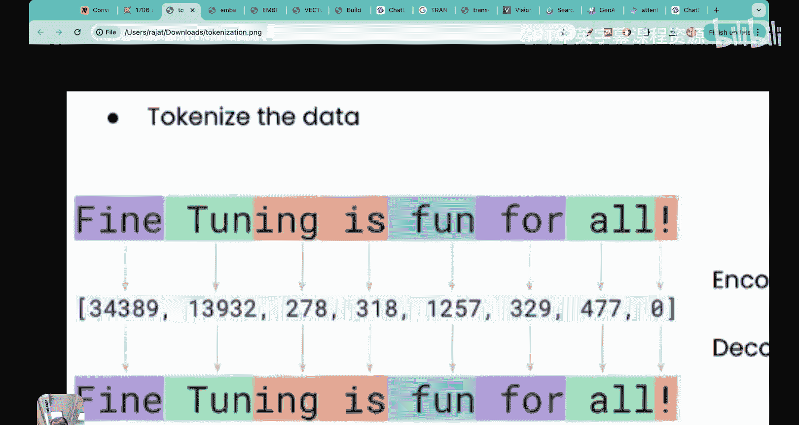
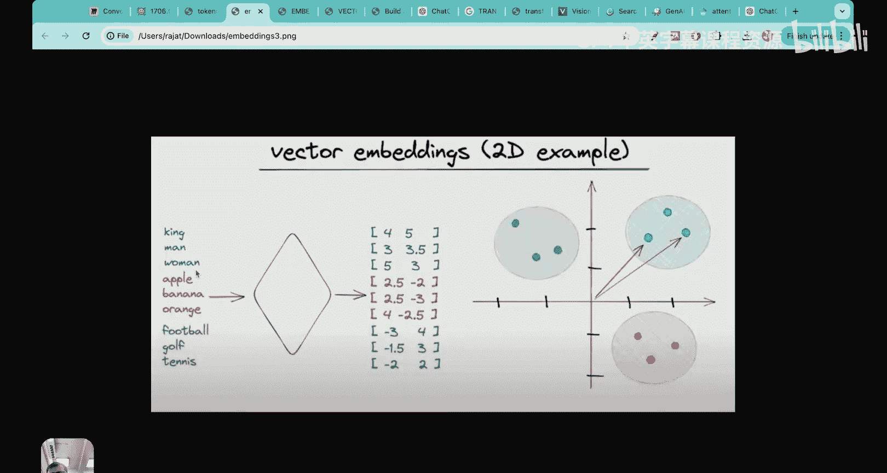
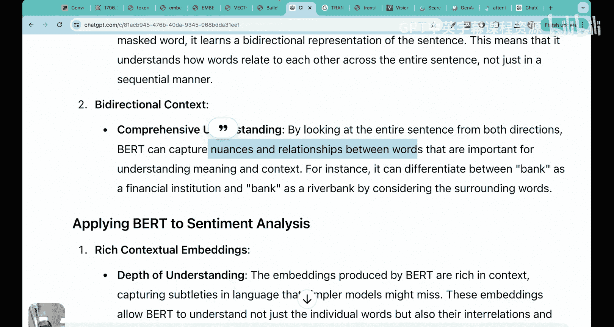
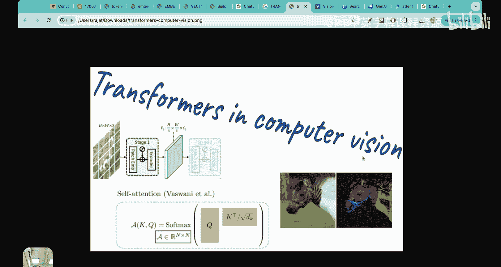
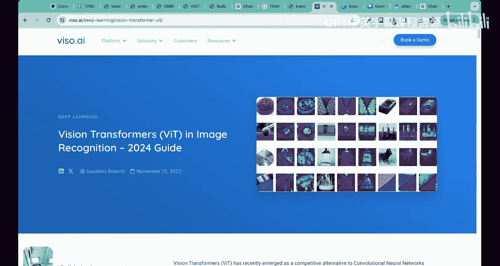
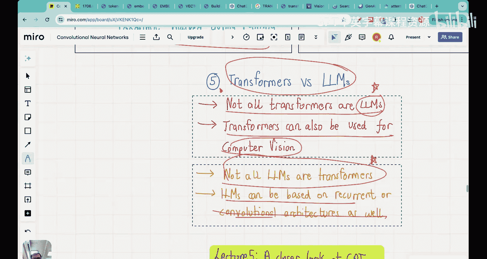
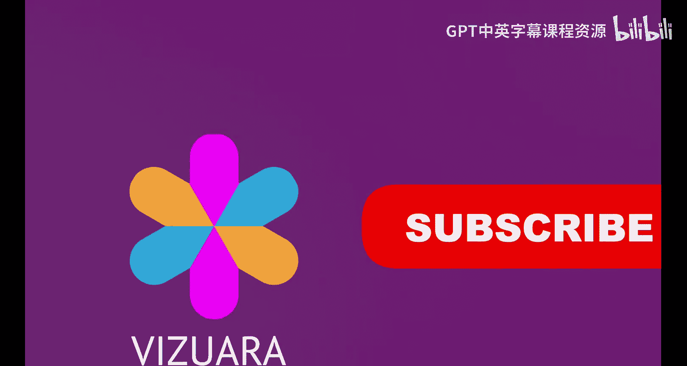

# 04：什么是Transformer？ 🤖

在本节课中，我们将学习Transformer架构的基础知识。Transformer是现代大语言模型（LLM）背后的核心技术。我们将了解它的起源、核心组件、工作原理，以及它与LLM的关系和区别。课程内容设计得简单易懂，适合初学者。

---

## 概述

Transformer是一种深度神经网络架构，于2017年在一篇名为《Attention Is All You Need》的论文中首次提出。这篇论文在短短几年内获得了超过10万次引用，因为它为后续的许多突破性进展奠定了基础，包括GPT架构。最初，Transformer是为机器翻译任务（如英语到德语、法语）设计的，但后来人们发现，基于此架构的变体可以完成更多任务。

上一节我们介绍了LLM构建的两个阶段（预训练和微调），本节中我们来看看实现这些阶段的核心架构——Transformer。

---

## Transformer架构的简化流程

Transformer架构可以简化为八个核心步骤。以下是这八个步骤的概述：

1.  **输入文本**：准备待翻译的文本（例如英文句子）。
2.  **预处理（分词）**：将句子分解成更小的单元（词元）。
3.  **编码器**：接收分词后的输入。
4.  **生成向量嵌入**：编码器将词元转换为捕捉语义关系的向量。
5.  **部分输出文本**：模型已生成的部分翻译结果（例如德文单词）。
6.  **解码器**：接收向量嵌入和部分输出文本。
7.  **生成翻译文本**：解码器预测下一个输出词元。
8.  **最终输出**：得到完整的翻译句子。

接下来，我们将详细探讨其中的关键步骤。

---

## 关键步骤详解

### 1. 分词

在将文本输入模型之前，需要先进行分词处理。这个过程将长句子或文档分解成更小的单元，称为“词元”。

以下是分词过程的简单说明：

*   你可以暂时将一个词元理解为一个单词。
*   每个词元会被分配一个唯一的数字ID。
*   例如，句子 “fine tuning is fun for all” 可能被分解为 `[‘fine’, ‘tuning’, ‘is’, ‘fun’, ‘for’, ‘all’]` 并赋予对应的ID。

### 2. 编码器与向量嵌入

编码器的主要任务是将分词后的词元（数字ID）转换为“向量嵌入”。

*   **问题**：简单的数字ID无法表达单词之间的语义关系（例如“狗”和“小狗”是相关的）。
*   **解决方案**：向量嵌入将每个单词映射到一个高维空间中的向量。语义相近的单词，其向量在空间中的位置也更接近。
*   **例如**：在二维示意图中，“国王”、“男人”、“女人”的向量可能聚集在一起；“苹果”、“香蕉”、“橙子”的向量聚集在另一处；“足球”、“高尔夫”、“网球”的向量又聚集在第三处。这样，模型就能“理解”单词之间的关系。

编码器通过训练神经网络来学习如何生成这种能捕捉语义的向量表示。

### 3. 解码器与自回归生成

解码器是Transformer架构的另一半，负责生成输出文本（如翻译结果）。

*   **输入**：解码器接收来自编码器的向量嵌入，以及**当前已生成的部分输出文本**。
*   **过程**：模型以自回归的方式工作，即一次只预测并生成下一个词元。
*   **示例**：在翻译“This is an example”时，模型可能先生成“Das”（这），然后基于“Das”生成“ist”（是），再基于“Das ist”生成“ein”（一个），如此循环，直到生成完整的德语句子“Das ist ein Beispiel”。
*   **训练**：解码器本质上是一个神经网络，通过损失函数进行训练和优化，以更准确地预测下一个词元。

---

## 注意力机制：Transformer的核心 🧠

原论文标题“Attention Is All You Need”突出了“注意力机制”的核心地位。

*   **作用**：注意力机制允许模型衡量输入序列中不同词元之间的相对重要性。
*   **解决长距离依赖**：在预测一个句子后面的词时，可能需要参考句子开头甚至前几个句子的信息。注意力机制使模型能够“关注”到这些远处但相关的词元。
*   **直观理解**：就像人类阅读时，会根据上下文重点关注某些关键词来理解全文一样，注意力机制为模型中的每个词元计算一个“注意力分数”矩阵，标明在生成当前词元时，应该给其他词元分配多少“注意力”。

在Transformer架构图中，那些标有“Multi-Head Attention”的模块就是实现这一机制的部件。

---

## Transformer的后续变体：BERT与GPT

基于原始Transformer架构，后续发展出了两个重要的变体：BERT和GPT。

以下是BERT和GPT的核心区别：

*   **BERT**：
    *   全称：**B**idirectional **E**ncoder **R**epresentations from **T**ransformers。
    *   **工作原理**：在训练时，随机遮盖句子中的一些词（掩码），然后让模型预测这些被遮盖的词。因为任何位置的词都可能被遮盖，所以模型必须从**双向**（左右两侧）理解整个句子的上下文。
    *   **特点**：仅使用Transformer的**编码器**部分。擅长理解词语间的细微差别和上下文，因此在情感分析等任务上表现优异。
*   **GPT**：
    *   全称：**G**enerative **P**re-trained **T**ransformer。
    *   **工作原理**：接收一段不完整的文本，然后以**自左向右**的方式，逐个预测生成接下来的词元。它根据左侧已知的文本来推测右侧未知的内容。
    *   **特点**：仅使用Transformer的**解码器**部分。是典型的生成式模型，用于文本补全、对话等。

**关键区别**：BERT是“填空”模型，注重理解；GPT是“续写”模型，注重生成。

---

## Transformer与LLM的关系与区别

最后，我们需要厘清Transformer和大语言模型这两个常被混用的概念。

*   **并非所有Transformer都是LLM**。
    *   Transformer架构具有通用性，不仅可用于处理文本，还可用于计算机视觉任务。例如，Vision Transformer（ViT）在图像分类等任务上取得了显著成果。
*   **并非所有LLM都是Transformer**。
    *   在Transformer出现之前，循环神经网络（RNN）、长短期记忆网络（LSTM）等架构也用于构建语言模型，完成文本生成和序列建模任务。它们也属于LLM的范畴。

因此，虽然现代主流的LLM大多基于Transformer，但这两个术语在概念上并不等同，不应完全互换使用。

---

## 总结

本节课中我们一起学习了Transformer架构的基础知识。

1.  我们了解到Transformer是现代LLM的基石，源于2017年的论文《Attention Is All You Need》。
2.  我们通过一个简化的八步流程（输入、分词、编码、嵌入、解码、生成）理解了Transformer如何工作，特别是**编码器**负责创建语义向量，**解码器**负责自回归生成文本。
3.  我们探讨了**注意力机制**的核心作用，它使模型能够权衡不同词元的重要性并捕捉长距离依赖关系。
4.  我们区分了Transformer的两个重要变体：**BERT**（双向编码器，用于理解）和**GPT**（生成式预训练解码器，用于生成）。
5.  最后，我们明确了**Transformer**和**LLM**的关系：Transformer是一种可用于多种任务的架构，而LLM是专注于语言任务的模型，其实现架构可以是Transformer，也可以是RNN、LSTM等。

理解这些基本概念，是深入探索大语言模型世界的重要第一步。