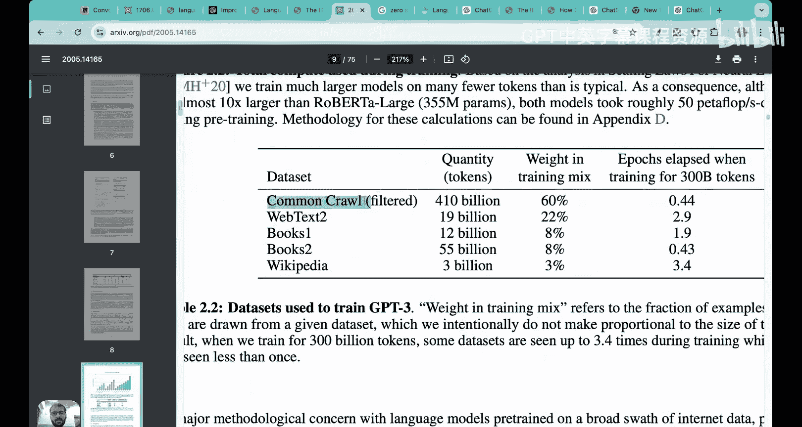
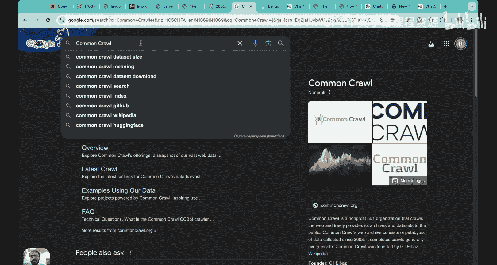
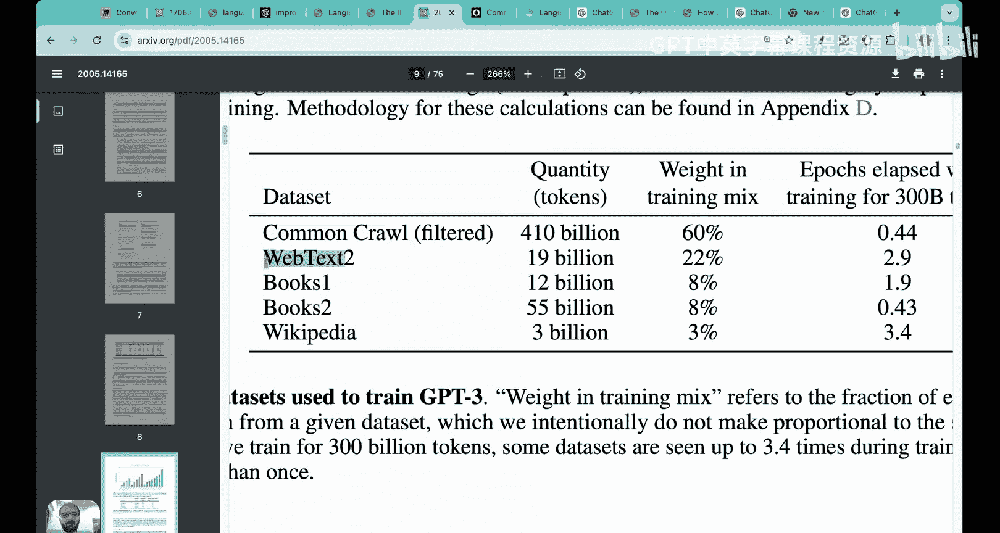
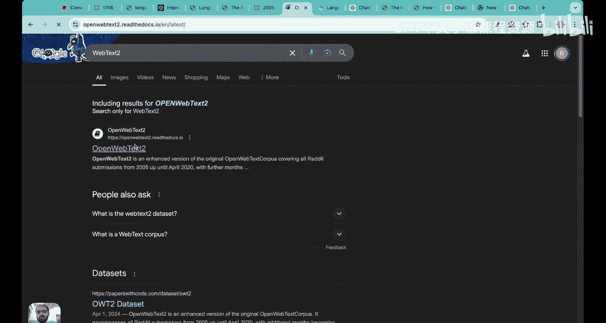
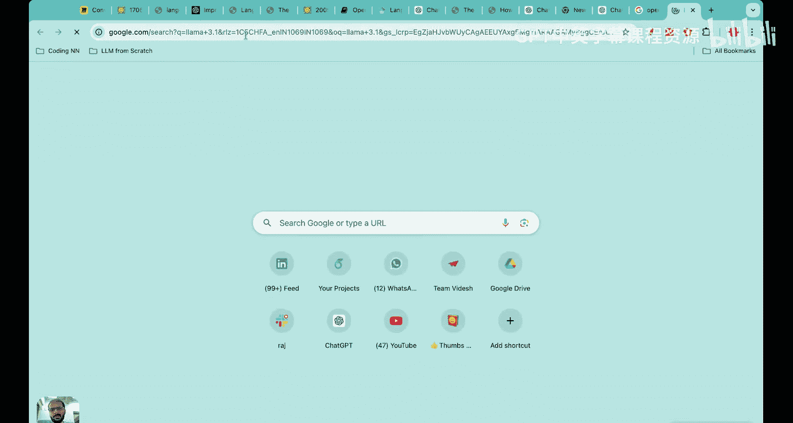
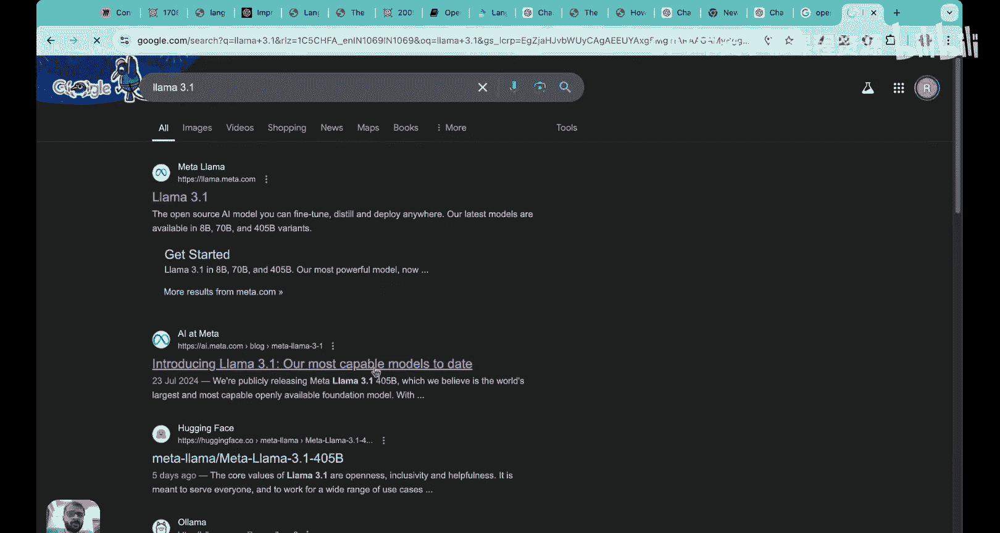
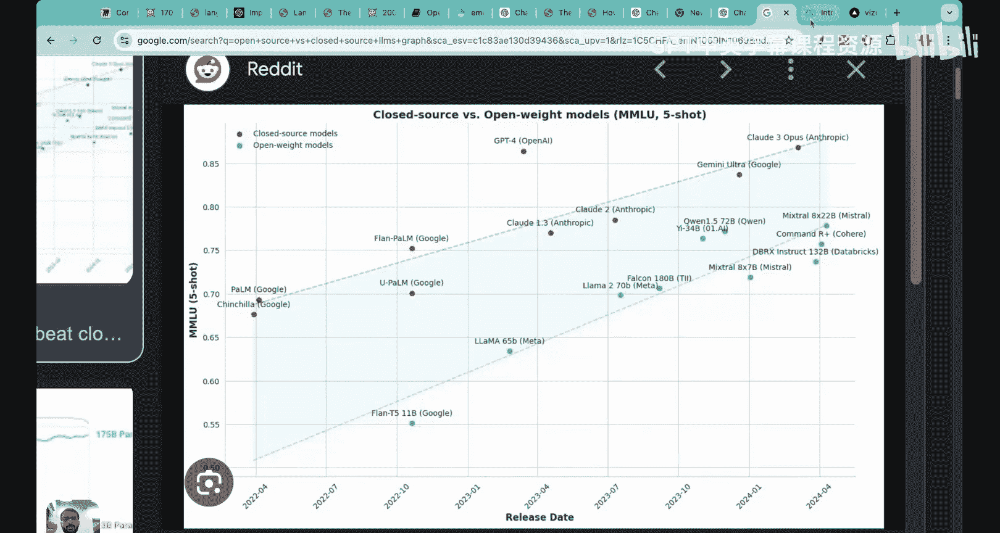
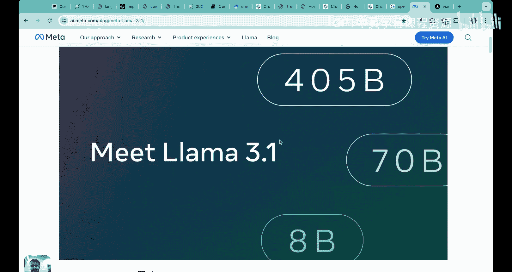
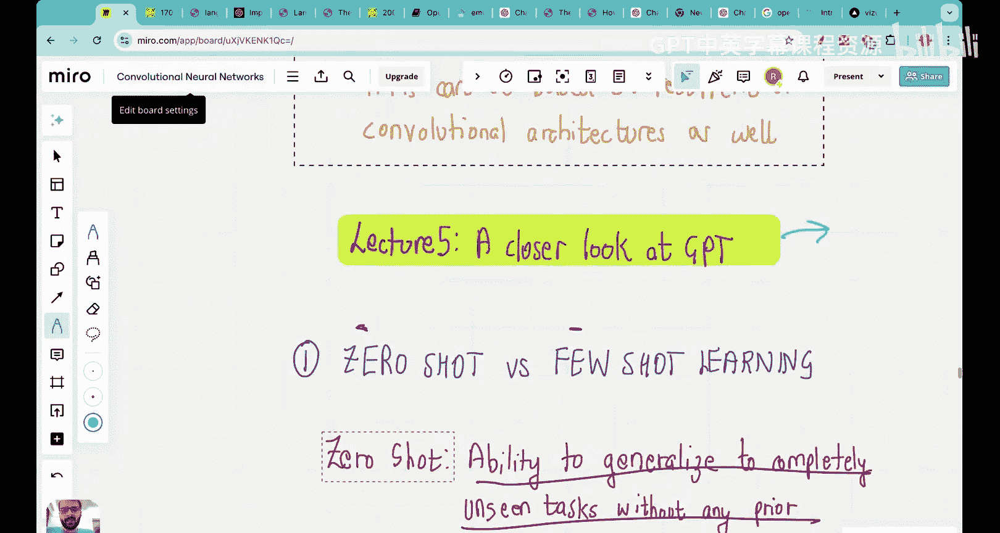

# 05：GPT-3 究竟如何工作？🤖

在本节课中，我们将详细探讨 GPT（生成式预训练变换器）模型。我们将了解 GPT 各个版本的演变历程，从最初的 Transformer 架构到 GPT、GPT-2、GPT-3，直至当前的 GPT-4。我们还将深入理解一个核心概念：零样本学习与少样本学习的区别。

## 历史演进：从 Transformer 到 GPT-4 📜

上一节我们介绍了 Transformer 的基本架构。本节中，我们来看看 GPT 系列模型是如何在此基础上发展起来的。

以下是关键研究论文的演进时间线：

*   **2017年：《Attention Is All You Need》**
    *   这篇论文引入了**自注意力机制**，能够捕捉句子中的长距离依赖关系，在预测句子中下一个词的任务上表现出色。
    *   它代表了相较于循环神经网络和长短期记忆网络的重大进步。论文中提出的原始 Transformer 架构包含编码器和解码器。

*   **2018年：《Improving Language Understanding by Generative Pre-Training》（GPT）**
    *   这篇在 Transformer 之后发表的论文引入了**生成式预训练**的概念。
    *   核心思想是**无监督学习**。论文指出，自然语言处理此前大多依赖监督学习，而标注数据稀缺。他们证明，通过在大量无标注文本语料库上进行生成式预训练，可以在这些任务上实现巨大提升。
    *   GPT 架构仅使用了 Transformer 的**解码器**部分。

*   **2019年：《Language Models are Unsupervised Multitask Learners》（GPT-2）**
    *   这篇论文使用了比 GPT 更大量的数据和一个生成式预训练网络。
    *   它发布了四个规模的模型：GPT-2 Small、Medium、Large 和 Extra Large。其中最大的 GPT-2 Extra Large 拥有约 **15亿参数**，在当时是巨大的模型。

*   **2020年：《Language Models are Few-Shot Learners》（GPT-3）**
    *   GPT-3 是一个拥有 **1750亿参数** 的庞然大物。
    *   尽管仅被训练来预测下一个词，但它展现出执行多种任务（如翻译、问答、情感分析）的卓越能力，这主要归功于其**少样本学习**能力。

*   **2022年至今：GPT-3.5、GPT-4 及以后**
    *   GPT-3.5 在商业领域变得流行。
    *   当前我们已处于 GPT-4 时代。同时，开源模型（如 Meta 的 Llama 3.1）的性能正在快速追赶甚至超越闭源模型。

## 核心概念：零样本、单样本与少样本学习 🎯

理解大型语言模型如何执行任务的关键在于区分它们的学习方式。以下是基于 GPT-3 论文的清晰说明：

*   **零样本学习**
    *   模型仅根据任务描述生成答案，不提供任何示例。
    *   **示例**：提示为“将英语翻译成法语：`cheese` =>”。模型需要直接输出法语翻译。

*   **单样本学习**
    *   模型除了看到任务描述，还看到一个任务示例。
    *   **示例**：提示为“将英语翻译成法语：`sea otter` => `loutre de mer`。`cheese` =>”。模型参考单个示例进行翻译。

*   **少样本学习**
    *   模型看到任务描述和少量（通常为几个）任务示例。
    *   **示例**：提示为“将英语翻译成法语：`sea otter` => `loutre de mer`， `peppermint` => `menthe poivrée`， `giraffe` => `girafe`。`cheese` =>”。模型参考多个示例进行翻译。

GPT-3 论文的核心主张是，GPT-3 是一个强大的**少样本学习器**。这意味着提供少量示例能显著提升其在特定任务上的表现。虽然它也能进行零样本学习，但少样本下的准确率通常更高。

当前像 GPT-4 这样的模型，同时具备零样本和少样本学习能力。为了获得更准确的响应，提供少量示例（即使用少样本学习）通常是更佳实践。

## 训练基石：海量数据集与高昂成本 💰

GPT-3 的强大能力建立在巨大的数据量和计算资源之上。我们来具体看看：

**GPT-3 的训练数据混合来源：**

1.  **Common Crawl**：一个免费开放的网页爬虫数据集，包含超过2500亿个页面。GPT-3 使用了其中 **4100亿个词元**，占总数据集的约60%。
2.  **WebText2**：一个增强版网络文本语料库，包含大量 Reddit 帖子。GPT-3 使用了其中 **190亿个词元**，约占22%。
3.  **书籍与维基百科**：构成了剩余约18%的数据。

**总计**，GPT-3 在约 **3000亿个词元** 上进行了训练。
> **注**：词元是模型读取文本的基本单位。为简化理解，目前你可以近似认为 **1个词元 ≈ 1个单词**。实际的词元化过程更复杂，我们将在后续课程中详述。

**预训练成本**：训练 GPT-3 模型的总成本高达 **460万美元**。这反映了处理如此庞大数据和优化1750亿参数所需的巨大计算开销（如GPU集群）。

## 架构本质：仅解码器的自回归模型 🧱

现在，我们深入 GPT 的架构和工作原理。

**GPT 与原始 Transformer 的关键区别**：
*   **原始 Transformer**：包含编码器（用于理解输入）和解码器（用于生成输出）。
*   **GPT 架构**：**仅包含解码器堆叠**。它是一个简化但规模极大的架构。

**GPT 是自回归模型**：
*   **训练目标**：GPT 模型的核心训练任务是**预测句子中的下一个词**。
*   **自回归含义**：在生成过程中，模型将**之前生成的输出作为后续步骤的输入**。
*   **无监督学习**：训练数据不需要人工标注。标签来自数据本身——句子的下一个词就是需要预测的目标。这种方法称为**自监督学习**。

**工作流程示意**：
假设我们要生成句子“This is an example”。

1.  **迭代 1**：
    *   输入：`“This”`
    *   模型处理并预测下一个词：`“is”`
2.  **迭代 2**：
    *   输入变为：`“This is”` （包含了上一次的输出）
    *   模型预测下一个词：`“an”`
3.  **迭代 3**：
    *   输入变为：`“This is an”`
    *   模型预测下一个词：`“example”`

这个过程不断重复，直到生成完整的序列。正是这种“输出反馈为输入”的机制，使得 GPT 被称为**自回归模型**。

## 神奇现象：涌现能力 ✨

尽管 GPT 系列模型**仅被明确训练用于下一个词预测**，但它们却展现出执行多种未经过专门训练的任务的强大能力，例如：
*   语言翻译
*   问答
*   生成选择题
*   文本总结
*   编写教案

这种能力被称为**涌现能力**。其正式定义是：模型执行其未经过明确训练的任务的能力。

涌现能力是如何产生的，目前仍是活跃的研究领域。一种解释是，在预测下一个词的庞大训练过程中，模型隐式地学习到了语言的内在规律、知识和推理能力，从而能够泛化到各种下游任务。

## 模型生态：预训练、微调与开源闭源 🔄

理解大型语言模型的应用，需要了解以下概念：

*   **预训练**：在像 GPT-3 这样的大规模通用数据集上训练模型，得到**基础模型**。成本高昂，但只需进行一次。
*   **微调**：在预训练的基础模型上，使用特定领域（如金融、医疗）的、规模较小的**标注数据集**进行额外训练。这能使模型在该领域表现更专业、更可靠，是生产环境部署的常见步骤。
*   **开源 vs. 闭源**：
    *   **闭源模型**：如 GPT-4，其模型权重和架构细节不公开，用户只能通过 API 接口使用。
    *   **开源模型**：如 Meta 的 Llama 系列，其模型权重和代码公开，允许研究者和开发者自由使用、修改和研究。近年来，顶级开源模型（如 Llama 3.1）的性能已非常接近甚至在某些方面超越闭源模型。

## 总结 📝

本节课中我们一起学习了 GPT-3 的核心工作原理及其背景：

1.  **历史演进**：回顾了从 Transformer 到 GPT-4 的关键发展节点。
2.  **学习方式**：明确了**零样本**、**单样本**和**少样本**学习的区别，并指出 GPT-3 是优秀的少样本学习器。
3.  **数据与成本**：了解到 GPT-3 在约3000亿词元的庞大数据上训练，预训练成本高达460万美元。
4.  **模型架构**：理解了 GPT 是**仅包含解码器**的**自回归**模型，通过**下一个词预测**进行**无监督/自监督学习**。
5.  **涌现能力**：认识了模型能够执行未经过专门训练的任务的神奇现象。
6.  **模型生态**：区分了**预训练**与**微调**，以及**开源**与**闭源**模型生态。

在下一讲中，我们将开始探讨构建一个大语言模型的完整阶段，并直接从数据预处理环节开始动手编码。