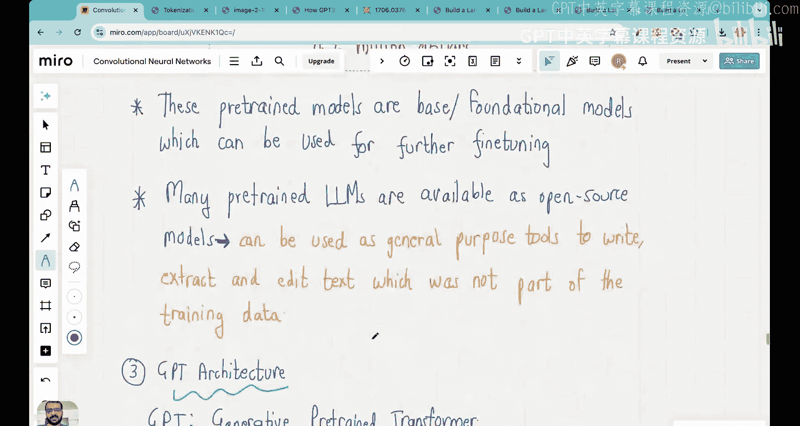
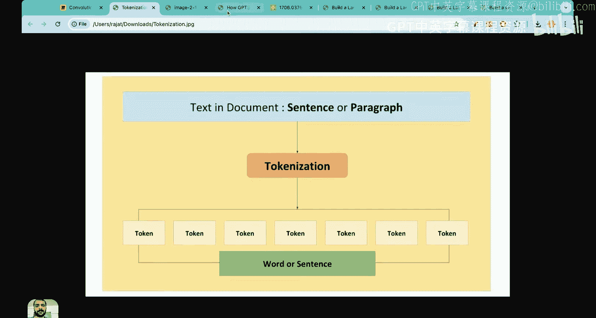
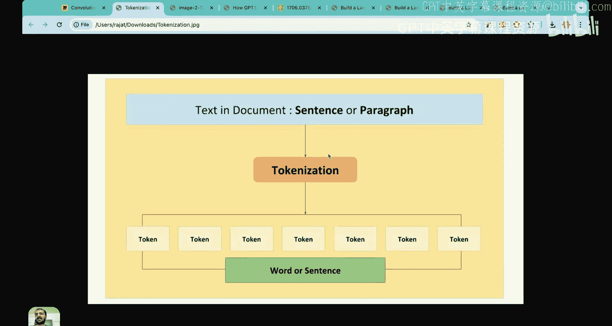
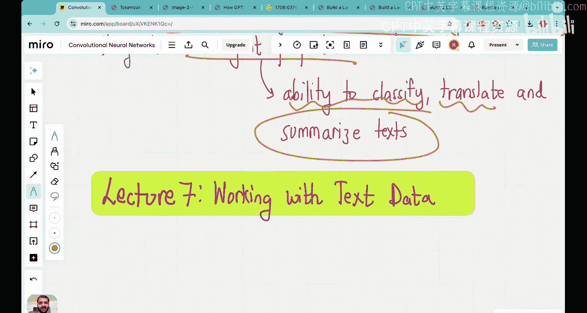

# 06：构建大语言模型的阶段 🗺️

在本节课中，我们将概述整个系列教程的学习路线图，明确构建大语言模型（LLM）的三个核心阶段。同时，我们也会对之前课程中学到的关键概念进行一次全面的回顾。

## 概述

到目前为止，我们已经完成了五节理论课程的学习。在上一节课中，我们深入探讨了GPT-3的架构，并回顾了从GPT到GPT-4的演进历程。我们了解到，GPT-3的总训练成本高达约460万美元。

从下一节课开始，我们将进入实践环节，真正动手构建一个大语言模型。本节课旨在提供一个清晰的路线图，说明我们将在本系列中涵盖的所有阶段和内容。

## 构建LLM的三个阶段

我们将整个学习过程划分为三个阶段。需要说明的是，本系列内容大量借鉴了Sebastian Raschka所著的《从零开始构建大语言模型》一书。

目前，网络上许多教程仅覆盖了部分阶段，且不够深入。本系列计划为每个阶段分配多节课程，以确保您能透彻理解其内部原理。

以下是三个阶段的划分：

### 第一阶段：理解基础构建模块 🧱

在正式训练大语言模型之前，我们需要掌握其核心构建模块。第一阶段将聚焦于以下三个方面：

1.  **数据预处理与采样**
2.  **注意力机制**
3.  **LLM架构**

本阶段的主要目标是理解大语言模型的基本工作原理。

以下是第一阶段将涵盖的具体内容：

*   **数据准备与采样**：我们将学习如何对句子进行分词，将文本分解为独立的标记（Token）。接着，学习词向量嵌入，将每个词转换为高维向量，以捕捉词语间的语义关系。例如，“苹果”、“香蕉”、“橙子”的向量在空间中应该彼此靠近。我们还将学习位置编码，以告知模型词语在句子中的顺序信息。最后，学习如何将海量数据集构建成批次，高效地输入模型进行训练。
*   **注意力机制**：我们将深入理解Transformer模型中的注意力机制，包括多头注意力、掩码多头注意力等概念，并用代码从零实现它。
*   **LLM架构**：学习如何堆叠不同的神经网络层来构建大语言模型架构，例如注意力头应该放置在何处。

完成第一阶段后，我们便为模型训练做好了准备。

### 第二阶段：预训练基础模型 🏋️

第二阶段的核心是**预训练**。在准备好数据和模型架构后，我们将编写代码，在无标签的数据集上训练我们的大语言模型。这个阶段的成果是得到一个**基础模型**。

本阶段将具体涵盖以下内容：

*   实现训练循环，按周期（Epoch）处理数据，计算损失梯度并更新模型参数。
*   进行模型评估，例如通过文本生成进行可视化检查。
*   实现保存和加载模型权重的功能，以便后续使用或继续训练，这能节省大量计算成本。
*   学习如何将OpenAI等机构发布的预训练权重加载到我们自己的模型中。

### 第三阶段：微调与应用开发 🎯

第三阶段的主要目标是**微调大语言模型**，以构建具体的应用程序。仅仅使用基础模型通常无法满足特定任务的需求。在本系列中，我们将基于预训练好的基础模型，开发两个实际应用：

1.  **垃圾邮件分类器**：我们将使用带有“垃圾邮件/非垃圾邮件”标签的数据集对模型进行微调，使其能够自动分类邮件。
2.  **个人助理聊天机器人**：我们将构建一个能够根据指令和输入生成相应输出的对话式AI应用。

对于希望成为专业LLM工程师的学习者而言，理解所有三个阶段都至关重要。许多学习者可能只关注第三阶段，直接使用LangChain或Llama等工具部署应用，但对前两个阶段知之甚少。本系列旨在无遗漏地深入讲解每个概念，帮助您建立扎实的知识体系。

## 核心概念回顾

在进入实践环节之前，让我们回顾一下目前已学习的关键概念：

1.  **大语言模型的影响**：大语言模型彻底改变了自然语言处理领域，它们在生成、理解和翻译人类语言方面取得了巨大进步。与以往需要为每个任务单独训练模型不同，LLM具有通用性。
2.  **两阶段训练流程**：所有现代大语言模型都遵循两个主要训练步骤：
    *   **预训练**：在无标签的海量文本数据上训练，得到基础模型。这需要巨大的数据量、算力和资金。
    *   **微调**：在特定、较小的带标签数据集上对基础模型进行进一步训练，以使其适应具体任务（如垃圾邮件分类）。生产级别的LLM应用通常都需要经过微调。
3.  **Transformer架构与注意力机制**：大语言模型成功的“秘诀”在于Transformer架构，其核心是**注意力机制**。注意力机制允许模型在生成输出时，有选择地关注输入序列中的所有部分，从而理解上下文的重要性。原始的Transformer（2017年）包含编码器和解码器，而生成式预训练Transformer（GPT，2018年）仅使用了解码器架构。
4.  **涌现能力**：大语言模型仅被训练来预测下一个词。但令人惊讶的是，它们发展出了**涌现能力**，即能够执行文本分类、语言翻译、文本摘要等它们并未被直接训练过的任务。这使得它们能够广泛应用于各种场景。

## 总结

本节课我们一起梳理了构建大语言模型的完整路线图，包括**理解基础模块**、**预训练基础模型**和**微调开发应用**三个阶段。我们也回顾了大语言模型的核心价值、两阶段训练流程、Transformer架构的基石——注意力机制，以及神奇的涌现能力。

从下一节课开始，我们将正式进入第一阶段，从“处理文本数据”入手，开始实际的编码工作。我们将结合白板讲解和Jupyter Notebook代码演示，确保您能同时理解理论和实践。