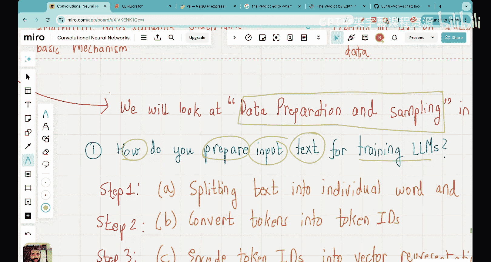
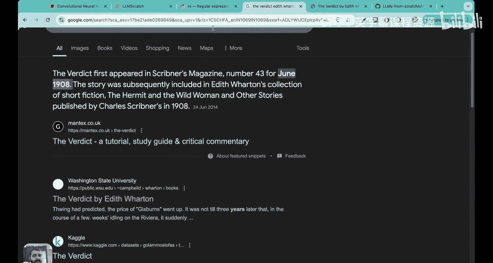
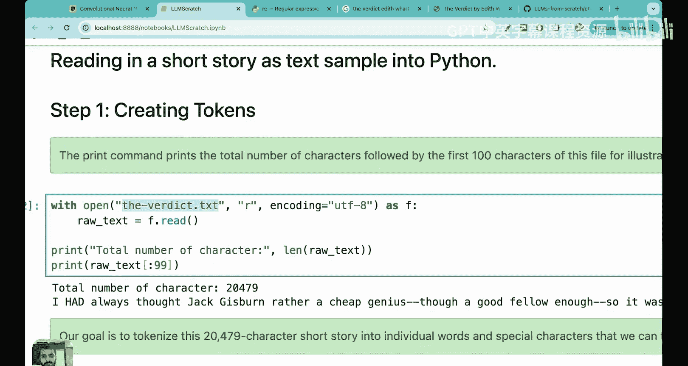
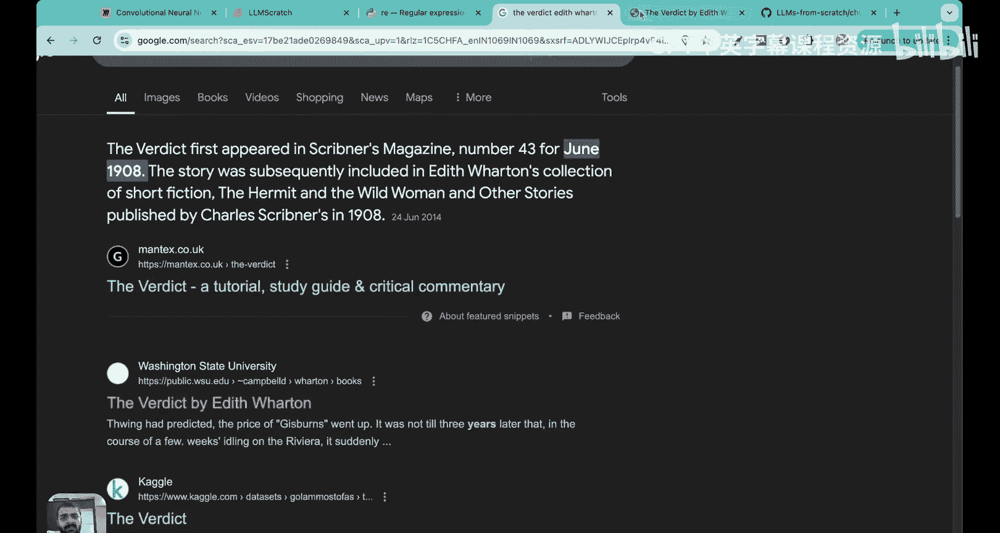
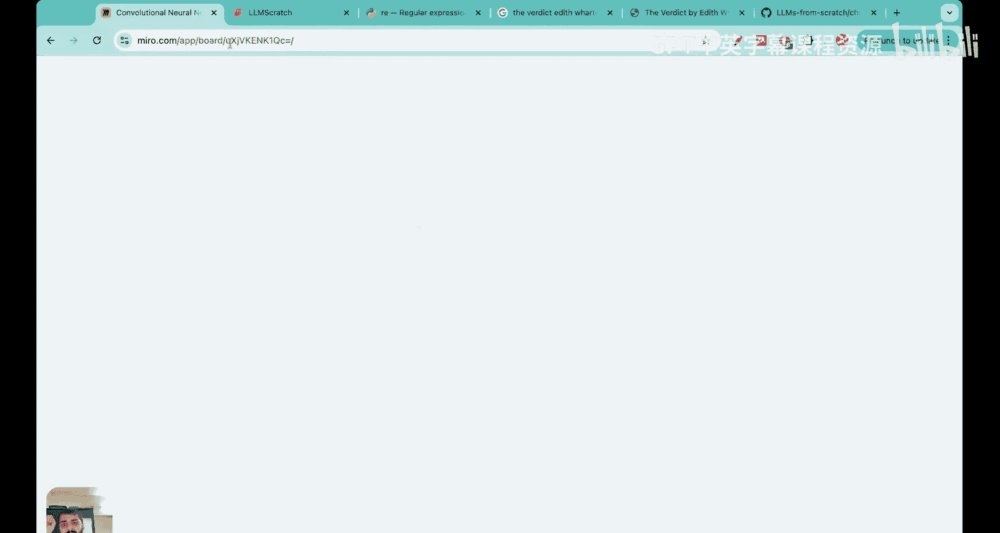

# 07：用Python从零编写LLM分词器


在本节课中，我们将学习大语言模型数据预处理流程中的第一步：分词。我们将理解分词的核心概念，并用Python从零开始构建一个完整的分词器，包括编码器和解码器。

## 概述：什么是分词？



大语言模型本质上是神经网络，需要处理大量文本数据。在训练之前，文本数据必须经过预处理。分词就是这个预处理流程中的第一步。简单来说，分词是将句子分解成单个单词或子词的过程。但为了实际构建大语言模型，我们需要更深入地理解其细节。

## 分词的两个主要步骤


分词过程可以大致分为两个核心步骤：
1.  将文本拆分成独立的单词或子词标记。
2.  将这些标记转换为对应的标记ID。



本节课我们将重点学习这两个步骤。后续还有一个将标记ID转换为向量表示的步骤，这属于词嵌入的范畴，我们将在单独的课程中讨论。





## 第一步：将文本拆分为标记

上一节我们介绍了分词的两个核心步骤。本节中，我们来看看如何具体实现第一步：将文本拆分为标记。

我们将使用Python的`re`（正则表达式）库来实现一个基础的分词器。为了演示，我们将使用Edith Wharton的短篇小说《The Verdict》作为数据集。

首先，我们需要下载并加载数据。

```python
# 下载并读取文本文件
with open('the-verdict.txt', 'r', encoding='utf-8') as f:
    raw_text = f.read()

print(f"总字符数: {len(raw_text)}")
print(f"前100个字符: {raw_text[:100]}")
```

接下来，我们需要设计一个方案来将这段文本拆分成标记。一个简单的方法是使用正则表达式在空格和标点符号处进行分割。

以下是实现分词的关键代码：

```python
import re

def simple_tokenizer(text):
    # 在空格、逗号、句号等标点处分割文本
    split_pattern = r'([,.:;?!_\"\'\(\)\-\–])|\s+'
    parts = re.split(split_pattern, text)
    # 过滤掉空字符串和None值（例如分割产生的空格）
    tokens = [item for item in parts if item and not item.isspace()]
    return tokens

# 应用分词器到整个文本
preprocessed = simple_tokenizer(raw_text)
print(f"标记总数: {len(preprocessed)}")
print(f"前30个标记: {preprocessed[:30]}")
```

这段代码首先使用`re.split`函数，根据我们定义的正则表达式模式（匹配各种标点符号和空白字符）来分割文本。然后，通过列表推导式过滤掉空白字符，最终得到一个纯净的标记列表。

**关于是否保留空格的说明**：在我们的简单分词器中，我们选择移除空格以简化处理并减少内存占用。但在实际应用中，例如训练处理Python代码的模型时，空格（缩进）具有重要含义，可能需要保留。这取决于具体的应用需求。

## 第二步：将标记转换为标记ID

我们已经成功将文本拆分为独立的标记。本节中，我们将学习如何将这些标记转换为模型可以处理的数字形式，即标记ID。

神经网络处理的是数字，因此我们需要为每个唯一的标记分配一个唯一的整数ID。为此，我们首先需要构建一个**词汇表**。

词汇表是所有唯一标记的列表，通常按字母顺序排序。每个唯一的标记都会映射到一个唯一的整数ID。

```python
# 从标记列表中获取所有唯一标记，并排序以创建词汇表
all_words = sorted(set(preprocessed))
vocab_size = len(all_words)
print(f"词汇表大小: {vocab_size}")

# 创建标记到ID的映射字典（词汇表）
str_to_int = {word: i for i, word in enumerate(all_words)}
# 同时创建ID到标记的反向映射，用于后续解码
int_to_str = {i: word for word, i in str_to_int.items()}

# 查看词汇表前几项
print("词汇表示例（前10项）:", list(str_to_int.items())[:10])
```

在上面的代码中，`str_to_int`字典就是我们的词汇表，它将每个标记字符串映射到一个整数ID。`int_to_str`是反向字典，在需要将ID转换回文本时非常有用。

## 构建完整的分词器类

前面我们分别实现了文本拆分和ID转换。现在，我们将它们整合到一个完整的、可复用的分词器类中。这个类将包含`encode`（编码）和`decode`（解码）两个核心方法。

`encode`方法接收文本，输出标记ID列表。`decode`方法则相反，接收标记ID列表，尝试还原出原始文本。

```python
class SimpleTokenizerV1:
    def __init__(self, vocab):
        """初始化分词器，传入词汇表（str_to_int字典）"""
        self.str_to_int = vocab
        self.int_to_str = {i: s for s, i in vocab.items()}

    def encode(self, text):
        """将文本编码为标记ID列表"""
        # 使用之前定义的分词逻辑
        tokens = simple_tokenizer(text)
        # 将每个标记转换为其ID，假设所有标记都在词汇表中
        ids = [self.str_to_int[token] for token in tokens]
        return ids

    def decode(self, ids):
        """将标记ID列表解码回文本"""
        # 将ID转换回标记
        tokens = [self.int_to_str[i] for i in ids]
        # 将标记连接成字符串，并简单处理标点前的空格
        text = ' '.join(tokens)
        # 修复标点符号前的多余空格，例如 "hello , world" -> "hello, world"
        import re
        text = re.sub(r'\s+([,.?!:;\'\"])', r'\1', text)
        return text

# 使用我们之前构建的词汇表实例化分词器
tokenizer = SimpleTokenizerV1(str_to_int)

# 测试编码和解码
sample_text = "It is the last, he painted, you know, Mrs. Gisburn said with pardonable pride."
encoded_ids = tokenizer.encode(sample_text)
print("编码后的ID:", encoded_ids)
decoded_text = tokenizer.decode(encoded_ids)
print("解码后的文本:", decoded_text)
```

## 处理未知词汇与特殊标记

我们构建的基础分词器有一个明显的问题：如果输入的文本包含词汇表中不存在的单词（未知词），编码过程会抛出`KeyError`。在实际的大语言模型中，训练数据极其庞大和多样，以尽量减少这种情况，但仍需有机制来处理它。

此外，当训练数据由多个独立文档（如不同的书籍、文章）拼接而成时，我们通常需要在文档之间插入特殊的标记来标识边界。

以下是两种重要的特殊标记：
1.  **`<UNK>` (Unknown)**: 用于替换词汇表中不存在的单词。
2.  **`<EOT>` (End of Text)**: 用于标记一个独立文本段落的结束。

让我们创建一个增强版的分词器来处理这些情况。

首先，我们需要扩展词汇表，加入这些特殊标记。

```python
# 在原有唯一词汇列表中添加特殊标记
special_tokens = ['<EOT>', '<UNK>']
all_words_with_special = all_words + special_tokens

# 重新创建映射字典
str_to_int_v2 = {word: i for i, word in enumerate(all_words_with_special)}
int_to_str_v2 = {i: word for word, i in str_to_int_v2.items()}

print(f"扩展后的词汇表大小: {len(str_to_int_v2)}")
print("特殊标记的ID:", str_to_int_v2['<EOT>'], str_to_int_v2['<UNK>'])
```

现在，我们基于新的词汇表构建第二代分词器。

```python
class SimpleTokenizerV2:
    def __init__(self, vocab):
        self.str_to_int = vocab
        self.int_to_str = {i: s for s, i in vocab.items()}
        self.unk_token_id = vocab.get('<UNK>', len(vocab)-1) # 获取UNK的ID

    def encode(self, text):
        tokens = simple_tokenizer(text)
        # 处理未知词：如果标记不在词汇表中，则使用<UNK>的ID
        ids = [self.str_to_int.get(token, self.unk_token_id) for token in tokens]
        return ids

    def decode(self, ids):
        tokens = [self.int_to_str.get(i, '<UNK>') for i in ids]
        text = ' '.join(tokens)
        import re
        text = re.sub(r'\s+([,.?!:;\'\"])', r'\1', text)
        # 也可以选择在解码输出中移除或保留特殊标记的显示
        return text

# 实例化新版分词器
tokenizer_v2 = SimpleTokenizerV2(str_to_int_v2)

# 测试包含未知词和多个文本段的输入
text_source1 = "Hello, do you like tea?"
text_source2 = "In the sunlit terraces of the palace."
# 在输入中显式添加<EOT>标记来分隔文本段
combined_text = text_source1 + " <EOT> " + text_source2

encoded_ids_v2 = tokenizer_v2.encode(combined_text)
print("编码ID (V2):", encoded_ids_v2)
decoded_text_v2 = tokenizer_v2.decode(encoded_ids_v2)
print("解码文本 (V2):", decoded_text_v2)
```

在这个版本中，`encode`方法使用`.get(token, self.unk_token_id)`来安全地查找标记ID，如果标记不存在，则返回`<UNK>`的ID。`decode`方法也做了类似的安全处理。

**关于其他特殊标记的说明**：除了`<UNK>`和`<EOT>`，其他常见的特殊标记还包括`<BOS>`（序列开始）、`<EOS>`（序列结束）和`<PAD>`（填充）。填充标记在批量训练中用于将不同长度的文本统一到相同长度。值得注意的是，像GPT这样的模型为了简洁，通常只使用`<EOT>`标记，并且它们通过下一节课将要学习的**字节对编码**技术来从根本上减少未知词的出现，而不是依赖`<UNK>`标记。

## 总结

本节课中，我们一起学习了构建大语言模型的关键预处理步骤——分词。我们主要涵盖了两个核心步骤：

1.  **文本拆分**：使用Python的`re`库，通过正则表达式将原始文本分割成独立的单词和标点符号标记。我们讨论了处理空格和各类标点的策略。
2.  **标记转ID**：通过构建**词汇表**（一个从唯一标记到唯一整数的映射字典），将文本标记转换为模型可处理的数字ID。

我们不仅理解了概念，还动手实践，从零开始编写了两个版本的分词器类：
*   `SimpleTokenizerV1`实现了基础的编码和解码功能。
*   `SimpleTokenizerV2`通过引入`<UNK>`（未知）和`<EOT>`（文本结束）等**特殊标记**，增强了分词器的鲁棒性，使其能够处理未见过的词汇和多个文本段落。

最后我们提到，实际中GPT等先进模型使用**字节对编码**这种更复杂的分词方案，它通过将单词拆分为子词来更高效地处理词汇，这将是下节课的重点。




通过本课的学习，你应该对分词在大语言模型流水线中的作用有了扎实的理解，并掌握了从零实现一个基础分词器的能力。