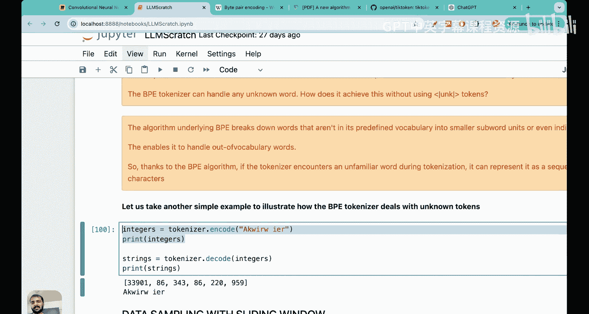

# 08：GPT分词器与字节对编码


在本节课中，我们将要学习一个非常重要的主题——字节对编码。在现代大语言模型（如GPT-2、GPT-3）的背后，其使用的分词器通常就是字节对编码。理解其含义和工作原理对于掌握现代大语言模型至关重要。

## 分词算法概述

上一节我们实现了一个简单的分词方案。本节中，我们来看看更复杂的分词方案——字节对编码分词器。

分词算法主要分为三种类型：基于词的分词、基于子词的分词和基于字符的分词。

### 基于词的分词
在基于词的分词中，句子中的每个词通常被视为一个独立的标记。例如，句子“The fox chased the dog”会被分词为：`[“The”, “fox”, “chased”, “the”, “dog”]`。

以下是基于词的分词面临的主要问题：
*   **词汇表外词问题**：当用户输入一个不在训练词汇表中的词时，分词器难以处理。
*   **语义相似性丢失**：例如，“boy”和“boys”在语义上高度相关，但会被视为两个完全独立的标记，模型无法捕捉其关联性。

### 基于字符的分词
在基于字符的分词中，每个字符被视为一个独立的标记。例如，“my hobby is playing cricket”会被分解为单个字符：`[“m”, “y”, “h”, “o”, “b”, “b”, “y”, …]`。

基于字符的分词优缺点如下：
*   **优点**：词汇表极小（例如英语仅约256个字符），几乎不存在词汇表外词问题。
*   **缺点**：
    1.  词的含义完全丢失。
    2.  分词后的序列长度远长于原始文本（例如“dinosaur”一词会被分成8个标记）。

### 基于子词的分词
基于子词的分词结合了上述两种方法的优点。字节对编码就是一种基于子词的分词算法。

其核心规则有两条：
1.  对于数据集中频繁出现的词，保留其作为完整标记。
2.  对于出现频率较低的罕见词，将其拆分为更小的、有意义的子词。

这种方法的优势在于：
*   能帮助模型学习具有相同词根的词（如“token”, “tokens”, “tokenizing”）之间的关联。
*   能帮助模型识别常见的词缀（如“-ization”），理解其语法功能。

## 字节对编码算法详解

字节对编码最初是一种数据压缩算法，发布于1994年。其核心思想是：**迭代地寻找数据中最常见的连续字节对，并用一个未在数据中出现的新字节替换它**。

让我们通过一个例子来理解这个过程。假设原始数据为：
```
aaabdaaabaac
```
1.  **第一次迭代**：最常见的字节对是“aa”，出现4次。我们用一个新字节“Z”替换它。数据变为：`ZabdZabac`。
2.  **第二次迭代**：现在最常见的字节对是“ab”，出现2次。我们用新字节“Y”替换它。数据变为：`ZYdZYac`。
3.  **后续迭代**：可以继续合并“ZY”等，直到没有字节对出现超过一次。

这个压缩过程就是编码。对于大语言模型，我们稍微修改这个算法：**不是用新字节替换常见字节对，而是将它们合并成一个新的子词标记**。

## BPE在大语言模型中的应用实践

现在，我们来看BPE如何应用于大语言模型的分词。我们将通过一个具体例子，展示如何从一组单词构建子词词汇表。

假设我们的数据集包含以下单词及其频率：
*   `old` (出现7次)
*   `older` (出现3次)
*   `finest` (出现9次)
*   `lowest` (出现4次)

首先，我们在每个词末尾添加一个特殊的结束标记（如 `</w>`），然后将其拆分为字符，并统计频率。

**初始状态（字符级）**：
字符及其频率列表大致如下：`o:14, l:14, d:10, e:16, r:3, f:9, i:9, n:9, s:13, t:13, w:4, </w>:23, …`

**迭代过程**：
1.  找到最常见的字节对 `e` 和 `s`（共出现13次）。合并它们，创建新子词 `es`。更新频率（`e`和`s`单独出现的次数减少）。
2.  接下来，常见字节对变为 `es` 和 `t`（出现13次）。合并为 `est`。
3.  `est` 后常跟 `</w>`（出现13次）。合并为 `est</w>`。这个子词捕获了“finest”和“lowest”的共同后缀。
4.  另一常见字节对 `o` 和 `l`（出现10次）。合并为 `ol`。
5.  `ol` 和 `d` 是常见对（出现10次）。合并为 `old`。这个子词捕获了“old”和“older”的共同词根。

**最终词汇表**：
经过多轮迭代合并后，我们得到的子词词汇表可能包含：`old`, `est</w>`, `er</w>`, `f`, `i`, `n`, `l`, `o`, `w`, `</w>`, … 等。像“older”这样的词会被分词为 `[“old”, “er</w>”]`。

**算法停止条件**：
通常，当合并达到预设的词汇表大小（例如GPT-2使用50257）或迭代次数时停止。

## 使用代码实现BPE分词器

理解了原理后，我们来看看如何用代码使用BPE分词器。我们将使用OpenAI开源的 `tiktoken` 库。

```python
import tiktoken

# 实例化GPT-2使用的BPE分词器
tokenizer = tiktoken.get_encoding(“gpt2”)

# 编码文本
text = “Hello! Do you like tea?<|endoftext|>In the sunlit terraces of someunknownplace.”
token_ids = tokenizer.encode(text)
print(“Token IDs:”, token_ids)

# 解码回文本
decoded_text = tokenizer.decode(token_ids)
print(“Decoded text:”, decoded_text)
```
运行代码，我们可以观察到：
1.  特殊标记 `<|endoftext|>` 被编码为一个特定的ID（如50256），它通常是词汇表中的最后一个ID。GPT-2的词汇表大小正是50257。
2.  生造词“someunknownplace”被成功编码和解码，没有引发错误。这是因为BPE分词器可以将其分解为已知的子词或字符序列（例如 `[“some”, “unknown”, “place”]` 的子词组合）。

这展示了BPE分词器的关键优势：**通过子词和字符的灵活组合，有效处理词汇表外的未知词**。

## 总结

本节课我们一起学习了字节对编码。我们从分词算法的三种基本类型（词、字符、子词）入手，分析了各自的优缺点。然后，我们深入探讨了BPE算法的起源及其作为数据压缩算法的核心思想。通过一个详细的例子，我们逐步演示了BPE如何通过迭代合并最常见字节对来构建一个能捕获词根和词缀信息的子词词汇表。最后，我们使用 `tiktoken` 库实践了GPT-2的BPE分词器，验证了其处理未知词汇的能力。




BPE分词器因其能平衡词汇表大小、捕捉语义关联以及优雅处理未知词，成为GPT系列等现代大语言模型的标准选择。