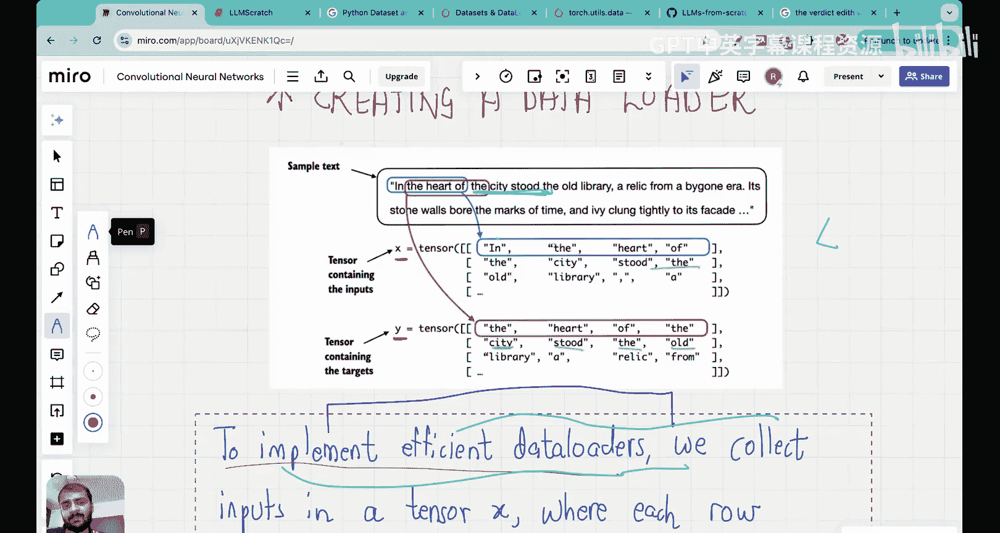

# 09：创建输入-目标数据对

在本节课中，我们将学习如何为大型语言模型的训练准备数据。具体来说，我们将学习如何将文本数据转换为模型可以理解的输入-目标数据对。这是模型训练前数据预处理的关键一步。

在上一讲中，我们深入了解了字节对编码算法。我们看到了该算法如何用于子词分词，并比较了基于词、子词和字符的分词方法。我们还详细了解了GPT系列模型如何使用字节对编码进行分词。

到目前为止，我们已经了解了大型语言模型所需的分词步骤。如果我们回顾整个流程，目前我们正处于数据预处理阶段。在将数据送入LLM训练之前，预处理的第一步是分词，接下来是向量嵌入，然后才将这些向量嵌入送入训练过程。

在进入向量嵌入之前，有一个非常重要的主题需要覆盖，那就是今天课程的内容：创建输入-目标数据对。如果你观察其他机器学习任务，如分类或回归，输入和输出通常非常明确。例如，在猫狗图像分类中，猫狗图像是输入，而“猫”或“狗”的标签是输出。在回归问题中，房屋面积是输入，价格是输出。对于大型语言模型，我们使用一种特定的技术来创建这些数据对，理解这项技术非常重要，因此我们专门用一节课来讲解。

## 理解输入-目标数据对

首先，当我们说输入-目标数据对时，我们指的是什么？它们看起来是怎样的？

假设我们有一个句子：“LLMs learn to predict one word at a time”。标记为蓝色的部分将是LLM的输入，标记为红色的部分将是LLM需要学习预测的目标或输出。

为什么会有不同的行？这些是不同的迭代步骤。让我们看第一次迭代：输入是“LLMs”，基于此输入，LLM需要学习的输出是“learn”。下一个词始终是输出。预测之后的内容被屏蔽或不显示给LLM。这是第一次迭代的情况。

现在看第二次迭代：“learn”这个在第一次迭代中是输出的词，现在成为了输入的一部分。因此，在第二次迭代中，“LLMs learn”是输入，“to”是目标。在第三次迭代中，“to”成为了输入的一部分，“LLMs learn to”是输入，“predict”是输出。

希望你现在已经开始理解这个模式了。在每次迭代中，只有下一个词是输出，而它之前的所有内容都是输入。这些就是输入-目标数据对。记住这一点非常重要。在迭代过程的每个阶段，LLM的输入是句子中直到需要预测的词为止的部分，而需要预测的那个词就是输出。

这个图示仅用于说明目的。在今天的课程中，我们还将学习上下文长度的概念，它指的是作为输入给出的词的数量。输出长度始终是一个词，但我们可以选择输入的上下文长度。

在每次迭代中，目标之后的词本质上被屏蔽了，因此LLM无法访问目标之后的词。这里有两件事需要记住：第一，在句子内部，我们将句子分解为输入和下一个词作为目标；第二，在后续迭代中，前一次迭代的输出会成为下一次迭代的输入。因此，这是一个自回归模型。之所以称为自回归，是因为第一次迭代的输出成为了下一次迭代的输入。这也被称为自监督学习，或者你可以将其视为无监督学习，因为我们没有手动标注输入和输出，句子结构本身就被用来确定什么是输入和输出。在猫狗分类中，我们必须手动标注“这是猫”或“这是狗”，但在这里创建输入-目标对时，我们不需要特别标注，只需编写一个简单的代码，利用句子结构本身将句子分解为输入和输出。因此，这也是无监督学习的一个例子，并且被称为自回归。希望你已经理解了这两个概念。

在预训练中，我们总是进行无监督学习，因为句子结构被用来创建输入-输出对或输入-目标对。

希望你已经理解了输入-目标对的样子，我们将在今天的课程中用Python创建它们。如果你理解到这里，用Python编码实际上相当容易，但我发现学生们通常不能直观地理解这部分内容，因此会觉得编码部分有些困难。

## 核心概念总结

现在，我想总结一下到目前为止解释的所有内容。

第一，我们在这里本质上所做的是：给定一个文本样本，我们基于该文本样本提取输入块，这些输入块作为LLM的输入。LLM在训练期间的预测任务是预测跟随输入块的下一个词。例如，如果你看这个输入块，LLM的任务是基于此输入预测输出或下一个词。这就是LLM被训练的目的。

最后一点要记住的是，在训练过程中，我们将屏蔽目标之后的所有词。例如，在这个迭代中，“to”是目标。当我们进行这个迭代时，LLM看不到“to”之后的任何内容，因此这部分本质上被屏蔽了。我们将看到如何在代码中实现所有这些功能。

到目前为止，我只是想解释今天课程的目的和目标，现在我们将用Python编写代码来创建输入-目标对。希望你已准备好进行编码，让我们开始吧。

## 编码实现输入-目标对

在这个编码部分，我将标题定为“创建输入-目标对”。和往常一样，我将与你分享这个Jupyter笔记本代码以及视频，以便你可以运行代码并自己检查是否理解了概念。

在本节中，我们将实现一个数据加载器，使用滑动窗口方法获取输入-目标对。这句话有两个部分可能会让你困惑：什么是数据加载器？什么是滑动窗口方法？别担心，我会详细解释这两者。

首先，我们将使用整个短篇小说《判决》作为数据集。请记住，我们整个编码旅程、整个播放列表的数据集都是这个短篇小说《判决》。这是一个玩具数据集，但它很重要，因为我们现在学到的一切都可以以完全相同的方式扩展到更大的数据集。

我们将使用这个数据集，并记住在上一讲中，我们了解了字节对编码分词器。我们将使用字节对编码分词器对整个文本进行编码。这是一个子词分词器，因此标记可以是字符、词或子词。如果你不熟悉字节对编码器，请查看我们之前覆盖的课程。

我们已经定义了分词器，即字节对编码分词器。我们要做的第一件事是读取整个数据集并将其存储在名为`raw_text`的变量中，然后对整个原始文本进行编码。请记住，编码器的作用是获取文本并将其转换为标记ID。

我现在运行了这段代码，你会看到我打印出了编码文本的长度，是5145。这意味着我们的词汇表大小是5145。词汇表本质上看起来像这样：一个将标记映射到标记ID的字典。由于我们使用字节对编码器，标记可能不是词，也可能是子词或字符。因此，大小5145表明，我们数据集的词汇表长度为5145，意味着我们有5145个标记及其对应的标记ID。

执行上面的代码将返回5145，这是应用字节对编码分词器后训练集中的标记总数。

## 创建简单的输入-输出对

现在，我将向你演示如何创建简单的输入-输出对。首先，我将从数据集中移除前50个标记，以便演示更清晰。移除初始的50个标记后，会得到一个稍微更有趣的文本段落。你也可以保留所有标记。为了使课程更有趣，我将定义一个名为`encoded_corpus_sample`的新变量，它只是从数据集中移除前50个标记。

首先，我希望你在这里暂停一下，自己思考这个问题：假设你现在被给予这个数据集，并且我希望你理解了刚才提到的输入-输出目标对。你能想到的最简单的方法是什么？如何将这个数据集转换成这样的输入-输出目标对？你需要做什么来进行这种转换？你能稍微思考一下吗？想想最简单的方法，不要考虑复杂的算法。你能想到的最简单的事情是什么？你可以在这里暂停视频一段时间，因为如果你能回答出来，它将真正提高你的理解。

现在让我揭示答案。为下一个词预测任务创建输入-目标对的最简单、最直观的方法之一是创建两个变量x和y，其中x包含输入标记，y包含目标，目标本质上是输入向右移动1位。让我解释一下这个逻辑是如何工作的。

我们到底需要什么？假设我的输入是[1, 2, 3, 4]，我希望我的输出数组看起来像[2, 3, 4, 5]。我在这里所做的就是：如果1是输入，2应该是输出。这和我们之前的例子很相似：如果“LLM”是输入，“learn”应该是输出。如果[1, 2]是输入，那么3应该是输出，这意味着如果“LLMs learn”是输入，那么“to”应该是输出。如果[1, 2, 3]是输入，这意味着如果“LLMs learn to”是输入，那么输出应该是4，即“predict”应该是输出。最后，如果[1, 2, 3, 4]这四个词都是输入，那么5应该是输出，这意味着如果“LLMs learn to predict”是输入，那么输出应该等于“one”。这就是我想要创建的。

我如何确定这个的大小？为什么我取输入大小x为4，输出大小y为4？这基本上就是上下文大小。上下文大小是你希望作为输入提供给模型以进行预测的词的数量。这里上下文大小等于4。因此，如果我们给出最多四个词，模型将能够预测下一个词。这就是上下文大小的实际含义。

我们想要创建像这样的输入-输出数组。让我展示如何为我们看到的《判决》数据集创建这些数组。首先，我们必须确定上下文大小。正如我告诉你的，上下文大小决定了输入中包含多少标记。让我在这里更详细地解释一下上下文大小。目前我们选择上下文大小为4，你可以选择任何你想要的，并且当我与你分享代码时，你可以尝试修改它。上下文大小为4意味着模型被训练为查看四个词或标记的序列来预测序列中的下一个词。因此，输入x是前四个标记，比如[1, 2, 3, 4]，目标y是接下来的四个标记，即[2, 3, 4, 5]。

这就是上下文大小的含义。如果输入是[1, 2, 3, 4]，输出是[2, 3, 4, 5]。这意味着如果输入是[1]，输出将是[2]；如果输入是[1, 2]，输出将是[3]；如果输入是[1, 2, 3]，输出将是[4]；如果输入是[1, 2, 3, 4]，输出将是[5]。但输入不能是[1, 2, 3, 4, 5]，因为那样会超出上下文大小。直观地理解，上下文大小基本上是模型在预测下一个词时一次应该关注多少个词。

现在让我们看一个简单的例子。我们有这个`encoded_sample`，它包含编码数据集的标记ID。我首先要做的是取前四个元素，那是我的x，也就是输入。然后我将这个x数组向右移动1位，那就是我的y，也就是输出。让我们打印出x，这是与前四个编码样本关联的ID：[290, 4920, 2241, 287]。然后与y关联的ID是：[4920, 2241, 287, 257]。这意味着什么？如果输入ID是290，输出将是4920；如果输入是[290, 4920]，输出是2241；如果输入是[290, 4920, 2241]，输出将是287；如果输入是[290, 4920, 2241, 287]，输出将是257。输入-输出对就是这样构建的。

我们现在可以处理输入和目标，记住目标只是输入向右移动一个位置。然后我们可以如下创建下一个词预测任务。我刚刚向你解释的内容已经写在了代码中。我创建了两个变量`context`和`desired`，并在循环中处理。上下文大小是4，所以这个循环将从1到5。当i等于1时，即第一次迭代，`context`将只是第一个标记ID 290，`desired`将是下一个标记ID 4920。当i等于2时，`context`将是前两个标记[290, 4920]，`desired`将是下一个标记2241。当i等于3时，`context`将是前三个标记ID [290, 4920, 2241]，输出或`desired`将是下一个标记287。当i等于4时，`context`将是前四个标记ID，`desired`将是下一个标记257。

箭头左边的所有内容代表大型语言模型将接收的输入，箭头右边的标记ID代表LLM应该预测的目标标记ID。当我们构建这些输入-输出对时，这就是它的实际含义。这里有四个预测任务，不是一个预测任务。当我创建这个x和y的输入-输出对时，甚至在这里当我展示x和y的输入-输出对时，它不仅仅是一个预测任务，而是有四个预测任务在这里发生。这是因为上下文大小是4。如果上下文大小是8，每个输入-输出对中就会有八个预测任务。当你查看输入-输出对时，通常回归和分类问题中，一个输入-输出对对应一个预测任务（例如，一张狗的图片需要被分类为猫或狗）。但在LLM的情况下，一个输入-输出对对应由上下文大小设定的多个预测任务。这一点非常重要。

现在我要做的是，我将采用相同的简单代码，但将其解码为文本，以便你能感受到这里到底发生了什么。你可以看到我使用了相同的代码，但我打印了解码后的`context`和解码后的`desired`值。因此，如果“and”是输入，“established”是输出；如果“and established”是输入，“himself”是输出；如果“and established himself”是输入，下一个词“in”是输出；如果“and established himself in”是输入，那么下一个词“a”是输出。这正是我们开始课程时展示的内容，你还记得吗？我们通过代码创建了一个非常简单的输入-输出对x和y，并且看到了这些对如何用于创建输入和输出。很棒，对吧？

## 引入数据加载器

这只是我们需要做的第一步。到目前为止，我们已经创建了可以用于LLM训练的输入-输出对。稍后我们将进行LLM训练，所以我们现在已经创建了输入-输出对，但我们需要以更有结构化的方式创建它们，我们需要为整个数据创建，而不仅仅是部分。此外，稍后我们将进行并行处理，所以如果我们有多个CPU并且需要并行计算，我们需要分批处理计算。我们将以非常有结构化的方式来做这件事，为此，我们将使用一种叫做数据加载器的东西。

现在，在下一讲中查看向量嵌入之前，只剩下一个任务，那就是实现一个高效的数据加载器，它遍历输入数据集并以PyTorch张量的形式返回输入和目标。目前我们已经得到了输入-输出数组，但它们不是张量。为什么我们需要张量？因为后面所有的优化过程都将使用PyTorch，而PyTorch使用张量。因此，我们需要输入张量和输出张量。如果你不知道张量是什么，不用担心，你可以暂时将其视为二维数组或多维数组，这不会妨碍你理解本课程。

我们的目标是：实现一个数据加载器，它创建两个张量：一个包含LLM看到的文本的输入张量，和一个包含LLM要预测的目标的目标张量。基本上，我们需要创建类似于我之前在代码中展示的东西，但我们需要以张量格式创建，并且需要以更有结构化的方式进行。这就是为什么我们将使用称为数据集和数据加载器的东西。这些是Python中的数据集和数据加载器，你可以看到一些为分类数据集完成的示例，但本质上，数据集和数据加载器使你能够以更高效和紧凑的方式加载或处理数据，我们马上就会看到。

现在，我们将在下一步中实现一个数据加载器。为了实现高效的数据加载器，我们将使用PyTorch内置的`Dataset`和`DataLoader`类。这些是我现在显示的`Dataset`和`DataLoader`类的链接，我也会在视频描述中附上链接。

在进一步深入代码之前，我只想展示我们期望数据加载器做什么，以便你有一个直观的理解。我发现，除非你获得直观的理解，否则代码会变得非常难以掌握，但如果你知道你想要实现什么，那就真的很容易。在本节中，我们正在实现一个使用滑动窗口方法获取输入-输出目标对的数据加载器。让我们看看这意味着什么。

## 滑动窗口方法图解

假设我们看这个示例文本：“In the heart of the city stood the old library, a relic from a bygone era.” 假设这是那种句子，我们想创建输入-输出对，并且我们将使用上下文大小为4来创建输入-输出对。

假设输入是“In the heart of”。输出张量将向右移动一位，正如我们已经看到的。因此，输出将是“the heart of the”。正确。所以第一个输入对是“In the heart of”，第一个输出是“the heart of the”。在这个输入-输出对中，将有四个预测任务。第一个是：如果输入是“In”，预测应该是“the”；如果输入是“In the”，预测应该是“heart”；如果输入是“In the heart”，预测应该是“of”；如果输入是“In the heart of”，预测应该是“the”。首先，我们有一个x，即输入张量，和一个y，即输出张量。现在让我们看看每个张量的行代表什么。

我们在一个张量x中收集输入。张量x中的每一行代表一个输入上下文。如果你看张量x，每一行都是一个输入上下文：“In the heart of”、“the city stood the”等等。每一行代表一个输入上下文。因此，第一个输入-输出对将是“In the heart of”，第一个输出将是“the heart of the”。第二个输入将是“the city stood the”，第二个输出将是“city stood the old”。基本上，我在本课程前面展示了一个输入-输出对。当我们查看张量时，如果你看每一行，x张量的每一行是一个输入，y张量的每一行是对应的输出。因此，x张量的第50行和y张量的第50行将是第50个输入-输出对。在每个输入-输出对中，这里有四个预测任务，正如我告诉你的，因为上下文大小等于4。所以本质上，我们正在做与课程前半部分相同的事情，但我们只是取整个文本，将其放入张量的行中。我们将文本分成四个词一组：前四个词是第一行，接下来的四个词是第二行。如果你看输出张量，它只是输入张量向右移动一位。如果你看输出张量的每一行，它只是输入张量的对应行向右移动一位。

第二个张量y包含相应的预测目标，这些目标是通过将输入向右移动一个位置创建的。这对于观看本课程的每个人来说都非常重要。我们所做的一切都是下一个词预测任务。让我再次解释一下，因为我真的希望这个概念被理解，因为它是我们将要做的所有事情的核心。让我们看看第二行。

在第二行中，将有四个预测任务。第一个预测任务是：当输入是“the”时，输出是“city”；当输入是“the city”时，输出是“stood”；当输入是“the city stood”时，输出是“the”；当输入是“the city stood the”时，输出是“old”。输出是“old”。基本上，每个输入-输出对对应一个预测任务，并且对应四个预测任务，我们只是预测下一个词。就这么简单，这正是我们在代码中实际所做的。

## 实现数据加载器

现在我将回到代码中，我刚才在白板上展示的创建这种输入张量和输出张量正是我们将在代码中做的。如果你理解了这一点，代码将更容易理解。

我们将实现一个数据加载器来创建这些输入和输出张量。这将分四个步骤完成：第一步是对整个文本进行分词，因为我们现在要处理标记ID（我现在向你展示的是词，但实际上我们处理的是标记ID，所以我们需要编码后的文本）。然后我们将使用滑动窗口。现在你明白为什么它