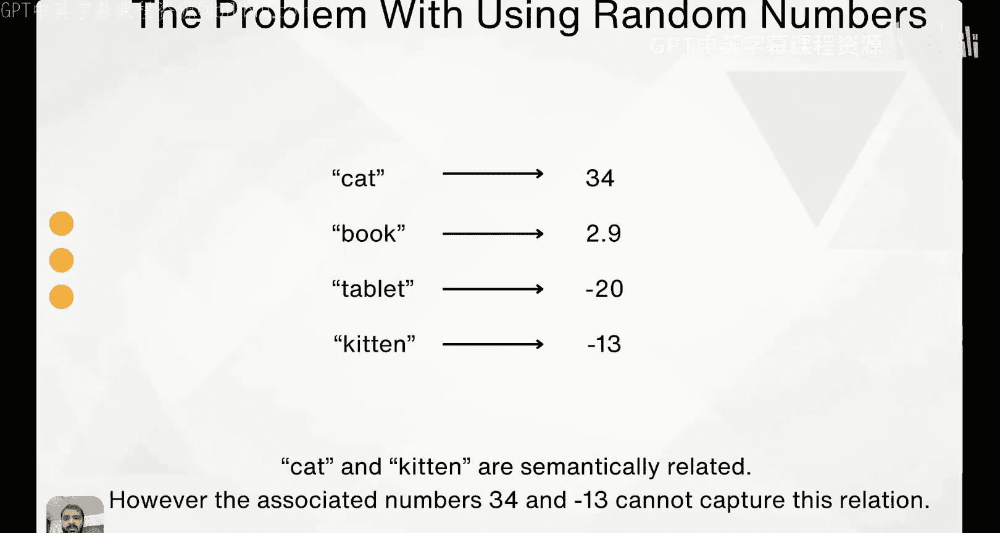
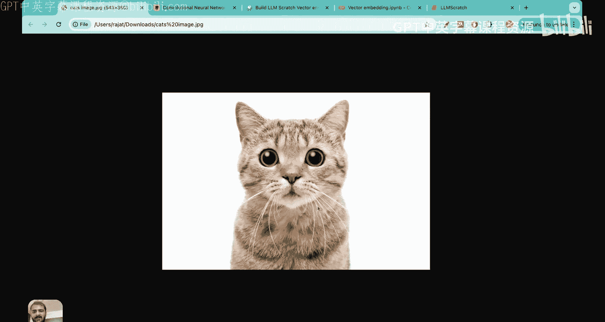
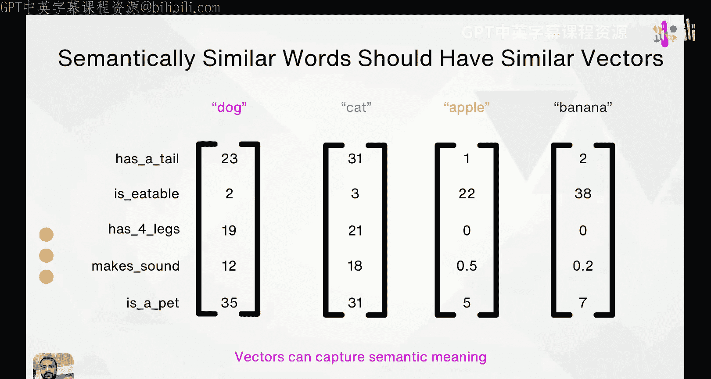
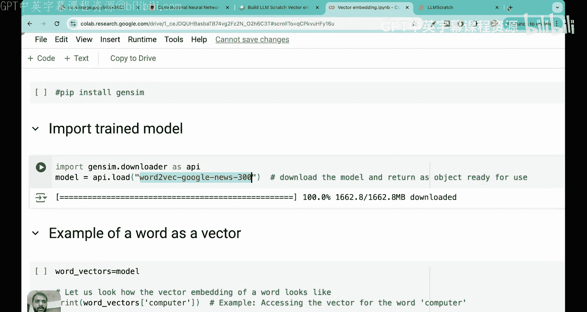
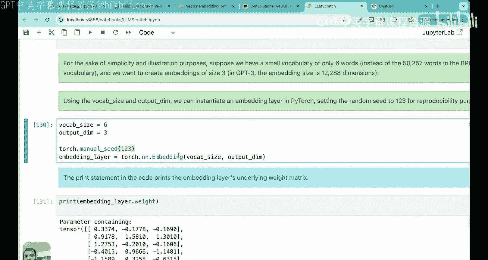
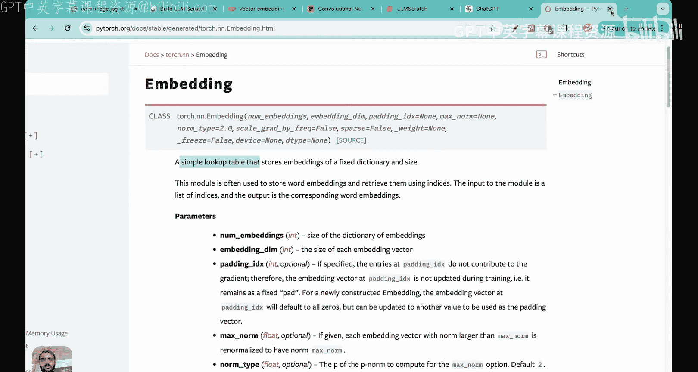
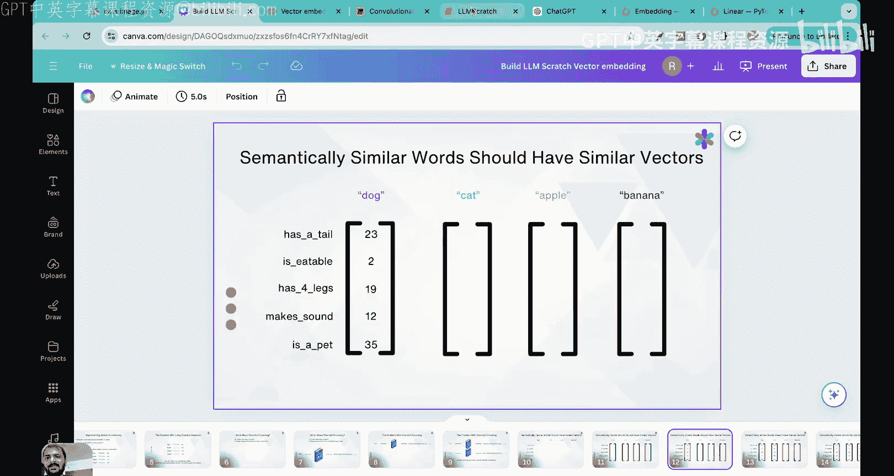
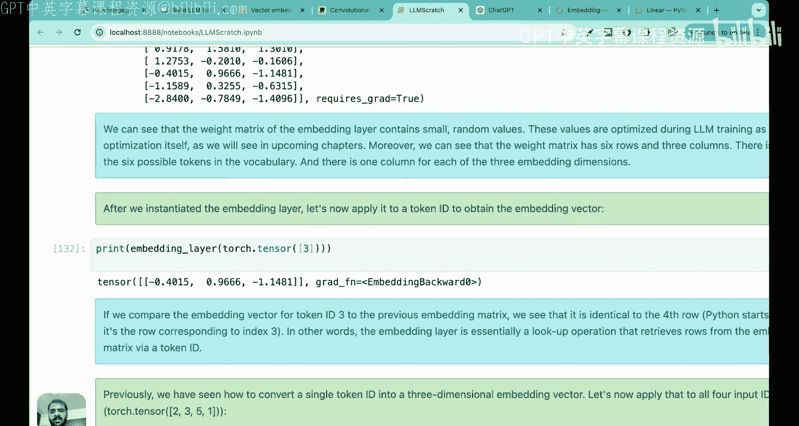

# 10：什么是词元嵌入？


在本节课中，我们将要学习大语言模型工作流程中的一个核心概念——**词元嵌入**。我们将探讨为什么需要词元嵌入，它们如何工作，以及如何在实际中创建和使用它们。

---

## 概念理解：为什么需要词元嵌入？

上一节我们介绍了大语言模型处理文本的基本流程。本节中，我们来看看为什么在将词元转换为ID之后，还需要一个额外的步骤——创建词元嵌入。

计算机无法直接理解单词，因此我们需要将单词表示为数字。一种简单的方法是为每个单词分配一个随机的ID号。然而，这种方法存在一个根本性问题：它无法捕捉单词之间的**语义关系**。





例如，“猫”和“小猫”在含义上是相关的，但如果我们只是给“猫”分配ID 34，给“小猫”分配ID -30，这两个数字本身并不能体现这种关联性。这就像在图像处理中，如果我们只是将像素值拉平成一个向量，就会丢失图像中像素之间的**空间关系**信息。卷积神经网络之所以成功，正是因为它利用了图像中固有的空间信息。


同样，文本中也蕴含着固有的信息：**单词承载着意义**。我们需要在将单词输入模型时，利用这种语义上的相似性。如果我们不利用这些信息，训练过程将不是最优的。

那么，如何编码这种语义关系呢？一个关键的想法是：**将每个单词编码为一个向量**。

以下是构建这种向量的一个思想实验：

假设我们有四个单词：狗、猫、苹果、香蕉。我们根据五个特征来定义它们：
1.  有尾巴
2.  可食用
3.  有四条腿
4.  会发出声音
5.  是宠物

对于每个单词，我们根据这些特征为其打分（例如，高或低），从而形成一个五维向量。

*   **狗**的向量可能是：`[高, 低, 高, 高, 高]`
*   **猫**的向量可能是：`[高, 低, 高, 高, 高]`
*   **苹果**的向量可能是：`[低, 高, 低, 低, 低]`
*   **香蕉**的向量可能是：`[低, 高, 低, 低, 低]`




通过比较这些向量，我们可以发现：
*   “狗”和“猫”的向量非常相似，因为它们共享许多特征（有尾巴、四条腿等）。
*   “苹果”和“香蕉”的向量也非常相似。
*   而“狗”和“香蕉”的向量则差异很大。

这表明，如果我们能以智能的方式将单词表示为向量，那么**向量就可以捕捉语义含义**。这种能够保留单词间语义关系的向量表示，就称为**向量嵌入**或**词元嵌入**。

---

## 实践演示：感受词元嵌入的威力




在理解了词元嵌入的概念后，我们通过一个实际的演示来直观感受训练良好的词元嵌入如何编码语义。

我们可以使用预训练的词嵌入模型，例如 Google 的 Word2Vec（基于 Google 新闻数据集训练）。在这个模型中，每个单词被映射为一个 **300 维** 的向量。

以下是一些有趣的演示，展示了这些向量如何编码语义关系：

**1. 类比推理：国王 - 男人 + 女人 = ？**

我们可以对向量进行加减运算。例如，`king`（国王）的向量 + `woman`（女人）的向量 - `man`（男人）的向量，结果应该最接近 `queen`（女王）的向量。

```python
# 伪代码示例
result_vector = vector('king') + vector('woman') - vector('man')
most_similar_word = find_most_similar(result_vector) # 结果很可能是 'queen'
```

这个演示表明，向量确实编码了诸如“男性气质”、“女性气质”等抽象概念。

**2. 计算词义相似度**

我们可以计算两个单词向量之间的相似度（例如，通过余弦相似度）。

```python
# 伪代码示例
similarity_woman_man = cosine_similarity(vector('woman'), vector('man')) # 相似度高
similarity_king_queen = cosine_similarity(vector('king'), vector('queen')) # 相似度高
similarity_paper_water = cosine_similarity(vector('paper'), vector('water')) # 相似度低
```

结果显示，语义相近的词（如 `woman/man`, `king/queen`）其向量相似度很高，而语义无关的词（如 `paper/water`）相似度很低。

**3. 查找相似词**

给定一个单词，我们可以找到与其向量最接近的其他单词。

```python
# 伪代码示例
similar_to_tower = find_similar_words(vector('tower'))
# 结果可能包括：skyscraper（摩天大楼）, spire（尖顶）等
```

这些演示强有力地证明，通过适当的训练，词元嵌入能够有效地捕捉和编码单词的语义信息。

---

## 为大语言模型创建词元嵌入

现在，我们来看看在大语言模型（如 GPT-2）中，词元嵌入是如何具体创建和使用的。

创建词元嵌入矩阵需要两个关键参数：
1.  **词汇表大小**：模型能识别的所有唯一词元的数量。
2.  **向量维度**：每个词元嵌入向量的长度。

以 GPT-2 为例：
*   词汇表大小 = 50,257 （通过字节对编码得到的子词词元数量）
*   向量维度 = 768

因此，GPT-2 的**词元嵌入矩阵**是一个形状为 `[50257, 768]` 的矩阵。这个矩阵的每一行对应一个词元ID（从0到50256），每一行都是一个768维的向量，代表该词元的嵌入。




**那么，这个矩阵中的数值是如何确定的呢？**

1.  **随机初始化**：在训练开始前，嵌入矩阵中的所有 `50257 * 768` 个权重值都被初始化为随机的小数。
2.  **联合优化**：这些权重**不会单独预训练**，而是作为大语言模型整体参数的一部分，在模型的主训练任务（如预测下一个词）过程中，通过**反向传播**算法一起被优化。

模型通过海量的文本数据学习调整这些权重，使得语义相近的词元在向量空间中的位置也彼此接近。

---

## 代码实现：嵌入层即查找表

在代码中，我们使用 `torch.nn.Embedding` 层来实现词元嵌入。理解它的最佳方式是将其视为一个**查找表**。

假设我们有一个微型词汇表，包含6个单词，我们想为每个单词创建3维的嵌入向量。

```python
import torch
import torch.nn as nn

# 定义参数
vocab_size = 6    # 词汇表大小
embed_dim = 3     # 嵌入向量维度

# 创建嵌入层
embedding_layer = nn.Embedding(vocab_size, embed_dim)

# 查看嵌入层的权重矩阵（随机初始化）
print(embedding_layer.weight)
print(f"权重矩阵形状: {embedding_layer.weight.shape}") # 输出: torch.Size([6, 3])
```

`embedding_layer.weight` 就是一个 `6x3` 的矩阵。第0行对应词元ID 0的向量，第1行对应词元ID 1的向量，依此类推。

**如何使用这个查找表？**

如果我们想获取单个词元ID（例如 ID=3）的嵌入向量：

```python
token_id = torch.tensor([3])
vector_for_id_3 = embedding_layer(token_id)
print(vector_for_id_3)
# 这个输出就是权重矩阵的第4行（索引为3的行）
```

如果我们想批量获取多个词元ID的嵌入向量：

```python
input_ids = torch.tensor([2, 3, 5, 1]) # 我们想要这四个ID的向量
all_embeddings = embedding_layer(input_ids)
print(all_embeddings)
print(f"批量嵌入形状: {all_embeddings.shape}") # 输出: torch.Size([4, 3])
```




`embedding_layer` 所做的就是根据输入的ID，从 `embedding_layer.weight` 矩阵中取出对应的行。因此，它本质上是一个高效的**查找操作**。


**技术细节（可选了解）**
从数学上看，嵌入层等价于一个将**独热编码**输入乘以一个权重矩阵的线性层。但由于词汇表通常很大，独热编码会产生大量零值，导致计算效率低下。`nn.Embedding` 层直接通过查找实现，避免了这些不必要的乘法运算，因此效率高得多。

---

## 总结与预告

本节课中我们一起学习了：

1.  **为什么需要词元嵌入**：为了利用文本中固有的语义信息，我们不能仅仅使用随机的词元ID或独热编码，而需要将词元表示为能捕捉其含义的向量。
2.  **词元嵌入的直观感受**：通过预训练模型演示，我们看到训练良好的词元嵌入能够进行类比推理、计算相似度，证明向量确实可以编码语义。
3.  **如何创建词元嵌入**：在大语言模型中，我们定义一个嵌入矩阵，其大小由词汇表大小和向量维度决定。该矩阵的权重随机初始化，并在模型的主训练过程中被优化。
4.  **嵌入层的实现**：在代码中，`torch.nn.Embedding` 层是一个高效的查找表，可以根据词元ID检索对应的嵌入向量。




目前我们学习的词元嵌入编码了单词的**语义**，但还没有考虑单词在句子中的**位置**信息。例如，“猫坐在垫子上”中，“猫”和“垫子”的接近关系很重要。




在下一讲中，我们将学习 **位置嵌入**，这是另一种重要的嵌入类型，用于将词元在序列中的顺序信息注入模型。