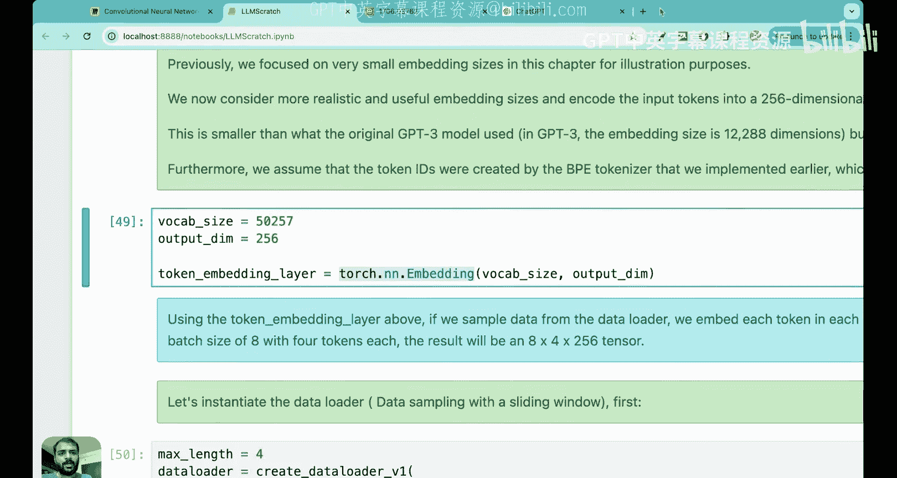
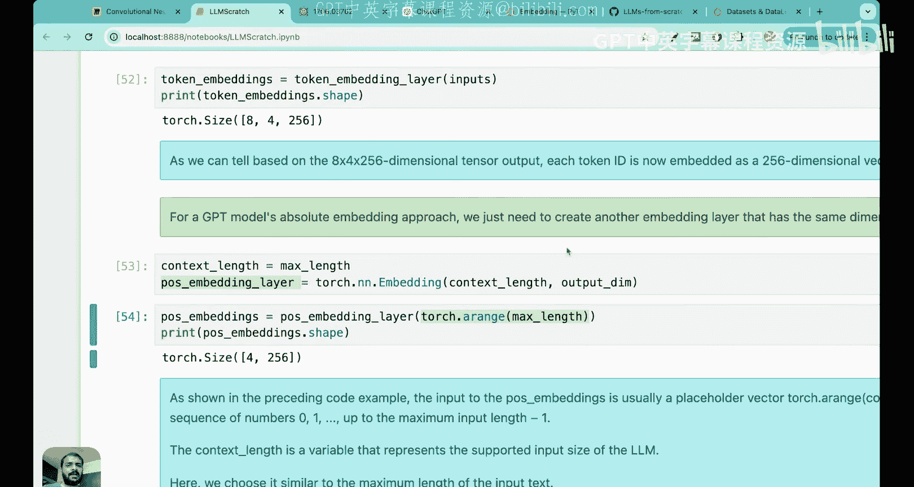

# 11：位置编码的重要性 🧭


在本节课中，我们将要学习一个非常关键的主题：位置编码。我们将首先回顾已学内容，然后深入理解为什么需要位置编码，最后通过一个Python动手编程练习，将位置编码层与我们已创建的词元嵌入层结合起来。

## 概述：为什么需要位置编码？

在上一讲中，我们学习了词元嵌入。词元嵌入是大语言模型训练流程中的第三步，它将词元ID转换为向量，从而保留词元之间的语义关系。然而，仅凭词元嵌入，模型无法获知词元在序列中的位置信息。

考虑以下两个句子：
1.  `The cat sat on the mat.`
2.  `On the mat the cat sat.`

在这两个句子中，词元“cat”的词元ID相同，因此其词元嵌入向量也相同。但“cat”在两个句子中的位置不同，这可能导致句子含义完全不同。因此，除了语义信息，向模型注入词元的位置信息也至关重要。

## 位置编码的类型

位置编码主要有两种类型：绝对位置编码和相对位置编码。

### 绝对位置编码

在绝对位置编码中，为输入序列中的每个位置添加一个唯一的嵌入向量到词元嵌入中，以传达其确切位置。

**核心思想**：最终输入嵌入 = 词元嵌入 + 位置嵌入。

例如，对于句子“The cat sat on the mat”：
*   “cat”的词元嵌入是 `x`。
*   由于“cat”在第二个位置，我们添加位置嵌入 `y`。
*   最终向量为 `x + y`。

对于句子“On the mat the cat sat”：
*   “cat”的词元嵌入同样是 `x`。
*   由于“cat”在第五个位置，我们添加位置嵌入 `z`。
*   最终向量为 `x + z`。

因此，同一个词元“cat”在不同句子中会得到不同的最终输入嵌入，从而编码了位置信息。

**关键点**：位置嵌入向量必须与词元嵌入向量具有相同的维度，因为我们需要将它们相加。

### 相对位置编码

相对位置编码侧重于词元之间的相对位置或距离，而非绝对位置。模型学习的是词元相隔多远的关系。

**优势**：这种编码方式使模型能更好地泛化到不同长度的序列。例如，如果模型在训练时只见过长度为5的序列，但在测试时遇到长度为6的序列，相对位置编码依然可以工作，因为它只关心词元间的相对距离。

**应用场景**：相对位置编码在处理长序列或语言建模任务时可能更有优势，因为在这些任务中，相同的短语可能出现在序列的不同部分。

## 实践中的选择

以下是两种编码方式的比较与选择建议：

*   **绝对位置编码** 在词元的固定顺序至关重要时更受青睐，例如序列生成任务。原始的Transformer论文和OpenAI的GPT模型系列（如GPT-2、GPT-3）都使用了绝对位置编码。
*   **相对位置编码** 更适合处理长序列或语言建模任务。
*   在实践中，绝对位置编码更为常用。GPT模型在训练过程中会优化位置嵌入向量的值，而非使用预设的公式（如Transformer论文中的正弦/余弦函数）。

## 动手实践：实现位置编码

现在，我们将通过代码演示如何为GPT-2风格的模型实现位置编码。我们将使用更现实的嵌入维度（256维）和词汇表大小（50257，类似于GPT-2）。

### 1. 创建词元嵌入层

首先，我们定义一个词元嵌入层。这是一个查找表，将词元ID映射为指定维度的向量。

```python
import torch
import torch.nn as nn




# 定义参数
vocab_size = 50257  # 词汇表大小，类似GPT-2
output_dim = 256    # 嵌入向量维度
context_length = 4  # 上下文长度（最大输入词元数）
batch_size = 8      # 批处理大小

# 创建词元嵌入层
token_embedding_layer = nn.Embedding(vocab_size, output_dim)
print(f"Token embedding layer created: {token_embedding_layer}")
```

### 2. 准备输入数据

我们使用数据加载器来批量处理输入文本。假设我们有一个经过分词的文本数据集，数据加载器会生成形状为 `(batch_size, context_length)` 的输入批次。

```python
# 假设 `data_loader` 是一个已定义好的DataLoader，能 yield 出 (inputs, targets)
# inputs 的形状为 (batch_size, context_length)
for inputs, targets in data_loader:
    # inputs 是一个形状为 (8, 4) 的张量，包含8个序列，每个序列4个词元ID
    print(f"Input batch shape: {inputs.shape}")
    break  # 只看第一个批次
```

### 3. 生成词元嵌入

将输入批次传递给词元嵌入层，为每个词元ID生成256维的向量。

```python
# 获取一个批次的数据
inputs, targets = next(iter(data_loader))

# 生成词元嵌入
token_embeddings = token_embedding_layer(inputs)
print(f"Token embeddings shape: {token_embeddings.shape}")  # 应为 (8, 4, 256)
```

现在，`token_embeddings` 是一个形状为 `(8, 4, 256)` 的三维张量，表示8个序列，每个序列4个词元，每个词元用256维向量表示。

### 4. 创建位置嵌入层

接下来，我们创建位置嵌入层。由于上下文长度是4，我们只需要编码4个位置。

```python
# 创建位置嵌入层
# 行数 = 上下文长度 (需要编码的位置数量)
# 列数 = 输出维度 (必须与词元嵌入维度相同)
pos_embedding_layer = nn.Embedding(context_length, output_dim)
print(f"Positional embedding layer created: {pos_embedding_layer}")
```

### 5. 生成位置嵌入向量

我们需要为位置0, 1, 2, 3生成对应的位置嵌入向量。

```python
# 生成位置索引 [0, 1, 2, 3]
positions = torch.arange(context_length)
print(f"Position indices: {positions}")

# 从位置嵌入层查找对应的向量
position_embeddings = pos_embedding_layer(positions)
print(f"Position embeddings shape: {position_embeddings.shape}")  # 应为 (4, 256)
```

现在，`position_embeddings` 是一个形状为 `(4, 256)` 的张量，包含4个位置对应的256维向量。

### 6. 结合词元嵌入与位置嵌入

最后一步是将位置嵌入加到词元嵌入上，得到最终的输入嵌入。

```python
# 将位置嵌入加到词元嵌入上
# token_embeddings 形状: (8, 4, 256)
# position_embeddings 形状: (4, 256)
# PyTorch通过广播机制自动将 position_embeddings 扩展为 (8, 4, 256) 然后相加
input_embeddings = token_embeddings + position_embeddings
print(f"Final input embeddings shape: {input_embeddings.shape}")  # 应为 (8, 4, 256)
```

**广播机制解释**：PyTorch会将形状为 `(4, 256)` 的 `position_embeddings` 在批次维度（第0维）上复制8次，使其变为 `(8, 4, 256)`，然后与 `token_embeddings` 逐元素相加。这意味着批次中的每个序列都添加了相同的位置嵌入向量。

## 总结

本节课中我们一起学习了位置编码的核心概念与实践方法。

我们首先理解了为什么需要位置编码：词元嵌入虽然捕获了语义，但丢失了词元在序列中的顺序信息。位置编码弥补了这一缺陷。

我们探讨了两种主要的位置编码类型：
*   **绝对位置编码**：为每个绝对位置添加一个唯一的向量。
*   **相对位置编码**：编码词元之间的相对距离关系。

在动手实践部分，我们模拟了为类似GPT-2的模型添加位置编码的过程：
1.  创建了词元嵌入层（`nn.Embedding(vocab_size, output_dim)`）。
2.  使用数据加载器准备输入批次（形状为 `(batch_size, context_length)`）。
3.  生成词元嵌入（形状变为 `(batch_size, context_length, output_dim)`）。
4.  创建位置嵌入层，其行数等于上下文长度（`nn.Embedding(context_length, output_dim)`）。
5.  生成位置嵌入向量（形状为 `(context_length, output_dim)`）。
6.  将两者相加得到最终的输入嵌入，PyTorch的广播机制使加法得以顺利进行。

最终得到的 `input_embeddings` 是形状为 `(batch_size, context_length, output_dim)` 的张量，它同时包含了词元的语义信息和位置信息，可以作为大语言模型的训练输入。




理解这些张量形状的由来（如 `8, 4, 256`）是掌握模型数据流的关键。在后续课程中，我们将使用这些输入嵌入来开始训练大语言模型的核心部分。