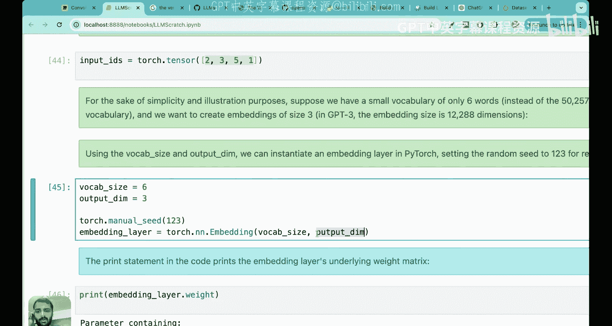
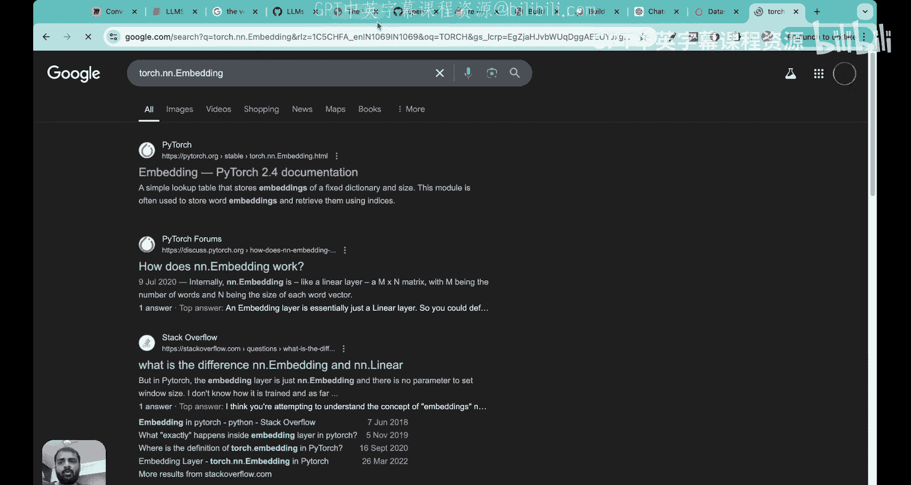
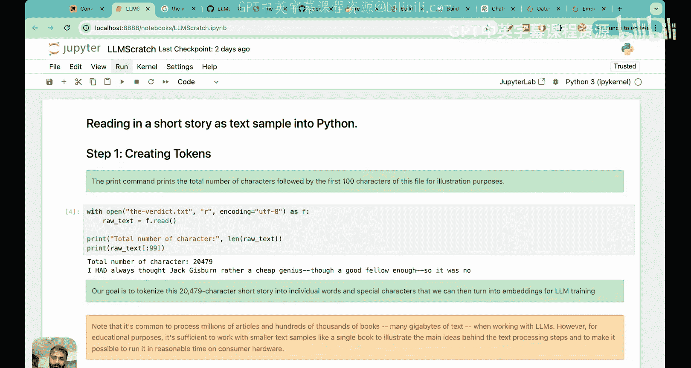

# 12：大语言模型完整的数据预处理流程


在本节课中，我们将要学习构建大语言模型最基础的方面之一：构建数据处理流程。数据预处理是拥有高性能大语言模型的基本构建模块之一。

数据预处理的主要思想是，大语言模型处理的是文本和句子，但原始的文本文件不能直接作为输入。在将数据输入大语言模型之前，需要对其进行处理的整个过程被称为数据预处理。

我们将通过四个基本步骤来回答如何将句子转换为适合大语言模型输入的形式。这四个步骤分别是：分词、词元嵌入、位置嵌入以及最终创建输入嵌入。输入嵌入是词元嵌入和位置嵌入的总和。

## 第一步：分词

上一节我们介绍了数据预处理的重要性，本节中我们来看看数据处理的第一步：分词。分词是将文本分解成更小单元（词元）的过程。我们将从构建一个简单的基于单词的分词器开始。

### 构建基于单词的分词器

首先，我们需要一个数据集。我们将使用一本名为《The Verdict》的书籍作为输入数据。基于单词的分词器旨在将整个文本分解成单词块。

以下是读取数据集并查看其内容的代码：

```python
with open('the_verdict.txt', 'r', encoding='utf-8') as f:
    raw_text = f.read()

print(f"总字符数: {len(raw_text)}")
print(f"前100个字符: {raw_text[:100]}")
```

接下来，我们需要将文本拆分为词元。我们将使用Python的正则表达式库。

```python
import re

# 初始尝试：按空白字符分割
sample_text = "Hello, world. This is a test."
tokens = re.split(r'(\s)', sample_text)
print(tokens)
```

这种方法的问题在于，标点符号和单词没有被分开，并且空白字符也被保留为单独的词元。我们需要改进。

以下是改进后的分词方法：

```python
# 改进方法：在特殊字符和空白处分割，并移除空白词元
sample_text = "Hello, world. This is a test."
split_tokens = re.split(r'([,.:;?_!"()\']|--|\s)', sample_text)
tokens = [item for item in split_tokens if item.strip() != '']
print(tokens)
```

现在，我们将这个逻辑应用到整个数据集上。

```python
# 对整个数据集进行分词
preprocessed = re.split(r'([,.:;?_!"()\']|--|\s)', raw_text)
preprocessed = [item for item in preprocessed if item.strip() != '']

print(f"前30个词元: {preprocessed[:30]}")
print(f"总词元数: {len(preprocessed)}")
```

### 构建词汇表与词元ID

计算机不理解单词，因此我们需要将词元转换为数字ID。这通过构建词汇表来实现。

以下是构建词汇表的步骤：

```python
# 获取所有唯一词元并排序
all_tokens = sorted(set(preprocessed))
vocab_size = len(all_tokens)
print(f"词汇表大小: {vocab_size}")

# 创建词元到ID的映射字典
vocab = {token: idx for idx, token in enumerate(all_tokens)}
# 打印前50个映射项
print(list(vocab.items())[:50])
```

### 实现分词器类

接下来，我们实现一个分词器类，它包含编码（将文本转换为ID）和解码（将ID转换回文本）的方法。

以下是分词器类的实现：

```python
class SimpleTokenizerV1:
    def __init__(self, vocab):
        self.str_to_int = vocab
        self.int_to_str = {idx: token for token, idx in vocab.items()}

    def encode(self, text):
        preprocessed = re.split(r'([,.:;?_!"()\']|--|\s)', text)
        preprocessed = [item for item in preprocessed if item.strip() != '']
        ids = [self.str_to_int[token] for token in preprocessed]
        return ids

    def decode(self, ids):
        text = " ".join([self.int_to_str[idx] for idx in ids])
        # 修复标点符号前的空格
        text = re.sub(r'\s+([,.?!"()\'])', r'\1', text)
        return text

# 测试分词器
tokenizer = SimpleTokenizerV1(vocab)
text = "It was the last he painted, you know, Mrs. Gisborne said with pardonable pride."
ids = tokenizer.encode(text)
print(f"编码后的ID: {ids}")
decoded_text = tokenizer.decode(ids)
print(f"解码后的文本: {decoded_text}")
```

### 处理未知词元和特殊上下文词元

基于单词的分词器的一个主要问题是无法处理词汇表之外的单词。为了解决这个问题，我们需要添加特殊上下文词元，如未知词元和文本结束词元。

以下是添加特殊词元并修改分词器的步骤：

```python
# 添加特殊词元到词汇表
all_tokens_extended = all_tokens + ["<|endoftext|>", "<|unk|>"]
vocab_extended = {token: idx for idx, token in enumerate(all_tokens_extended)}
print(f"扩展后词汇表大小: {len(vocab_extended)}")
print(list(vocab_extended.items())[-2:])

class SimpleTokenizerV2:
    def __init__(self, vocab):
        self.str_to_int = vocab
        self.int_to_str = {idx: token for token, idx in vocab.items()}

    def encode(self, text):
        preprocessed = re.split(r'([,.:;?_!"()\']|--|\s)', text)
        preprocessed = [item for item in preprocessed if item.strip() != '']
        ids = []
        for token in preprocessed:
            if token in self.str_to_int:
                ids.append(self.str_to_int[token])
            else:
                ids.append(self.str_to_int["<|unk|>"])
        return ids

    def decode(self, ids):
        text = " ".join([self.int_to_str[idx] for idx in ids])
        text = re.sub(r'\s+([,.?!"()\'])', r'\1', text)
        return text

# 测试改进后的分词器
tokenizer_v2 = SimpleTokenizerV2(vocab_extended)
text1 = "Hello, do you like tea?"
text2 = "In the sunlit terraces of the palace."
combined_text = text1 + " <|endoftext|> " + text2
ids_v2 = tokenizer_v2.encode(combined_text)
print(f"编码后的ID (含特殊词元): {ids_v2}")
decoded_text_v2 = tokenizer_v2.decode(ids_v2)
print(f"解码后的文本: {decoded_text_v2}")
```

## 第二步：字节对编码分词器

上一节我们构建了基于单词的分词器，本节中我们来看看GPT模型实际使用的分词方法：字节对编码。这是一种基于子词的分词方法。

基于单词的分词器存在词汇量大、无法捕捉词根相似性等问题。基于字符的分词器词汇量小，但丢失了单词的语义信息。字节对编码结合了二者的优点。

### 字节对编码原理

字节对编码算法最初用于数据压缩。在分词中，它将频繁出现的字符对合并为新的子词单元，从而构建一个包含子词、单词甚至字符的词汇表。

以下是字节对编码的核心思想：
1.  不将常用词拆分为更小的子词。
2.  将罕见词拆分为有意义的子词，以保留词根信息。

例如，“boy”和“boys”。“boy”是常见词，保留为一个词元。“boys”是罕见词，拆分为“boy”和“s”。这样，模型就能学习到“boy”和“boys”之间的语义关联。

### 使用`tiktoken`库实现BPE分词器

OpenAI提供了`tiktoken`库，其中包含了GPT模型使用的BPE分词器。

以下是使用`tiktoken`的示例：

```python
import tiktoken

# 加载GPT-2使用的分词器
tokenizer = tiktoken.get_encoding("gpt2")

text = "Hello, do you like tea? In the sunlit terraces of some unknown place."
# 编码
ids = tokenizer.encode(text, allowed_special={"<|endoftext|>"})
print(f"编码后的ID: {ids}")
print(f"ID数量: {len(ids)}")

# 解码
decoded_text = tokenizer.decode(ids)
print(f"解码后的文本: {decoded_text}")

# 查看词汇表大小
print(f"GPT-2词汇表大小: {tokenizer.n_vocab}")
```

BPE分词器的优势在于：
1.  词汇表大小适中（例如GPT-2约5万）。
2.  能通过子词保留词根语义。
3.  能自动处理词汇表外的单词，无需特殊未知词元。

## 第三步：创建输入-目标对与数据加载器

在进入嵌入层之前，我们需要理解如何为语言模型准备训练数据。语言模型的核心任务是预测下一个词元，因此我们需要从文本中创建输入序列和对应的目标序列。

### 理解上下文大小与步幅

上下文大小决定了模型一次能看到的词元数量。步幅决定了从一个输入序列到下一个输入序列的滑动窗口移动距离。

以下是创建输入-目标对的思路：

```python
# 假设上下文大小为4，步幅为1
context_size = 4
stride = 1
encoded_text = [...] # 经过BPE编码的ID列表

input_chunks = []
target_chunks = []

for i in range(0, len(encoded_text) - context_size, stride):
    input_chunk = encoded_text[i:i+context_size]
    target_chunk = encoded_text[i+1:i+context_size+1] # 输入偏移一位即为目标
    input_chunks.append(input_chunk)
    target_chunks.append(target_chunk)

# 转换为张量
import torch
inputs = torch.tensor(input_chunks)
targets = torch.tensor(target_chunks)
```

### 使用PyTorch数据加载器

为了高效处理数据，我们使用PyTorch的`Dataset`和`DataLoader`。

以下是创建自定义数据集和数据加载器的示例：

```python
from torch.utils.data import Dataset, DataLoader

class TextDataset(Dataset):
    def __init__(self, text, tokenizer, context_size=4, stride=1):
        self.tokenizer = tokenizer
        self.context_size = context_size
        self.stride = stride
        self.encoded_text = tokenizer.encode(text, allowed_special={"<|endoftext|>"})
        self.inputs, self.targets = self._create_sequences()

    def _create_sequences(self):
        inputs, targets = [], []
        for i in range(0, len(self.encoded_text) - self.context_size, self.stride):
            inputs.append(self.encoded_text[i:i+self.context_size])
            targets.append(self.encoded_text[i+1:i+self.context_size+1])
        return torch.tensor(inputs), torch.tensor(targets)

    def __len__(self):
        return len(self.inputs)

    def __getitem__(self, idx):
        return self.inputs[idx], self.targets[idx]

# 创建数据集和数据加载器
dataset = TextDataset(raw_text, tokenizer, context_size=4, stride=1)
dataloader = DataLoader(dataset, batch_size=8, shuffle=True)

# 查看一个批次的数据
for batch_inputs, batch_targets in dataloader:
    print(f"输入批次形状: {batch_inputs.shape}") # (8, 4)
    print(f"目标批次形状: {batch_targets.shape}") # (8, 4)
    print(f"第一批次输入:\n{batch_inputs[0]}")
    print(f"第一批次目标:\n{batch_targets[0]}")
    break
```

## 第四步：词元嵌入

上一节我们准备好了输入数据，本节中我们来看看如何将词元ID转换为有语义信息的向量表示，即词元嵌入。词元嵌入将离散的词元ID映射到连续的向量空间，使语义相似的词在向量空间中距离更近。

### 为什么需要词元嵌入？

直接使用词元ID或独热编码无法捕捉单词之间的语义关系。例如，“cat”和“kitten”语义相关，但它们的ID是任意的，模型无法从ID中学习到这种关联。

词元嵌入通过一个可学习的查找表（嵌入层）将每个词元ID映射为一个固定维度的向量。在训练过程中，模型会调整这些向量，使语义相似的词具有相似的向量表示。

### 实现词元嵌入层

在PyTorch中，我们可以使用`nn.Embedding`层来实现词元嵌入。

以下是创建和使用嵌入层的示例：

```python
import torch.nn as nn

# 假设词汇表大小和向量维度（以GPT-2为例）
vocab_size = 50257  # GPT-2词汇表大小
embedding_dim = 256 # 嵌入向量维度





# 创建嵌入层
token_embedding_layer = nn.Embedding(vocab_size, embedding_dim)
print(f"嵌入层权重矩阵形状: {token_embedding_layer.weight.shape}") # (50257, 256)

# 从数据加载器获取一个批次输入
batch_inputs, _ = next(iter(dataloader)) # 形状: (8, 4)

# 将输入ID转换为嵌入向量
token_embeddings = token_embedding_layer(batch_inputs) # 形状: (8, 4, 256)
print(f"词元嵌入张量形状: {token_embeddings.shape}")
```

嵌入层本质上是一个查找表。当传入一个形状为`(batch_size, context_size)`的ID张量时，它会返回一个形状为`(batch_size, context_size, embedding_dim)`的嵌入向量张量。

## 第五步：位置嵌入

词元嵌入包含了语义信息，但缺少了词元在序列中位置的信息。对于语言模型来说，“猫坐在垫子上”和“垫子上坐着猫”含义不同，但词元嵌入可能相同。位置嵌入的作用就是为模型提供词元的顺序信息。

### 绝对位置嵌入

GPT模型使用绝对位置嵌入。它为序列中的每个位置分配一个唯一的嵌入向量，然后将其加到对应位置的词元嵌入上。

以下是创建位置嵌入层的示例：

```python
# 上下文大小（序列长度）
context_size = 4

# 创建位置嵌入层，维度需与词元嵌入一致
pos_embedding_layer = nn.Embedding(context_size, embedding_dim)

# 生成位置ID (0, 1, 2, 3)
position_ids = torch.arange(context_size, dtype=torch.long).unsqueeze(0) # 形状: (1, 4)

# 获取位置嵌入向量
position_embeddings = pos_embedding_layer(position_ids) # 形状: (1, 4, 256)
print(f"位置嵌入张量形状: {position_embeddings.shape}")
```

### 创建输入嵌入

输入嵌入是词元嵌入和位置嵌入的总和，它将作为大语言模型的最终输入。

以下是计算输入嵌入的示例：

```python
# 将位置嵌入广播到与词元嵌入相同的批次大小
# position_embeddings: (1, 4, 256) -> 广播为 (8, 4, 256)
# token_embeddings: (8, 4, 256)

input_embeddings = token_embeddings + position_embeddings # 形状: (8, 4, 256)
print(f"输入嵌入张量形状: {input_embeddings.shape}")
```

现在，`input_embeddings` 张量包含了每个词元的语义信息和位置信息，可以直接输入到Transformer模型中进行训练。

## 总结

本节课中我们一起学习了构建大语言模型完整的数据预处理流程。我们涵盖了以下四个核心步骤：

1.  **分词**：将原始文本分解为词元。我们学习了基于单词、基于字符的分词器，并重点介绍了GPT模型使用的基于子词的**字节对编码**方法。
2.  **创建输入-目标对**：为了训练语言模型预测下一个词元，我们从文本中构建了输入序列和对应的目标序列，并使用了PyTorch的`DataLoader`进行高效批处理。
3.  **词元嵌入**：通过`nn.Embedding`层将词元ID转换为连续的向量表示，从而捕捉单词的语义信息。公式表示为：`TokenEmbedding = EmbeddingLayer(TokenIDs)`。
4.  **位置嵌入**：通过另一个`nn.Embedding`层为序列中的每个位置生成向量，为模型提供词元顺序信息。**输入嵌入**是词元嵌入和位置嵌入的总和，即 `InputEmbeddings = TokenEmbeddings + PositionEmbeddings`。




这个流程将原始文本转换成了富含语义和位置信息的数值化张量，为大语言模型的训练做好了准备。理解这个管道是深入理解LLM如何工作的关键第一步。