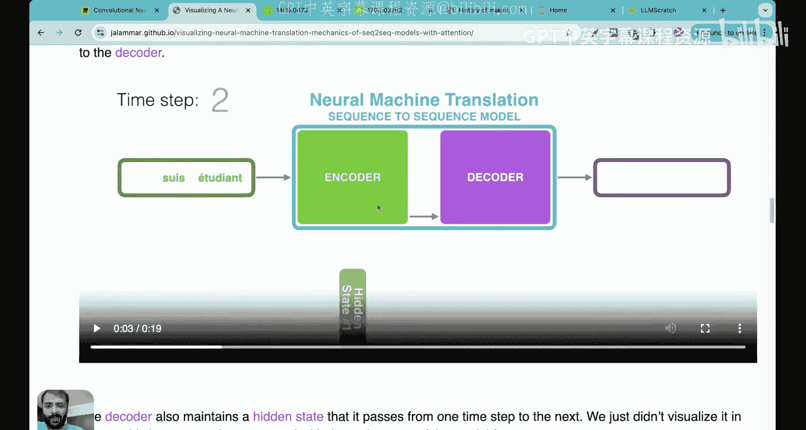
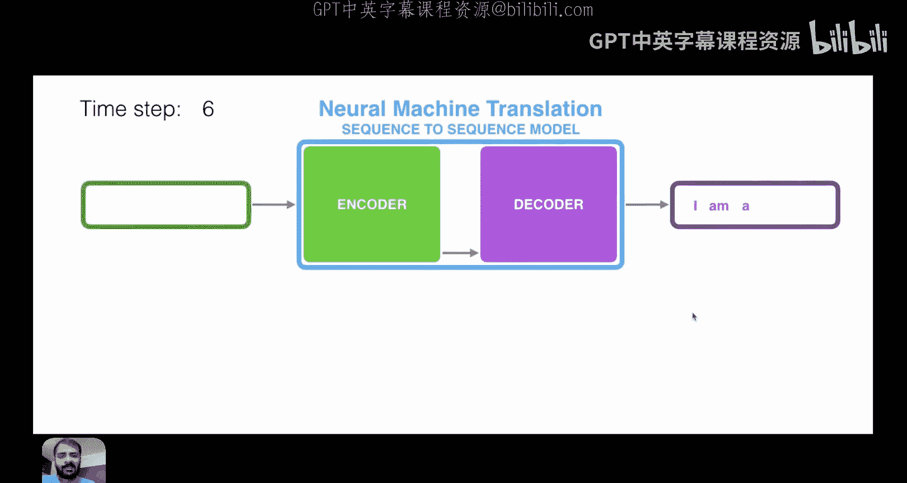
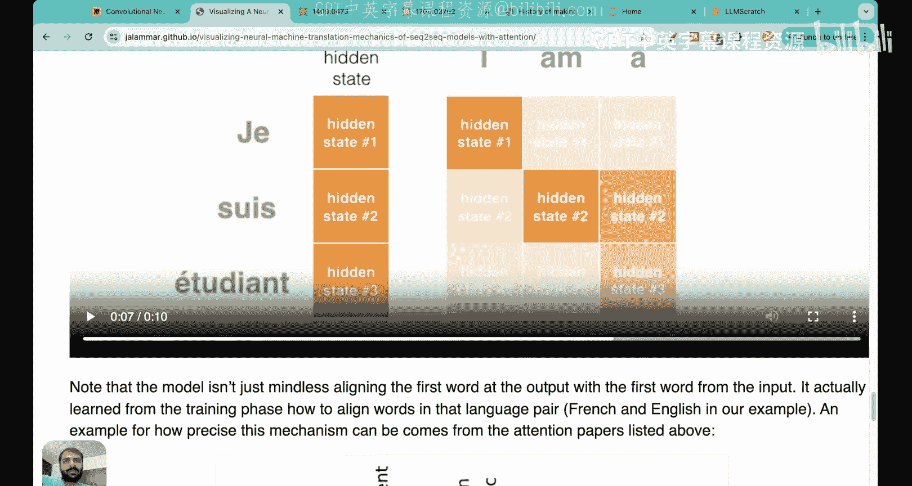
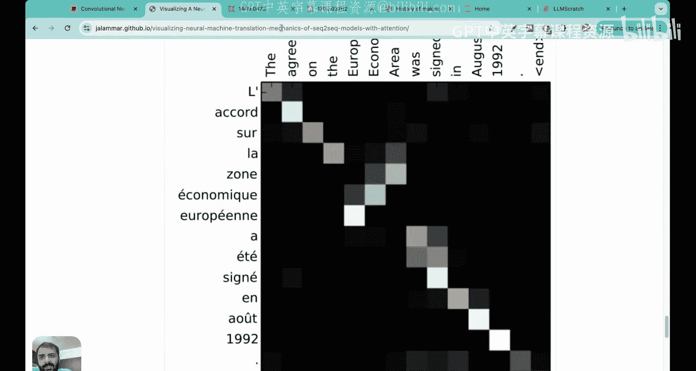
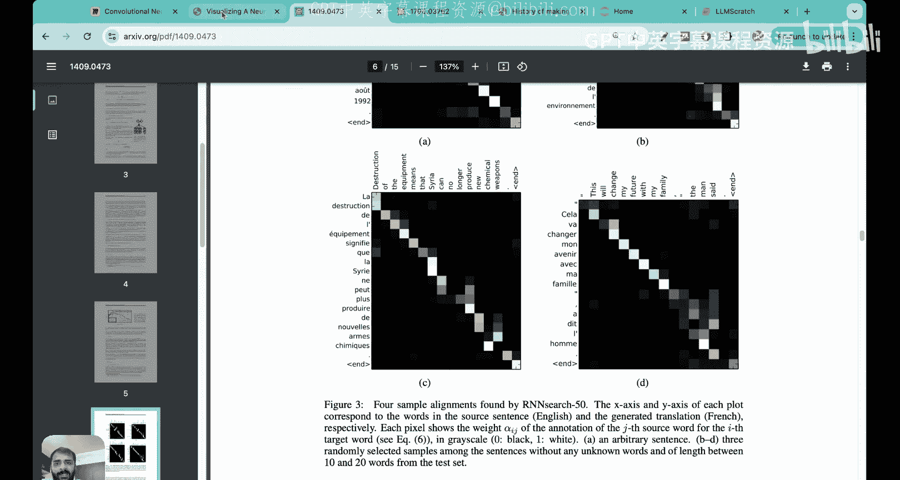
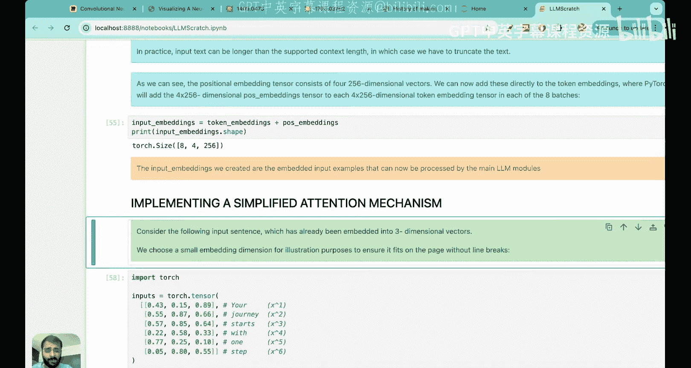

# 13：注意力机制导论 🧠


在本节课中，我们将要学习大语言模型（LLM）中一个核心且强大的概念——注意力机制。我们将了解它为何被需要，它是如何从历史模型（如循环神经网络）的局限性中发展而来的，以及它在现代LLM架构中的核心地位。

## 课程概述

到目前为止，在本系列课程中，我们已经详细探讨了构建大语言模型的第一阶段——数据准备与采样，涵盖了词嵌入、分词、字节对编码和位置编码等主题。现在，是时候转向第一阶段中的第二个核心构建模块：**注意力机制**。

如果把Transformer模型比作驱动LLM的“汽车”，那么注意力机制就是它的“引擎”。正是这个机制赋予了大型语言模型强大的能力。由于这是一个至关重要的概念，我们将通过一系列讲座来深入讲解。本节课将作为基础概述，介绍注意力机制是什么、为什么需要它，以及它的不同类型。

## 为什么需要注意力机制？

为了直观理解“注意力”这个名字的由来以及它要解决的问题，让我们看一个例子。

假设你是一个像GPT这样的大语言模型，收到了这样一个句子：
> “The cat that was sitting on the mat which was next to the dog jumped.”

作为人类，我们可以分析出：有一只猫，它坐在一块垫子上，垫子挨着一只狗，然后这只猫跳了起来。对于LLM来说，这个句子有点复杂，因为它包含了**长距离依赖关系**。模型需要理解的核心是：主语“猫”执行的动作是“跳”。

因此，当模型处理“猫”这个词时，它应该对“跳”这个词给予最多的“关注”。如果没有注意力机制，模型可能难以捕捉这种长距离关联，可能会错误地认为“狗跳了”或者只理解到“猫在垫子上”。这就是我们需要注意力机制的根本原因：它使模型能够有选择地关注输入序列中不同部分的信息，从而更好地理解上下文和长距离依赖。

## 注意力机制的发展历程

为了更好地理解注意力机制的价值，我们需要回顾一下历史，看看在它出现之前，模型是如何处理序列任务的（如机器翻译），以及它们存在哪些局限性。

### 循环神经网络（RNN）与编码器-解码器架构

在Transformer出现之前，处理序列任务（如机器翻译）的主流架构是**循环神经网络（RNN）**，它通常与**编码器-解码器**架构结合使用。

*   **编码器**：接收输入序列（如德语句子），逐步处理每个词，并维护一个**隐藏状态**。这个隐藏状态在每个时间步都会更新，旨在捕获到目前为止已处理序列的“记忆”或上下文。
*   **解码器**：接收编码器产生的**最终隐藏状态**（也称为上下文向量），并基于它逐步生成输出序列（如英译句子）。

以下是RNN编码器-解码器的工作流程示意图：

```
输入序列: [词1, 词2, 词3, 词4]
编码器:
    时间步1: 隐藏状态1 = f(词1, 初始隐藏状态)
    时间步2: 隐藏状态2 = f(词2, 隐藏状态1)
    时间步3: 隐藏状态3 = f(词3, 隐藏状态2)
    时间步4: 隐藏状态4（最终上下文向量）= f(词4, 隐藏状态3)
解码器:
    基于“最终上下文向量”生成输出词1
    基于输出词1和更新后的状态生成输出词2
    ...
```

### RNN的局限性：信息瓶颈与上下文丢失



RNN架构存在一个关键问题，这直接催生了注意力机制的诞生。



**核心问题在于：解码器只能访问编码器传递过来的最后一个隐藏状态（上下文向量）。**

这意味着，无论输入序列有多长，编码器都必须将所有信息压缩到这一个固定长度的向量中。对于长句子或复杂结构，这会造成**信息瓶颈**，导致**上下文丢失**。解码器无法直接访问输入序列中较早时间步的隐藏状态，因此在生成特定输出词时，难以回顾并重点关注输入序列中与之高度相关的特定部分。

以我们的长例句为例，当解码器需要生成对应“jumped”的词时，它最需要关注的是输入中的“cat”。但在标准RNN中，解码器只有一个包含了整个句子信息的混合向量，很难从中精准地提取出“cat”和“jumped”之间的强关联。这就是RNN处理长距离依赖能力不足的原因。

### 注意力机制的诞生：Bahdanau注意力

2014年，研究人员在论文《Neural Machine Translation by Jointly Learning to Align and Translate》中提出了**注意力机制**（常被称为Bahdanau注意力），以解决上述问题。

**核心思想：允许解码器在每一步生成输出时，有选择地“回顾”编码器对所有输入词计算出的全部隐藏状态，而不仅仅是最后一个。**

具体来说：
1.  编码器依然为每个输入词生成一个隐藏状态。
2.  当解码器要生成当前输出词时，它会计算一个**注意力权重**分布。这个分布决定了在生成当前词时，应该对编码器的**每一个**隐藏状态给予多少“注意力”。
3.  解码器将所有隐藏状态按注意力权重进行加权求和，得到一个**上下文向量**。这个向量动态地聚焦于当前最相关的输入信息。
4.  解码器结合这个动态生成的上下文向量和自身状态，来产生输出。

用伪代码表示这一过程：
```python
# 假设编码器隐藏状态为：encoder_states = [h1, h2, ..., hn]
# 解码器当前状态为：decoder_state

# 计算注意力分数（衡量每个编码器状态与当前解码状态的相关性）
attention_scores = [score(decoder_state, hi) for hi in encoder_states]

# 将分数转换为权重（例如使用softmax）
attention_weights = softmax(attention_scores)

# 计算加权和的上下文向量
context_vector = sum(attention_weights[i] * encoder_states[i] for i in range(n))

# 解码器使用context_vector生成输出
output = generate(decoder_state, context_vector)
```

这种机制使得模型能够动态地将输出与输入对齐。例如，在翻译时，生成英文“jumped”时，模型可以学会将高注意力权重分配给输入德语句子中的“sprang”和“Katze”（猫），即使它们在序列中相隔很远。

### 从注意力到Transformer与自注意力

2017年，革命性的论文《Attention Is All You Need》提出了 **Transformer** 架构。它完全摒弃了RNN，将注意力机制作为核心构建块，并引入了 **自注意力（Self-Attention）**。

*   **自注意力**：与传统注意力（关注两个不同序列间的关系，如源语言和目标语言）不同，自注意力机制让序列中的**每一个位置**都能关注到**同一序列中的所有其他位置**。它用于学习序列内部元素之间的关系。



例如，在处理句子“The cat jumped”时，自注意力机制会计算“cat”与“The”、“jumped”之间的关联强度，从而更好地理解“cat”是主语，并与动作“jumped”紧密相关。这种对序列内部结构的强大建模能力，是Transformer及其后续大语言模型成功的关键。





## 注意力机制的类型与学习路线

为了循序渐进地掌握这个复杂概念，我们将在后续课程中按照以下顺序深入讲解并编码实现：

1.  **简化自注意力**：最基础的形式，理解注意力计算的核心思想。
2.  **自注意力**：引入可训练的权重矩阵（Query, Key, Value），构成实际使用机制的基础。
3.  **因果注意力**：一种特殊的自注意力，用于语言建模。它确保在预测下一个词时，只能关注当前词及之前的词，屏蔽未来信息。
4.  **多头注意力**：这是现代LLM（如GPT）中实际使用的模块。它将多个并行的因果注意力头组合在一起，允许模型同时从不同的表示子空间关注信息，从而捕获更丰富的关系。

## 历史脉络总结

以下是注意力机制及相关模型发展的一个简要时间线，帮助我们建立整体认知：

*   **1980年代**：循环神经网络（RNN）被提出，引入隐藏状态来维护记忆。
*   **1997年**：长短期记忆网络（LSTM）被提出，通过门控机制缓解RNN的梯度消失问题，更好地处理长序列。
*   **2014年**：Bahdanau等人提出用于机器翻译的注意力机制，使解码器能访问所有编码器状态。
*   **2017年**：Transformer架构论文发表，核心是自注意力机制，完全摒弃RNN，在多项任务上取得突破。
*   **现今**：基于Transformer和自注意力的大语言模型（如GPT系列）成为主流。

## 本节课总结

在本节课中，我们一起学习了注意力机制的导论。我们首先通过一个例子理解了为什么LLM需要“注意力”来捕捉长距离依赖。然后，我们回顾了历史，深入分析了RNN编码器-解码器架构在处理长序列时的核心缺陷——信息瓶颈和上下文丢失，这源于解码器只能访问单一的最终隐藏状态。

接着，我们看到了2014年提出的注意力机制如何优雅地解决了这个问题：它允许解码器动态地、有选择地关注输入序列的所有部分。最后，我们了解到这项技术如何进一步演变为Transformer模型核心的**自注意力**机制，并概览了我们将要深入学习的几种注意力类型：简化自注意力、自注意力、因果注意力和多头注意力。




理解注意力机制是理解现代大语言模型如何工作的关键。在接下来的课程中，我们将从最基础的简化自注意力开始，一步步用代码实现这些概念，彻底掌握这个驱动AI革命的“引擎”。