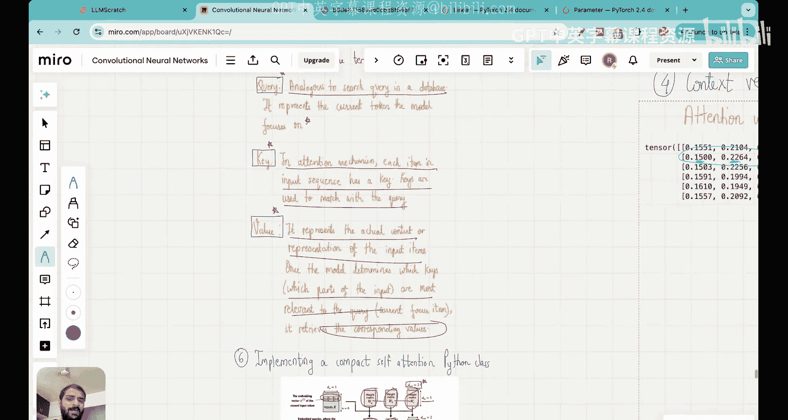

# 14：使用键、查询和值矩阵编写自注意力机制


在本节课中，我们将学习如何实现一个带有可训练权重的自注意力机制。我们将深入理解键、查询和值这三个核心概念，并了解为什么这种自注意力机制也被称为缩放点积注意力。通过结合数学理论、直观解释和代码实现，我们将一步步构建出GPT等大语言模型中使用的注意力机制的核心部分。

## 概述

上一节课我们实现了一个没有可训练权重的简化版自注意力机制。我们以句子“your journey starts with one step”为例，展示了如何将每个词元的嵌入向量转换为上下文向量。我们通过计算查询向量与所有输入嵌入向量的点积得到注意力分数，然后将其归一化为注意力权重，最后通过加权求和得到上下文向量。整个过程是固定的，没有进行任何训练。

本节课，我们将引入可训练的权重矩阵，这是真实大语言模型（如GPT）中实际使用的机制。我们将学习如何将输入嵌入转换为键、查询和值向量，如何计算注意力分数和权重，并最终得到上下文向量。理解这些步骤是掌握Transformer架构的关键。

## 从输入嵌入到键、查询和值向量

首先，我们需要将输入嵌入向量转换为三个新的表示：键、查询和值。这是通过三个可训练的权重矩阵实现的。

我们的输入是一个矩阵，包含六个词元（your, journey, starts, with, one, step），每个词元用一个三维向量表示。因此，输入矩阵 `X` 的维度是 `6 x 3`。

我们将使用三个可训练的权重矩阵：
*   **查询权重矩阵 `W_q`**：维度为 `3 x 2`
*   **键权重矩阵 `W_k`**：维度为 `3 x 2`
*   **值权重矩阵 `W_v`**：维度为 `3 x 2`

这些矩阵的初始值是随机的，将在模型训练过程中通过反向传播进行优化。它们的作用是将输入从三维空间投影到二维空间（在本例中）。通过矩阵乘法，我们得到三个新的矩阵：

*   **查询矩阵 `Q`**：`Q = X * W_q`，维度为 `6 x 2`
*   **键矩阵 `K`**：`K = X * W_k`，维度为 `6 x 2`
*   **值矩阵 `V`**：`V = X * W_v`，维度为 `6 x 2`

现在，每个词元都对应一个二维的查询向量、键向量和值向量。在后续计算中，我们将不再直接使用原始输入嵌入 `X`，而是使用 `Q`、`K`、`V`。

以下是实现这一步骤的代码示例：

```python
import torch
import torch.nn as nn

# 定义输入：6个词元，每个词元3维嵌入
inputs = torch.randn(6, 3)  # 形状: (6, 3)

# 定义输入和输出维度
d_in = 3  # 输入嵌入维度
d_out = 2 # 查询/键/值的目标维度

# 初始化可训练的权重矩阵（使用 nn.Parameter）
W_query = nn.Parameter(torch.randn(d_in, d_out))
W_key = nn.Parameter(torch.randn(d_in, d_out))
W_value = nn.Parameter(torch.randn(d_in, d_out))

# 计算查询、键、值矩阵
queries = inputs @ W_query  # 形状: (6, 2)
keys = inputs @ W_key       # 形状: (6, 2)
values = inputs @ W_value   # 形状: (6, 2)
```

## 计算注意力分数

在获得了查询和键矩阵后，下一步是计算注意力分数。注意力分数衡量了对于一个给定的查询（例如，“journey”），应该给予其他每个词的键多少“关注度”。

直观上，我们可以将查询向量视为当前模型关注的焦点。通过计算查询向量与所有键向量的点积，我们可以知道它们之间的对齐程度。点积越大，表示两个向量方向越一致，相关性越高。

具体来说，对于第二个查询（对应“journey”），我们需要计算它与所有6个键的点积，得到6个注意力分数。这可以通过矩阵运算高效完成：`注意力分数 = Q * K^T`。

这里，`Q` 是 `6 x 2` 矩阵，`K^T` 是 `2 x 6` 矩阵，相乘后得到 `6 x 6` 的注意力分数矩阵 `attn_scores`。这个矩阵的每一行对应一个查询与所有键的注意力分数。

```python
# 计算注意力分数矩阵
attn_scores = queries @ keys.T  # 形状: (6, 6)
# 例如，attn_scores[1] 包含了“journey”的查询与所有键的分数
```

## 计算注意力权重

直接得到的注意力分数存在两个问题：1）它们没有归一化，不便于解释；2）数值可能过大，导致后续计算不稳定。因此，我们需要对其进行缩放和归一化，得到注意力权重。

首先，我们将注意力分数除以键向量维度的平方根（本例中为 `sqrt(2)`）。这一步称为“缩放”，是“缩放点积注意力”名称的由来。缩放主要有两个原因：
1.  **稳定学习**：防止点积结果过大，导致Softmax函数输出过于“尖锐”（即概率质量过度集中在某一个值上），影响模型训练的稳定性。
2.  **控制方差**：理论上，当查询和键向量的元素服从均值为0、方差为1的分布时，它们的点积的方差会随着维度 `d_k` 线性增长。除以 `sqrt(d_k)` 可以将点积的方差重新缩放回1左右，有利于梯度流动和模型收敛。

缩放之后，我们对每一行应用Softmax函数，确保每一行的值之和为1，并且所有值都在0到1之间。这样得到的矩阵就是**注意力权重矩阵** `attn_weights`。现在，我们可以直观地解释每一行：例如，第二行表示当查询是“journey”时，模型应该分配给“your”、“journey”、“starts”等词元的注意力百分比。

```python
import torch.nn.functional as F

d_k = keys.shape[-1]  # 键的维度，本例中为2
# 缩放并应用Softmax得到注意力权重
attn_weights = F.softmax(attn_scores / d_k**0.5, dim=-1) # 形状: (6, 6)
# 现在 attn_weights[1] 各行之和为1，表示注意力分布
```

## 计算上下文向量

现在，我们来到了最后一步：计算上下文向量。注意力权重告诉我们每个词元的重要性，而值向量 `V` 包含了每个词元的内容信息。上下文向量就是这些值向量的加权和，权重即为我们刚刚计算出的注意力权重。

具体来说，对于“journey”的上下文向量，我们将“your”、“journey”、“starts”等词元的值向量，分别乘以它们对应的注意力权重（来自 `attn_weights` 的第二行），然后将所有这些加权后的向量相加。结果就是一个新的二维向量，它不仅仅编码了“journey”本身的语义，还编码了它与句子中所有其他词元的关系信息，因此被称为“ enriched embedding”。

在矩阵形式上，这非常简单：`上下文向量矩阵 = attn_weights * V`。因为 `attn_weights` 是 `6 x 6`，`V` 是 `6 x 2`，相乘后得到 `6 x 2` 的上下文向量矩阵，其中每一行就是对应词元的上下文向量。

```python
# 计算上下文向量矩阵
context_vecs = attn_weights @ values  # 形状: (6, 2)
# context_vecs[1] 就是“journey”的上下文向量
```

## 整合为自注意力类

为了代码的整洁和可重用性，我们将上述所有步骤整合到一个PyTorch模块中。下面是一个自注意力机制的实现类：

```python
class SelfAttentionV1(nn.Module):
    def __init__(self, d_in, d_out):
        super().__init__()
        # 初始化可训练的权重矩阵
        self.W_query = nn.Parameter(torch.randn(d_in, d_out))
        self.W_key = nn.Parameter(torch.randn(d_in, d_out))
        self.W_value = nn.Parameter(torch.randn(d_in, d_out))

    def forward(self, x):
        # 1. 计算键、查询、值
        keys = x @ self.W_key
        queries = x @ self.W_query
        values = x @ self.W_value
        # 2. 计算注意力分数
        attn_scores = queries @ keys.T
        # 3. 计算注意力权重（缩放 + Softmax）
        attn_weights = F.softmax(
            attn_scores / keys.shape[-1]**0.5, dim=-1
        )
        # 4. 计算上下文向量
        context_vecs = attn_weights @ values
        return context_vecs

# 使用示例
sa_v1 = SelfAttentionV1(d_in=3, d_out=2)
context_vecs = sa_v1(inputs)
print(context_vecs.shape)  # 输出: torch.Size([6, 2])
```

在实践中，我们更常用 `nn.Linear` 层（将偏置设为False）来代替手动定义 `nn.Parameter`，因为 `nn.Linear` 内置了更优化的权重初始化方案。

```python
class SelfAttentionV2(nn.Module):
    def __init__(self, d_in, d_out):
        super().__init__()
        # 使用 nn.Linear 层，bias=False 表示只做矩阵乘法
        self.W_query = nn.Linear(d_in, d_out, bias=False)
        self.W_key = nn.Linear(d_in, d_out, bias=False)
        self.W_value = nn.Linear(d_in, d_out, bias=False)

    def forward(self, x):
        keys = self.W_key(x)
        queries = self.W_query(x)
        values = self.W_value(x)
        attn_scores = queries @ keys.T
        attn_weights = F.softmax(
            attn_scores / keys.shape[-1]**0.5, dim=-1
        )
        context_vecs = attn_weights @ values
        return context_vecs
```

## 核心概念：查询、键、值的直观理解

*   **查询**：可以类比数据库中的搜索查询。它代表模型当前正在关注的词元（例如，“journey”）。
*   **键**：可以类比数据库中的索引键。输入序列中的每个词元都有一个键，用于与查询进行匹配，计算相似度（注意力分数）。
*   **值**：可以类比数据库中索引对应的实际数据。它包含了词元本身的表示内容。一旦模型通过查询和键确定了哪些词元是相关的，就会提取这些词元对应的值，并按照注意力权重进行组合，形成上下文向量。

## 总结

本节课中，我们一起学习了自注意力机制的核心实现。我们从输入嵌入开始，通过三个可训练的权重矩阵将其转换为查询、键和值向量。接着，我们通过查询和键的点积计算注意力分数，并通过缩放和Softmax归一化得到注意力权重。最后，我们使用注意力权重对值向量进行加权求和，得到了富含上下文信息的上下文向量。

我们还将整个过程封装成了一个PyTorch模块。理解这个流程是掌握Transformer模型的基础。下一节课，我们将学习因果注意力，这是一种修改，用于防止模型在生成文本时“看到”未来的信息。




