# 16：因果自注意力机制

在本节课中，我们将要学习因果自注意力机制，这是构建现代大语言模型（如GPT）的关键组件。我们将从回顾自注意力机制开始，然后深入探讨因果注意力的概念、必要性及其实现方法，最后通过Python代码从零开始实现一个完整的因果注意力类。

## 概述

在过去的几节课中，我们详细介绍了注意力机制。我们首先学习了不带可训练权重的简化自注意力机制，然后引入了可训练权重，并讨论了键、查询和值的概念。今天，我们的主要目标是学习因果注意力。在下一节课中，我们将转向多头注意力，这是GPT等现代大语言模型中实际使用的注意力机制。理解这个顺序流程至关重要，因为如果不先理解基础，就无法理解多头注意力的核心。

## 自注意力机制回顾

首先，让我们回顾一下之前学到的关于自注意力的一切。我们使用的示例句子是：“your journey starts with one step”。这个句子有六个词。大语言模型数据处理流程的第一步是将这些词转换为词元，将词元转换为词元ID，再将词元ID转换为向量嵌入。

在这里，每个词元都有一个三维向量嵌入。我们选择三维仅用于演示，在GPT等模型中，向量维度通常高达500或更多。这些是输入嵌入。任何注意力机制的目标都是获取每个词元的输入嵌入，并将其转换为上下文嵌入或上下文向量。

输入嵌入和上下文向量之间的区别在于：输入嵌入（例如“journey”的绿色向量）编码了关于“journey”的一些语义含义，但不包含该词与句子中其他词（如“your”、“step”、“with”等）关系的信息。而上下文向量不仅包含关于“journey”的语义含义，还编码了“journey”与所有其他词的关系信息。这就是注意力机制的主要目标：为每个输入嵌入向量获取上下文向量。我们需要上下文向量是因为它使下一个词的预测任务更加可靠，因为现在我们编码了在句子序列中需要关注不同词的程度信息。

正如我们在上一节课中看到的，第一步是将输入与查询矩阵、键矩阵和值矩阵相乘。这里的Wq、Wk和Wv是可训练的权重矩阵。通过将输入矩阵与这些可训练权重矩阵相乘，我们得到最终的查询矩阵、键矩阵和值矩阵。

下一步是计算注意力分数。我们通过将查询矩阵与键矩阵的转置相乘来计算注意力分数。这些是注意力分数，每一行代表特定查询与所有其他键的注意力关系。

然后，我们将这些注意力分数转换为注意力权重。方法是将注意力分数除以键维度的平方根，然后应用softmax激活函数。这样得到的注意力权重矩阵，其每一行的和都为1，具有概率意义。

最后一步是，我们取注意力权重矩阵，将其与值矩阵相乘，最终得到上下文向量矩阵。这就是我们寻找的最终向量。每一行对应特定词元的上下文向量。

## 什么是因果注意力？

因果注意力，也称为掩码注意力，是自注意力的一种特殊形式。因果注意力的作用是限制模型在处理任何给定词元时，只考虑序列中当前及之前的输入。这与允许一次性访问整个输入序列的自注意力机制形成对比。

在因果注意力中，当我们查看任何特定查询时，我们只考虑该查询与出现在它之前的词元的注意力关系。为了实现这一点，在GPT等大语言模型中，对于每个正在处理的词元，我们会掩码掉出现在当前词元之后的未来词元。

从视觉上看，我们之前看到的注意力权重矩阵是这样的：当我们查看“journey”这一行时，我们可以得到“journey”与所有其他词元的注意力权重。但因果注意力机制的目标是，当查看“journey”这个词元时，只应考虑“journey”与出现在它之前的词元（如“your”和“journey”本身）的注意力分数。此点之后的所有注意力分数都将被掩码掉，即设置为零。

类似地，对于“with”这个词元，在它之前有“your”、“journey”、“starts”、“with”四个词元，我们保留这四个词元的注意力分数，但所有未来词元的注意力分数将被掩码掉。对于最后一个词“step”，所有词都出现在它之前，因此所有注意力分数都被考虑，没有内容被掩码。对于第一个词“your”，没有任何词出现在它之前，因此“your”之后的所有内容都将被掩码。

当我们进行掩码时，上下文长度也很重要，因为它指定了LLM在预测下一个词之前可以查看多少个词。在这个矩阵中，我们假设上下文长度为6。

因果注意力机制的主要目的是掩码掉对角线以上的注意力权重。如果我们观察第二个矩阵，会发现一个关键模式：对角线以上的所有元素本质上都是0，这意味着它们被掩码掉了。了解三角矩阵（下三角矩阵和上三角矩阵）的学生会更容易理解这一点。

我们将这些注意力权重设置为零，然后重新归一化剩余的注意力权重，使得每一行的注意力权重之和仍然为1。

## 如何应用因果注意力掩码？

我们将遵循的策略是：首先像之前一样获得注意力权重，然后将对角线以上的元素设置为0，接着重新归一化注意力权重。这就是我们要遵循的策略。

我们将首先获得注意力分数，然后获得注意力权重，接着添加一个步骤：将对角线以上的元素掩码为0，得到掩码后的注意力分数，最后再次归一化它们以获得掩码后的注意力权重，确保每一行再次求和为1。

现在，让我们在代码中实现这个逻辑。请记住，我们所做的只是获取注意力权重，并将对角线以上的元素清零。

## 代码实现：用因果注意力掩码未来词元

现在，让我们进入代码部分。我们的目标是用因果注意力掩码未来词元。

在此之前，请记住我们在上一节课中编写了`self_attention_version2`。这个自注意力类的作用是引导我们完成整个流程管道：首先初始化查询、键和值的权重矩阵为随机值，然后将输入与这些矩阵相乘以获得查询、键和值矩阵，接着将查询与键的转置相乘以获得注意力分数，然后通过维度平方根进行缩放并应用softmax以获得注意力权重，最后将注意力权重与值相乘以获得上下文向量矩阵。

在`self_attention`类的`forward`方法中，我们基本上获得了键、查询和值。这里的`W_key`、`W_query`和`W_value`是可训练的键、查询和值权重矩阵，它们被随机初始化，然后我们将其与输入相乘以获得键、查询和值矩阵。

然后，我们将查询与键的转置相乘以获得注意力分数，应用softmax，将注意力分数除以键维度的平方根以获得注意力权重，最后将注意力权重与值相乘以获得上下文向量。这就是在`self_attention_version2`类中发生的过程。

我们将从`self_attention_version2`开始，首先获得查询和键矩阵，通过查询与键转置的乘法获得注意力分数，然后将注意力分数除以键维度的平方根并应用softmax以获得注意力权重。到目前为止，我们还没有实现因果注意力。

现在，让我复制粘贴我们定义的输入，以便您可以一目了然地查看整个代码。

这些是我的输入，是六个词：“your”、“journey”、“begins”、“with”、“one”、“step”。从这些输入嵌入向量中，我们得到了注意力权重，我现在将它们打印出来。

当我们获得注意力权重时，这才是因果注意力机制真正开始实现的地方。我们现在要做的是首先生成一个掩码。

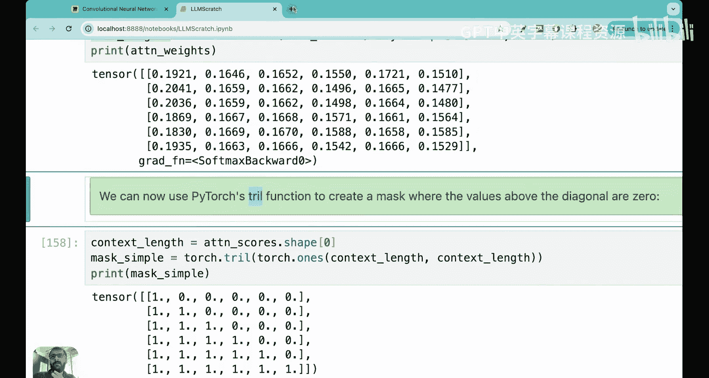

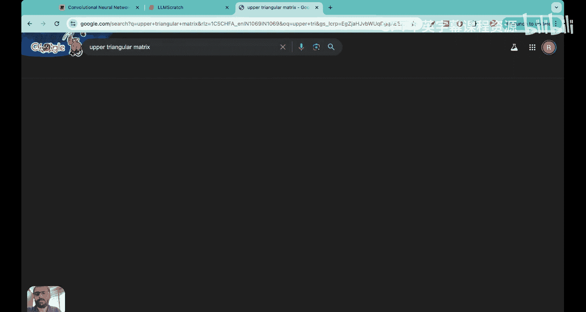

我们将生成一个如下所示的掩码。在这个掩码中，所有对角线以上的元素都等于0。理想情况下，这就是我们想要对注意力权重矩阵做的事情。

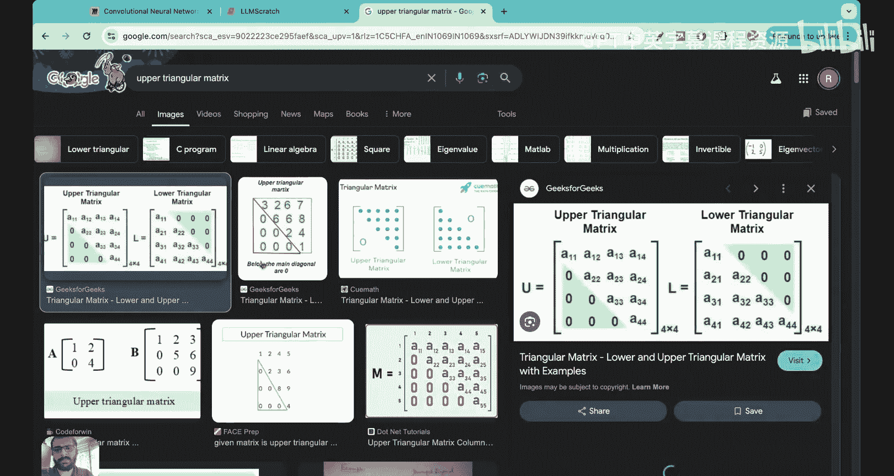

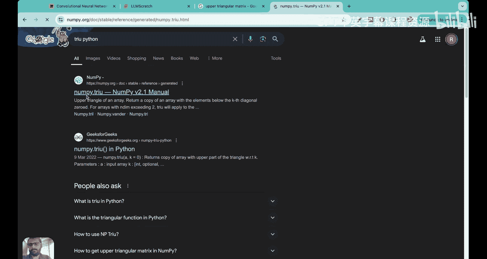

如果我们有一个这样的掩码，并将注意力权重乘以这个掩码，理想情况下，所有对角线以上的元素都将被设置为0。

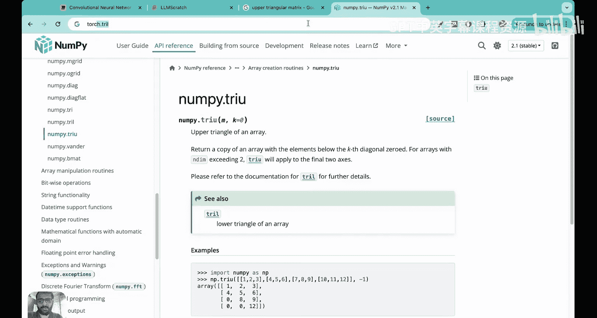

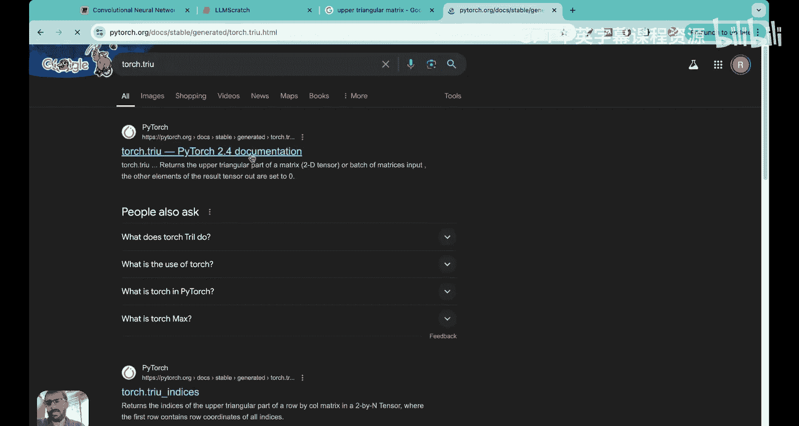

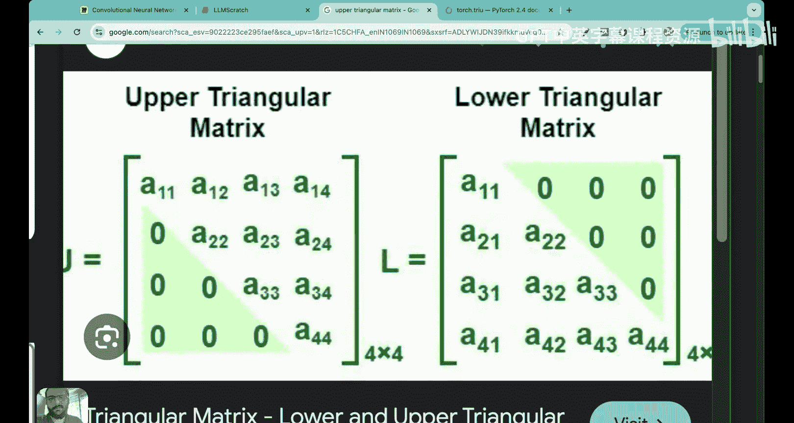

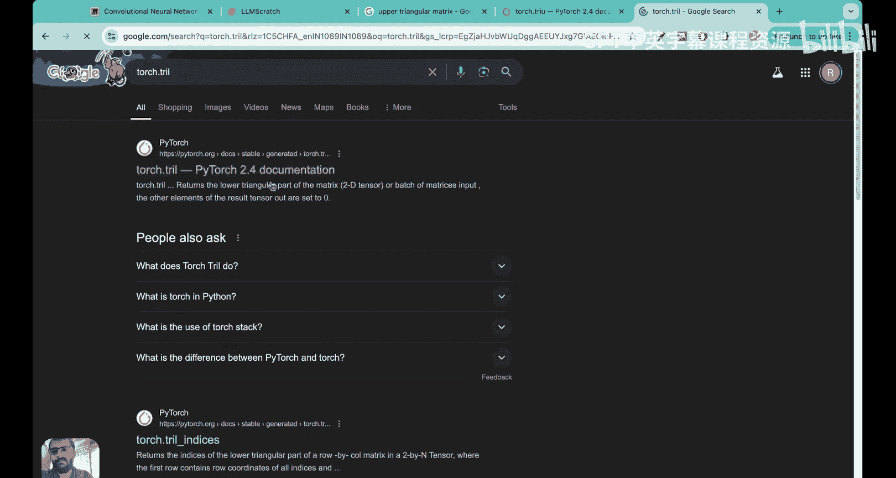

现在，我们将使用Python的`tril`函数来构造这个掩码。那么，什么是`tril`？有两种类型的矩阵：上三角矩阵和下三角矩阵。

上三角矩阵本质上看起来像这样，其中对角线以下的所有元素都是0。在Python中，这是`triu`。下三角矩阵是`tril`，其中对角线以上的所有元素都等于0。

由于所有对角线以上的元素都被设置为0，我们需要一个下三角矩阵。这就是我们使用`torch.tril`的原因。

在`torch.tril`中，我们需要传入矩阵的形状。目前，我打算创建一个由1和0组成的矩阵。我将传入一个`torch.ones(context_length, context_length)`的矩阵。如果我打印出这个矩阵，它看起来像这样。然后，我将对这个矩阵应用下三角矩阵函数，它将把所有对角线以上的元素设置为0。

这正是这里发生的情况。因此，`mask_simple`将是应用`torch.tril`函数到这个`torch.ones`矩阵的结果。当我打印`mask_simple`时，我会得到这个掩码，其中所有对角线以上的元素都等于0。请记住，这个掩码的长度由上下文长度指定，因为上下文长度是LLM在预测下一个词之前可以查看的词数。

在这个例子中，上下文长度等于6，因为LLM在预测下一个词之前可以查看6个词。

这就是我们创建`mask_simple`的方法，我们在这里打印它。

现在，如果你将注意力权重乘以这个掩码，你应该得到的是所有对角线以上的元素都被设置为0。这正是我们要做的。现在，我们将定义另一个变量`masked_simple`，它是注意力权重与我们之前获得的掩码相乘后的最终注意力权重矩阵。

当我们打印这个时，我们将得到这种类型的注意力权重矩阵，你会看到所有对角线以上的元素都等于0。这太棒了，这正是我们想要的。

但下一步是，你会看到这些不能作为我们的注意力权重，因为每一行的和不为1。

因此，下一步是归一化注意力权重，使得每一行的和为1。我们将做的是取每一行的和，然后用该和除以该行的所有元素。

例如，如果我们看第二行，我们将取第二行的和，然后用该和除以第二行的所有元素。这样，我们将确保一行中的所有元素之和为1。

这就是我们接下来要做的。我们将计算每一行的和，然后用和除以每一行。然后我们得到归一化的`masked_simple`。

在这里，你会看到我们得到一个注意力权重矩阵，其中每一行有效地求和为1。这太棒了。这正是我们需要的。这是因果注意力机制引入的主要修改。就这么简单。

现在，我们将把这个与值矩阵相乘，得到上下文向量矩阵。就是这样。如果你从这节课中理解了这么多，你就已经理解了我想要传达的80%的内容。

## 数据泄漏问题与更优方案

现在让我们继续，你可能会想，好吧，我们已经完成了大部分工作，那么之后我们还需要做什么呢？实际上，存在一些问题。如果你仔细看因果注意力，其主要目的本质上是不受未来词元的影响，但如果你仔细看我们在这里所做的，我们实际上已经对之前获得的注意力分数应用了softmax。

即使你将所有未来词元清零，也并没有真正消除未来词元的影响，因为未来词元在我们进行softmax时已经影响了初始的两个值。

这就是我们采用的方法的缺点。我们在这里应用softmax，然后通过除以和来进行这种重新归一化。这导致了数据泄漏问题。

为什么是数据泄漏？因为尽管我们将对角线以上的元素清零，但由于我们在之前进行了softmax，出现在未来的元素确实也会影响前面的元素。所以我们需要一种方法来避免这种情况。

有一个更聪明的方法来进行这种重新归一化，让我告诉你那是什么。

如果我们有一个更高效的方法呢？高效的方法是：我们拥有注意力分数，然后我们应用一个称为上三角无穷大掩码的东西，然后我们只应用一次softmax。这将确保没有泄漏问题。

让我解释一下上三角无穷大掩码的含义。假设我们有一个注意力分数矩阵。与其提前应用softmax并获得注意力权重矩阵，不如我们替换这些值。例如，对于第一行，我们将这些值替换为负无穷；对于第二行，我们将这些值替换为负无穷。基本上，我们将对角线以上的所有条目替换为负无穷。

然后我们进行softmax。这将确保无论如何，当我们进行softmax时，负无穷的指数将是0。因此，当我们对这一行进行softmax时，所有这些条目无论如何都将是0，然后由于我们进行了softmax，它们将自动求和为1。

因此，这种技巧将确保我们没有数据泄漏问题，因为注意力分数已经计算好了。现在，当你查看每一行时，由于我们还没有进行softmax，因此还没有未来词元的影响。然后，我们只是将对角线以上的元素替换为负无穷，现在我们已经取消了未来词元的影响，因为我们还没有进行softmax。然后，我们将对这个矩阵进行softmax。softmax将做的是：一石二鸟；它将所有这些条目替换为0，因为负无穷的指数无论如何都是0，并且由于我们应用了softmax，它将确保每一行的和等于1。因此，它将确保注意力权重矩阵的每一行求和为1。

这正是我们接下来要做的。现在，如果我给你这个矩阵，并告诉你你想将对角线以上的所有元素替换为0或负无穷，你会使用上三角矩阵还是下三角矩阵？

让我告诉你这是如何实际完成的。这种方式是：我们首先创建一个上三角矩阵。让我打印出来，向你展示我们在这里做什么。

我们将再次使用一个6x6的矩阵，这次我们将取一个上三角矩阵。请记住，之前我们取了一个下三角矩阵。让我告诉你为什么我们取上三角矩阵。我们取一个上三角矩阵，其中所有这些元素都是1。我们稍后要编写的代码是：查看所有为1的位置，并将这些1替换为负无穷。

这就是我们要构造的掩码。我们在这里有这个掩码张量，它本质上是一个零向量，但对角线以上的所有元素都是1。然后我们使用`attention_scores.masked_fill`函数。这个函数的作用是：它首先查看参数，我们取这个掩码矩阵，找出矩阵返回正值或True值的所有位置，这些位置都在对角线以上，然后替换它们。

因此，`attention_scores.masked_fill`函数所做的本质上是：它获取注意力分数矩阵，并将对角线以上的所有元素替换为负无穷。这正是我们想要的。

现在我们要做的是：我们取这个矩阵，应用`torch.softmax`。就像我们之前做的那样，首先我们取掩码矩阵，将其除以键维度的平方根，然后应用softmax。这将确保所有的无穷大值无论如何都会变成零，并且每一行将求和为1。

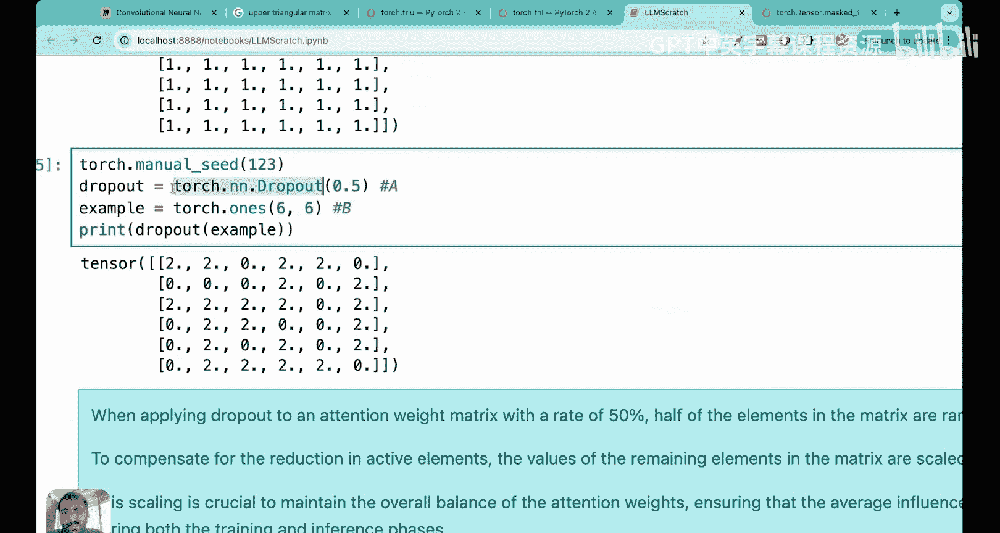

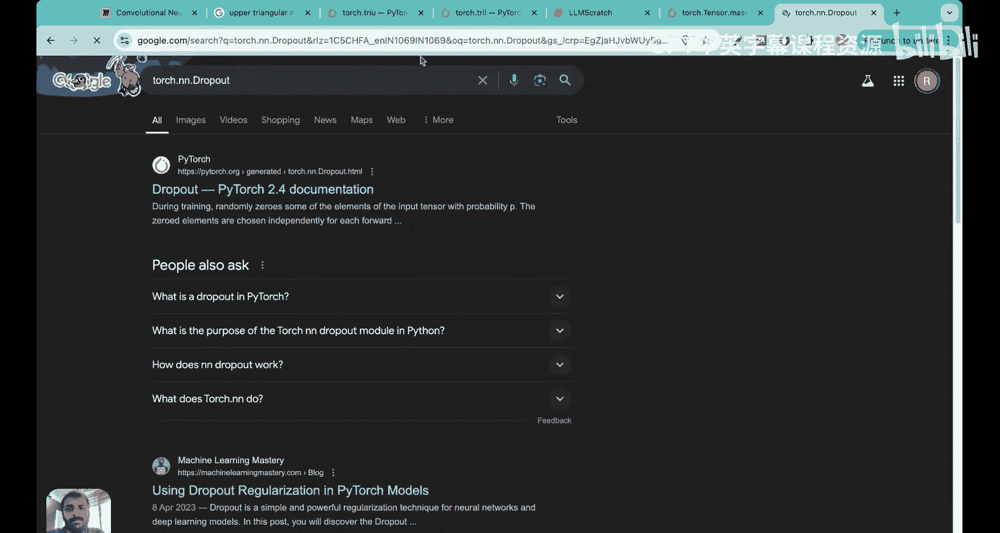

现在，我的最终注意力权重矩阵看起来像这样，你会看到数据泄漏问题不存在了，因为我在所有未来元素被设置为负无穷之后应用了softmax，其次，所有注意力权重矩阵的行求和为1。

因此，因果注意力机制得到了满足，softmax也得到了满足，数据泄漏问题不存在，并且每一行求和为1。所以，我基本上已经获得了在计算这些注意力权重时我想要的一切。

## 实现Dropout

现在，既然我们已经获得了注意力权重矩阵，我们可以简单地将其与值矩阵相乘，得到上下文向量。就是这样。这是在Python中实现因果注意力机制的方法。

但是，通常与因果注意力机制一起实现的还有一个额外的步骤，那就是使用Dropout实现因果注意力机制。

如果你不熟悉Dropout，它实际上是一种深度学习技术，你取一个神经网络，并随机将不同层中的神经元切换为零。这样做通常是因为在训练时，一些神经元变得懒惰，它们不工作，因为它们意识到其他神经元无论如何都在做大部分工作。这就是懒惰神经元问题或相互依赖问题。

Dropout确保的是：当一个懒惰的神经元看到其他神经元被关闭时，它被迫工作。这是思考这个问题的最简单方式。因此，Dropout随机关闭神经元，确保所有神经元都参与工作，这导致更好的泛化，防止过拟合，并在测试数据上表现更好。

Dropout的优势在于它防止过拟合并提高泛化性能。

在Transformer架构中，包括GPT等模型，注意力机制中实现了Dropout，并且通常应用于两个特定领域：第一个是在计算注意力分数之后，第二个是在将注意力权重应用于值向量之后。

因此，有两种特定的方式可以实现Dropout。第一种是在获得上下文向量本身之后，在将注意力权重应用于值向量之后，你可以实现Dropout。但更常见的方式是在计算注意力权重或注意力分数之后实现Dropout，因此我们将考虑这种方式。

本质上，在Dropout中完成的是：假设我们有一个实现了因果注意力的注意力权重矩阵，所有未来词元都已被掩码，我们将要做的是首先创建一个Dropout掩码。这个Dropout掩码指定了哪些神经元需要被随机关闭。例如，如果我们实现一个概率为0.5的Dropout，这意味着平均每行有50%的注意力权重将被关闭。

这就是Dropout的实现方式。这是一个Dropout掩码，你可以在这里看到，掩码出现的位置，那些特定的元素需要被清零。

因此，Dropout用非常简单的术语来说就是：它查看行，然后以给定的概率随机关闭注意力权重。

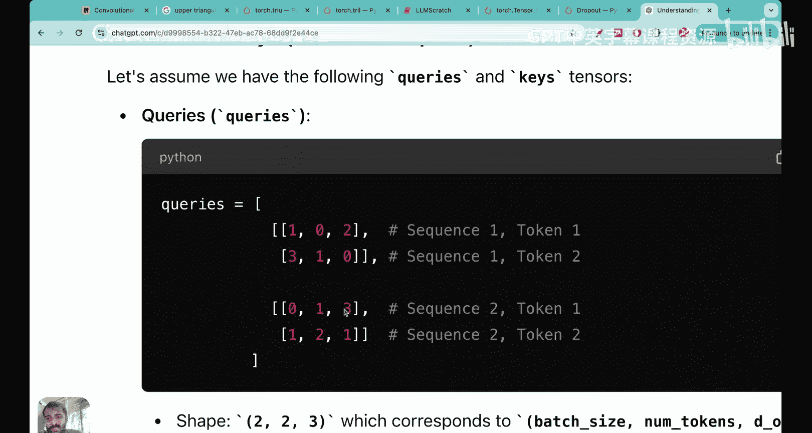

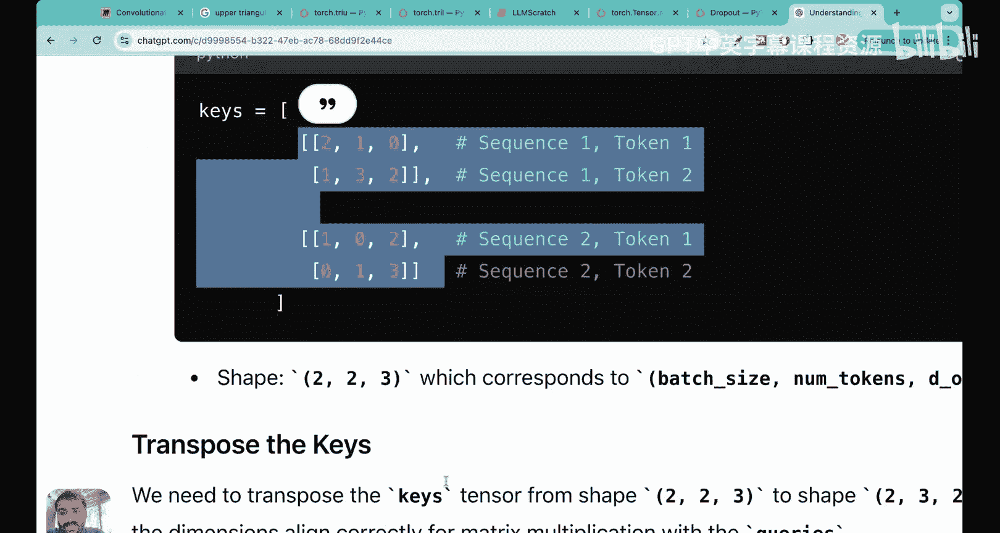

现在，让我首先在Python中实现Dropout。在下面的代码示例中，我们将使用50%的Dropout率，这意味着我们将掩码掉一半的注意力权重。稍后，当我们训练GPT模型时，我们将使用更低的Dropout率，大约0.1或0.2。

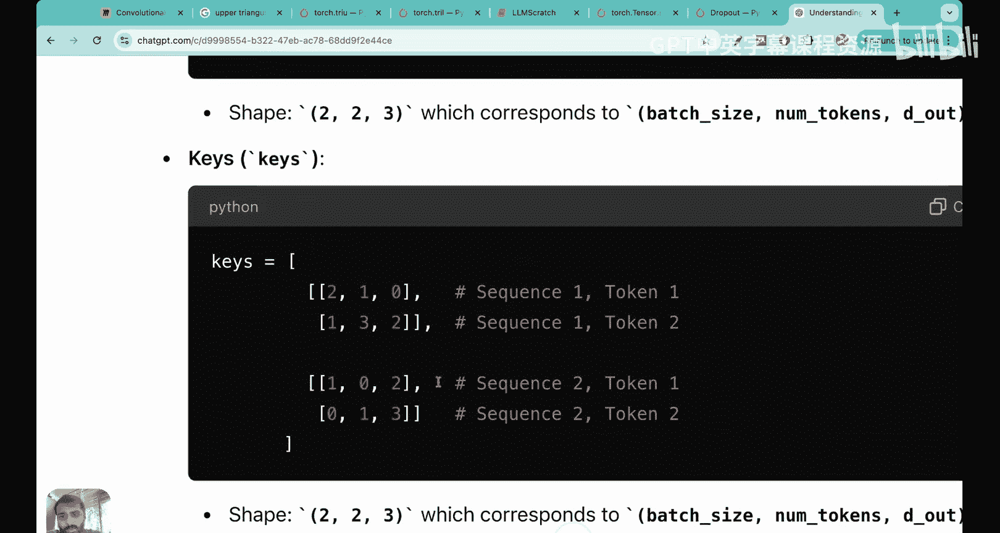

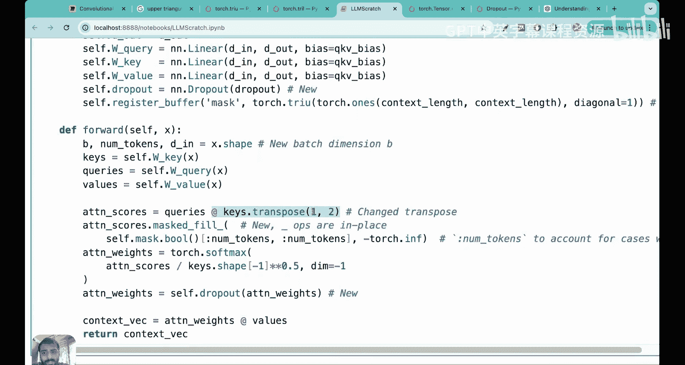

在下面的代码中，我们将PyTorch的Dropout实现应用于一个由1组成的6x6张量，用于说明目的，然后我们将其实际应用于我们已有的注意力权重矩阵。

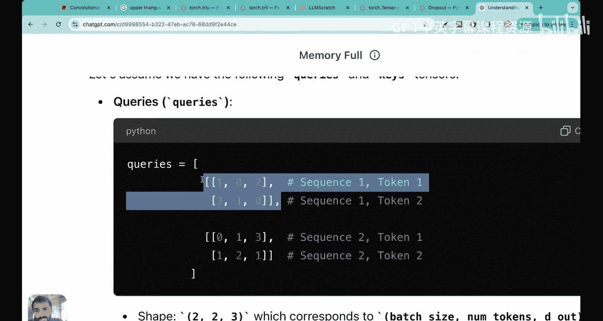

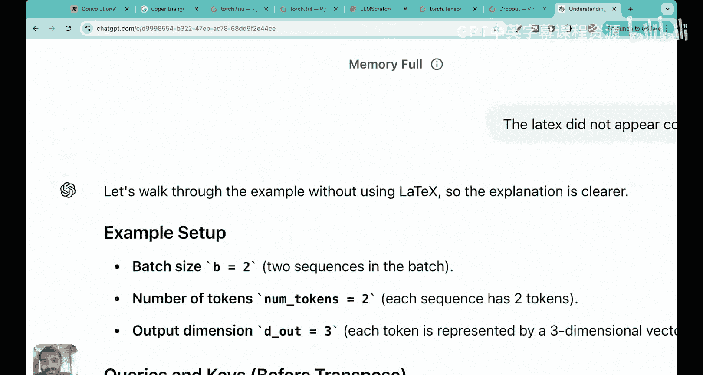

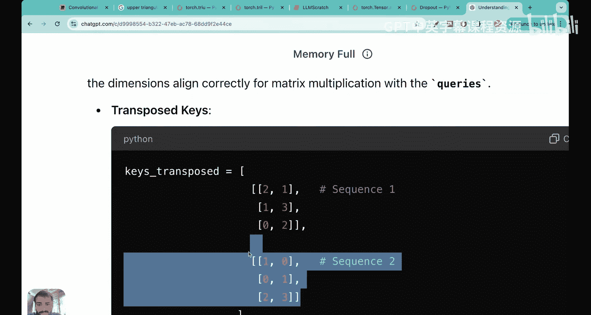

假设我们有一个6x6的示例矩阵，我在这里打印出来。然后我们将实现`torch.nn.Dropout(0.5)`。这将做的是：它将查看每一行，然后平均关闭50%的权重。

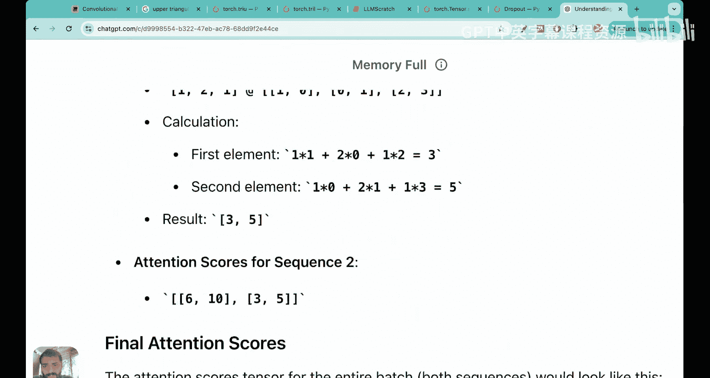

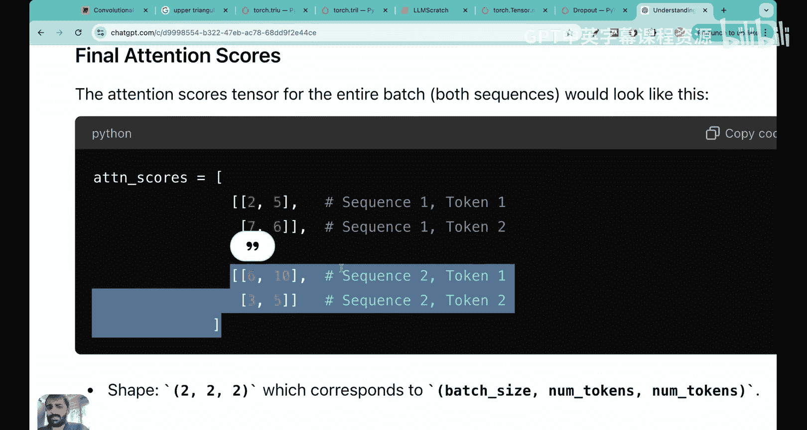

由于50%的权重被关闭，所有其他未被关闭的权重将按比例重新缩放。因此，所有未被关闭的其他权重将重新缩放2倍，即除以0.5或乘以2。

如果你看这里的第一行，你会看到两个权重被关闭；看第二行，你会看到四个权重被关闭；看第三行，你会看到一个权重被关闭。请记住，这是概率性的。

因此，如果你取10,000行，你会看到平均每行有50%被关闭。这并不保证每行恰好有三个或四个权重被关闭，但平均每行有三个权重被关闭。

当以50%的速率将Dropout应用于注意力权重矩阵时，矩阵中一半的元素被随机设置为0。请记住，这是概率性的。为了补偿活动元素的减少，矩阵中剩余元素的值按比例放大2倍。这就是PyTorch中`torch.nn.Dropout`的实现方式。

这种缩放对于保持注意力权重的整体平衡至关重要，确保注意力机制的平均影响力在训练和推理阶段保持一致。

现在，让我们实际获取之前已有的注意力权重，这些是最终的注意力权重，我们将对其应用Dropout层。

我获取注意力权重矩阵并对其应用Dropout。Dropout被定义为一个类，并且创建了Dropout类的一个实例，输入参数是0.5，这意味着Dropout率为0.5。

在这里，你可以看到，与原始的注意力权重矩阵相比，在应用Dropout后，一些注意力权重被随机设置为0，而未被设置为0的权重被放大了2倍。

因此，正如你所看到的，得到的注意力权重矩阵现在有额外的元素被清零，剩余的元素被重新缩放。这正是我们想要的。

## 实现因果注意力类

现在我们已经对因果注意力和Dropout掩码有了实际的理解，我们将在Python中实现一个因果注意力类。

这也是我们接下来要在白板上看到的部分。

我们将要看到的下一个部分是实现一个因果注意力类，它将因果注意力和Dropout合并到我们之前实现的自注意力类中。

为此，首先我希望你对我们将要实现的内容有一个直观的理解，这将使理解代码变得容易得多。如果你理解了自注意力类，当我们实现这个因果注意力时，除了几个小的变化外，其他部分将完全相同。

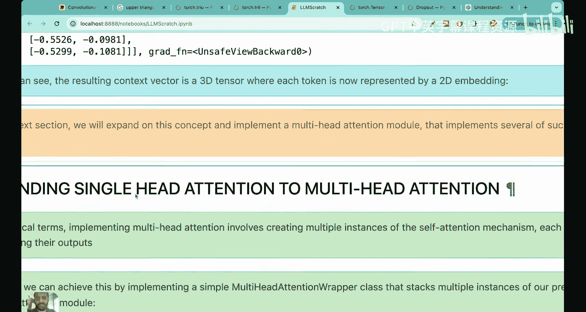

我们将有输入，将其与可训练的查询权重、键权重和