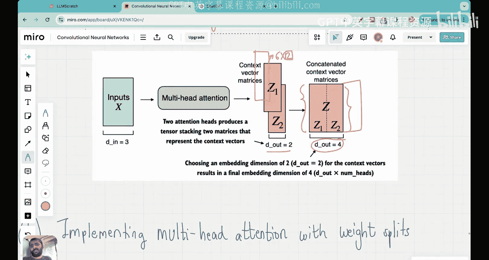

# 17：多头注意力机制第一部分 - 基础与Python代码


## 概述
在本节课中，我们将要学习多头注意力机制的基础知识。多头注意力是现代大语言模型的核心组件之一。我们将从回顾已学的因果注意力机制出发，逐步理解如何将多个注意力头组合起来，并最终用Python代码实现一个基础的多头注意力包装器。

## 从因果注意力到多头注意力
上一节我们介绍了因果注意力机制，它确保了模型在预测下一个词时，只关注序列中位于该词之前的信息。本节中我们来看看如何将这种注意力机制扩展为更强大的多头注意力。

### 因果注意力机制回顾
因果注意力机制的目标是将输入词嵌入向量转换为更丰富的上下文向量。输入词嵌入向量包含单个词的语义信息，但不包含该词与序列中其他词的关系信息。上下文向量则同时编码了这两种信息。

其工作流程如下：
1.  输入是一个形状为 `(batch_size, num_tokens, input_dim)` 的张量。
2.  输入分别与三个可训练的权重矩阵 `W_q`、`W_k`、`W_v` 相乘，得到查询（Queries）、键（Keys）和值（Values）矩阵。
    *   `queries = inputs @ W_q`
    *   `keys = inputs @ W_k`
    *   `values = inputs @ W_v`
3.  计算注意力分数：`attention_scores = queries @ keys.T`
4.  应用因果掩码，将注意力分数矩阵主对角线上方的元素置为 `-inf`，确保每个词只关注自身及之前的词。
5.  对掩码后的注意力分数应用 `softmax` 函数，得到注意力权重矩阵，其每一行之和为1。
6.  将注意力权重与值矩阵相乘，得到最终的上下文向量：`context_vectors = attention_weights @ values`

以下是我们在上一讲中实现的因果注意力类的核心代码框架：
```python
class CausalAttention(nn.Module):
    def __init__(self, d_in, d_out, context_length, dropout, qkv_bias=False):
        super().__init__()
        self.d_out = d_out
        self.W_query = nn.Linear(d_in, d_out, bias=qkv_bias)
        self.W_key = nn.Linear(d_in, d_out, bias=qkv_bias)
        self.W_value = nn.Linear(d_in, d_out, bias=qkv_bias)
        # ... 其他初始化（如dropout、掩码）

    def forward(self, x):
        queries = self.W_query(x)
        keys = self.W_key(x)
        values = self.W_value(x)
        # ... 计算注意力分数、应用掩码、softmax
        context_vec = attention_weights @ values
        return context_vec
```

## 多头注意力的核心思想
多头注意力的核心思想非常简单：**并行运行多个独立的注意力机制（即多个“头”），然后将它们的输出组合起来**。

### 多头注意力的工作流程
与单头注意力相比，多头注意力做出了以下关键改变：
1.  **多组权重**：不再只有一组 `(W_q, W_k, W_v)`，而是为每个注意力头准备独立的一组可训练权重矩阵。
2.  **并行计算**：输入同时与所有头的权重矩阵相乘，生成多组查询、键和值矩阵。
3.  **独立计算上下文向量**：每一组 `(Q, K, V)` 独立进行注意力计算，生成一个上下文向量矩阵。
4.  **拼接输出**：将所有头计算出的上下文向量矩阵沿着最后一个维度（特征维度）拼接起来，形成最终的、维度更高的上下文向量。

假设我们设置 `d_out = 2`（每个头的输出维度），并使用 `num_heads = 2`（两个头）。
*   单头注意力：输入一个形状为 `(6, 3)` 的矩阵（6个词，每个词嵌入维度为3），输出一个形状为 `(6, 2)` 的上下文向量矩阵。
*   多头注意力（2个头）：每个头独立输出一个 `(6, 2)` 的上下文向量矩阵。将这两个矩阵拼接后，得到最终的上下文向量矩阵，其形状为 `(6, 4)`。这里的 `4` 等于 `d_out * num_heads`。

这种设计的优势在于，不同的注意力头可以学习关注输入序列中不同方面的关系（例如语法结构、语义关联、指代关系等），从而使模型的表示能力更强。

## 实现多头注意力包装器
理解了核心思想后，实现就变得非常直观。我们可以创建一个包装器类，它包含多个 `CausalAttention` 实例，并在前向传播中依次调用它们，最后拼接结果。

以下是实现多头注意力包装器的步骤：

首先，我们初始化指定数量的 `CausalAttention` 头。
```python
class MultiHeadAttentionWrapper(nn.Module):
    def __init__(self, d_in, d_out, context_length, dropout, num_heads, qkv_bias=False):
        super().__init__()
        self.heads = nn.ModuleList([
            CausalAttention(d_in, d_out, context_length, dropout, qkv_bias)
            for _ in range(num_heads)
        ])
```
然后，在前向传播中，我们遍历所有头，收集每个头的输出。
```python
    def forward(self, x):
        # 收集每个注意力头的输出
        head_outputs = [head(x) for head in self.heads]
        # 沿最后一个维度（特征维度）拼接所有头的输出
        context_vectors = torch.cat(head_outputs, dim=-1)
        return context_vectors
```

### 代码演示与维度分析
让我们用具体数据来演示这个包装器是如何工作的。

首先，定义输入数据。假设我们有一个包含6个词的序列，每个词的嵌入向量是3维。我们创建一个包含2个这样序列的批次。
```python
inputs = torch.tensor([[[0.7, 2.0, 1.0],  # “your” 的嵌入
                        [0.3, 0.5, 0.1],  # “journey”
                        [0.9, 0.2, 0.8],  # “starts”
                        [0.4, 0.6, 0.3],  # “with”
                        [0.1, 0.9, 0.5],  # “one”
                        [0.2, 0.4, 0.7]]], # “step”
                       [[0.8, 1.9, 1.1],  # 第二个批次，序列相似
                        [0.4, 0.4, 0.2],
                        [0.8, 0.3, 0.9],
                        [0.5, 0.5, 0.4],
                        [0.2, 0.8, 0.6],
                        [0.3, 0.3, 0.8]]])
print(f"输入批次形状: {inputs.shape}")  # 输出: torch.Size([2, 6, 3])
```
接下来，初始化多头注意力包装器。我们设置输入维度 `d_in=3`，每个头的输出维度 `d_out=2`，使用2个注意力头。
```python
torch.manual_seed(123)
batch = inputs
context_length = batch.shape[1]  # 6
d_in = batch.shape[2]            # 3
d_out = 2
num_heads = 2

mha = MultiHeadAttentionWrapper(d_in=d_in, d_out=d_out,
                                context_length=context_length,
                                dropout=0.0,
                                num_heads=num_heads)
```
最后，将批次数据输入模型，并检查输出形状。
```python
context_vecs = mha(batch)
print(f"多头注意力输出形状: {context_vecs.shape}")  # 输出: torch.Size([2, 6, 4])
```
**维度分析**：
*   `2`：批次大小。我们输入了2个序列样本。
*   `6`：序列长度（词的数量）。每个词都产生了一个上下文向量。
*   `4`：每个词的最终上下文向量的维度。这来源于 `d_out * num_heads = 2 * 2 = 4`。前两维来自第一个注意力头，后两维来自第二个注意力头。

这个输出就是经过多头注意力机制增强后的序列表示，它将作为后续神经网络层（如前馈网络）的输入。

## 当前实现的局限性与展望
我们目前实现的多头注意力包装器虽然功能正确，但存在一个明显的效率问题：**它是以串行方式逐个处理每个注意力头的**。在实际的大型模型中，注意力头的数量可能非常多（例如GPT-3有96个头），这种串行计算会非常缓慢。

在下一讲中，我们将学习一种更高效、更常用的实现方式——**通过权重分割实现并行多头注意力**。其核心思想是通过一次大型矩阵乘法，同时计算出所有头的查询、键和值，然后利用张量变形和视图操作来模拟并行计算，最终再合并结果。这种方法能充分利用现代GPU的并行计算能力，是生产环境中使用的标准实现。



## 总结
本节课中我们一起学习了多头注意力机制的第一部分。我们从回顾因果注意力机制出发，理解了多头注意力的核心思想：使用多组独立的注意力权重并行处理输入，以捕获更丰富的序列关系信息。我们实现了一个基础的多头注意力包装器，它通过串行调用多个 `CausalAttention` 实例并拼接其结果来工作。通过代码演示，我们看到了输入如何从形状 `[2, 6, 3]` 转换为输出形状 `[2, 6, 4]`，其中最后一个维度 `4` 是每个头的输出维度与头数的乘积。最后，我们指出了当前串行实现的效率瓶颈，并为下一讲将介绍的高效并行实现做好了铺垫。