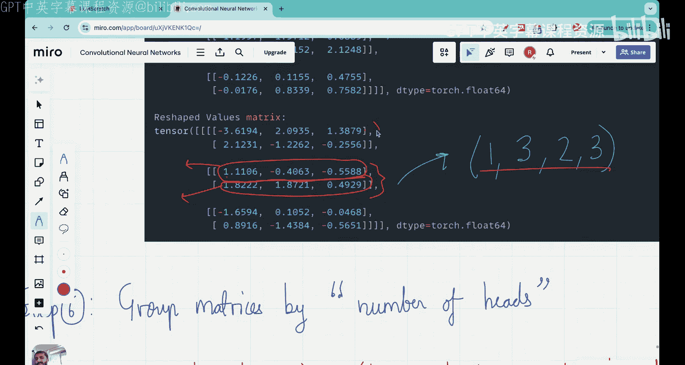
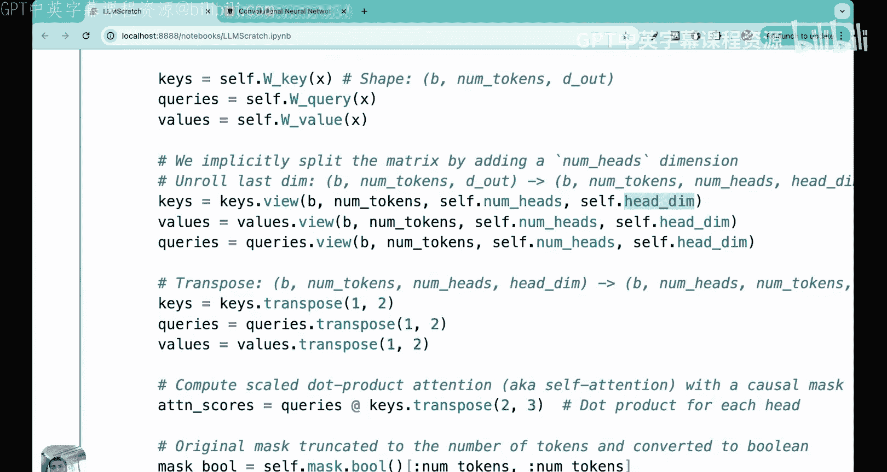
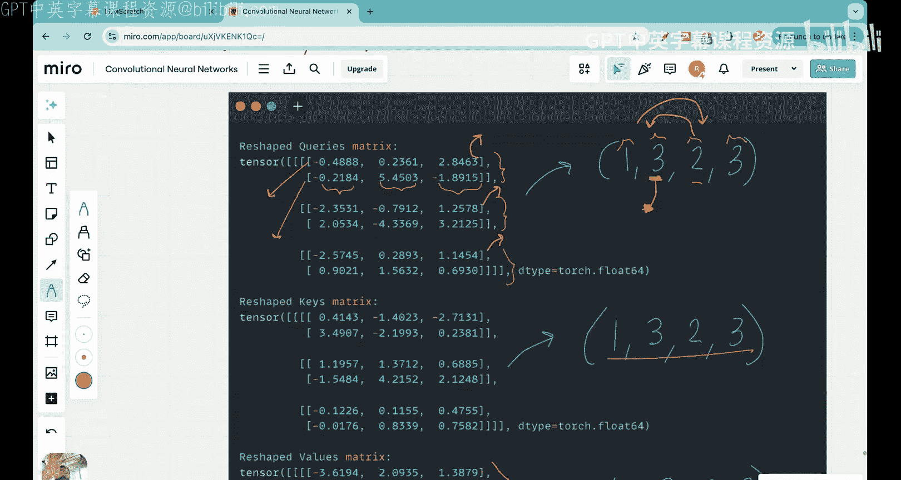
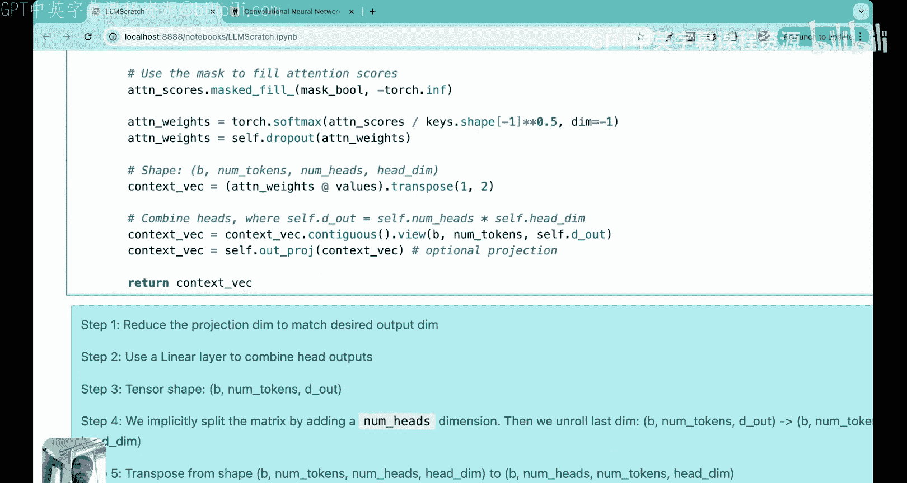

# 17：多头注意力机制第二部分 - 完整数学原理详解


在本节课中，我们将深入学习多头注意力机制的第二种、更高效的实现方式。我们将通过一个具体的例子，一步步拆解其背后的数学原理和代码实现，确保你能完全理解这个Transformer架构的核心组件。

上一节我们介绍了多头注意力机制的基本概念和一种直观但低效的实现方式。本节中，我们将看看如何通过“权重分割”技术，用更少的矩阵乘法实现相同的功能，并深入理解其背后的张量维度变换。

## 概述：更高效的多头注意力

在上一部分的实现中，如果有 `n` 个头，我们需要进行 `n` 次独立的矩阵乘法来分别计算每个头的查询、键和值矩阵。对于像GPT-3这样使用96个注意力头的模型，这会导致巨大的计算开销。

本节介绍的核心思想是：**只进行一次矩阵乘法来得到一个大矩阵，然后将其分割给多个头使用**。这种方法被称为“带权重分割的多头注意力”，它显著减少了计算量。

## 核心概念与决策

在开始代码之前，我们需要明确几个关键参数。我们将通过一个具体的例子来贯穿整个讲解过程。

**输入定义**：
假设我们的输入是一个句子，包含三个词（或标记）：`the`、`cat`、`sleeps`。我们将每个词编码为一个6维的向量。同时，我们设定批处理大小为1（即一次处理一个句子）。因此，输入张量 `x` 的形状为：
```
x.shape = (batch_size, num_tokens, d_in) = (1, 3, 6)
```
其中 `d_in=6` 是输入嵌入的维度。

**输出维度决策**：
我们决定输出上下文向量的维度 `d_out` 也为6。这在GPT类模型中很常见，即 `d_in = d_out`。

**注意力头数量决策**：
我们决定使用 `num_heads = 2` 个注意力头。

**头维度计算**：
每个头的维度 `head_dim` 由总输出维度除以头数得到：
```
head_dim = d_out / num_heads = 6 / 2 = 3
```

## 实现步骤详解

以下是实现带权重分割的多头注意力的11个核心步骤。我们将结合代码和图示，详细解释每一步的张量形状变化和其含义。

### 步骤1：初始化可训练权重矩阵

我们需要为查询、键和值初始化三个可训练的权重矩阵：`W_q`、`W_k`、`W_v`。它们的维度必须与输入兼容。

由于输入 `x` 的最后一个维度是 `d_in=6`，而我们需要输出维度为 `d_out=6`，因此这些权重矩阵的形状应为 `(d_in, d_out) = (6, 6)`。

在代码中，这通常在类的 `__init__` 构造函数中完成，使用不带偏置的线性层（`nn.Linear`）来初始化这些矩阵，因为线性层在反向传播时经过了优化。

```python
# 在 __init__ 构造函数中
self.W_query = nn.Linear(d_in, d_out, bias=False)
self.W_key = nn.Linear(d_in, d_out, bias=False)
self.W_value = nn.Linear(d_in, d_out, bias=False)
```

### 步骤2：计算查询、键、值矩阵

将输入 `x` 与上一步初始化的权重矩阵相乘，得到初始的查询、键和值矩阵。

```
Q = x @ W_q  # 形状: (1, 3, 6)
K = x @ W_k  # 形状: (1, 3, 6)
V = x @ W_v  # 形状: (1, 3, 6)
```

此时，`Q`、`K`、`V` 的形状都是 `(batch_size=1, num_tokens=3, d_out=6)`。每一行对应一个词（标记），每一行有6个值，因为 `d_out=6`。

### 步骤3：重塑张量以引入“头”维度

目前，`Q`、`K`、`V` 是三维张量，没有显式地包含“注意力头”这个维度。我们需要将最后一个维度 `d_out` “展开”，使其包含 `num_heads` 和 `head_dim`。

因为 `d_out = num_heads * head_dim = 2 * 3`，我们可以将形状从 `(1, 3, 6)` 重塑为 `(1, 3, 2, 3)`。

新的维度含义是：`(batch_size, num_tokens, num_heads, head_dim)`。

*   **第一个 `3`**：代表3个词（标记）。
*   **`2`**：代表2个注意力头。
*   **最后一个 `3`**：代表每个头的维度是3。



可以这样理解：对于第一个词，它有2个注意力头（两行），每个头是一个3维向量。



在代码中，使用 `.view()` 方法进行重塑：
```python
Q = Q.view(batch_size, num_tokens, num_heads, head_dim)
K = K.view(batch_size, num_tokens, num_heads, head_dim)
V = V.view(batch_size, num_tokens, num_heads, head_dim)
```



### 步骤4：转置以按“头”分组

上一步得到的张量是按“词（标记）”分组的，即对于每个词，我们能看到它的两个头。但为了后续能独立计算每个头的注意力分数，更方便的做法是按“头”来分组。

因此，我们需要交换“词数”和“头数”这两个维度的位置。将形状从 `(1, 3, 2, 3)` 转换为 `(1, 2, 3, 3)`。

新的维度含义是：`(batch_size, num_heads, num_tokens, head_dim)`。

*   **`2`**：代表2个注意力头。
*   **第一个 `3`**：代表3个词（标记）。
*   **最后一个 `3`**：代表每个头的维度是3。

现在，第一个“块”包含了第一个头对所有3个词的处理结果，第二个“块”包含了第二个头对所有3个词的处理结果。这为并行计算每个头的注意力做好了准备。

在代码中，使用 `.transpose(1, 2)` 来交换第1和第2个维度（索引从0开始）：
```python
Q = Q.transpose(1, 2) # 形状变为 (1, 2, 3, 3)
K = K.transpose(1, 2)
V = V.transpose(1, 2)
```

### 步骤5：计算注意力分数

注意力分数的计算公式是：`注意力分数 = Q @ K^T`。这里我们需要计算每个头自己的 `Q` 和 `K^T` 的点积。

我们的 `Q` 和 `K` 形状都是 `(1, 2, 3, 3)`。为了进行矩阵乘法，我们需要对 `K` 转置最后两个维度（`head_dim` 和 `num_tokens`），使 `K^T` 的形状变为 `(1, 2, head_dim, num_tokens) = (1, 2, 3, 3)`。

然后进行批量矩阵乘法：
```
注意力分数 = torch.matmul(Q, K.transpose(2, 3))
```

结果的形状是 `(batch_size, num_heads, num_tokens, num_tokens) = (1, 2, 3, 3)`。

**如何理解这个 `(3, 3)` 的矩阵？**
对于每个头（比如第一个头），这个 `3x3` 矩阵的每一行对应一个“查询”词，每一列对应一个“键”词。例如，第2行第1列的值，表示当“查询”是第二个词（`cat`）时，它与第一个词（`the`）的原始关联度（注意力分数）。

### 步骤6：应用因果注意力掩码

在语言建模中，我们通常使用因果（或掩码）注意力，即一个词只能关注它自身以及它之前的词，不能关注未来的词。这通过一个掩码矩阵来实现。

我们创建一个上三角矩阵（主对角线及以上元素为1，其余为0），然后将1替换为一个极小的负数（如 `-1e9`），再将其加到注意力分数上。这样，在后续应用 `softmax` 时，这些位置的概率就会趋近于0。

```python
mask = torch.triu(torch.ones(context_length, context_length), diagonal=1).bool()
注意力分数 = 注意力分数.masked_fill(mask[:num_tokens, :num_tokens], float(‘-inf’))
```

### 步骤7：缩放注意力分数

在应用 `softmax` 之前，我们需要将注意力分数除以 `sqrt(head_dim)`。这是为了在 `head_dim` 较大时，防止点积后的结果方差过大，导致 `softmax` 梯度消失，从而稳定训练。

```python
缩放后的注意力分数 = 注意力分数 / (head_dim ** 0.5)
```

### 步骤8：计算注意力权重

对缩放后的注意力分数应用 `softmax` 函数，确保每个“查询”词对所有“键”词的注意力权重之和为1。

```python
注意力权重 = F.softmax(缩放后的注意力分数, dim=-1)
```

`dim=-1` 表示对最后一个维度（即“键”词所在的维度）进行 `softmax`。现在，`注意力权重` 的形状仍然是 `(1, 2, 3, 3)`，但每一行的和都为1，具有了概率解释。例如，对于第一个头的第二行，它表示第二个词（`cat`）应该将多少注意力分配给 `[the, cat, sleeps]` 这三个词。

### 步骤9：计算上下文向量

注意力机制的最终目标是得到每个词的上下文向量。这通过将注意力权重与值矩阵 `V` 相乘得到。

```
上下文向量 = torch.matmul(注意力权重, V)
```

*   `注意力权重` 形状: `(1, 2, 3, 3)`
*   `V` 形状: `(1, 2, 3, 3)`

矩阵乘法发生在最后两个维度上：`(3, 3) @ (3, 3) -> (3, 3)`。结果 `上下文向量` 的形状是 `(1, 2, 3, 3)`，即 `(batch_size, num_heads, num_tokens, head_dim)`。

**如何理解？**
对于每个头（比如第一个头），现在得到一个 `3x3` 的矩阵。它的每一行对应一个词（标记）的上下文向量，而这个上下文向量是一个 `head_dim=3` 维的向量，它融合了该词根据注意力权重从所有词的值中提取的信息。

### 步骤10：转置以合并头输出

目前，上下文向量的形状是 `(1, 2, 3, 3)`，即按头分组。为了将多个头的输出合并，我们需要先将形状转换为按词（标记）分组。

交换“头数”和“词数”的维度位置，将形状从 `(1, 2, 3, 3)` 转换为 `(1, 3, 2, 3)`。

新的维度含义是：`(batch_size, num_tokens, num_heads, head_dim)`。

现在，对于第一个词，我们可以看到它来自两个头的、维度均为3的上下文向量。

在代码中：
```python
上下文向量 = 上下文向量.transpose(1, 2) # 形状变为 (1, 3, 2, 3)
```

### 步骤11：合并多头输出

最后一步，我们将每个词对应的多个头的输出合并起来，形成该词的最终上下文向量。

由于 `d_out = num_heads * head_dim = 2 * 3 = 6`，我们可以将最后两个维度 `(num_heads, head_dim)` 重塑（展平）为一个维度 `d_out`。

将形状从 `(1, 3, 2, 3)` 重塑为 `(1, 3, 6)`。

```python
上下文向量 = 上下文向量.contiguous().view(batch_size, num_tokens, d_out)
```
`.contiguous()` 确保张量在内存中是连续存储的，这样 `.view()` 操作才能安全执行。

现在，我们得到了最终的输出：
*   形状：`(batch_size=1, num_tokens=3, d_out=6)`
*   含义：对于句子中的3个词，每个词都获得了一个新的、6维的上下文感知表示（上下文向量）。

## 代码测试与总结

我们可以用之前定义的参数来测试这个多头注意力类。输入一个形状为 `(2, 3, 6)` 的批量数据（两个句子，每个句子3个词，每个词6维嵌入），经过处理后，输出形状应为 `(2, 3, 6)`。这与我们的预期完全一致。

本节课中我们一起学习了多头注意力机制最核心、最高效的实现方式。我们通过一个具体的例子，详细追踪了从输入到输出过程中每一步的张量形状变化和数学运算。你理解了如何通过一次矩阵乘法和后续的拆分、转置、合并操作，来替代多次独立的矩阵乘法，从而实现高效的多头注意力计算。



掌握这些维度变换和线性代数操作，是深入理解Transformer架构乃至所有现代大语言模型的关键。虽然GPT-3等模型使用了更多的头（如96个）和更大的维度（如768），但其基本原理与我们今天所学的完全一致。希望这次详细的拆解能帮助你建立起坚实的理论基础，在后续构建和调试自己的语言模型时充满信心。