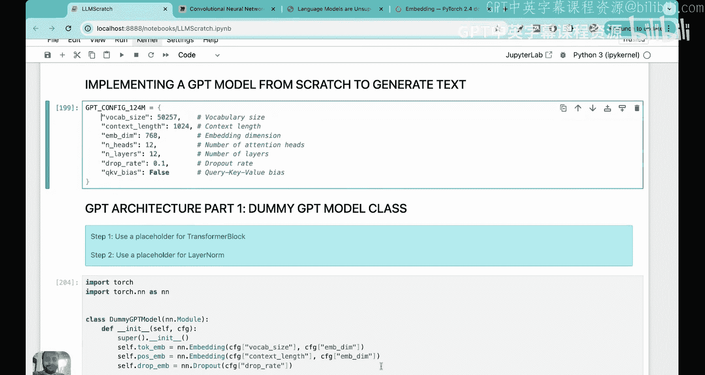

# 18：19-大语言模型架构鸟瞰图

大家好，欢迎来到《从零开始搭建大语言模型》系列讲座。首先，让我带大家回顾一下我们在这个系列中已经学到的内容。通过这张图，我们可以看到，我们计划完全从零开始构建一个大语言模型，并且将分三个阶段进行。在第一阶段，我们将为构建LLM打下基础。在第二阶段，我们将对LLM进行预训练。在第三阶段，我们将对LLM进行微调。

我们目前仍处于第一阶段，并且到目前为止，我们已经涵盖了第一阶段的两个方面：数据准备与采样（包括分词、向量嵌入和位置嵌入），以及最近详细学习的注意力机制。特别是，如果你已经学习了注意力机制部分，我们用了四到五节课，从简化的自注意力、自注意力、因果注意力到多头注意力进行了非常详细的讲解。如果你还没有学习这些课程，我强烈建议你去学习，因为注意力机制是理解后续所有内容的基础构建模块。

如果你已经观看了之前的所有课程，并且运行了我提供的代码，那真是太棒了，我要祝贺你。理解注意力是理解大语言模型最困难的方面之一。如果你已经学到了这里，接下来的部分对你来说会更容易一些。

那么，让我们开始吧。在接下来的系列视频中，我们将学习第三部分，即大语言模型架构。和往常一样，我会将其分解为多个视频，不会在一个视频中涵盖所有内容。我们将非常详细地、从零开始地讲解每一个视频。今天，现在，是大语言模型架构模块的第一个视频。让我们开始吧，我认为这对所有一直跟随学习的同学来说，将是一个非常有趣的模块。

## 课程概述

在本节课中，我们将学习大语言模型架构的顶层视图。我们将了解模型的输入和输出是什么，以及各个主要组件是如何组合在一起的。这为我们后续深入每个组件细节的学习提供了路线图。

## 架构鸟瞰图

在之前的课程中学习了注意力机制之后，现在让我们来学习LLM架构。我首先想给大家展示一下LLM架构的整体视图。这是一个鸟瞰图，我们将详细讲解其中的每一个方面，但现在我想展示你已经学到的内容，以及它们如何融入接下来的学习中。这总是有助于学习过程。

想象一下，你正步行穿过一片森林，想要到达另一边。了解你已经走过的路径，并对接下来要走的路有一些概念总是好的。这样，你就可以将接下来要学习的内容与过去的知识联系起来，从而帮助你到达森林的尽头。在我们的案例中，了解之前的知识如何融入接下来要学习的内容，将真正帮助你更好地理解LLM。

最初，我们从分词开始，然后学习了向量嵌入和位置嵌入。我们为每个词元获得的最终嵌入向量，随后通过掩码多头注意力被转换为上下文向量。

因此，注意力或更准确地说多头注意力的主要目的是获取输入嵌入向量，并将它们转换为上下文向量。上下文向量是比嵌入向量更丰富的表示形式，因为它们不仅包含词元的语义含义，还包含该词元与句子中所有其他词元关系的信息。

掩码多头注意力构成了一个称为**Transformer块**的重要组成部分。Transformer块是大语言模型架构中最重要的部分，它实际上是一个由许多相互关联的不同方面组成的模块。

## 深入Transformer块

让我们放大这个Transformer块，打开它，看看它包含什么。如果你放大Transformer块，你会看到它包含许多东西，掩码多头注意力是其中的一部分。所以，你在多头注意力中学到的内容就在这里。

想象你有一个句子，比如“every effort moves you”，你想预测下一个词。第一步是将每个词转换为输入嵌入或向量嵌入。我们假设我们也添加了位置嵌入。这些嵌入向量随后被传递到Transformer块。

Transformer块的第一部分是**层归一化**。第二部分是**掩码多头注意力**，它将输入嵌入词元转换为上下文向量。这些上下文向量随后被传递到一个**Dropout层**。

你可以注意到这些加号。从这些地方连接到加号的箭头被称为**快捷连接**。快捷连接的输出进入另一个**层归一化**层。然后我们有一个**前馈神经网络**，接着连接另一个**Dropout层**，这里还有一个**快捷连接**。

如果你进一步放大前馈神经网络，你会看到它有一个称为**GELU激活函数**的东西。

如果你看到所有这些术语，可能会想它们是什么意思？什么是层归一化？什么是Dropout？什么是GELU激活函数？为什么这里有一个前馈神经网络？为什么所有这些东西像这样堆叠在一起？

这些正是我们将在本视频以及接下来的四到五个视频中要涵盖的内容。但请记住，这整个架构有大量可训练的参数和权重。当LLM进行预训练时，这些权重和参数会被优化，最终我们得到输出。

输出的形式和维度与输入相同，然后输出被进一步处理，得到最终的文本。所以，一旦我们从Transformer块得到输出，它就会进入这些输出层，然后解码Transformer块的输出，我们就得到了下一个词。如果输入是“every effort moves you”，那么下一个词就是“forward”。

我只是想给你这个鸟瞰图，让你了解正在发生什么、我们正在构建什么、你已经学到了什么，以及它如何融入我们计划接下来学习的内容。

在接下来的这组课程中，我们将深入这个Transformer块，并理解这里提到的每一个东西。我们将首先学习如何将这些不同的层堆叠在一起（这将在今天的课程中涉及），然后我们将深入每一层并学习它们。

我们将有单独的课程讲解层归一化、单独的课程讲解这些快捷连接、单独的课程讲解带有GELU激活的前馈神经网络。我们将把所有这些东西堆叠在一起，最后，我们将有单独的课程讲解如何解码Transformer的输出以产生下一个词。

## 回顾已学内容

我希望你已经理解了为什么我们要学习掩码多头注意力，因为如果你没有学习这个，你看，它构成了Transformer块如此关键的一部分。为了学习这一个小的模块，我们花了五节课，超过七个小时，但这正是注意力机制的重要性。如果这个模块被移除，如果这个掩码多头注意力块被移除，大语言模型将失去其所有能力，我们将回到循环神经网络和长短期记忆网络的时代。

那么，让我们看看我们已经学到了什么。我们学习了输入分词、学习了词元嵌入加位置嵌入，以及学习了掩码多头注意力。

让我先简要概述一下掩码多头注意力，以防你忘记了。

我们有像这样堆叠在一起的输入嵌入向量。我们有一组键、查询和值矩阵，它们与输入相乘得到查询、键和值。查询与键的转置相乘，得到注意力分数，然后转换为注意力权重。注意力权重再与值矩阵相乘，得到上下文向量。由于我们有多个注意力头，上下文向量被堆叠在一起，得到一个组合的上下文向量。这就是多头注意力块中发生的事情。

到目前为止，我们学到的整个过程也可以这样可视化：如果你有输入文本“every effort moves you”，它首先被分词（GPT使用我们之前学过的字节对编码分词器）。每个词元被转换为一个词元ID。每个词元ID被转换为一个向量嵌入（向量化表示）。这些向量嵌入被传递到GPT模型中，该模型包含我之前展示的Transformer块。然后有一个输出，该输出被进一步解码，得到输出文本。

对于GPT-2，使用的词元嵌入向量大小为768维，这意味着每个词元ID被转换为一个768维的向量。输出的生成方式使得维度匹配，因此每个768维的输入词元嵌入对应一个768维的输出向量。然后我们对输出进行一些后处理，以生成下一个词，即“forward”。所以是“every effort moves you forward”。

## 即将学习的内容：Transformer块

我们尚未学习的是Transformer块，我们将在今天的课程中开始学习它。在后续课程中，我们将逐步深入这个块的每一层。

因此，在这组四到五节课中，我们不会使用玩具问题或玩具模型，我们将直接使用GPT-2。我们将使用与构建GPT-2模型相同的架构。

如果你看这篇论文，这是介绍GPT-2的论文。如果你看他们拥有的模型，他们有一个小模型和一个拥有1542百万参数的大模型。小模型有117百万参数，后来修订为124百万参数，这也正是我们在这组课程以及本系列视频的其余部分将要使用的。我们将构建一个拥有124百万参数、12层的LLM。这些层意味着我们有12个Transformer块。D_model（向量嵌入大小）是768。这些参数将在今天的课程以及其余课程中使用。

我们为什么使用GPT-2而不是GPT-3或GPT-4？一个原因是GPT-2更小，因此更适合在我们的本地机器上运行。第二个原因是OpenAI只公开了GPT-2的权重。OpenAI目前尚未公开GPT-3和GPT-4的权重。这就是开源的情况，OpenAI目前是闭源的，而Meta的Llama模型是开源的，所有权重都已发布。这就是我们坚持使用GPT-2的原因，因为它的权重是公开的，我们将在后续的一个视频中加载这些权重。

## GPT-2配置参数

以下是我们将要使用的配置。观看视频的各位可以在这里暂停，尝试理解这里的每一个术语。我们在之前的课程中已经涵盖了所有这些，所以我将在这里暂停，也请你们暂停一下，尝试思考这些术语。无论如何，我会解释每一个术语，但我希望你们也尝试一下去理解。

*   **词汇表大小**：这意味着我们从一个词汇表开始。GPT-2使用字节对编码器，所以它是一个子词分词器。词汇表大小基本上是存在多少个子词。这将用于分词。如果词汇表是词级分词，那么如果句子是“every step moves you forward”，词汇表将包含“every”、“step”、“moves”、“you”、“forward”，这样分词就会发生。但如果你使用GPT-2使用的字节对编码器，它是一个子词分词器，词汇表大小是50257，它可能包含字符、子词，也可能包含完整的词。当我们考虑GPT-2时，这对于分词非常有用。当我们进行分词时，会发生的是：我们有一个词汇表，其中有词元，每个词元对应一个词元ID。每当给我们一段新文本时，使用该词汇表，文本被转换为词元，然后这些词元被转换为词元ID。如果某些文本不属于词汇表，那就是所谓的“词汇表外”问题，字节对编码器不会遇到这个问题，因为它是一个子词分词器。我们在关于嵌入的课程中已经讲过词汇表大小，如果你不清楚，请参考那部分。
*   **上下文长度**：上下文长度基本上指的是用于预测下一个词的最大词数。所以，如果上下文长度是1024（GPT-2实际使用的），我们将查看最多1024个词来预测下一个词。不会有我们查看2000个词来预测下一个词的情况。当我说“词”时，实际上是指“词元”，这并不完全正确，因为GPT-2使用字节对编码分词器，这是一种子词分词方案。但为了本讲座的直观理解，如果我交替使用“词”和“词元”，那是因为这对直觉有好处。
*   **嵌入维度**：现在，我们词汇表中的每个词元都将被投影到一个向量空间中。例如，词元“your journey starts with one step”是每个词元的三维向量表示。嵌入应该是这样的：如果“journey”和“starts”在意义上更相似，它们在这个嵌入空间中应该更接近。这是一个三维嵌入空间。在GPT-2中，我们使用768维嵌入空间，很难在这里展示，但你可以想象一个768维的嵌入空间，词被投影到其中。如果你在想我们如何学习这些投影？我们怎么知道“journey”对应哪个向量？这在GPT-2中也是训练的。当我们看Transformer块时，你会看到嵌入层本身不是固定的，我们将训练嵌入层，以便每个词都能正确嵌入，从而捕获语义含义。
*   **注意力头数量**：这是注意力头的数量，等于12。如果你看这里的图，我告诉过你，会创建多个查询、键和值矩阵，对吧？注意力头的数量越多，创建的这些矩阵就越多。所以，如果我们有12个注意力头，就意味着会有12个这样的查询、键和值矩阵。
*   **层数**：这是Transformer块的数量。记住，这与注意力头的数量不同。层数是我们将拥有多少个这样的层。所以这是一个Transformer块层，它包括多头注意力。在这一层内，将有12个注意力头。但就这些Transformer块本身而言，可以有12个块。所以层数和头数不一定相同。这里我们使用12个Transformer块。我们稍后会看到它们是如何堆叠在一起的。
*   **Dropout率**：基本上是Dropout率。
*   **QKV偏置**：是初始化查询、键和值矩阵时的偏置项。默认情况下，这总是设置为False。

我想在这里提到的另一件事是，我们正在看的是GPT-2小模型，它使用了12个Transformer块。但正如我们在这里看到的，他们有四个GPT-2模型。如果你从左到右看，你会看到小模型、中模型有24个Transformer块、大模型有36个、最大模型（超大）有48个Transformer块。你会看到维度也从左到右增加。我们使用的是768维的GPT-2小模型，但如果你从左到右看，你会看到1024、1280，最后GPT-2超大模型的维度是1600。

## 构建GPT占位符架构

我希望你已经理解了这个配置。我们现在要做的是，我将带你进入代码，并构建一个GPT占位符架构。这是什么意思？这基本上意味着，无论我在这里向你展示什么，我知道你还没有理解层归一化、快捷连接，甚至Transformer块到底有什么，前馈神经网络是什么，GELU激活函数是什么。现在我想做的是，我想为我们的代码创建一个骨架，这些不同的块将组合在一起。我们将在后续部分对它们进行编码，并且我们将为它们各自开设单独的课程。但现在，我们将构建一个GPT占位符架构，我们也称之为虚拟GPT模型。这将实际上给出一个鸟瞰图，展示一切是如何组合在一起的。

所以，这个鸟瞰图再次非常重要的原因是，你将看到我们在接下来的课程中计划做什么，这就是为什么骨架对于像LLM架构这样复杂的话题非常重要，因为多个东西必须组合在一起。首先让我们放大视野，看看所有东西必须如何组合在一起，然后在后续课程中，我们将开始编写代码。

## 代码实现概览

那么，现在我们要做的是，我们将从零开始实现GPT模型来生成文本，我将向你展示代码是如何执行的，但在代码的每一步，我会再次带你回到白板，这样你就可以可视化每个参数的含义。对你来说，阅读一行代码并可视化它的样子非常重要，只有这样你才能真正理解代码。

这是我们在白板上讲过的GPT配置。我希望你已经理解了这里每个术语的含义。如果没有，只需再看一下含义，或者回顾一下我们之前的课程。但非常重要的是，你不要在不理解含义的情况下跳过它。

正如我告诉你的，我们将构建GPT架构。所以这是一个虚拟GPT模型类，我们将为Transformer块使用一个占位符，为层归一化使用一个占位符。

首先，让我给你一个大概的概述，看看我们这里有什么。我们这里有一个虚拟GPT模型，它有前向传播方法。这个前向方法的作用是接收一个输入，在这个前向方法的最后，我们将打印输出。这就是我们的目标。

如果你看这个图，让我把这个图展示给你。这里这是主要的东西，对吧？所以前向方法的作用是接收一个输入，基本上可以只是这些词。然后前向传播的目的是给你下一个词，在这个案例中，下一个词是“forward”，那就是输出。所以，我们想要实现的所有东西都位于中间某处，对吧？

有两个主要块对我们非常重要。首先是Transformer块，我们将在后面的课程中为它创建一个类，而不是在本节课。我们还将为层归一化创建一个类。让我告诉你它们出现在哪里。如果你看这里的Transformer块，Transformer块包含所有这些东西，对吧？层归一化是其中非常重要的一部分。层归一化也会在Transformer之前和之后实现，但它也存在于Transformer内部。所以我们将有一个Transformer块，里面放入我在这里展示的所有这些东西，我们还将有一个单独的层归一化块。我们有一个单独的层归一化块的原因是，它出现在Transformer块中，这没问题，但它也出现在其他地方，所以最好为它定义一个单独的类。

这是我们将稍后定义的类，不是现在。现在让我们看看这个前向方法实际上在做什么。

前向方法首先接收一个输入。让我展示一下那个输入实际上是什么样子。

## 输入处理流程

前向方法将接收一个输入，假设输入是这个相同的东西，让我写在这里。输入是什么？输入是“Every effort moves you”。假设这是传递给前向方法的输入。让我用不同的颜色写在这里。所以假设输入是“Every”、“effort”、“moves”、“you”。很好，所以这是我的输入。

现在，这个输入被馈送到前向方法的方式是这样的。我们将把这个输入馈送到前向方法，做类似这样的事情。

假设“every effort moves you”是输入，我们首先要使用分词器（字节对编码器），将这些词元转换为词元ID。记住我们之前看到的工作流程。这里的每个词元基本上都被转换为词元ID。然后，在此之后的所有事情都发生在GPT模型类内部。但直到这个阶段，我们必须在外部完成，然后将词元ID传递给GPT模型类。

现在我们有了“every effort moves you”，这将被转换为词元ID，这将被转换为词元ID，这将被转换为词元ID，这将被转换为词元ID，对吧？第一步是每个词元ID将被转换为词元嵌入。这意味着每个词元ID，假设这是ID 1，这是ID 2，这是ID 3，这是ID 4，每个词元ID都需要转换为一个768维向量。一个768维向量嵌入本质上将是输入嵌入。

我们将要这样做的方式是，我们首先要创建一个词元嵌入层。为此，我们将使用PyTorch中的`nn.Embedding`。这个层实际上做的是创建一个称为词元嵌入矩阵的矩阵，它的行数等于模型词汇表大小，每一行基本上对应一个词元ID。每一行的长度本质上是768。所以现在，如果你想找到ID号为1的向量嵌入，假设ID号1是44，你只需查看这里的第44行，就得到768维向量。如果你想查看“effort”的ID，假设是64，你查看ID号为64的“effort”行，得到768维向量。类似地，假设“you”的ID是85或40000，你向下找到第40000行，得到768维输入嵌入向量。

这就是为什么这个词元嵌入矩阵也被称为查找矩阵，你只需传入词元ID，它就会给你向量嵌入。请记住，这个词元嵌入矩阵中的所有参数，以及这里所有地方的参数，目前都是随机初始化的，我们将训练这些参数。当我们初始化这个词元嵌入层时，它会从高斯分布初始化参数，然后它们的初始值是随机的。稍后当我们进行反向传播时，我们将训练它们。现在，当你查看所有这些嵌入矩阵时，只需知道它们的值目前是随机的。

所以，第一步是将所有这些词元转换为768维嵌入向量，你会看到这已经在这里完成了。

当你进入前向方法时，你首先要查看输入形状，输入形状基本上是批量大小（行数）和序列长度（我们考虑的词元数量）。例如，让我们看看这个。例如，这是这样一个批次。在这个批次中，批次大小是2，所以这个张量中有两行，列数是我们要使用的词元数量。现在，让我们只看一个批次。我输入四个词元作为输入，然后我想得到下一个词。所以“every effort moves you forward”将是下一个词，对吧？

所以形状是批量大小和序列长度。在我展示的例子中，有两个批次，所以