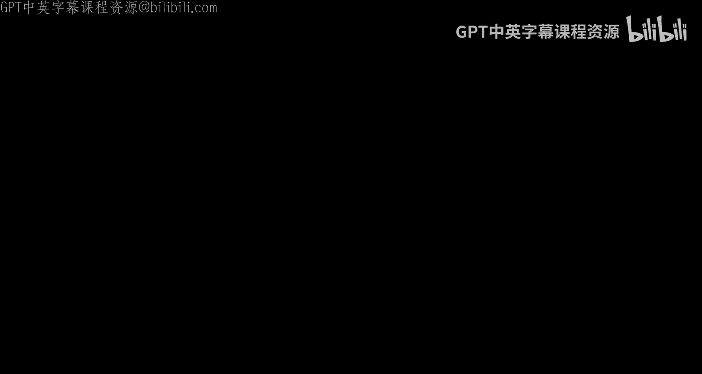
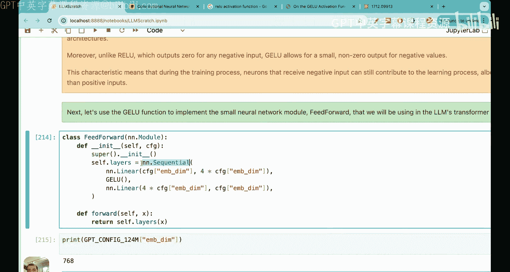
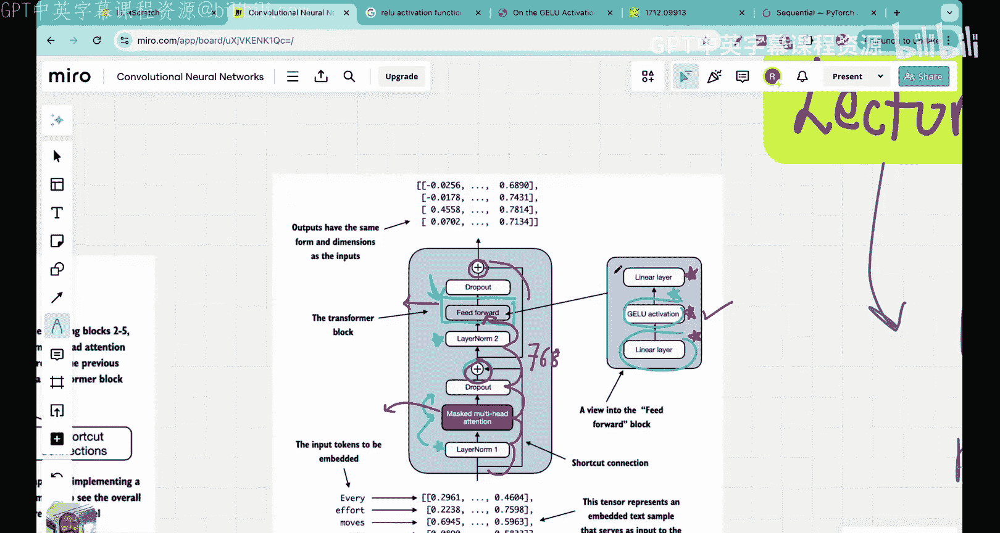

# 20：GELU激活函数与LLM架构



## 概述

在本节课中，我们将学习大语言模型架构中的两个核心组件：**GELU激活函数**和**前馈神经网络**。我们将深入探讨GELU的数学原理、它与传统ReLU的区别，并动手实现一个包含GELU的前馈神经网络模块。

---

## 课程背景与目标

在之前的课程中，我们学习了GPT架构的宏观视图以及层归一化技术。本节课，我们将聚焦于Transformer块中的第二个关键构建模块：GELU激活函数及其所在的前馈神经网络。

我们的目标是实现一个属于LLM Transformer块的小型神经网络子模块，即前馈神经网络块。理解这个模块对于掌握Transformer的核心至关重要。

---

## GELU激活函数详解

上一节我们介绍了层归一化，本节中我们来看看激活函数。在大型语言模型中，两个最常用的激活函数是GELU和Swish。本节课我们将重点学习GELU。

在深入GELU之前，我们先回顾一下ReLU激活函数，这有助于理解GELU的设计动机。

### ReLU激活函数及其局限性

ReLU函数的定义很简单：
*   对于输入 `x > 0`，输出为 `x`。
*   对于输入 `x <= 0`，输出为 `0`。

用公式表示为：
**`ReLU(x) = max(0, x)`**

虽然ReLU因其线性特性使神经网络更具表现力，但它存在两个主要问题：
1.  **不可微性**：在 `x = 0` 处存在一个尖锐的拐点，导致此处不可导，这可能使深度网络的优化变得困难。
2.  **神经元“死亡”问题**：任何负输入都会导致输出为0。一旦某个神经元的输出为负，其后续梯度也将为0，导致该神经元在训练过程中停止更新，无法对学习过程做出贡献。

### GELU激活函数的数学原理

GELU（高斯误差线性单元）激活函数旨在解决ReLU的上述问题。其数学定义是输入 `x` 与标准高斯分布的累积分布函数 `Φ(x)` 的乘积：

**`GELU(x) = x * Φ(x)`**

其中，`Φ(x)` 是标准正态分布的累积分布函数。

这个设计非常巧妙：
*   当 `x` 为很大的正数时，`Φ(x)` 趋近于1，因此 `GELU(x)` 趋近于 `x`，行为类似于ReLU的正半轴。
*   当 `x` 为负数时，`Φ(x)` 是一个小但非零的值，因此 `GELU(x)` 是一个小的负值，而非严格的0。

### GELU的近似实现

直接计算 `Φ(x)` 比较复杂，因此在实践中（例如在GPT-2中）常使用一个高精度的近似公式：

**`GELU(x) ≈ 0.5 * x * (1 + tanh[ √(2/π) * (x + 0.044715 * x^3) ])`**

这个近似函数平滑且易于计算，我们在代码中将使用此形式。

### GELU vs. ReLU：优势对比

以下是GELU相对于ReLU的主要优势：
1.  **处处可微**：GELU函数是平滑的，没有ReLU在零点的不连续问题，这通常能带来更好的优化特性。
2.  **避免神经元“死亡”**：对于负输入，GELU会产生非零输出，使得即使激活值为负的神经元也能继续参与学习过程。
3.  **实证效果更佳**：在大型语言模型的实验中，GELU通常表现出比ReLU更好的性能。

现在，我们已经理解了GELU的原理，接下来让我们进入代码，实现GELU激活函数类。

```python
import torch
import torch.nn as nn
import math

class GELU(nn.Module):
    """GELU激活函数，使用GPT-2采用的近似公式。"""
    def __init__(self):
        super().__init__()

    def forward(self, x):
        # 应用GELU近似公式
        return 0.5 * x * (1.0 + torch.tanh(math.sqrt(2.0 / math.pi) * (x + 0.044715 * torch.pow(x, 3.0))))
```

---

## 前馈神经网络架构

理解了GELU之后，我们将其放入上下文——前馈神经网络中。在Transformer块中，前馈神经网络紧随第二个层归一化层之后。

### 网络结构解析

前馈神经网络是一个相对简单的子模块，但其设计非常精妙。它遵循“扩展-激活-压缩”的模式：
1.  **第一线性层（扩展）**：将输入投影到一个更高维的空间（通常是输入维度的4倍）。这增加了模型的容量和表现力。
2.  **GELU激活层**：引入非线性。
3.  **第二线性层（压缩）**：将高维表示投影回原始的嵌入维度。

这种设计的关键在于：**输入和输出的维度保持一致**。这确保了Transformer块中的各个层可以轻松地堆叠，而无需担心维度不匹配的问题。

### 维度变化示例

假设我们使用GPT-2小型模型的配置，其中嵌入维度 `d_model = 768`。
*   **输入**：形状为 `(batch_size, seq_len, d_model)`，例如 `(2, 3, 768)`。
*   **第一线性层后**：维度扩展为 `(2, 3, 4 * 768) = (2, 3, 3072)`。
*   **GELU激活后**：维度保持不变 `(2, 3, 3072)`。
*   **第二线性层后**：维度压缩回 `(2, 3, 768)`。

与多头注意力机制不同，前馈神经网络独立处理序列中的每个位置（每个词元），不关注词元之间的关系。它的作用是深化每个位置自身的表示。




以下是前馈神经网络模块的代码实现：

```python
class FeedForward(nn.Module):
    """前馈神经网络模块，遵循扩展-激活-压缩模式。"""
    def __init__(self, config):
        super().__init__()
        # 使用nn.Sequential顺序组合各层
        self.layers = nn.Sequential(
            # 扩展层: d_model -> 4 * d_model
            nn.Linear(config.d_model, 4 * config.d_model),
            # GELU激活函数
            GELU(),
            # 压缩层: 4 * d_model -> d_model
            nn.Linear(4 * config.d_model, config.d_model),
        )

    def forward(self, x):
        # 前向传播：依次通过扩展、激活、压缩层
        return self.layers(x)
```

### 模块测试

让我们创建一个配置对象并测试我们实现的前馈网络。

```python
# 模拟一个简单的配置对象（实际中来自模型配置）
class GPTConfig:
    def __init__(self):
        self.d_model = 768  # 嵌入维度

config = GPTConfig()

# 实例化前馈网络
ffn = FeedForward(config)

# 创建模拟输入：2个批次，每个批次3个词元，每个词元768维
x = torch.randn(2, 3, config.d_model)
print(f"输入形状: {x.shape}")

# 前向传播
output = ffn(x)
print(f"输出形状: {output.shape}")
# 输出应为: torch.Size([2, 3, 768])
```

---

## 总结

本节课中我们一起学习了Transformer架构中的两个基础但至关重要的组件。

首先，我们深入探讨了**GELU激活函数**，理解了它的数学定义 `GELU(x) = x * Φ(x)`，以及它通过提供平滑梯度和非零负值输出来解决ReLU“死神经元”问题的优势。我们还实现了其近似公式的代码。

接着，我们构建了**前馈神经网络**模块。这个模块采用“扩展-激活-压缩”的设计，在保持输入输出维度一致的前提下，通过将特征投影到高维空间来增强模型的学习和泛化能力。我们使用 `nn.Sequential` 清晰地实现了这个结构。

通过本课的学习，我们离完整理解并构建Transformer块又近了一步。我们已经掌握了GPT主干、层归一化、GELU激活函数和前馈神经网络。在下一讲中，我们将学习最后一个关键部分：**残差连接（Shortcut Connections）**，从而将所有部分组合成完整的Transformer块。




请务必动手运行课程中的代码，这将极大地加深你对每个模块概念和实现的理解。