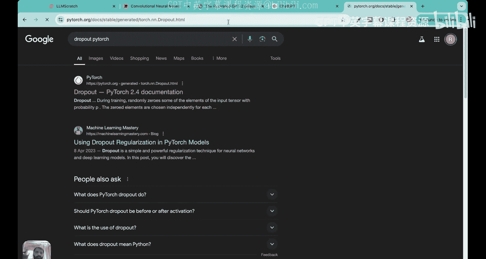
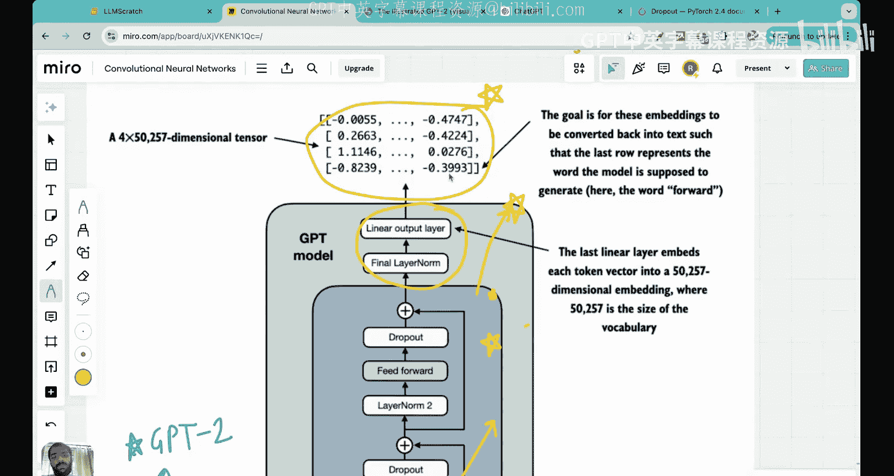

# 21：-23-编写完整的LLM Transformer Block

在本节课中，我们将最终编写出完整的Transformer块。在前面的三到四节课中，我们一直在为这节课奠定基础。首先，让我们回顾一下之前三节课中涵盖的内容。

当我们开始这个GPT架构系列时，我们首先介绍了层归一化以及为什么需要层归一化，并编写了一个层归一化类。然后，我们研究了带有GELU激活函数的前馈神经网络。接着，我们探讨了快捷连接及其必要性。我们编写了所有这些组件。今天这节课，就是这四个组件——层归一化、GELU激活函数、前馈神经网络和快捷连接——将共同组成所谓的Transformer块的时刻。

Transformer是大语言模型背后的核心引擎，今天你将看到我们如何编写出完整的Transformer块。让我们开始今天的课程。

首先，我想展示一下Transformer块在整个LLM堆栈中的宏观位置。

正如我们在之前的课程中所见，首先获取输入句子并进行分词。然后将其转换为向量嵌入，并在其上添加位置嵌入。接着应用一个Dropout层，最后我们进入Transformer块本身。在Transformer块内部，我们有几个层：一个层归一化层，接着是掩码多头注意力层，然后是Dropout层，接着是一个快捷连接。之后是另一个层归一化层，一个带有GELU激活函数的前馈神经网络，另一层Dropout，最后是另一个快捷连接。当我们离开Transformer块时，有几个步骤，称为后处理输出步骤。最终我们得到输出张量，这个张量用于预测输入序列中的下一个词。

今天我们将编写这个蓝色的结构，也就是Transformer块。正如我之前讨论的，Transformer块是GPT及其他LLM架构的基本构建块，因此请仔细关注今天的课程。

这里我想提一点，你可能看到这里的数字“2”并想知道它是什么。在GPT-2架构中，Transformer块实际上重复了12次。在我们这个LLM架构系列课程中，我们关注的是拥有1.24亿参数的最小版本GPT-2，在该版本中，Transformer块重复了12次。因此，我们现在要看到的代码在最终的GPT架构中实际上被复制了12次。

正如我告诉你的，Transformer块有几个我们之前看过的组件：层归一化、掩码多头注意力、Dropout、前馈神经网络和快捷连接。这里我列出了这五个组件：第一是掩码多头注意力，第二是层归一化，第三是Dropout，第四是前馈神经网络，第五是GELU激活函数。

现在，在跳入代码之前，我将快速回顾这五个子组件，以便刷新你的记忆，并在我们开始编写代码之前，让你对所学内容有更深入的理解。

## 组件回顾

### 1. 多头注意力

如果你忘记了，我们有一个非常全面的四节课系列来讲解注意力机制。在多头注意力中，我们查看输入，假设输入标记为矩阵 **X**。然后我们将输入与可训练的查询矩阵 **W_Q**、可训练的键矩阵 **W_K** 和可训练的值矩阵 **W_V** 相乘。在多头注意力的情况下，我们有多个副本，即多个可训练的查询矩阵、键矩阵和值矩阵。

因此，输入乘以这些权重矩阵后，我们得到查询矩阵 **Q**、键矩阵 **K** 和值矩阵 **V**。同样，在多头注意力中，我们得到这些矩阵的多个副本。接下来，我们取查询和键的点积，得到注意力分数。注意力分数被归一化后得到注意力权重，然后注意力权重与值矩阵相乘，得到一组上下文向量。

多头注意力或任何注意力机制的整个目标是将嵌入向量转换为上下文向量。上下文向量是什么？最简单的方式是认为它们是比嵌入向量更丰富的表示。嵌入向量包含特定词的语义含义，但不包含该词如何与句子中其他词相关的信息。上下文向量超越了嵌入向量，它不仅捕获特定词的语义含义，还捕获该词如何与句子中其他标记相关联或“关注”其他标记的信息，这就是为什么它被称为注意力机制。

整个多头注意力的目标是获取上下文向量。对于每个注意力头，都会生成一个单独的上下文向量矩阵，最终合并来自不同注意力头的上下文向量矩阵，得到这个组合的上下文向量矩阵。这个上下文向量矩阵就是多头注意力的输出。因此，每当你看到这里的掩码多头注意力层时，输入是向量嵌入，输出是来自多头注意力的上下文向量。

### 2. 层归一化

这个组件的作用是归一化层的输出。假设这些是任何层的输出，没有归一化时，它们会有随机的均值和方差。应用层归一化后，这些输出的值将被改变，使得均值为0，方差为1。

为什么需要这个？因为它为我们解决了两个问题。首先，它在反向传播过程中带来了一定的稳定性，确保值不会太大，从而防止梯度爆炸或消失。其次，它解决了内部协变量偏移的问题，这意味着在训练过程中，某一层接收到的输入在不同迭代中可能具有不同的分布。这是一个大问题，因为它会阻碍训练，使得更新权重变得非常困难，训练收敛需要很长时间。层归一化解了这个问题。

仔细观察Transformer块，你会发现层归一化在多个地方被实现：它被实现在多头注意力之前，也被实现在前馈神经网络之前。实际上，它在Transformer块内被实现了两次。需要注意的是，层归一化在Transformer块之后也有实现，但我们暂时不讨论那个。

### 3. Dropout

Dropout层可以应用在任何层之后。Dropout的作用是查看层的输出，然后随机关闭其中的一些输出。在应用Dropout之前，我们显示一个神经网络，这些是前一层输出的单元。在通过Dropout之后，这里的一些神经元或输入被随机关闭。

为什么它们被随机关闭？因为这样可以提高训练过程中的泛化能力。有些神经元变得懒惰，它们变得如此懒惰以至于完全不更新自己，而是依赖其他神经元。在测试时，这是一个大问题，因为这些懒惰的神经元没有学到任何东西。一旦我们实现Dropout，一个懒惰的神经元会发现其他正在做所有工作的神经元在那次迭代中不存在，因此懒惰的神经元别无选择，只能学习并更新其权重。这就是Dropout有助于泛化、防止过拟合的原因。

### 4. 前馈神经网络与GELU激活函数

这个前馈神经网络的构造相当有趣。我们保留了输入的维度。假设输入到神经网络的输入是一个具有嵌入维度的标记。在GPT-2中，嵌入维度是768。所以，如果一个词是“forward”或“step”，该词将被转换为768维的嵌入向量。假设这是传递给神经网络的输入。

首先，我们有一个扩展层，这意味着有一个隐藏的神经元层，这里的神经元数量是嵌入维度的四倍。所以，神经元数量将是 `4 * 768`。第一层进行扩展，意味着我们从768维变为 `4 * 768` 维。然后有一个第二层，即压缩层，我们再次回到开始时的完全相同的维度。因此，这个神经网络的输入维度和输出维度完全相同。

你可能会想，为什么首先要进行这种扩展和收缩？进行扩展和收缩是为了探索更丰富的参数空间。这种扩展将输入带入一个更高（四倍）维度的空间，在那里我们可以发现参数之间更好的关系，这通常有助于LLM更好地学习。为什么我们将其压缩回相同的输出维度？因为我们希望输入和输出维度保持不变。这有助于可扩展性，这样你就可以堆叠多个这样的神经网络，而不用担心维度变化。

在这一层神经元之后，每个神经元都必须有一个激活函数，在这种情况下使用的激活函数是GELU激活函数。通常大家都熟悉ReLU，但GELU是一个轻微的变体。对于 `x < 0`，GELU不等于0，这是一个变化。第二个变化是GELU在 `x = 0` 处是可微的，它是完全平滑的，不像ReLU在 `x = 0` 处不可微。对于 `x > 0`，GELU通常近似于ReLU，即 `y = x`，但并不完全等于 `x`，而是趋近于它。

因此，GELU通常解决了“死亡神经元”问题。这意味着如果一个神经元的输出是负数，并且它通过ReLU，输出将变为零。但当它通过GELU时，不会变为零。这时神经元将继续学习。在ReLU中，如果一个神经元的输出是负数，并且通过ReLU，输出为0，然后神经元就“死亡”了，在那之后它无法学习任何东西，学习停滞。GELU解决了这个问题。在LLM的实验中发现，GELU激活函数的表现通常比ReLU好得多。这就是为什么在这层神经元之后使用的激活函数是GELU激活函数。

### 5. 快捷连接

在快捷连接中，一层的输出与前一层的输出相加。在这里，你可以看到一层的输出与前一层的输出相加，然后我们创建了这个路径。类似地，在这里，你会看到这一层的输出与前一层的输出相加，然后我们创建了这个路径。

实现快捷连接的原因是它解决了梯度消失问题。在左侧，如果你看到梯度，最外层的梯度是0.005，但当你反向传播到第4层、第3层、第2层和第1层时，你会发现梯度已经减小到非常小的值。当你反向传播到第一层时，这就是梯度消失问题。然后，如果梯度变得非常小，学习就会停止，这对训练LLM不利。而如果我们实现这个快捷连接，它为梯度流动提供了另一条路径，使梯度流动更加稳定。这就是为什么梯度消失问题得到解决。如果你看到第5层的梯度大小是1.32，而第3层、第2层和第1层的大小都在0.2和0.3左右，所以梯度并没有变得极小，我们已经解决了梯度消失问题。实际上，这里的梯度大小看起来相当稳定。这就是为什么快捷连接是Transformer块如此重要的部分。

现在让我们缩小视野，一起看看这五个组件。我们学习了层归一化、Dropout、前馈神经网络、它与GELU的关联，最后学习了快捷连接。现在，当我们创建Transformer块时，所有这些都必须堆叠在一起，并且我们将遵循示意图中提到的特定顺序。

## Transformer块的顺序

这个顺序到底是什么？首先，我们从层归一化开始，然后在它上面堆叠多头注意力。接着，我们添加Dropout层。这个带加号的箭头就是快捷连接。然后，我们添加另一个层归一化。接着，我们添加带有GELU激活函数的前馈神经网络。然后，我们添加另一个Dropout层，最后再添加另一个快捷连接。这就是我们将在代码中做的事情。

在进入代码之前，我想解释一些概念细节。当Transformer块处理输入序列时，每个元素都由一个固定大小的向量表示，假设大小是每个元素的嵌入维度。

一个极其重要的需要注意的点是，Transformer块内的操作，如多头注意力和前馈层（记住扩展-收缩层），被设计为转换输入向量，同时保持维度不变。这一点非常重要。因此，当你查看这个Transformer块，查看进入Transformer的输入，以及离开Transformer的输出时，输出的形式和维度与输入完全相同。

我想提请你们注意这个极其重要的点，这就是为什么堆叠多个Transformer块变得如此容易。我们看到GPT-2有12个Transformer块，之所以能如此容易地堆叠它们，是因为Transformer块保留了维度。Transformer输入的维度与Transformer输出的维度相同。所以，如果你看输入，每个输入基本上是标记，标记被转换为向量嵌入，这就是Transformer的输入。现在，如果你看输出，输出具有完全相同的大小。因此，每个标记将有一个对应的输出，并且它将具有与输出中完全相同的维度。

许多学生没有注意到Transformer保留维度的重要性，但这是Transformer块创建方式最重要的特性之一。我们本可以轻松创建输出维度不同的Transformer块，但那将无助于我们扩展Transformer块。现在，我们可以直接堆叠不同的Transformer块，而不用担心维度问题。

为了复习，自注意力块与前馈块不同。自注意力块分析输入元素之间的关系，即分析一个输入元素如何与其他输入元素相关，并分配一个注意力分数。但前馈神经网络只是单独查看每个元素。所以，当我们看这里的神经网络时，我们一次只查看一个输入标记，一个具有768维度的输入标记，输出也是768维度，这意味着我们一次只查看一个输入，而不查看它与其他输入的关系。这是多头注意力机制和前馈神经网络之间的一个区别。

好了，现在如果你们都理解了Transformer块背后的理论和直觉，现在是时候跳入代码了。我将带你们进入Python代码，让我们一起编写Transformer块的不同方面。

## 代码实现：Transformer块

在继续之前，我想讨论一下我们将要使用的配置。我们将使用GPT-2最小版本的配置，该版本有1.24亿参数。这里的词汇表大小是50257，上下文长度是1024。上下文长度是允许预测下一个标记的最大输入标记数，这在表示位置嵌入时需要。然后我们有嵌入维度，记住每个标记被转换为向量嵌入，这里的维度是768。`n_heads` 是注意力头的数量，是12。`n_layers` 是12，这实际上是Transformer块的数量。记住，注意力头的数量和Transformer块的数量是不同的。在每个Transformer块内部，有一个多头注意力块，它可以有多个注意力头。然后，当我们有Dropout层时，我们只有Dropout率，这里指定平均10%的神经元或层元素将被设置为0，所以现在是0.1。然后，`query_key_value_bias` 设置为False，因为我们现在不需要这个偏置项，我们将随机初始化查询、键和值矩阵的权重，不带偏置曲线。

在进入Transformer块之前，我们需要复习一下之前为其他块编写的代码。我们看到了层归一化，并且之前为层归一化定义了一个类。这个类的作用是简单地接受一个输入，从输入中减去均值，然后除以方差的平方根。这确保元素被归一化，使其均值等于0，标准差或方差等于1。记住，在那个分母中，我们还添加了一个非常小的值以防止除以零。你可能想知道缩放和移位是什么。这些是可训练的参数，可以认为是在训练过程中学习的参数。这就是层归一化，这里嵌入维度是输入，归一化是沿着嵌入维度执行的。

为了给你一个视觉表示，让我们看看这些标记，每个标记的嵌入维度是768。在归一化中，我们查看单独的行，然后跨列进行归一化。我们确保均值为0，标准差为1。这些值可以是任何层的输出。假设这里有一个层归一化，它接收来自这里的输入，输入维度为768，因为维度被保留。我们将沿着768维（即嵌入维度）取均值，确保归一化使得沿列的均值为0，标准差为1。这将是层归一化的输出，因此大小与输入相同，但会改变的是每一行的均值为0，标准差为1。

然后我们有GELU激活函数，正如我们所见，它由GPT-2中使用的这个近似定义。一旦我们使用这个近似，GELU就开始看起来像我们在构建块中看到的那样。实际上，在之前的一节课中，我们看到了实际使用的函数。这是研究人员训练GPT-2时实际使用的函数近似，这正是我们在这里写的。

然后我们有前馈神经网络，它接收输入，输入维度是嵌入维度，将其扩展到四倍嵌入维度，然后进行GELU激活，接着是压缩层，将四倍嵌入维度的输入带回原始嵌入维度。所以在这里你可以看到，前馈神经网络由扩展、激活和压缩组成。这正是我们在白板上看到的部分。

好了，现在我们已经编写了不同的类：一个层归一化类，一个GELU激活类，以及一个前馈神经网络类。现在我们准备使用之前学习的这些构建块来编写整个Transformer块。

这是Transformer块的类。首先，让我转到前向传播方法，告诉你我们在这里做什么。要理解这个顺序，你只需要记住这个图中的顺序。

所以，让我现在带你看看那个图。为了让你更好地看到这个顺序，我把屏幕上所有的东西都擦掉。现在有太多颜色和符号了。希望你现在能看到这个顺序了。我们将遵循完全相同的顺序，现在请记住它。你甚至可以在看视频时稍后查看这个白板并复习。

首先，我们有层归一化，接着是注意力，然后是Dropout，接着是快捷连接。所以最初我们看到这四个步骤。然后我们有接下来的步骤，这是另一个层归一化。在接下来的四个步骤中，我们有另一个层归一化，然后是前馈神经网络，接着是Dropout和快捷连接。所以，如果你理解白板上显示的图表，前向传播方法中发生的事情就非常简单了。

但是，让我们看看当我们创建Transformer块类的实例时，创建了哪些不同的对象。`attn` 是多头注意力对象，这是我们在之前一节课中定义的多头注意力类的一个实例。这个类的作用是将嵌入向量转换为上下文向量。输入维度是嵌入维度，输出与嵌入维度相同。我们必须指定上下文长度，这里是1024。再次复习一下，上下文长度是1024。注意力头的数量是注意力头的数量，我想这里是12。Dropout是之前使用的Dropout率10%，`query_key_value_bias` 设置为False。如果你想复习多头注意力，请去我们之前涵盖此内容的一节课。每当创建这个多头注意力类的实例 `attn` 时，它接收输入嵌入并将其转换为上下文向量。这里的大小是批大小、标记数量和嵌入大小。所以，如果标记数量是四或五个，这里将是四个，每个的嵌入大小是768（在我们的例子中），批大小可以是任何我们定义的批大小。

然后我们有另一个对象 `ff`，它是前馈类的一个实例。我们看到前馈类在这里，我们只需要在这里指定配置，以便从配置中获取嵌入维度。这个类的作用是创建这些层，并使用GELU激活函数随机初始化权重。所以，`ff` 是前馈类的一个实例。无论在哪里使用 `ff`，输入被传入，它经过扩展、GELU和压缩，输出是与输入相同的维度。

然后我们有 `norm_1` 和 `norm_2`，所以 `norm_1` 是第一个归一化层，`norm_2` 是第二个归一化层。你看到第一个归一化层用在多头注意力之前，第二个归一化层用在前馈神经网络之前。这就是为什么这些有时也被称为前置层归一化层，因为它们用在多头注意力和前馈神经网络之前。

最后一个对象是 `drop_shortcut`，它基本上是一个Dropout层。`nn.Dropout` 是PyTorch中预定义的。

现在，当你查看前向传播方法时，我已经向你解释了 `norm_1`，它是第一个归一化层对象，然后是 `attn`，接着是 `drop_shortcut`，它是Dropout层。我们不需要为快捷连接创建一个单独的类，因为我们所做的只是将这个输出加回到原始输入。所以，当你查看快捷机制时，看看箭头在哪里。如果你看这里的这个箭头，我们正在做的是将这里的这个输入与Dropout的输出相加。所以，Dropout的输出被加到这个输入上。让我用黄色标记这个，以便你能清楚地理解。输入在这里用黄色星号标记，Dropout的输出用另一个黄色星号标记，我们将这两个黄色星号相加。这就是第一个快捷连接。

所以，我们做的是：`shortcut` 被初始化为 `x`，即输入，然后 `x` 被修改为Dropout的输出。因此，我们基本上是将Dropout输出与输入相加，这正是我们在白板上看到的。在第二个快捷连接中，实际发生的是，你看到这里有第二个归一化层的输入，以及第二个Dropout的输出。所以，我们将第二个归一化层的输入与第二个Dropout的输出相加。你会在代码中看到