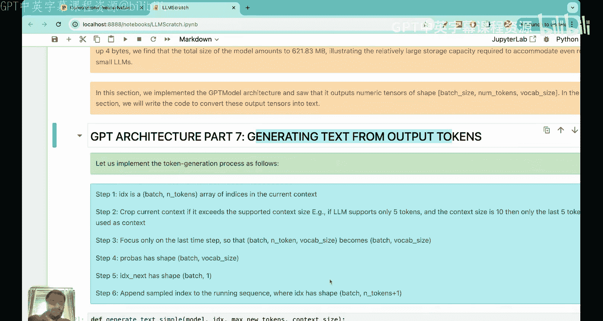

# 22：编码1.24亿参数的GPT-2模型


## 概述
在本节课中，我们将学习如何将之前构建的所有组件（如层归一化、前馈神经网络、Transformer块）组装起来，编码一个完整的GPT-2模型。我们将从输入文本开始，逐步经过词嵌入、位置编码、Transformer块等步骤，最终得到模型的输出逻辑值。我们将使用GPT-2的配置（约1.24亿参数），并在本地计算机上运行这个模型。

---

## 模型架构回顾
上一节我们介绍了Transformer块的具体实现。本节中，我们将看看如何将Transformer块与其他组件结合，构建完整的GPT模型。

GPT模型的整体流程可以概括为以下几个步骤：
1.  将输入文本转换为词元ID。
2.  将词元ID转换为词嵌入向量。
3.  添加位置嵌入向量。
4.  应用Dropout层。
5.  通过多个堆叠的Transformer块。
6.  应用最终的层归一化。
7.  通过线性输出层，得到逻辑值。

以下是GPT模型架构中各个组件的维度变化流程，我们将以一个包含四个词元的输入序列为例进行说明。

### 步骤详解

#### 1. 词元嵌入
输入文本“every effort moves you”首先被转换为四个词元ID。每个词元ID通过一个嵌入层被映射为一个768维的向量。公式表示为：
`词元嵌入 = EmbeddingLayer(词元ID)`
初始时，这些向量是随机初始化的，并在模型训练过程中学习。

#### 2. 位置嵌入
为了捕捉词元在序列中的顺序信息，我们为序列中的每个位置（1到4）也生成一个768维的向量。公式表示为：
`位置嵌入 = EmbeddingLayer(位置索引)`
位置嵌入向量同样在训练开始时随机初始化。

#### 3. 输入嵌入
将每个词元的词嵌入向量与其对应的位置嵌入向量相加，得到最终的输入嵌入。公式表示为：
`输入嵌入 = 词元嵌入 + 位置嵌入`
这一步确保了每个输入向量既包含语义信息，也包含位置信息。

#### 4. Dropout层
为了防止过拟合，我们在输入嵌入上应用Dropout。Dropout会随机将输入嵌入向量中的一部分元素设置为0。例如，如果Dropout率为0.5，则平均每个向量有50%的元素被置零。

#### 5. Transformer块
输入嵌入随后被送入Transformer块。这是模型的核心，我们之前已经详细构建了它。Transformer块内部包含层归一化、多头注意力机制、前馈神经网络等子层。关键点在于，**Transformer块的输入和输出维度保持不变**（本例中为 `[4, 768]`），这使得我们可以轻松堆叠多个Transformer块。

#### 6. 最终层归一化
经过所有Transformer块处理后，输出会再经过一次层归一化，以稳定训练。

#### 7. 输出头（线性层）
最后，归一化后的输出通过一个线性层（输出头）。该线性层将每个词元的768维向量映射到整个词表的大小（GPT-2为50257维）。公式表示为：
`逻辑值 = LinearLayer(Transformer输出)`
因此，对于我们的四个词元输入，最终输出是一个形状为 `[4, 50257]` 的张量，每一行代表对应位置预测下一个词元在整个词表上的未归一化分数（逻辑值）。

#### 批次处理
在实际中，输入通常以批次处理。如果批次大小为2，每个批次有4个词元，则最终输出的形状为 `[2, 4, 50257]`。

---

## 代码实现
现在，我们对模型的数据流有了直观理解，接下来看看如何用代码实现它。

我们将使用以下GPT-2配置：
```python
vocab_size = 50257        # 词表大小
context_length = 1024     # 上下文长度
embed_dim = 768           # 嵌入维度
num_heads = 12            # 注意力头数
num_layers = 12           # Transformer层数
drop_rate = 0.1           # Dropout率
```

以下是构建GPT模型类的核心代码：

```python
import torch.nn as nn

class GPTModel(nn.Module):
    def __init__(self, config):
        super().__init__()
        self.config = config

        # 词元嵌入层
        self.token_embedding = nn.Embedding(config.vocab_size, config.embed_dim)
        # 位置嵌入层
        self.position_embedding = nn.Embedding(config.context_length, config.embed_dim)
        # Dropout层
        self.dropout = nn.Dropout(config.drop_rate)
        # 堆叠多个Transformer块
        self.transformer_blocks = nn.Sequential(
            *[TransformerBlock(config) for _ in range(config.num_layers)]
        )
        # 最终层归一化
        self.final_layer_norm = LayerNorm(config.embed_dim)
        # 输出头（线性层）
        self.output_head = nn.Linear(config.embed_dim, config.vocab_size, bias=False)

    def forward(self, input_ids):
        batch_size, seq_len = input_ids.shape
        device = input_ids.device

        # 1. 获取词元嵌入
        token_embeds = self.token_embedding(input_ids)  # 形状: [batch_size, seq_len, embed_dim]

        # 2. 获取位置嵌入
        position_ids = torch.arange(seq_len, device=device).unsqueeze(0)  # 形状: [1, seq_len]
        position_embeds = self.position_embedding(position_ids)  # 形状: [1, seq_len, embed_dim]

        # 3. 相加得到输入嵌入
        x = token_embeds + position_embeds  # 形状: [batch_size, seq_len, embed_dim]

        # 4. 应用Dropout
        x = self.dropout(x)

        # 5. 通过所有Transformer块
        x = self.transformer_blocks(x)  # 形状保持不变: [batch_size, seq_len, embed_dim]

        # 6. 最终层归一化
        x = self.final_layer_norm(x)  # 形状: [batch_size, seq_len, embed_dim]

        # 7. 通过输出头，得到逻辑值
        logits = self.output_head(x)  # 形状: [batch_size, seq_len, vocab_size]

        return logits
```

### 运行模型
我们可以创建一个模型实例并传入一个输入批次来测试：

```python
# 模型配置
config = ModelConfig(vocab_size=50257, embed_dim=768, num_layers=12, ...)
# 实例化模型
model = GPTModel(config)

# 创建一个模拟输入批次 (2个批次，每个4个词元)
input_batch = torch.tensor([[100, 150, 200, 250], [300, 350, 400, 450]])
# 前向传播
output_logits = model(input_batch)
print(output_logits.shape)  # 输出: torch.Size([2, 4, 50257])
```

### 参数量与内存占用
我们的模型拥有大量参数。我们可以计算总参数量：

```python
total_params = sum(p.numel() for p in model.parameters())
print(f"总参数量: {total_params}")  # 输出约为1.63亿
```

这个数字比原始GPT-2的1.24亿参数要多，是因为我们没有使用**权重绑定**。在原始GPT-2中，词元嵌入层的权重与输出头线性层的权重是共享的，这减少了参数量和内存占用。我们的实现为了更好的训练性能，选择了使用独立的层。

即使如此，模型的内存占用也相当可观：
```python
# 假设每个参数为32位浮点数（4字节）
memory_bytes = total_params * 4
memory_mb = memory_bytes / (1024 ** 2)
print(f"模型内存占用（近似）: {memory_mb:.2f} MB")  # 输出约为620 MB
```

---




## 总结
本节课中我们一起学习了如何从零开始编码一个完整的GPT-2模型架构。我们回顾了从输入词元到输出逻辑值的整个数据流，明确了每个步骤（词嵌入、位置编码、Transformer块、输出头）的维度和作用。通过代码实现，我们将之前构建的各个组件组装起来，成功创建了一个拥有超过1.6亿参数、可在本地运行的“大语言模型”。这个模型的最终输出是一个逻辑值张量，为下一节课的文本生成任务奠定了基础。理解这个架构的维度流动是掌握大语言模型工作原理的关键。