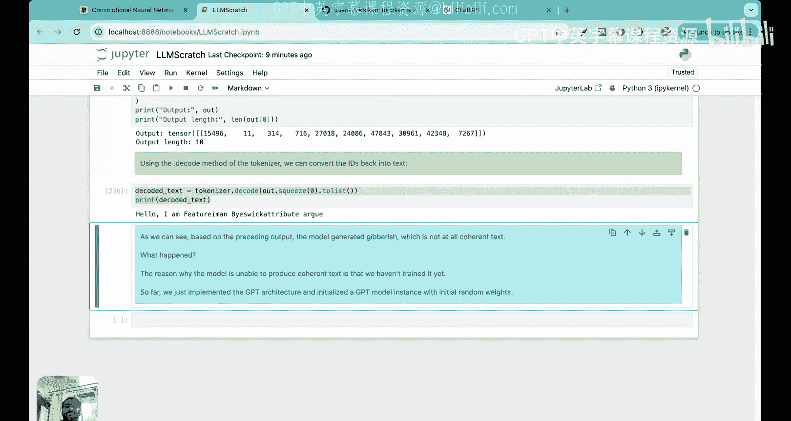

# 23：从输出张量预测下一个词元


在本节课中，我们将学习如何从GPT模型的输出张量中生成文本。我们将深入理解大语言模型预测下一个词元的迭代过程，并编写代码实现这一核心功能。

## 概述：大语言模型如何生成文本

上一节我们完成了GPT模型的整体构建。本节中，我们来看看如何利用模型的输出生成连贯的文本。

大语言模型生成文本的核心是一个迭代过程。模型接收一系列输入词元，预测下一个词元，然后将预测出的词元追加到输入序列中，作为下一轮迭代的输入。这个过程会重复进行，直到生成指定数量的新词元。

以下是该过程的简要说明：
*   给定初始输入词元（例如 “hello I am”），模型预测下一个词元（例如 “a”）。
*   将预测出的词元 “a” 追加到输入序列末尾，形成新的输入 “hello I am a”。
*   模型基于新的输入序列预测下一个词元（例如 “model”）。
*   重复此过程，直到达到预设的最大新词元数量。

在这个过程中，**上下文长度**（context size）是一个关键参数，它决定了模型在预测下一个词元时，最多可以回顾前面多少个词元。在GPT-2架构中，这个值是1024。

## 回顾：从输入到输出张量的完整流程

在深入代码之前，我们先快速回顾一下之前课程中构建的完整数据处理流程。

我们从一句输入文本开始，例如 “every effort moves you”。
1.  **词元化**：将句子转换为词元ID序列。
2.  **嵌入层**：将每个词元ID转换为一个词元嵌入向量（维度为768）。
3.  **位置编码**：为每个位置生成一个位置嵌入向量，并与词元嵌入相加，得到最终的输入嵌入。
4.  **Dropout层**：对输入嵌入应用随机失活。
5.  **Transformer块**：输入嵌入经过多个Transformer块的处理。每个块包含层归一化、多头注意力机制、前馈神经网络等组件。这是模型理解上下文关系的核心。
6.  **最终层归一化**：对Transformer块的输出进行归一化。
7.  **输出头**：一个线性层，将最终的嵌入向量映射到整个词表大小的逻辑值（logits）张量。

至此，我们得到了一个形状为 `(batch_size, num_tokens, vocab_size)` 的输出张量。对于输入 “every effort moves you”（4个词元），输出张量的形状是 `(1, 4, 50257)`，其中50257是GPT-2的词表大小。

## 理解输出张量与下一个词元预测

现在，我们面临一个关键问题：如何从这个庞大的输出张量中得到预测的下一个词？

输出张量中的每一行都对应一个特定的“预测任务”。对于包含4个词元的输入序列：
*   第1行（对应“every”）：预测在“every”之后最可能出现的词（应该是“effort”）。
*   第2行（对应“effort”）：预测在“every effort”之后最可能出现的词（应该是“moves”）。
*   第3行（对应“moves”）：预测在“every effort moves”之后最可能出现的词（应该是“you”）。
*   **第4行（对应“you”）**：预测在“every effort moves you”之后最可能出现的词（这**才是我们想要的下一个词**，例如“forward”）。

因此，要得到整个序列的下一个预测词，我们需要关注输出张量的**最后一行**。这一行包含了模型基于整个输入序列，对词表中所有50257个词作为下一个词出现可能性的“评分”，即逻辑值。

## 从逻辑值到生成词元的步骤

从输出张量的最后一行得到最终的下一个词元，需要经过以下几个步骤：

**步骤一：提取最后一行逻辑值向量**
我们从形状为 `(batch_size, num_tokens, vocab_size)` 的输出张量中，提取每个批次最后一个时间步（即最后一个词元）对应的逻辑值向量。代码表示为 `logits[:, -1, :]`，结果形状变为 `(batch_size, vocab_size)`。

**步骤二：将逻辑值转换为概率**
逻辑值向量中的数字大小不一，且总和不为1。我们使用 **Softmax** 函数将其转换为概率分布。Softmax确保转换后的所有值都在0到1之间，且总和为1。公式如下：
`probabilities = softmax(logits_vector)`

**步骤三：确定最高概率的词元ID**
在得到的概率分布中，我们找出值最大的那个元素对应的索引。这个索引就是模型预测的**下一个词元的ID**。代码表示为 `torch.argmax(probabilities, dim=-1)`。

**步骤四：将词元ID解码为文本**
使用词表（Tokenizer）将上一步得到的词元ID转换回对应的文本（词元）。

**步骤五：将新词元追加到输入序列**
将新生成的词元ID追加到原始输入序列的末尾。这样，在下一轮迭代中，模型就能基于更长的历史上下文进行预测。

这个过程会循环执行，每次生成一个新词元并追加到序列中，直到生成的新词元数量达到预设的 `max_new_tokens`。

## 代码实现：文本生成函数

理解了原理后，我们开始编写 `generate_text_simple` 函数来实现上述过程。

首先，我们需要确保输入序列的长度不超过模型的上下文长度。如果超过，我们只截取最后 `context_size` 个词元作为有效输入。

```python
idx_cond = idx[:, -context_size:] if idx.size(1) > context_size else idx
```

接下来，我们将处理后的输入传入模型，获得逻辑值张量。

```python
logits = model(idx_cond)
```

然后，我们提取最后一个时间步的逻辑值，并应用Softmax将其转换为概率。虽然对于直接选取最大值的操作，Softmax并非必需（因为 `argmax` 在逻辑值上直接操作结果相同），但为了展示完整流程并为后续更复杂的采样方法（如引入温度系数）做准备，这里我们保留此步骤。

```python
logits_last = logits[:, -1, :]
probs = torch.softmax(logits_last, dim=-1)
```

接着，我们找出概率最高的索引作为下一个词元ID，并将其解码。

```python
idx_next = torch.argmax(probs, dim=-1).unsqueeze(1)
```

最后，我们将新生成的词元ID追加到输入序列中，为下一次迭代做准备。

```python
idx = torch.cat((idx, idx_next), dim=1)
```

我们将以上步骤放入一个循环中，循环次数即为 `max_new_tokens`。

## 测试未训练的模型

现在，我们可以用一段示例文本测试我们构建的完整GPT-2架构。由于模型的1.24亿个参数尚未经过训练，它们都是随机初始化的，因此生成的文本看起来会是随机的、无意义的。但这恰恰证明我们的架构搭建是正确的，数据流是通畅的。

我们输入 “hello I am”，并请求模型生成6个新词元。

```python
input_text = “hello I am”
input_ids = encoder.encode(input_text) # 使用tiktoken编码器
input_tensor = torch.tensor([input_ids]) # 添加批次维度

model.eval() # 将模型设置为评估模式
output_ids = generate_text_simple(model=model, idx=input_tensor, max_new_tokens=6, context_size=model_config.context_length)
generated_text = encoder.decode(output_ids[0].tolist()) # 解码为文本
print(generated_text)
```

输出可能是一串随机的词元序列，这与我们在白板上演示的 “hello I am a model ready to help” 相去甚远。这正是预期的结果，因为**模型尚未学习任何语言规律**。

## 总结与展望

本节课中，我们一起学习了GPT模型生成文本的核心迭代机制，并成功编写代码实现了从输出张量预测下一个词元的功能。我们完成了以下关键任务：
1.  理解了LLM通过“预测-追加”循环生成文本的原理。
2.  分析了GPT模型输出张量的结构，明确了最后一行对应下一个词的预测。
3.  实现了从逻辑值到生成词元的完整步骤：提取、Softmax、取argmax、解码、追加。
4.  编写了 `generate_text_simple` 函数，并测试了拥有1.24亿参数的未训练GPT-2模型。

至此，我们已经**从零开始完整搭建了GPT-2模型架构**，并实现了前向传播和简单的文本生成。这是一个重要的里程碑。模型目前表现不佳的唯一原因是参数是随机的。

在接下来的模块中，我们的核心任务将是**训练这1.24亿个参数**。通过在大规模文本数据上进行训练，模型将逐渐学会语言的内在规律和模式，其生成的文本也会变得越来越连贯、有意义。我们将在后续课程中深入探讨数据准备、损失函数、训练循环以及优化策略等内容。




你已经完成了超过95%学习者可能止步的艰巨工作，亲手在本地机器上构建并运行了一个完整的GPT-2架构，这非常了不起！感谢你的坚持学习，我们下节课再见。