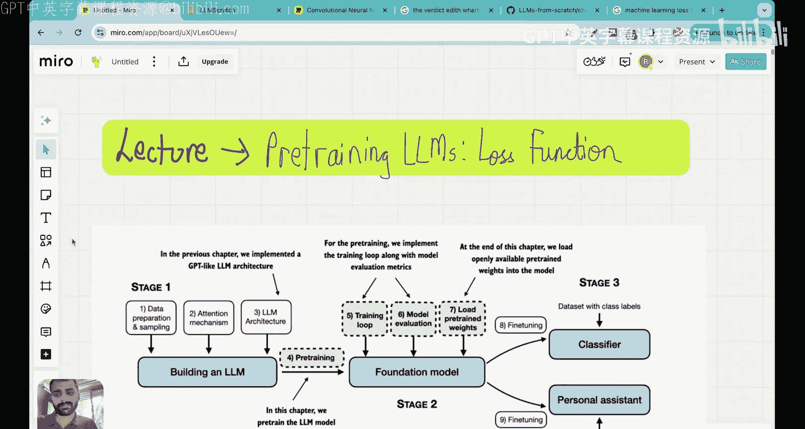
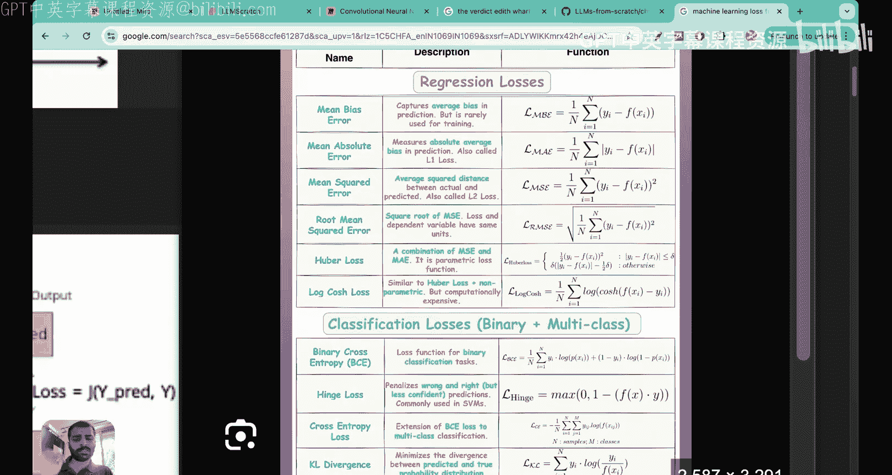
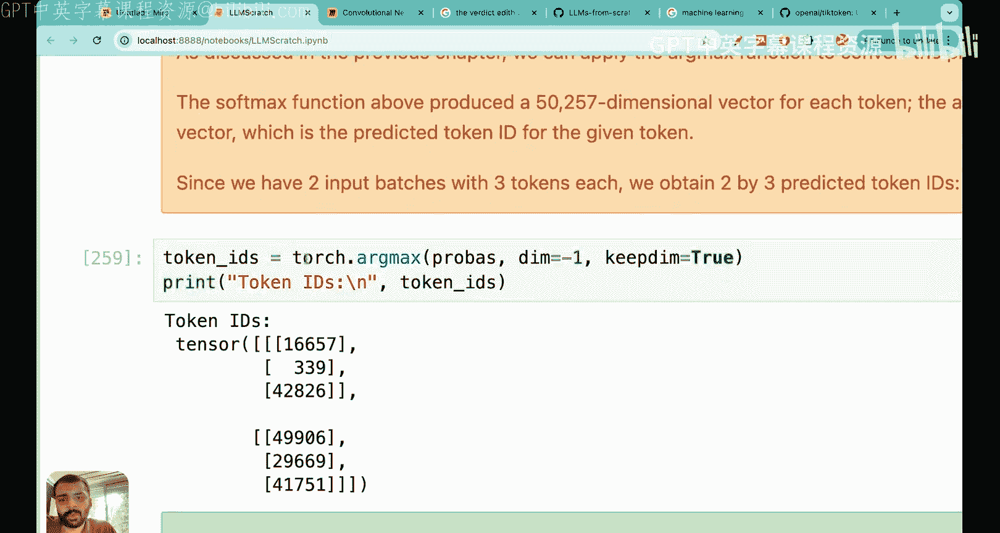
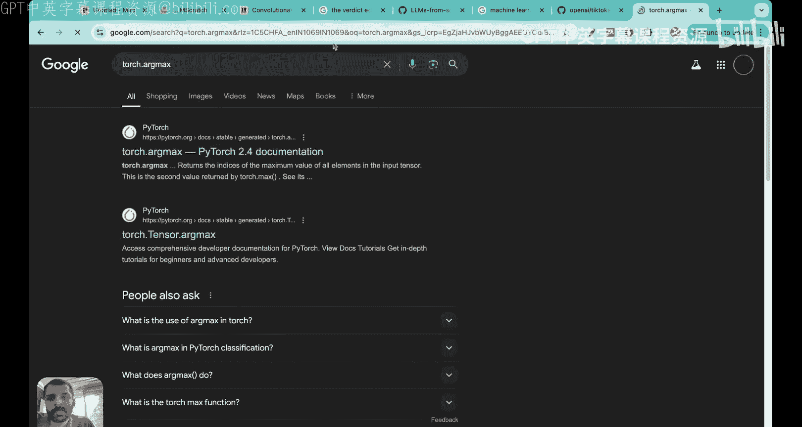
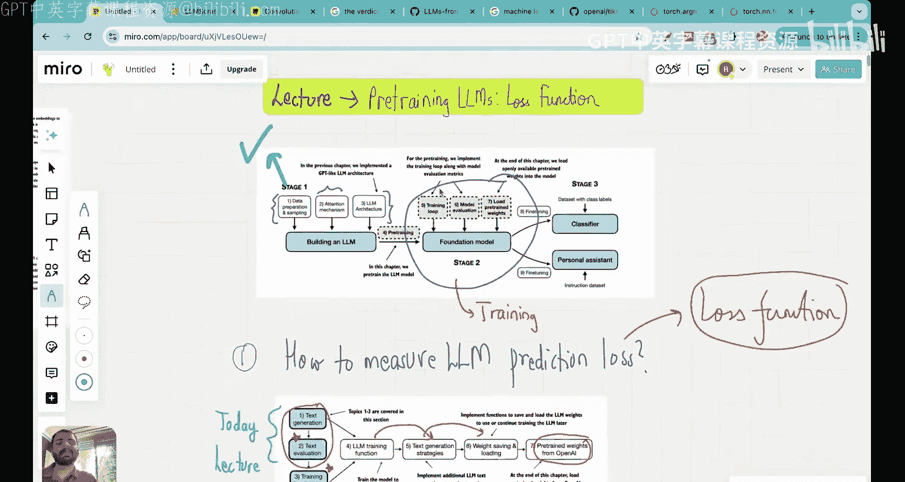

# 24：测量LLM的损失函数






在本节课中，我们将学习如何为大语言模型定义和计算损失函数。这是训练模型使其预测更准确的关键一步。

## 概述

上一节我们介绍了GPT架构，并构建了一个能够接收输入并预测下一个词的模型。然而，模型的初始预测是随机的，效果不佳。本节中，我们将探讨如何量化模型预测的“好坏”，即如何定义损失函数。我们将学习输入、目标（真实值）和模型输出之间的关系，并最终使用交叉熵损失和困惑度来评估模型性能。

## 输入与目标

首先，我们需要理解模型的输入和期望的输出（即目标）的格式。

模型的输入是一个张量，其行数对应批处理大小。例如，一个包含两个批次、上下文长度为3的输入可能如下所示：

*   **批次1输入**：`[16833, 3626, 6100]` (对应文本 “every effort moves”)
*   **批次2输入**：`[40, 1107, 588]` (对应文本 “I really like”)

对于每个输入序列，模型的任务是预测下一个词。但请注意，对于一个长度为 `n` 的输入序列，实际上存在 `n` 个预测任务。因此，目标张量（真实值）的形状与输入相同，但其值是输入序列向右移动一位的结果。

以下是目标张量的构成：

*   **批次1目标**：`[3626, 6100, 345]`
    *   当输入为 `16833` (“every”) 时，期望输出 `3626` (“effort”)。
    *   当输入为 `[16833, 3626]` (“every effort”) 时，期望输出 `6100` (“moves”)。
    *   当输入为 `[16833, 3626, 6100]` (“every effort moves”) 时，期望输出 `345` (“you”)。
*   **批次2目标**：`[1107, 588, 11311]`
    *   对应预测 “I” -> “really”, “I really” -> “like”, “I really like” -> “chocolate”。

我们的目标是让模型的预测输出尽可能接近这些目标值。

## 模型输出与文本生成

接下来，我们回顾模型如何生成输出。输入文本首先被转换为词元ID，然后经过GPT模型（包含嵌入层、位置编码、多个Transformer块等）处理，最终得到一个逻辑值张量。

这个逻辑值张量的形状为 `(批大小, 序列长度, 词汇表大小)`。例如，对于两个批次、序列长度为3、词汇表大小为50257的情况，形状为 `(2, 3, 50257)`。

为了得到预测的下一个词元ID，我们需要对逻辑值张量应用 **softmax** 函数，将其转换为概率分布。然后，对序列中每个位置（每一行），取概率最大的索引作为预测结果。

以下是文本生成的步骤分解：





1.  **输入**：文本序列（例如 “every effort moves”）。
2.  **词元化**：使用分词器（如BPE）将文本转换为词元ID序列 `[16833, 3626, 6100]`。
3.  **模型前向传播**：词元ID序列通过GPT模型，得到逻辑值张量。
4.  **概率转换**：对逻辑值张量应用softmax，得到每个位置对所有词汇的概率分布。
5.  **预测**：对每个位置，选择概率最高的词元ID作为该位置的预测输出。

在模型未经训练时，这些预测是随机的，例如输入 “every effort moves” 可能输出无意义的词元序列。

## 定义损失函数

为了训练模型，我们需要一个可量化的指标来衡量模型预测与真实目标之间的差距，这就是损失函数。对于分类任务（如下一个词预测），最常用的损失函数是**交叉熵损失**。

其核心思想是：我们希望模型在目标词元位置给出的概率尽可能高（接近1）。损失函数通过计算模型预测概率分布的负对数似然来量化这个差距。

具体计算步骤如下：

1.  获取模型输出的概率张量 `probs`，形状为 `(批大小, 序列长度, 词汇表大小)`。
2.  根据目标张量 `targets` 中的索引，从 `probs` 中提取对应位置的概率值。例如，对于批次1的第一个目标 `3626`，我们取出 `probs[0, 0, 3626]` 的概率值 `p11`。
3.  收集所有批次和所有位置的目标概率值，得到 `[p11, p12, p13, p21, p22, p23]`。
4.  计算这些概率的负对数似然的平均值：
    **损失 = -mean(log(p11) + log(p12) + ... + log(p23))**

当所有目标概率 `p` 都接近1时，`log(p)` 接近0，损失值也接近0，表示模型预测完美。反之，概率越低，损失越大。

在PyTorch中，这可以通过一行代码高效实现：
```python
loss = torch.nn.functional.cross_entropy(logits_flattened, targets_flattened)
```
其中 `logits_flattened` 是将逻辑值张量前两维展平后的结果（形状为 `(总词元数, 词汇表大小)`），`targets_flattened` 是展平后的目标张量（形状为 `(总词元数,)`）。这个函数内部会自动进行softmax和负对数似然计算。

## 困惑度：一个更直观的指标

除了交叉熵损失，**困惑度** 是评估语言模型的另一个常用且更直观的指标。

困惑度的计算公式非常简单：
**困惑度 = exp(损失)**

困惑度可以解释为“模型在预测下一个词时，平均面临的选择不确定性”。例如：
*   如果损失为10.79，则困惑度 = exp(10.79) ≈ 48725。
*   这意味着，对于给定输入，模型在预测下一个词时，其不确定性相当于要从大约48725个等可能的词中随机挑选一个。这非常糟糕，因为总词汇量才50257。
*   理想的困惑度应该尽可能低。如果困惑度接近1，表示模型非常确定；如果困惑度等于词汇表大小，则表示模型完全随机猜测。

因此，困惑度将抽象的损失值转化为一个与模型预测不确定性直接相关的、更易于理解的数字。

## 总结

本节课中我们一起学习了如何为大语言模型定义和计算损失函数。

1.  我们首先明确了模型的**输入**和**目标**（真实值）的格式，理解了序列预测任务是如何分解的。
2.  接着，我们回顾了模型如何生成输出，即通过GPT架构得到逻辑值，再经softmax得到概率分布，最后通过argmax得到预测词元。
3.  然后，我们深入探讨了**交叉熵损失**的原理。其核心是最大化模型在目标词元位置预测的概率，并通过计算负对数似然平均值来量化误差。我们在PyTorch中可以用一行代码 `torch.nn.functional.cross_entropy` 来实现它。
4.  最后，我们介绍了**困惑度**这一指标，它通过 `exp(损失)` 计算，能更直观地反映模型预测的不确定性，值越低表示模型越好。




通过定义损失函数，我们将训练大语言模型的问题转化为了一个可以通过梯度下降等优化算法解决的数值优化问题。在下一节课中，我们将把这些知识应用于整个数据集，开始实际训练我们的模型。