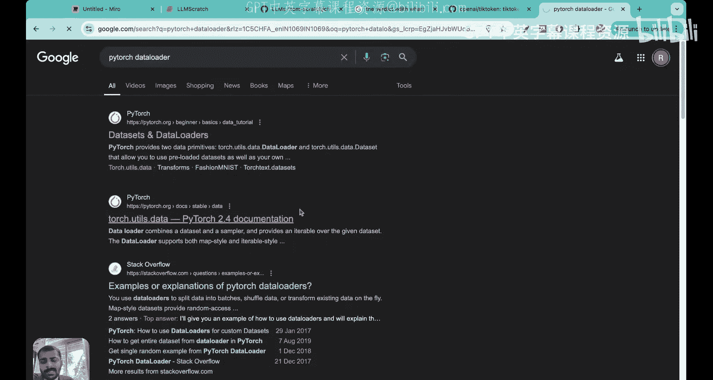
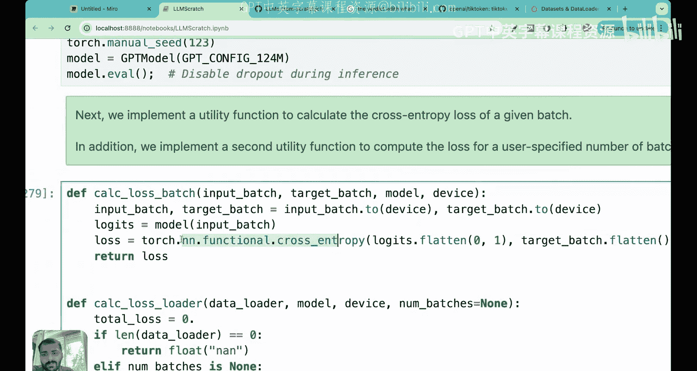
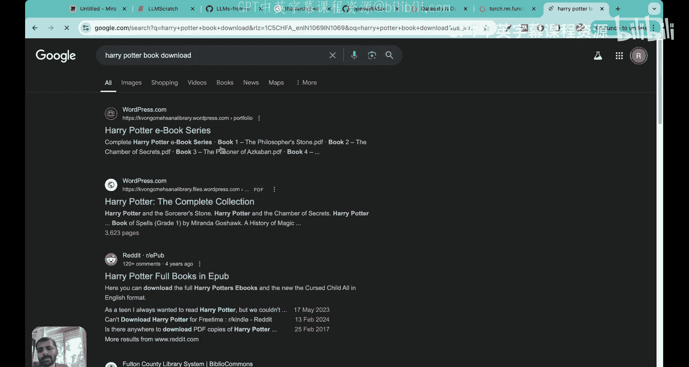
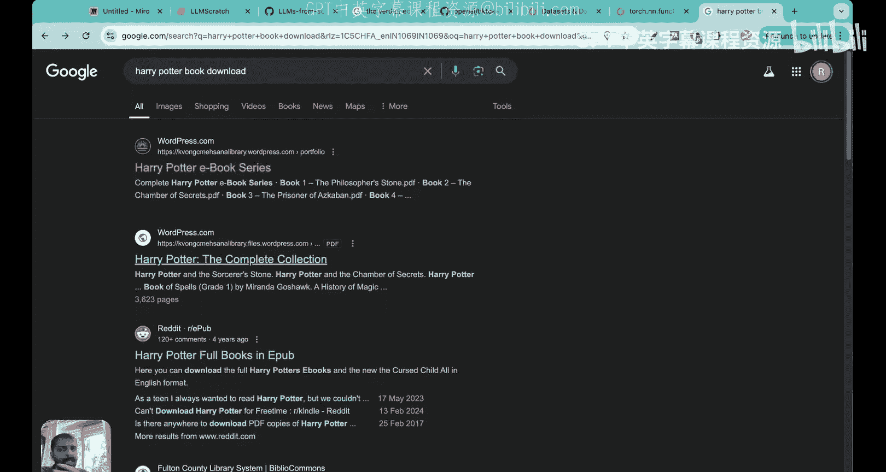
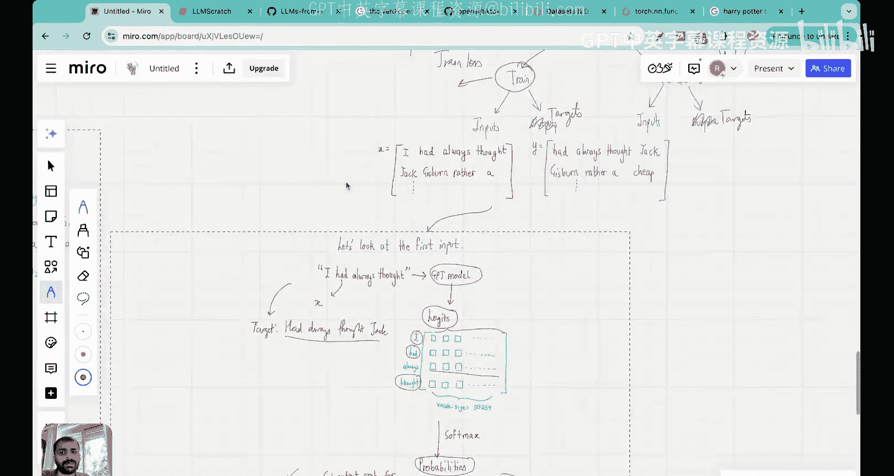

# 25：在真实数据集上评估LLM性能 _ 动手项目 _ 书籍数据


在本节课中，我们将学习如何在一个真实的书籍数据集上评估我们构建的大型语言模型的性能。我们将收集数据，使用模型进行预测，并计算训练损失和验证损失。这是迈向模型训练的关键一步。

## 📚 概述与数据准备

上一节我们介绍了如何为简单的输入计算交叉熵损失。本节中，我们将在一个更大的真实数据集上进行实践。

我们使用的数据集是埃德·沃顿于1906年出版的短篇小说《裁决》。这本书篇幅较短，包含约20，000个字符，便于快速演示。你可以从公开链接下载此书。

首先，我们需要将文本数据转换为模型可以理解的令牌。我们将使用字节对编码方案，这与OpenAI使用的方案相同。经过编码后，该数据集大约有5，000个令牌。

```python
# 示例：使用Tiktoken进行字节对编码
import tiktoken
tokenizer = tiktoken.get_encoding(“gpt2”)
tokens = tokenizer.encode(text_data)
print(f”令牌数量：{len(tokens)}”)
```

## 🧩 划分训练集与验证集

与所有机器学习问题一样，我们需要将数据划分为训练集和验证集。训练损失并不关键，模型在未见过的文本上的表现才更重要。

我们将采用简单的90/10分割比例。前90%的数据用于训练，后10%的数据用于验证。

```python
# 划分训练集和验证集
split_idx = int(0.9 * len(tokens))
train_data = tokens[:split_idx]
val_data = tokens[split_idx:]
```

## 🔄 构建输入-目标对

在大型语言模型中，构建输入和输出对并不像图像分类那样直接。LLM是自回归模型，我们需要从文本本身构造输入和目标。

以下是构建输入-目标对的核心步骤：

首先，我们需要决定上下文大小，即模型在预测下一个令牌前能看到的最大令牌数。为了演示，我们假设上下文大小为4。

假设我们的文本以“I had always thought Jack...”开头。

*   **第一个输入**：`[“I”, “had”, “always”, “thought”]`
*   **第一个目标**：`[“had”, “always”, “thought”, “Jack”]` （即输入向右移动一位）

接下来是构建第二个输入。这里涉及另一个参数：步长。如果步长设为1，第二个输入将与第一个有大量重叠。通常，在GPT等模型中，步长被设置为等于上下文大小（本例中为4）。这意味着输入之间没有重叠，也不会跳过任何令牌。

*   **第二个输入**：`[“Jack”, “Gipsen”, “rather”, “a”]`
*   **第二个目标**：`[“Gipsen”, “rather”, “a”, “cheap”]`

我们以此方式遍历整个数据集，构建出输入张量 `X` 和目标张量 `Y`。`X` 是输入，`Y` 是我们希望模型预测的真实目标值。

## 📊 计算损失的工作流程

现在，让我们看看如何计算损失。我们将输入 `X` 传入我们构建的GPT模型架构。

模型处理输入的流程如下：
1.  输入令牌通过字节对编码器进行标记化。
2.  令牌被转换为高维空间中的向量表示（词嵌入）。
3.  添加位置嵌入以包含顺序信息。
4.  应用Dropout层。
5.  输入通过**Transformer块**，这是GPT架构的核心引擎。其中的**多头注意力机制**将输入嵌入向量转换为更丰富的上下文向量，这些向量编码了令牌之间的关系。
6.  最后，通过一个线性层输出**逻辑值张量**。

逻辑值张量的维度为 `[批次大小， 上下文长度， 词汇表大小]`。对于词汇表大小为50，257的情况，每个令牌对应一个长度为50，257的向量。

逻辑值需要经过Softmax函数转换为概率张量，使得每个令牌对应的概率之和为1。

为了计算损失，我们将模型预测的概率与真实目标进行比较。具体做法是，根据目标 `Y` 中每个令牌在词汇表中的索引，从模型输出的概率张量中取出对应的概率值 `(p1， p2， p3， ...)`。

理想情况下，如果模型训练完美，这些概率应接近1。我们使用**交叉熵损失**（即负对数似然）来衡量差异：

**损失 = -mean(log(p1) + log(p2) + log(p3) + ...)**

训练LLM的目标就是最小化这个损失。




## 💻 代码实现详解

理解了理论流程后，我们来看看代码实现。在项目中，我们使用上下文长度256和批次大小2。

首先，我们创建一个自定义数据集类 `GPTDatasetV1`，它根据指定的上下文长度和步长，将数据转换为输入-目标对。

```python
class GPTDatasetV1(Dataset):
    def __init__(self, txt, tokenizer, max_length, stride):
        self.tokenizer = tokenizer
        self.input_ids = []
        self.target_ids = []
        # 将文本转换为令牌ID
        token_ids = tokenizer.encode(txt)
        # 使用滑动窗口创建输入-目标对
        for i in range(0, len(token_ids) - max_length, stride):
            input_chunk = token_ids[i:i + max_length]
            target_chunk = token_ids[i + 1:i + max_length + 1]
            self.input_ids.append(torch.tensor(input_chunk))
            self.target_ids.append(torch.tensor(target_chunk))
    def __len__(self):
        return len(self.input_ids)
    def __getitem__(self, idx):
        return self.input_ids[idx], self.target_ids[idx]
```

然后，我们使用PyTorch的 `DataLoader` 来批量加载数据。

```python
def create_dataloader_v1(txt, batch_size=4, max_length=256,
                         stride=128, shuffle=True, drop_last=True):
    # 初始化数据集
    dataset = GPTDatasetV1(txt, tokenizer, max_length, stride)
    # 创建数据加载器
    dataloader = DataLoader(
        dataset,
        batch_size=batch_size,
        shuffle=shuffle,
        drop_last=drop_last
    )
    return dataloader
```

我们为训练集和验证集分别创建数据加载器。

接下来，我们初始化之前构建好的GPT模型。

计算一个批次损失的关键函数如下：

```python
def calc_loss_batch(input_batch, target_batch, model, device):
    input_batch, target_batch = input_batch.to(device), target_batch.to(device)
    logits = model(input_batch) # 获取模型逻辑值
    # 展平逻辑值和目标，以便计算损失
    loss = torch.nn.functional.cross_entropy(logits.flatten(0, 1),
                                             target_batch.flatten())
    return loss
```

`torch.nn.functional.cross_entropy` 函数一次性完成了Softmax、索引目标概率和计算负对数似然这三个步骤。




为了计算整个数据加载器的平均损失，我们遍历所有批次并聚合损失：

```python
def calc_loss_loader(data_loader, model, device, num_batches=None):
    total_loss = 0.
    if len(data_loader) == 0:
        return float(“nan”)
    elif num_batches is None:
        num_batches = len(data_loader)
    else:
        num_batches = min(num_batches, len(data_loader))
    for i, (input_batch, target_batch) in enumerate(data_loader):
        if i < num_batches:
            loss = calc_loss_batch(input_batch, target_batch, model, device)
            total_loss += loss.item()
        else:
            break
    return total_loss / num_batches
```

最后，我们调用这个函数来计算训练集和验证集上的损失。

```python
train_loss = calc_loss_loader(train_loader, model, device)
val_loss = calc_loss_loader(val_loader, model, device)
print(f”训练损失： {train_loss}”)
print(f”验证损失： {val_loss}”)
```

## 🎯 运行结果与总结


运行代码后，我们可以在短时间内得到模型在《裁决》数据集上的训练损失和验证损失。由于模型尚未训练，这个初始损失值会比较高。






本节课中，我们一起学习了如何为一个真实书籍数据集准备数据、构建输入-目标对、将数据输入我们自建的GPT模型，并计算交叉熵损失。我们详细剖析了从文本到损失计算的完整工作流程，并实现了相应的代码。




这项工作是模型预训练的基础。在下一节课中，我们将在此基础上定义LLM训练函数，实现反向传播，并开始实际训练模型以最小化损失，从而使模型能够生成更连贯的文本。你可以尝试用其他书籍或文本数据集运行此代码，整个过程是通用的。