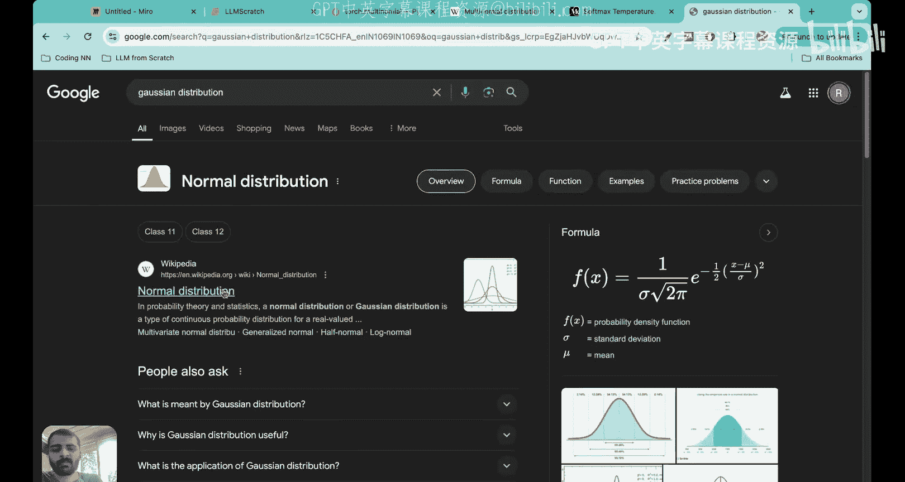
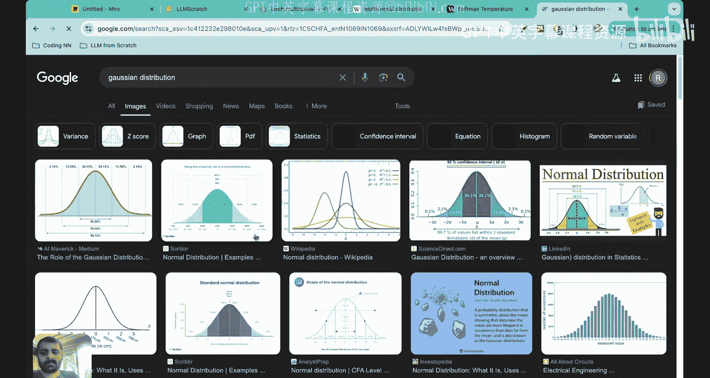
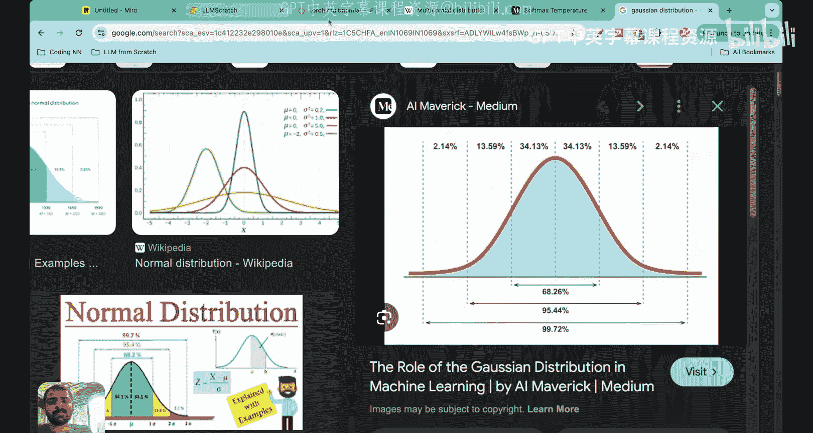
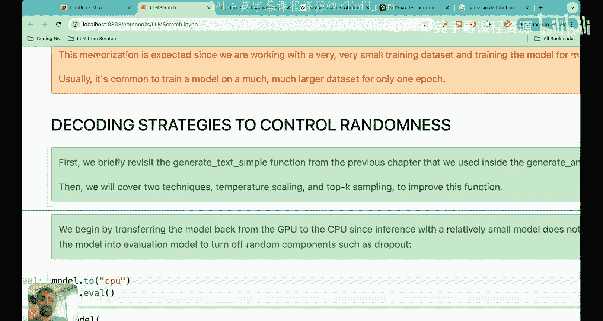

# 27：温度缩放（Temperature Scaling）在大语言模型中的应用

在本节课中，我们将学习一个非常重要的概念——温度缩放。我们将理解什么是温度缩放，以及为什么它在大语言模型中被使用。

上一节我们完全从零开始训练了一个大语言模型。我们定义了训练过程，并让模型运行了100个周期，观察了预测出的下一个词。然而，正如我们所见，模型生成的输出词元目前意义不大。本节课的目标就是学习如何减少输出词元的随机性，使其最终变得有意义。我们将学习实现这一目标的技术，其中一种关键技术就是温度缩放。

## 回顾当前解码策略

到目前为止，我们生成词元的方式是：从词汇表中所有词元的概率分数中，选择概率最大的那个。具体过程如下：输入句子（如“every effort moves”）经过模型架构处理后，会得到一个逻辑值张量。这个张量经过softmax函数后，转换为一组概率值。我们之前预测下一个词元的方法，就是找出概率值最大的那个索引（即词元ID），然后解码得到下一个词元。

例如，当输入是“every”时，概率张量中第二列的概率0.6最高，对应的词元ID是1，解码后得到下一个词元“effort”。当输入是“every effort moves”时，我们查看第三行，找到概率最高的条目（0.34，索引为5），解码后得到下一个词元“you”。

这种策略被称为**贪婪解码**。它导致生成的文本具有很高的随机性和多样性。既然我们得到的是概率分数，为什么一定要以这种确定性的方式选择下一个词元呢？我们能否以概率性的方式选择下一个词元？这正是温度缩放概念所要探索的。

## 引入概率性采样

控制随机性主要有两种技术，它们通常一起使用：第一种是温度缩放，第二种是Top-k采样（我们将在下一讲学习）。温度缩放的核心思想是：我们不再简单地选择最大概率对应的词元，而是用一个概率分布来替代这个“argmax”操作。

具体来说，我们不再盲目选择概率最高的词元i，而是根据概率分数来**采样**下一个词元。这个术语上的区别非常重要。“采样”意味着我们无法确切知道下一个词元会是什么，因为它是一个随机过程。例如，从高斯分布中采样，我们无法预知具体数值，但可以知道大多数样本会集中在均值附近。

在本例中，我们是从一个**多项分布**中采样。多项分布适用于多个互斥的结果。在这里，可能的结果数量等于词汇表大小K，每个结果（词元）都有一个关联的概率。当我们进行多次独立的“预测下一个词元”的试验时，就会形成多项概率分布。

## 代码演示：从贪婪解码到概率采样

本节课的主题是控制随机性的解码策略。让我们先简要回顾一下目前使用的`generate_text_simple`函数，然后介绍温度缩放和Top-k采样技术。

首先，我们将模型切换到CPU并设置为评估模式。模型架构包括嵌入层、Transformer块、归一化层和输出头。当前的`generate_text_simple`函数接收输入句子，通过模型架构，然后使用最大概率法预测接下来的25个词元。这被称为贪婪解码，它导致了较高的随机性。

现在，为了生成更多样化的文本，我们将用从概率分布中采样的函数来替换argmax操作。

为了用具体例子说明这种概率性采样，我们先假设一个很小的词汇表，包含以下9个词元：`closer`, `every`, `effort`, `forward`, `inches`, `smooth`, `pizza`, `towards`, `you`。每个词元有对应的ID（0到8），并维护一个从ID映射回词元的逆字典。

假设模型的输入是“Every effort moves you”。经过模型处理后，我们得到输出逻辑值张量，其列数等于词汇表大小（9）。将这个张量通过softmax函数，就得到了概率张量。所有概率之和为1。

之前我们的做法是直接找出最大概率（例如0.5721）对应的列索引（例如3），得到下一个词元ID（3），解码后得到词元“forward”。因此，预测的下一个词元是“forward”。

现在，为了实现概率性采样过程，我们将用PyTorch中的`multinomial`函数替换argmax。我们将`multinomial`函数应用于概率张量`probs`，然后根据从这个分布中采样的结果得到下一个词元ID，并预测对应的词元。

在这个例子中，采样结果可能仍然是4（对应“forward”）。你可能会问，这和之前有什么区别？关键在于，`multinomial`函数根据概率分数按比例采样下一个词元。目前我们只进行了一次试验，在这次试验中，`multinomial`函数查看所有概率，然后进行采样。由于“forward”的概率最高，它被选中的几率也最大，所以这次它被选中了。当我们进行更多次试验时，区别就会显现出来。

`multinomial`函数根据概率分数按比例采样下一个词元。换句话说，“forward”仍然是最有可能的词元，我们并没有改变这一点，它仍然是最有可能的。但`multinomial`函数大多数时候（而非所有时候）会选择它。

为了说明这一点，我们将把这个采样过程重复一千次。`multinomial`函数非常直观：当你进行一千次试验时，在每次试验中，它都会尝试选择概率最高的词元。现在这是一个随机过程，不再是确定性的。有时`multinomial`函数甚至可能选择“pizza”（尽管非常罕见），有时可能选择其他词元，但大多数时候它会选择“forward”。

以下是运行一千次试验后的结果：词元“forward”被采样了582次，“closer”被采样了73次，“inches”被采样了2次，“towards”被采样了343次。这意味着，由于我们用`multinomial`函数替换了argmax，大语言模型有时会生成如“every effort moves you towards”、“every effort moves you inches”和“every effort moves you closer”这样的文本，而不是每次都生成“every effort moves you forward”。

集成`multinomial`函数确保了我们不会每次都采样同一个词元。我们有时也给其他词元成为下一个词元的机会，这提升了大语言模型的创造力，带来了更多的探索性和创造性，有时还能产生更好的输出，而不是每次都采样一个确定性的预测。

## 温度缩放：概念与作用

你可能会想，这看起来不错，但为什么这个方法被称为“温度缩放”？“温度”从何而来，又为什么叫“温度”？

本质上，温度只是一个花哨的术语，指的是将逻辑值张量除以一个大于0的数。引入温度时，我们所做的唯一事情就是进行“缩放逻辑值”，我们所有的逻辑值都被另一个称为“温度值”的数除。

具体操作是：`scaled_logits = logits / temperature`。然后对缩放后的逻辑值应用softmax，得到概率张量。其余过程保持不变。但引入这个温度会改变概率的分布。

例如，让我们通过代码看看除以温度值会带来什么变化。我们可以通过一个称为温度缩放的概念来进一步控制和选择过程，温度缩放只是将逻辑值除以一个大于0的数的花哨描述。

现在我们将看到两种情况：温度大于1时会发生什么，以及温度小于1时会发生什么。

首先，我想在不进入`multinomial`函数的情况下，向你展示当你用温度缩放逻辑值并应用softmax后会发生什么。请看这张图：首先看温度等于1时的蓝色线条。你会看到“forward”的概率约为0.5，“closer”的概率约为0.1，“towards”的概率约为0.3。这和我们之前看到的情况完全一致。

现在看看温度较小时的情况。当你取这些逻辑值，将每个都除以0.1，然后取softmax，你会得到类似图中橙色的概率分布。现在“forward”的概率峰值更加尖锐，几乎所有其他概率都被压到了接近0。我们可以在代码中测试一下。

当我将逻辑值除以0.1并应用softmax后打印概率时，可以看到：几乎所有其他概率都被降到了0，但现在“forward”有一个非常高的尖锐概率。这与之前的概率形成对比，之前“towards”和“closer”也有显著的概率值，但现在这些值都变成了0，唯一最重要的是“forward”。这是第一个结论：当温度值非常低时，概率分布会出现峰值，这意味着它对特定值变得更加尖锐。

让我再试试除以5（即图中温度等于5的情况）。你会看到概率变得平坦了一些，这意味着所有词元都有较高的值。当我将逻辑值除以5并打印概率张量时，可以看到它变得有点平坦和均匀了。当然，“forward”的值仍然最高，但其他值如“towards”现在变得非常接近“forward”，甚至“closer”的概率值现在也变得和“forward”相似了。

如果温度值非常高，意味着概率分布变得平坦，每个词元作为下一个词元的概率都趋于均匀。你能想到这对生成下一个词元意味着什么吗？这意味着现在我们的输出词元有很大的可变性，有时这也被称为“创造力”。但在某些情况下，创造力可能过高，因为现在“pizza”也有一定的输出概率，这意味着我们的LLM也会预测“every effort moves you pizza”作为输出。理想情况下，我们不希望温度值太高，也不希望温度值太低。如果温度值太低，则只有一个词元被预测，我们也需要强调其他可能也有意义的词元。

正如我们所见，应用非常小的温度（如0.1）会导致尖锐的分布，之后当我们应用`multinomial`函数时，它几乎100%会选择最可能的词元“forward”。请记住，在这之后我们将应用`multinomial`，所以`multinomial`采样将在softmax之后进行。如果概率分布看起来像橙色那样，`multinomial`将总是采样“forward”，因为概率是0.991。因此，当温度值很小时，它会导致更尖锐的分布，而`multinomial`函数几乎总是选择最可能的词元，这样我们就接近了argmax函数的行为。当温度值较低时，几乎就像回到了我们之前选择最高概率分数对应词元ID的方法。

现在，如果你看更高的温度，比如温度值等于5，这实际上会导致更均匀的分布，其他词元也更经常被选择，如图中绿色所示。这可以为生成的文本增加更多多样性，但也会导致无意义的文本。例如，“pizza”现在有4%的概率，如果你使用温度等于5，我们大约有4%的时间会得到“every effort moves you pizza”，这并不好。因此，理想情况下，我们使用的温度需要有一个良好的平衡。

有一张非常好的图展示了为什么这被称为“温度”。你可以看到，如果温度变高，如右侧所示，分布变得更加均匀，每个词元都有一定的概率；而对于低温，我们有左侧的情况，分布更尖锐，只有一个词元有意义。因此，低温对应低熵，而当你提高温度时，事物通常变得更不稳定、更混乱、更有创造性，这就是为什么每个词元都有一定的概率成为下一个词元。所以它被称为“温度”，因为增加温度确保了所有词元都有一定的值，这使其有点不稳定，或者更确切地说，更有创造性、更随机化，几乎就像熵增加了。因此，从概念上讲，它被称为温度，因为温度升高会导致更平坦、更分散的分布，而降低温度意味着更低的熵，所以只有一个词元值更有意义。

这张图展示了当温度变得非常高时，几乎每个下一个词元都有相等的概率；当温度变得非常低时，我们则有之前看到的其他分布。

## 总结与工作流程

本节课我们学习了温度缩放，以及如何利用温度缩放以概率性的方式预测下一个词元。关键点在于，我们不再只是根据最大值选择下一个词元，而是使用多项概率分布来采样下一个词元。

其顺序工作流程如下：
1.  首先获取逻辑值张量 `logits`。
2.  用温度值缩放逻辑值：`scaled_logits = logits / temperature`。
3.  对缩放后的逻辑值应用softmax函数，得到概率张量 `probs`。
4.  使用多项分布进行采样：`next_token_id = torch.multinomial(probs, num_samples=1)`。

我们后来也看到，之所以称之为“温度”，是因为当温度变高时，就像熵增加了一样，每个下一个词元都有一定的概率成为下一个词元；而如果温度非常低，熵就很低，就像一切都集中在一个词元上，我们有一个更尖锐的概率分布。

因此，低温意味着LLM的输出没有任何创造性，它总是给出相同的输出；而高温意味着分布平坦，多样性更多，但也可能产生更多无意义的内容。所以在选择温度值时需要小心。

在下一讲中，我们将学习另一种在解码词元时减少随机性的技术，该策略被称为Top-k采样。通常，Top-k采样与温度缩放一起使用，因此我们也将看到Top-k采样如何与我们今天学习的温度缩放相结合。

感谢大家，这是一节简短的课程，但我希望你们理解了温度缩放的概念。非常感谢，我们下节课再见。

