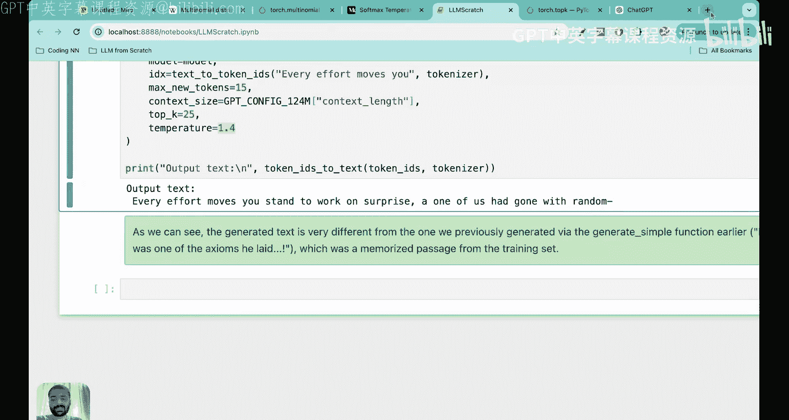
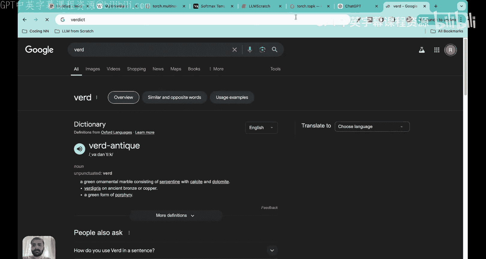
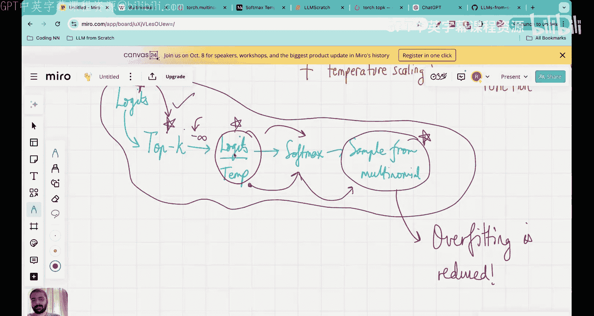

# 28：Top-k 采样在大语言模型中的应用 🎯


## 概述
在本节课中，我们将学习大语言模型（LLM）解码策略中的另一个重要技术——Top-k 采样。我们将探讨其工作原理、如何与温度缩放结合使用，以及它如何帮助模型生成更合理、更多样化的文本，同时避免过拟合。

---

## 解码策略的必要性
上一节我们介绍了温度缩放技术，本节我们来看看另一种解码策略。我们之所以需要这些策略，是因为最初简单的解码方法存在明显问题。

最初的方法是在词汇表中直接选择概率最高的词元作为下一个输出。这种方法非常确定，但会导致输出过于重复和随机，难以生成有意义的文本。

以下是该方法的简单描述：
```python
next_token_id = torch.argmax(probabilities)
```

这种方法的问题在于，它总是选择同一个词元，缺乏创造性，并且容易导致模型简单地“背诵”训练数据，即过拟合。

---

## 概率采样与温度缩放回顾
为了解决确定性问题，我们引入了概率采样。其核心思想是：不从概率分布中确定性地选择最大值，而是根据概率分布进行采样。这意味着概率高的词元被选中的机会更大，但概率低的词元也有机会。

我们使用**多项式分布**进行采样。采样概率与词元的原始概率分数成正比。

随后，我们引入了**温度缩放**。其方法是将逻辑值（logits）除以一个温度参数 `T`，然后再应用 Softmax 函数。

温度的影响可以用以下公式描述：
```
scaled_logits = logits / T
probabilities = softmax(scaled_logits)
```

*   **高温（T > 1）**：概率分布变得更均匀，输出更多样化、更具创造性，但也可能更随机。
*   **低温（0 < T < 1）**：概率分布变得更尖锐，模型输出更确定、更保守。
*   **T = 0**：退化为确定性选择（argmax）。

---

## Top-k 采样引入
尽管温度缩放引入了多样性，但它仍然存在一个问题：即使是非常不合理、概率极低的词元（例如在上下文“every effort moves you”后出现“pizza”），也有微小的机会被选中。这可能导致语法错误或完全无意义的输出。

Top-k 采样旨在解决这个问题。其核心思想很简单：**将下一个词元的候选范围限制在概率最高的 k 个词元内，排除所有其他词元。**

以下是 Top-k 采样的步骤：
1.  获取模型输出的逻辑值张量。
2.  找出逻辑值最高的 `k` 个值及其索引。
3.  将这 `k` 个值之外的所有其他逻辑值替换为负无穷大（`-inf`）。
4.  对处理后的逻辑值张量应用 Softmax。由于 `-inf` 经 Softmax 后变为 0，因此最终的概率分布仅由这 top-k 个词元构成，且它们的概率之和为 1。

在 PyTorch 中，关键操作如下：
```python
# 获取 top-k 的值和索引
top_k_values, top_k_indices = torch.topk(logits, k)
# 创建掩码，将非 top-k 的位置设为负无穷
mask = logits < top_k_values[:, -1].unsqueeze(-1)
logits[mask] = -float('Inf')
```

---

## 结合温度缩放与 Top-k 采样
在实际应用中，我们通常将 Top-k 采样与温度缩放和多项式采样结合起来，形成一个强大的解码流程。

完整的解码工作流如下：
1.  **获取逻辑值**：从 LLM 输出层得到逻辑值张量。
2.  **应用 Top-k 采样**：保留 top-k 个逻辑值，其余设为 `-inf`。
3.  **温度缩放**：将处理后的逻辑值除以温度 `T`。
4.  **Softmax**：转换为概率分布。
5.  **多项式采样**：根据最终的概率分布采样下一个词元 ID。

这个流程确保了：
*   **多样性**：通过温度缩放和多项式采样引入。
*   **合理性**：通过 Top-k 采样排除明显不合理的词元。
*   **防过拟合**：概率性采样避免了模型对训练数据的简单记忆。

---

## 代码实现
以下是一个结合了温度缩放和 Top-k 采样的生成函数的核心部分：

```python
def generate_with_topk_temp(model, input_ids, max_new_tokens, top_k, temperature):
    for _ in range(max_new_tokens):
        # 1. 获取模型输出的逻辑值
        logits = model(input_ids)[:, -1, :]

        # 2. 应用 Top-k 采样
        if top_k is not None:
            top_k_values, _ = torch.topk(logits, top_k)
            min_top_k_value = top_k_values[:, -1].unsqueeze(-1)
            logits[logits < min_top_k_value] = -float('Inf')

        # 3. 应用温度缩放
        if temperature > 0:
            scaled_logits = logits / temperature
            probs = F.softmax(scaled_logits, dim=-1)
            # 4. 多项式采样
            next_token_id = torch.multinomial(probs, num_samples=1)
        else:
            # 退化为确定性选择
            next_token_id = torch.argmax(logits, dim=-1, keepdim=True)

        # 将新词元添加到输入中，继续生成
        input_ids = torch.cat([input_ids, next_token_id], dim=1)

    return input_ids
```





使用该函数生成文本，例如设置 `top_k=25`, `temperature=1.4`，可以观察到生成的文本不再是训练数据的简单重复，而是产生了新的、合理的组合，有效缓解了过拟合问题。

---

## 总结
本节课我们一起学习了 Top-k 采样这一重要的 LLM 解码策略。

*   我们首先回顾了概率采样和温度缩放，它们通过引入随机性来增加输出的多样性和创造性。
*   接着，我们指出了仅使用温度缩放可能让不合理词元有机可乘的问题。
*   为此，我们引入了 **Top-k 采样**，其核心是**将下一个词元的候选范围限制在概率最高的 k 个词元内**。
*   最后，我们展示了如何将 Top-k 采样、温度缩放和多项式采样结合成一个完整的解码流程。这个流程能有效平衡输出的**创造性**、**合理性**，并防止模型对训练数据的**过拟合**。




记住这个核心工作流：**逻辑值 → Top-k 过滤 → 温度缩放 → Softmax → 多项式采样**。在接下来的课程中，我们将加载预训练的模型权重，并探索更多解码策略。