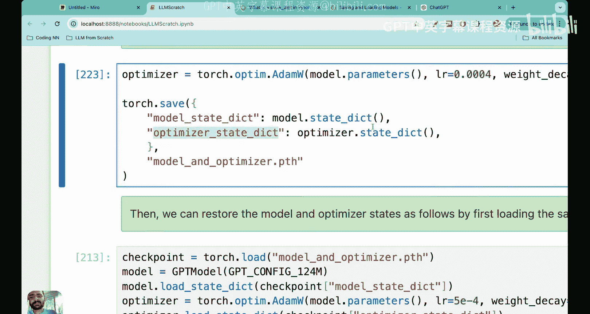
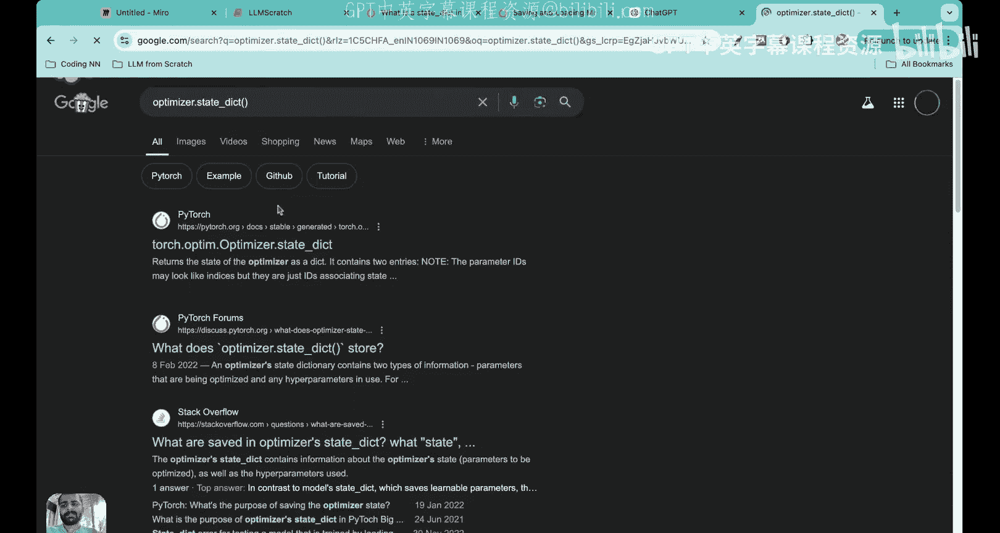
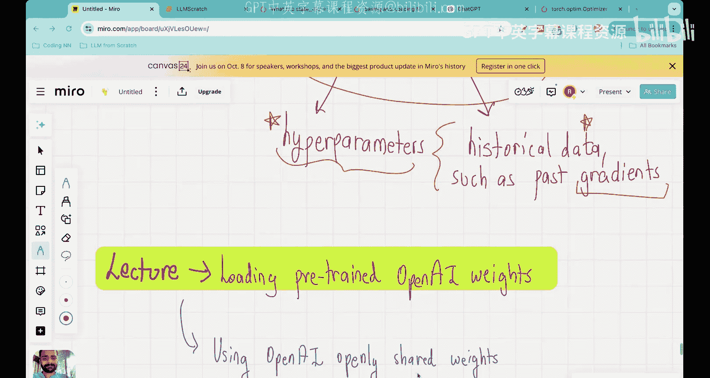

# 29：使用PyTorch保存与加载模型权重

## 概述

在本节课中，我们将学习如何使用PyTorch保存和加载大语言模型的权重。这对于处理我们迄今为止构建的大型语言模型至关重要，因为它能帮助我们节省内存和时间。我专门安排了这节课来教你如何在Python中实现权重的保存与加载。

## 回顾与过渡

在开始之前，我们先快速回顾一下到目前为止在本系列预训练大语言模型课程中所学的内容。

首先，我们研究了如何评估大语言模型的损失函数，了解了交叉熵损失在此处的应用，并定义了目标文本与大语言模型预测输出之间的损失。接着，我们运行了预训练循环，这是一个非常棒的实践环节，我们实际运行了一个大语言模型进行多次迭代，并根据给定的输入文本生成了新的文本。在这个过程中，我们发现了过拟合的问题：大语言模型只是记住了训练文本，并在预测时直接使用了这些记忆的文本。

为了避免过拟合，我们探讨了文本生成策略，包括温度缩放和Top-k采样，并学习了如何将两者结合以生成不过度拟合的文本。然而，尽管生成的文本不再过拟合，但其意义仍然不够明确，这主要是因为我们的训练数据集不够庞大。

因此，在下一讲中，我们将从OpenAI加载预训练的权重到我们的模型中，而不是从头开始训练我们自己的模型。OpenAI已经花费数百万美元预训练了GPT-2的权重，并将其开源。在下一讲中，我们将实际使用这些预训练权重，并将其集成到我们迄今为止构建的GPT架构中。

但在今天的课程中，我想为权重的保存和加载打下基础，因为当我们使用OpenAI的预训练权重时，这将非常有用。你可以把今天的课程看作是我为你准备的一个工具箱，帮助你理解下一讲关于OpenAI预训练权重的内容。

## 核心概念与函数

让我们开始吧。有两个主要函数非常重要：第一个是`torch.save`，第二个是`model.load_state_dict`。我来解释一下它们各自的实际含义。

假设我们有一个GPT模型，我们想要保存这个模型的参数。这是什么意思呢？本质上，我们之前已经在代码中定义了这个GPT模型类。当这个类被定义并构造出GPT模型实例时，模型内部包含了大量的参数，实际上参数数量超过1亿个。

与其每次运行都重新创建这个模型的新实例，我更希望将这1亿个参数保存到某个地方。PyTorch中保存这些参数的命令是`torch.save`和`model.state_dict`。

`torch.save`需要传入两个参数：第一个是模型的状态字典，第二个是你想要存储模型参数的文件名。`model.state_dict`是一个将每个层映射到其参数的字典，它是任何PyTorch模型的默认属性。

文件名在这里是`model.pt`。在PyTorch中，任何`torch.nn.Module`的可学习参数都包含在`model.parameters()`中，而状态字典就是一个简单的Python字典对象，它将每个层映射到其参数张量。

这个状态字典会获取每个层，并构建一个将其映射到该层参数的字典。然后，使用`torch.save`，我们可以将这个参数字典保存到名为`model.pt`的文件中。

第二个命令是`model.load_state_dict`。假设你保存了参数并发送给了项目合作者，他们可以在他们的环境中使用这个`model.pt`文件，通过`torch.load`加载它，然后调用`model.load_state_dict`。这样，当他们从头开始初始化模型时，他们的模型就会加载`model.pt`文件中包含的这些参数。

我在这里也展示了`torch.nn.Module.load_state_dict`的用法，它使用我们之前定义的状态字典来加载模型参数字典。状态字典基本上就是这个意思。

## 代码实践

太棒了，以上就是这两个命令。现在让我们在代码中看看它们的实际应用。

我们构建了一个GPT模型类的实例，我之前已经向你们展示过这个GPT模型类，这是我们之前在代码中定义的类。

我现在创建了这个类的一个实例，它有1.24亿个参数。然后，我在这里使用了`torch.save`命令，这是模型的状态字典，我将这个参数字典保存到一个名为`model.pt`的文件中。

正如我在这里写的，`.pt`扩展名是PyTorch文件的约定。技术上我们可以使用任何文件扩展名，这并不重要。

然后我们可以这样做：假设我是一个与其他人合作的研究人员，我将这个`model.pt`文件发送给那个人。他们可以创建一个GPT模型类的实例，并直接加载`model.pt`中提供的参数。为此，他们可以这样做：`torch.load`，然后执行`model.load_state_dict`，接着将模型设置为评估模式。他们会看到模型的所有参数都已被加载，这些参数正是`model.pt`文件中包含的。这为收到模型的新人节省了大量时间。即使对于你自己，如果你突然退出Python、Google Colab或Jupyter笔记本，与其重新训练模型，如果你能定期保存参数，那么下次运行代码时，这将为你节省大量时间和内存。

## 保存优化器状态

现在假设我在某个时间点训练了代码，并希望明天继续训练。加载模型参数是一回事，但优化器呢？因为在像Adam这样的优化器中，优化器也维护着梯度的历史记录以及梯度平方值的历史记录，对吧？我是否也应该保存这些值，因为优化器需要它们？如果我只保存模型参数，优化器基本上就丢失了它在训练过程中计算出的梯度值和梯度平方值。因此，通常也建议保存优化器状态。

与我们保存的参数类似，优化器也可以使用类似`optimizer.state_dict`的方法来保存。我马上会向你展示这个。这个字典存储的是优化器的超参数，但也存储了该优化器使用的历史数据，例如过去梯度值、梯度平方值，这些都是Adam优化器所需要的。

让我们看看如何保存优化器状态。我在这里写道，像我们用来训练LLM的AdamW这样的自适应优化器，会为每个模型权重存储额外的参数。这个优化器使用历史数据来调整每个模型的学习率，例如梯度的历史、梯度平方的历史。

如果不存储这些历史记录，优化器就会重置，这并不好，因为那样我们就无法有效利用迄今为止的训练成果，模型可能无法正确收敛。因此，使用`torch.save`，我们实际上可以同时保存模型和优化器的状态字典。

这是我们之前定义的优化器。现在你可以看到，之前我们使用`torch.save`只保存了模型参数。现在我们可以使用`torch.save`来保存模型状态字典，同时也可以使用`optimizer.state_dict()`来保存优化器状态字典。你可以在PyTorch中看到这个。

`optimizer.state_dict()`返回优化器的状态，它确实维护了梯度、梯度平方以及学习率、权重衰减等参数的历史记录。当Adam优化器用这些参数初始化时，保存优化器状态字典当然会保存这些参数，但也会保存历史记录。

你将这两个字典保存在这个名为`model_and_optimizer.pth`的文件中。当你把这些代码交给别人时，你现在可以传递给他们模型以及优化器状态，这样他们就可以直接使用模型以及优化器的当前状态，在他们那边继续运行模型。即使对于你自己，假设你今天关闭了训练会话，然后你想恢复训练，你必须将参数以及优化器状态保存在这个`model_and_optimizer.pth`文件中。

## 加载完整检查点

现在我们可以实际测试一下。这个文件已经保存好了，你可以执行`torch.load`加载这个特定文件，然后将内容加载到一个名为`checkpoint`的对象中。我们现在可以创建一个GPT模型类的实例，首先加载模型参数：我们使用这个`checkpoint`，然后查看这个字典`model.state_dict`，并在这里加载模型参数。接着，我们定义优化器，并加载优化器字典：我们查看`checkpoint`对象，加载优化器状态字典，从而加载优化器参数以及梯度和梯度平方的历史记录。

然后你将模型设置为训练模式。`model.train()`本身不会进行训练，我们只是将模型设置为训练模式。要进行训练，我们需要执行前向传播、反向传播、梯度下降等我们之前做过的步骤。

我向你展示模型和优化器状态的保存，只是因为这是一个非常有用的实践，尤其是在处理大语言模型时。否则，一切从头开始、丢失模型参数、丢失优化器状态会非常令人沮丧。我见过很多研究人员犯这个错误，不知道如何正确加载模型参数、优化器参数和优化器状态。一旦你学会了，它实际上相当简单。

我也会在视频描述中分享这些PyTorch链接给你。

## 总结

我希望你已经理解了这节课，我们在其中主要介绍了如何在PyTorch中加载和保存模型权重。

现在，我们已经拥有了所有必要的“弹药”来迎接下一讲：加载来自OpenAI的预训练权重。这将是一节非常棒的课程，我们将使用OpenAI为GPT-2提供的权重，然后使用我们在这个系列中构建的GPT架构，进行下一个预测任务。

非常感谢大家，我希望你们从这节课中学到了东西。请保持关注，我期待在下一讲中见到你们。