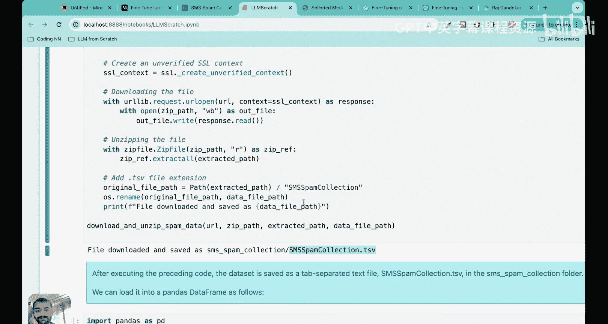
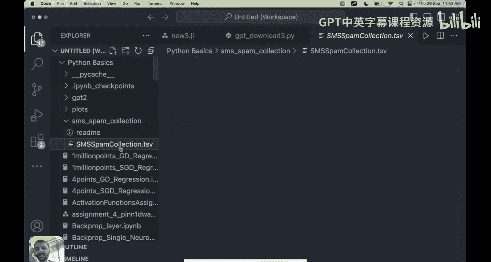
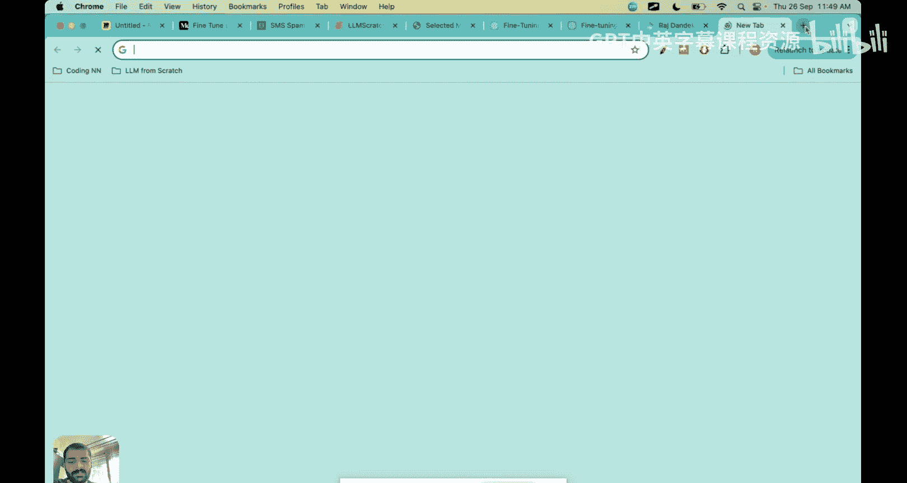
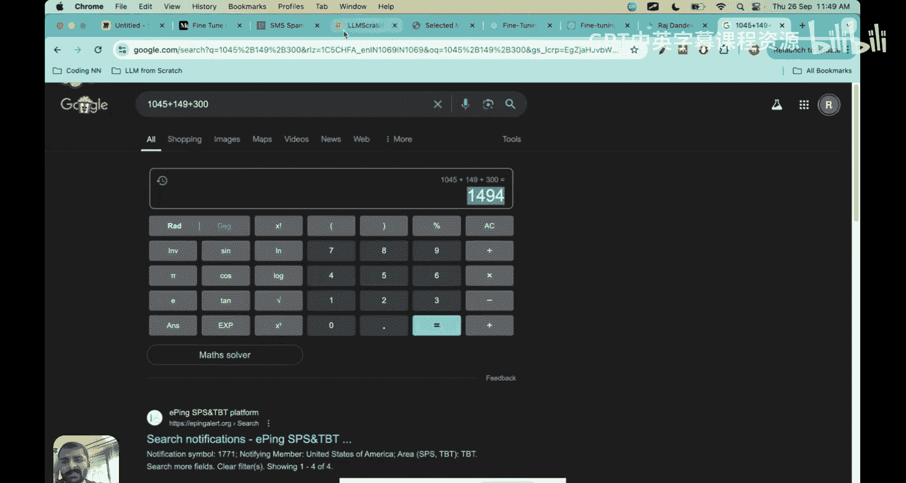
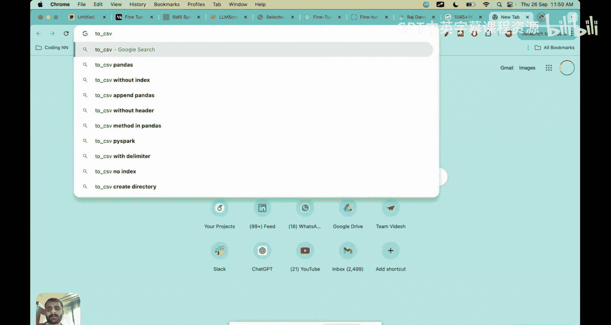
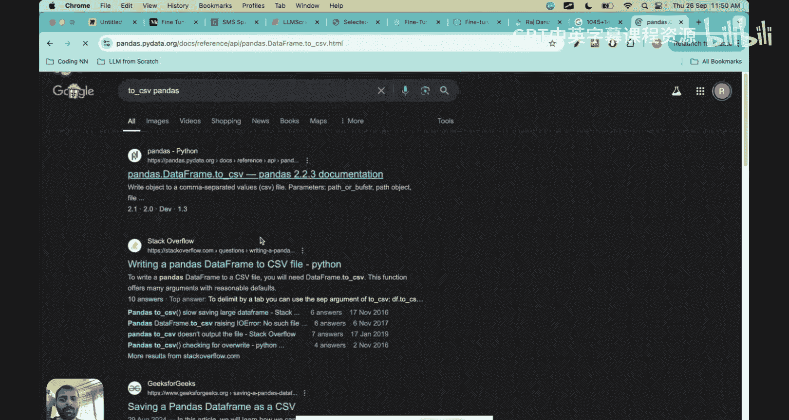
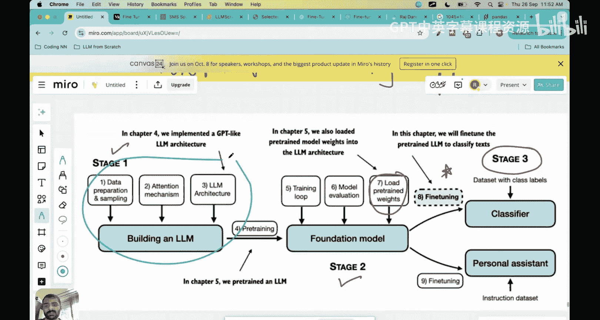

# 31：大语言模型微调入门与实践

在本节课中，我们将学习大语言模型微调的基础知识。微调是构建大语言模型的最后一个关键阶段，它能让预训练好的模型适应特定的任务。

## 课程概述

大家好，欢迎来到“从零开始搭建大语言模型”系列课程。到目前为止，我们已经完成了约30到32节课，涵盖了第一阶段（理解LLaMA架构、注意力机制、数据准备和采样）和第二阶段（大语言模型预训练、模型评估和加载预训练权重）。现在，我们准备进入最后一个阶段：微调。

通过预训练，我们看到模型已经能产生有意义的输出，效果相当不错，就像我们从头构建了自己的GPT模型。我们花费了大量时间来理解这个架构。现在，我们准备开始微调阶段。

## 为什么需要微调？

你可能会想，既然预训练模型已经工作得很好，我们是否就完成了大语言模型的构建？答案是否定的。

让我解释为什么需要微调。假设你已经预训练好了模型，这很好。但如果你有一个特定的任务呢？这个特定任务可能是基于公司自身数据构建一个聊天机器人，或者你是一家教育公司，想用自己的数据开发一个教育应用。又或者，你想为一家航空公司用其数据制作一个聊天机器人。

本质上，如果你想开发一个特定的应用程序，仅靠预训练模型是不够的。因为预训练模型是在互联网通用数据上训练的，你需要用额外的数据再次训练模型。这个过程就叫做**微调**。

微调的形式化定义是：**通过使用额外数据再次训练模型，使预训练模型适应特定任务**。

这里有一些非常重要的术语。第一个术语是“特定任务”。当你需要执行某些特定任务时，就需要进行微调。例如，如果你是一家公司，想要开发一个模型并投入生产，你不能直接使用预训练模型，因为它是在通用数据上训练的，无法基于你私有的、特定的数据给出你期望的答案。

第二个要点是“再次训练模型”。这意味着，到目前为止，模型的权重和偏置已经在预训练过程中得到了优化。现在，你将用额外的数据来训练模型，因此模型的参数、权重和偏置通常会发生变化，这个过程就是微调。

事实上，有很多关于微调的文章。其示意图是：你有一个预训练好的大语言模型，然后你在自定义数据集上进一步训练它，从而得到一个微调后的大语言模型。

因此，大语言模型微调的形式化定义是：**微调大语言模型涉及对一个预先存在的模型进行额外训练，该模型先前已从海量数据中学习了模式和特征，现在使用一个较小的、特定领域的数据集进行训练**。我们之所以再次训练这个模型，是因为我们有了新的、较小的、特定领域的数据。我们需要再次训练模型，使其调整其参数、权重和偏置。

## 微调的实际例子

为了给你一个微调的实际例子，这是我博士最后一年制作的网站，上面有我的出版物、演讲、媒体报道等。假设你也有一个类似的网站或博客，你想制作一个聊天机器人，这个机器人不像ChatGPT那样回答，而是像你本人说话的方式那样回答。你希望聊天机器人基于你的数据、你通常写文章的方式、你在网站上组织段落的方式来回答。你有特定的语气，你希望这种语气体现在你的聊天机器人中。你该如何实现？

仅靠预训练是不可能的，因为在预训练模型中，你的数据可能根本不存在。因此，你需要进行微调。你需要提供额外的数据，比如我网站上的所有内容、我的博客、我的出版物、我的演讲，这样模型才能理解并学习你的说话语气、你通常如何造句，然后它会进行适应。

这样开发出来的聊天机器人就会用我的语气（在这个例子中）说话。这就是微调。我寻找的特定应用是构建一个用我的语气说话的聊天机器人。对于这个特定应用，我有额外的数据（我的网站、出版物、演讲和媒体报道），我会将这些数据输入模型，并要求模型再次训练。这个再次训练模型的过程就叫做微调。现在，微调后的模型将完全按照我的期望行事，用我的语气说话，使用像我一样的语法句子。

另一个例子是，假设你有你的研究出版物（就像我在这里描述的一样），你想制作一个聊天机器人，专门回答人们关于你出版物的查询。那么，你可以基于你的出版物提供特定的数据。这也是微调的一个例子。

事实上，我想到这个例子的原因是，我在OpenAI的问答论坛上看到了一个问题。提问者说他们是微调学习的初学者，他们的目的是创建一个模型，能够使用他们博客中的语气，就像我们讨论的那样。他们问了很多关于如何具体操作、如何确保获得良好的准确性、如何防止产生错误答案的幻觉等问题。然后，OpenAI社区给出了许多答案来帮助这个人进行微调。

## 微调的两大类别

以上是微调的一般介绍。现在，微调本身又分为两大类。

让我为你标记一下。第一类叫做**指令微调**，这更常见、更广泛。第二类叫做**分类微调**。

两者有什么区别？在指令微调中，我们使用特定指令在一组任务上训练语言模型。

这里我给出了两个指令微调的例子。假设指令是：“判断以下文本是否为垃圾邮件，用‘是’或‘否’回答”。这就是指令微调的一个例子，因为我们要求LLM：你将收到这样的文本，你的任务是查看文本并回答它是否是垃圾邮件，即进行分类或用“是”或“否”回答。这就是为什么这是一个指令微调的例子。我们在这里添加了用蓝色标出的指令，这非常重要。

或者，指令可以是：“将给定句子恰当地翻译成德语”。这是指令微调的另一个例子。因此，LLM接收输入句子，在第一种情况下输出“是”或“否”，在第二种情况下将英语句子翻译成德语。

这些之所以是指令微调的例子，是因为我们给出了具体的指令，而LLM基于该指令行事。

第二个例子是**分类微调**。这不如指令微调常见，但了解过机器学习和分类示例（如脑肿瘤分类、猫狗图像分类）的读者（或听众）会发现这非常相似。但现在，你只是使用大语言模型，而不是卷积神经网络或其他神经网络来进行分类。这里没有给LLM任何指令，只是输入没有指令的文本。

LLM必须对电子邮件是垃圾邮件还是非垃圾邮件进行分类。这里我们也看到了垃圾邮件/非垃圾邮件的例子，但之前我们给出了指令，要求LLM用“是”或“否”回答。而在这里，没有给出指令，只有两个类别：垃圾邮件和非垃圾邮件。我们训练LLM基于这两个类别进行输出。

因此，LLM接收一段文本，然后预测它是垃圾邮件还是非垃圾邮件。尽管在这个例子和上一个例子中结果相同，但提示本身的构建方式或LLM的构建方式是不同的。这就是我现在强调的重点：这是一个指令微调的例子，而这个模型输入没有指令的例子，是基于分类的微调的例子，我们只是使用大语言模型进行分类。

当我看到这个时，我感到非常惊讶，因为我不知道LLM可以用于分类任务。事实上，分类微调也用于情感分类，例如愤怒、悲伤、快乐等。如果你有一段文本，想将其分类到这五个类别之一，你可以使用分类微调。

但指令微调是更常见的微调方式，它可以处理更广泛的任务集。通常，它甚至需要更大的数据集，因为你希望它处理更广泛的任务。因此，基于指令的微调通常也需要更大的计算能力。为什么需要更大的计算能力？因为你给模型提供了指令，它必须根据你给出的指令在整个语料库中搜索，并且你执行的操作不是特定的。例如，这里的操作非常具体：垃圾邮件或非垃圾邮件。而它必须执行的操作可能像翻译一样复杂。使用同一个基于指令的模型，你还可以做其他事情。因此，一个基于指令的模型实际上可以处理更广泛的任务，如翻译、摘要等。

但在分类微调中，执行的唯一操作是将文本分类到哪个类别。因此，分类微调只能处理较窄的提示集。

所以，当人们想到微调时，通常只谈论基于指令的微调，但我发现分类微调也同样重要。因此，我们今天课程中要开始的例子实际上就是基于分类微调的概念。

## 高效的微调方法

现在，在基于指令的微调中，人们通常还会讨论使微调更高效的方法。在基于指令的微调中，实际上还有另外两种方法，叫做**LoRA**和**QLoRA**。这些基本上属于参数高效微调的范畴。它是一种比全参数微调更高效的指令微调形式。

本质上，在参数高效微调中，我们只更新一部分参数，同时冻结其余的参数。这减少了可训练参数的数量，使得指令微调的内存需求更易于管理。

因此，LoRA基本上是一种改进的微调方法，它不是微调构成权重矩阵的所有权重，而是微调两个较小的矩阵，这两个小矩阵近似于这个大矩阵。我们现在不深入讨论LoRA的细节，我们会在后续课程中涵盖这个相当广泛的主题。但我今天只想向你介绍这个概念。

第二个是QLoRA，它本质上是量化LoRA。这是LoRA的一个更节省内存的迭代版本。QLoRA通过将LoRA适配器的权重量化为更低精度，将LoRA向前推进了一步。

现在，只需记住LoRA和QLoRA是更高效的微调形式，它们减少了传统上基于指令的微调所需的内存需求。

## 本节课实践内容

我希望你已经理解了指令微调和分类微调之间的区别。现在，我们将在今天的课程中开始处理一个实践问题，这是一个微调分类问题。

因此，我们现在将关注第二类，并采用一个真实的数据集。我们将查看一组电子邮件，包括垃圾邮件和非垃圾邮件，并训练一个大语言模型来分类它是垃圾邮件还是非垃圾邮件。

我们不会在今天的课程中完成所有这些步骤，因为这涉及很多步骤。首先，我们必须下载数据、预处理数据、创建数据加载器，这是数据准备的第一阶段。这个数据集将是所有被分类为垃圾邮件和非垃圾邮件的电子邮件。

然后，在第二阶段，我们必须初始化LLM模型、加载预训练权重、修改模型以适应微调、实现评估工具。

最后，在第三阶段，我们将微调模型、评估微调后的模型，并将模型用于新数据。

我本可以将所有这些内容放在一节课中，但那样我就必须匆忙完成。相反，我打算将其分成五到六节课，以便你按顺序理解整个微调过程。这是我们本系列所有课程遵循的理念：我首先在白板上，然后通过代码，带你详细了解每一个步骤。

今天，我们将要做两件事。首先，下载数据。第二件事是，我们将预处理数据。

在下一节课中，我们将创建数据加载器、初始化模型，然后稍后加载预训练权重。现在，让我们只关注第一步，也就是下载和预处理数据。在下一节课中，我们将看第二步，即创建数据加载器。

## 代码实践：下载与预处理数据

现在让我带你过一遍代码。在这部分代码中，我将其标题为“分类微调”。正如我提到的，第一步是下载数据集。这只是下载和解压数据的代码。让我带你看看数据集存在的地方。

这是UCI机器学习知识库，它非常有名，因为它包含大量数据集。在这个知识库中，还有一个SMS垃圾邮件收集数据集。这就是我们将要使用的数据。它包含大量电子邮件，既有垃圾邮件也有非垃圾邮件。

如果你向下滚动，你会看到关于这个数据集中具体包含什么的信息。首先，你会看到手动提取了425条SMS垃圾邮件。这是一个英国论坛，手机用户在该论坛上公开声称收到SMS垃圾邮件。所以有425条垃圾邮件，他们还有另外322条垃圾邮件，这些在其他网站上公开可用。所以总共有747条垃圾邮件。

现在让我们看看非垃圾邮件。在非垃圾邮件中，他们有大量的消息，正如你可以想象的，获取合法的非垃圾邮件更容易。他们收集非垃圾邮件的方式是在新加坡国立大学计算机科学系。自然地，如果是大学里学生之间的电子邮件，它们很可能不是垃圾邮件。因此，与垃圾邮件相比，我们有更多的非垃圾邮件。所以数据集有点不平衡。非垃圾邮件也被称为“ham”邮件，我不确定为什么存在这个术语，但非垃圾邮件被称为ham，垃圾邮件就称为spam。

这就是数据集。你甚至可以在这里下载数据，或者你可以直接运行我将提供给你的代码，该代码会下载并解压数据。一旦你运行这段代码，数据集将被下载到你的本地机器上。

它将被下载到这个名为“SMSSpamCollection.tsv”的文件中。所以在这里，你可以在我的VS代码中看到这个名为“SMSSpamCollection”的文件夹，这就是我现在在屏幕上向你展示的.tsv文件。在这里，你可以看到消息可以是ham（非垃圾邮件）或spam（垃圾邮件）。所以ham意味着不是垃圾邮件，spam当然是垃圾邮件。正如预期的那样，垃圾邮件内容类似于“免费进入并获胜”之类的东西。在这里，我们可以看到这些电子邮件确实有意义，并且这种分类也合理。

这就是整个数据集，你可以通过代码下载，也可以从我刚才展示的UCI知识库下载。一旦数据集下载完成，你可以使用pandas将其转换为数据框，这样读取数据就变得容易得多。你可以打印出数据框，它看起来像这样：标签要么是ham，要么是spam。

所以在这里，我们可以看到总共有5572行。也就是5572封电子邮件。但现在我们可以打印数据框中标签的数值计数。标签是一个列名，我们可以打印出ham条目的数量，即4825条非垃圾邮件，而垃圾邮件条目的数量要少得多，为747条。

现在，我们可以在这里做的是，我们需要使数据集平衡，对吧？有很多方法可以使数据集平衡，但我们将在这里采用一种简单的方法，因为这不是分类机器学习课程，而是关于大语言模型的课程。所以我们将采用一种简单的方法，我们将只是从非垃圾邮件中随机抽取747个条目，这样非垃圾邮件和垃圾邮件的数量就相互匹配，两者都应该是747。

因此，正如这里所写的，为了简单起见，并且因为我们出于教育目的更喜欢一个小数据集，我们对数据进行子采样，使其包含每个类别的747个实例。

这是创建平衡数据集的函数。这个函数要做的是，它将随机抽样ham实例，以便我们可以匹配垃圾邮件实例的数量，即等于747。这是通过这行代码完成的。

然后我们将ham子集与spam合并。所以现在，新的数据框是平衡的。如果你打印出平衡数据框的数值计数，你会看到ham（非垃圾邮件）的数量是747，垃圾邮件的数量是747。

在执行了之前的代码来平衡数据集之后，我们可以看到我们现在有等量的垃圾邮件和非垃圾邮件。很好，这正是我们想要的。

现在我们可以更进一步，看看标签。我们可以将ham分配为0，spam分配为1，而不是使用ham和spam。所以这些是我们每封电子邮件的标签编码。

我在这里写的一个注意事项是，这个过程类似于将文本转换为标记ID。记得在我们预训练大语言模型时，我们有一个大的词汇表，GPT词汇表，它有超过50,000个单词，实际上是50,257个标记，每个标记都有一个标记ID。这是一个简单得多的映射，我们只有两个标记，它们映射到0和1。

现在，正如我们通常在机器学习任务中所做的那样，我们将获取数据集并将其分成三部分。我们将取这747条数据，将其分成70%用于训练，10%用于验证，20%用于测试。

正如我在这里提到的，这些比例在机器学习中通常用于训练、调整和评估模型。所以在这里，你可以看到我写了一个随机分割函数。这个函数所做的就是，它只取训练分数，即训练数据的比例，将是0.7，验证分数将是0.1。我们首先构建训练数据框，它是主数据框的70%。验证数据框是剩余的20%，测试数据框是剩余的10%？不，验证数据框是10%，测试数据框是剩余的20%。

然后当这个函数被调用时，它将实际返回训练数据框、验证数据框和测试数据框。所以它将返回三个数据框给我们。

现在我们可以实际测试这个函数。我们有这个平衡数据框，我们将其传递给这个名为`random_split`的函数。一旦它被传递到这个函数中，我们还指定训练分数为0.7，验证分数为0.1。然后我们构建训练数据框、验证数据框和测试数据框。

让我们检查一下长度是否合理。我在这里输入新代码：`len(train_df)`。让我们看看长度是多少。是1045。是的，所以`train_df`的长度是1045，因为垃圾邮件和非垃圾邮件的总数是747加747，等于1494。

然后让我也打印出`len(val_df)`。也让我打印出`len(test_df)`。让我把这些都打印出来，这样我们可以看到它们是否确实加起来等于1494。

好的，所以现在我在打印这个。这里你可以看到`train_df`的长度是1045，`val_df`是149，`test_df`是300。让我们把它们加在这里：1045加149加300。

让我们看看，是1494。这是747加747，所以这是合理的。这是一种检查，确保训练、验证和测试数据框已正确创建。我喜欢时不时做这些检查，只是为了确保我们在代码中走在正确的轨道上。

现在，你可以做的是，我们还将这些数据框转换为CSV文件，因为我们以后需要重用它们。所以我们将使用`to_csv`函数。你可以搜索这个`to_csv`。

Pandas的这个功能是，它可以获取你的数据框并将其转换为CSV文件。我也会在信息描述中添加此链接。

因此，你可以将此函数应用于训练数据框、验证数据框和测试数据框，然后你可以得到`train.csv`、`val.csv`和`test.csv`文件。

到目前为止，我们已经完成了第一步，即下载和预处理数据。我们下载了数据，平衡了数据集（这是预处理的一部分），使垃圾邮件和非垃圾邮件的数量相同，都是747。然后我们将数据集分为训练集70%、验证集10%和测试集20%。

## 下节课预告

在下一节课中，我们将首先创建数据加载器，以便我们也可以进行批处理。在使用大语言模型时，使用数据加载器通常更好。然后我们将看看如何加载预训练权重，如何修改模型等。

你可能在想，如何使用大语言模型完成分类任务？最终发生的情况是，我们通常在其末尾拟合另一个神经网络，该网络将有一个softmax输出，以便进行分类输出。所以我们需要在这里进行增强，使输出是垃圾邮件或非垃圾邮件，即0或1。因此，我们将采用我们之前使用的相同架构，但我们将增强其末尾部分，使其适用于分类。

## 课程总结

本节课到此结束。非常感谢大家，我希望你们喜欢这种白板笔记加编码的方法。我们在这个系列中已经涵盖了大量课程，