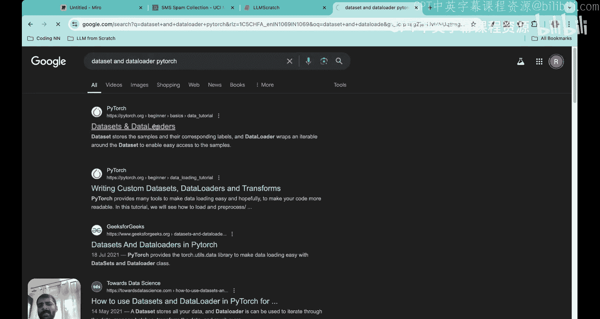
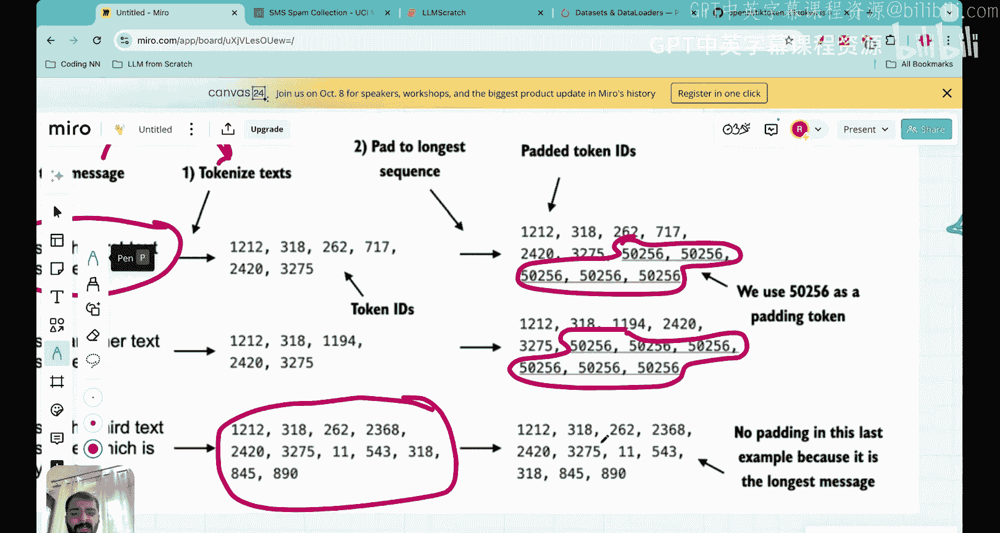
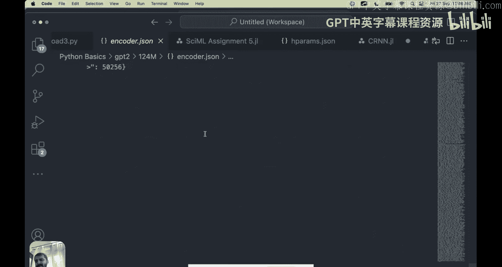
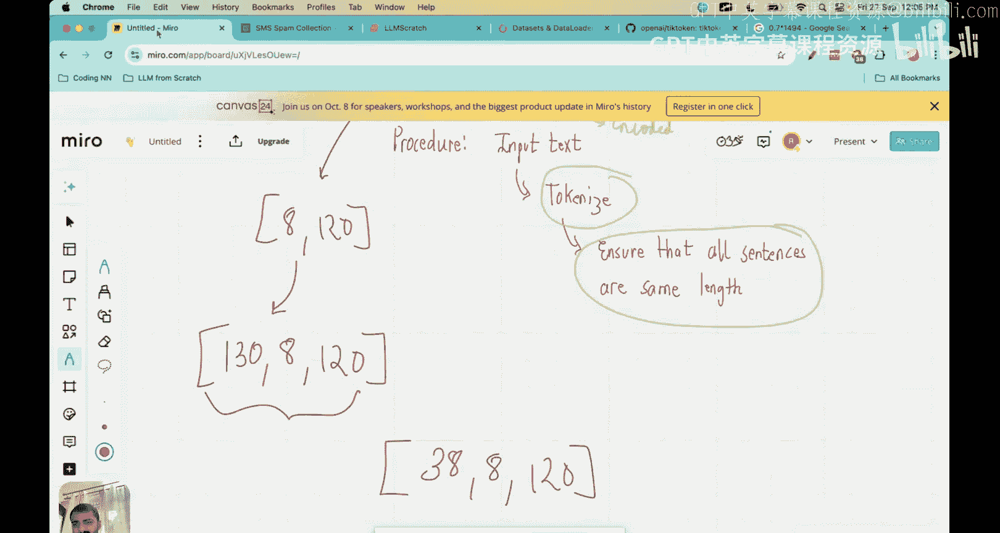

# 32：LLM分类微调中的数据加载器 | Python编码 | 动手实践LLM


在本节课中，我们将学习如何为大型语言模型的分类微调任务创建数据加载器。我们将把原始的文本数据转换为模型可以处理的、格式统一的输入-目标对批次。

## 概述

在上一节课中，我们开始了关于大语言模型微调的学习。我们了解到，微调本质上是通过在额外数据上训练模型，来使一个预训练模型适应特定任务。我们看到了两种主要的微调类型：指令微调和分类微调。我们进一步开始了一个基于分类微调的实践项目——电子邮件分类。我们的目标是使用大语言模型来查看电子邮件，并将其分类为垃圾邮件或非垃圾邮件。

在上一节课中，我们完成了前两个步骤：下载电子邮件数据集并对其进行预处理。我们从一个包含约747封垃圾邮件和3000多封非垃圾邮件的数据集开始，平衡了数据集，将标签“ham”（非垃圾）编码为0，“spam”（垃圾）编码为1，并将整个数据集按70%（训练）、10%（验证）和20%（测试）的比例进行了分割，最终保存为CSV文件。




然而，要将数据输入到模型架构中，我们还需要一个关键步骤：创建数据加载器。这正是本节课的核心内容。

## 数据加载器的必要性

我们之前在学习LLM预处理时已经了解过数据加载器。我们看到，大语言模型的输入-目标对需要通过数据加载器来馈送，这能更好地管理数据。PyTorch提供了`Dataset`和`DataLoader`工具，使我们能够轻松访问样本、对数据进行批处理，甚至进行并行处理。

本节课的目标可以理解为：我们已经有了数据集，现在需要将它们有效地组织成输入-目标对，以便高效管理。

## 目标：统一的输入批次

最终，我们希望达到这样一个阶段：给定一封电子邮件，我们将其转换为令牌（tokens），并确保每封邮件都被转换为相同数量的令牌。例如，一个批次可能包含8封邮件，每封邮件都被编码为120个令牌。这将构成我们的输入张量。对应于每个输入邮件，会有一个0或1的标签，构成目标张量。

我们创建数据加载器的原因，正是为了将数据转换成这种格式统一的输入-目标批次。

## 面临的挑战：文本长度不一

我们当前的数据是文本和标签（0或1）。然而，如果我们查看电子邮件长度，会发现它们并不相同。有些邮件较长，有些较短。但在处理批次时，每一行（即每封邮件）必须具有相同的列数（即令牌数量）。因此，我们需要确保所有文本消息具有相同的长度。

有两种方法可以实现这一点：
1.  **截断法**：找到数据集中最短的邮件长度，然后将所有其他邮件截断到这个长度。
2.  **填充法**：找到数据集中最长的邮件长度，然后对所有较短的邮件进行填充，使其达到这个长度。



截断法的缺点是会丢失较长邮件中的信息，因此不推荐。我们将采用填充法。

## 解决方案：使用填充令牌



对于所有较短的邮件，我们将用特定的令牌进行填充，直到它们达到最长邮件的长度。这个填充令牌被称为“文本结束”令牌。

具体来说，我们将使用GPT-2词汇表中的“文本结束”令牌，其令牌ID是**50256**。这个令牌通常用于在训练GPT时区分不同的文档来源。使用它作为填充令牌具有象征意义，当模型遇到它时，不会与任何随机单词混淆。

以下是整体工作流程：
1.  我们拥有CSV文件中的输入文本（训练、验证、测试集）。
2.  使用分词器将输入文本转换为一组令牌ID。
3.  找出数据集中最长的电子邮件（以令牌数量计）。
4.  通过填充令牌ID **50256**，确保所有文本消息都具有相同的长度（即最长邮件的长度）。

## 代码实现：创建自定义数据集类

现在，让我们通过代码来了解如何具体实现。首先，我们需要实现一个PyTorch `Dataset`，它指定了在实例化数据加载器之前应如何加载和处理数据。

我们将定义一个`SpamDataset`类。这个类将完成以下工作：
1.  识别训练数据集中的最长序列。
2.  将每条文本消息转换为令牌ID。
3.  确保所有其他序列都通过填充令牌进行填充，以匹配最长序列的长度。

以下是`SpamDataset`类的核心部分解析：

```python
import torch
from torch.utils.data import Dataset, DataLoader
import pandas as pd
import tiktoken # GPT-2使用的BPE分词器

class SpamDataset(Dataset):
    def __init__(self, csv_file, tokenizer, max_length=None, pad_token_id=50256):
        self.data = pd.read_csv(csv_file)
        self.tokenizer = tokenizer
        self.pad_token_id = pad_token_id

        # 1. 将每条文本转换为令牌ID
        self.encoded_texts = [self.tokenizer.encode(text) for text in self.data[‘text‘]]

        # 2. 确定最大长度
        if max_length is None:
            self.max_length = self._longest_encoded_length()
        else:
            self.max_length = max_length

        # 3. 填充或截断序列
        self.encoded_texts = self._pad_or_truncate_sequences()

        # 标签
        self.labels = torch.tensor(self.data[‘label‘].values)

    def _longest_encoded_length(self):
        # 找到所有编码文本中的最大长度
        return max(len(encoded) for encoded in self.encoded_texts)

    def _pad_or_truncate_sequences(self):
        processed = []
        for encoded in self.encoded_texts:
            if len(encoded) > self.max_length:
                # 截断
                processed.append(encoded[:self.max_length])
            else:
                # 填充
                padding = [self.pad_token_id] * (self.max_length - len(encoded))
                processed.append(encoded + padding)
        return processed

    def __len__(self):
        return len(self.data)

    def __getitem__(self, idx):
        # 返回编码后的张量和标签张量
        encoded_tensor = torch.tensor(self.encoded_texts[idx])
        label_tensor = self.labels[idx]
        return encoded_tensor, label_tensor
```

`SpamDataset`类从我们之前创建的CSV文件加载数据，使用tiktoken库中的GPT-2分词器对文本进行分词，并允许我们将序列填充或截断到统一长度。这个长度可以由最长序列决定，也可以由用户预定义。

现在，我们可以使用上一节课得到的`train.csv`文件创建`SpamDataset`类的实例。这里我们不设置最大长度，因此最大长度将从数据集中计算得出。打印出来可以看到是120，这很合理，因为数据集中最长序列不超过120个令牌。

需要注意的是，我们使用的GPT-2模型的上下文长度是1024，因此理论上可以处理最多1024个令牌的序列。

对于验证集和测试集，我们将填充它们以匹配训练集最长序列的长度（120）。重要的是，任何超过训练集最长示例长度的验证或测试样本都将被截断。

## 实例化数据加载器

数据集定义好后，就可以作为输入来实例化数据加载器了。

以下是创建数据加载器的示例代码：

```python
# 创建数据集实例
train_dataset = SpamDataset(csv_file=‘train.csv‘, tokenizer=tiktoken.get_encoding(‘gpt2‘))
val_dataset = SpamDataset(csv_file=‘val.csv‘, tokenizer=tiktoken.get_encoding(‘gpt2‘), max_length=train_dataset.max_length)
test_dataset = SpamDataset(csv_file=‘test.csv‘, tokenizer=tiktoken.get_encoding(‘gpt2‘), max_length=train_dataset.max_length)

# 创建数据加载器
batch_size = 8
train_loader = DataLoader(train_dataset, batch_size=batch_size, shuffle=True, num_workers=0, drop_last=True)
val_loader = DataLoader(val_dataset, batch_size=batch_size, shuffle=False, num_workers=0, drop_last=False)
test_loader = DataLoader(test_dataset, batch_size=batch_size, shuffle=False, num_workers=0, drop_last=False)
```

在这里，我们设置了批大小为8，`num_workers=0`表示为了简化而不进行并行处理，`drop_last=True`意味着如果最后一个批次数据量较小，则丢弃它。

## 验证数据加载器

现在，我们可以运行一个测试来确保数据加载器正常工作，并返回预期大小的批次。

```python
# 遍历训练加载器并打印批次维度
for inputs, labels in train_loader:
    print(f“Input batch dimension: {inputs.shape}“) # 应为 torch.Size([8, 120])
    print(f“Label batch dimension: {labels.shape}“) # 应为 torch.Size([8])
    break # 只看第一个批次
```

输入批次维度为`[8, 120]`，这意味着每个输入批次有8行（批大小）和120列（最大令牌长度）。标签批次维度为`[8]`，表示每个批次有8个标签（0或1）。这正好符合我们之前在示意图中展示的格式。

我们还可以打印数据加载器的长度来查看批次数量：

```python
print(f“Number of training batches: {len(train_loader)}“)
print(f“Number of validation batches: {len(val_loader)}“)
print(f“Number of test batches: {len(test_loader)}“)
```

训练集共有1045个样本（70%），批大小为8，因此大约有130个训练批次。验证集占10%，测试集占20%，所以测试批次数量大约是验证批次的两倍。这些数字与我们的计算相符。

## 总结

本节课中，我们一起学习了为LLM分类微调创建数据加载器的完整过程。

我们回顾了上一节课完成的数据下载和预处理步骤。在本节课，我们深入探讨了如何将处理好的文本数据转换为模型可用的格式。核心步骤包括：使用BPE分词器将文本转换为令牌ID，通过填充（使用令牌ID **50256**）或截断使所有序列长度一致，以及最终利用PyTorch的`Dataset`和`DataLoader`类来高效地组织和管理数据批次。

至此，我们完成了数据准备的所有步骤。我们已经拥有了训练、验证和测试数据加载器，可以轻松地从中提取格式统一的输入批次和标签批次，为接下来的模型初始化、加载预训练权重、修改模型以进行微调做好了准备。




数据处理和清洗通常是模型训练前至关重要且繁重的工作，打下这个坚实的基础将使我们后续的模型训练更加顺利。在接下来的课程中，我们将进入第二阶段，开始构建和微调模型本身。