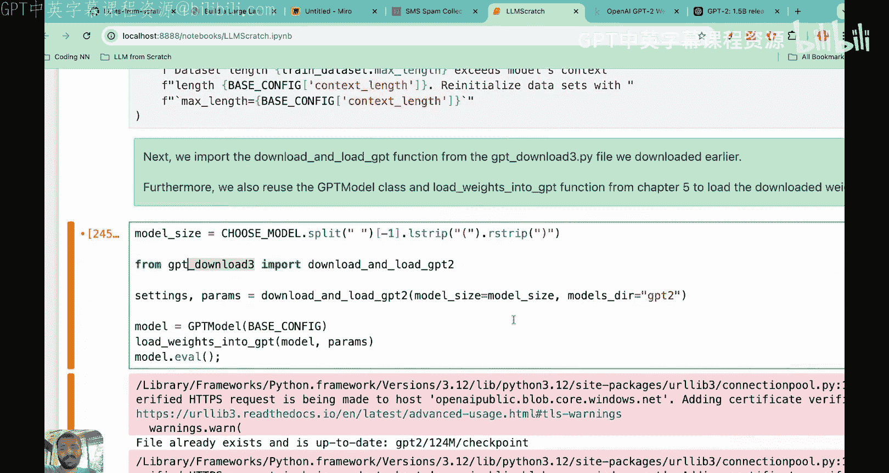
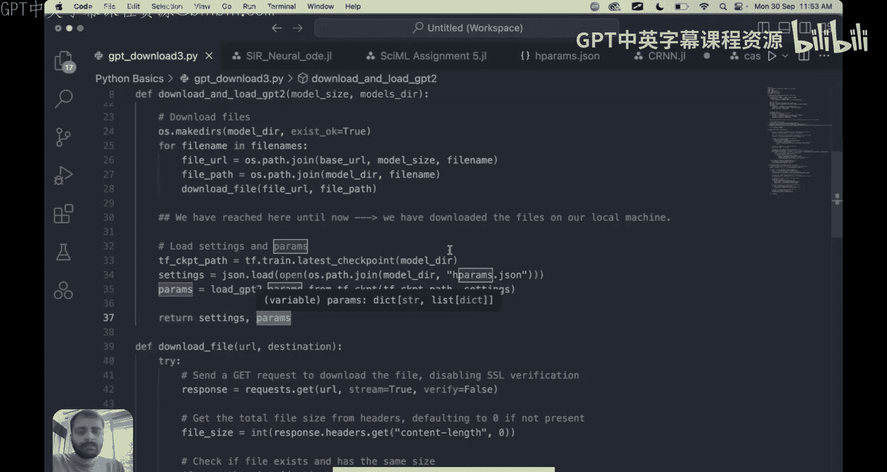
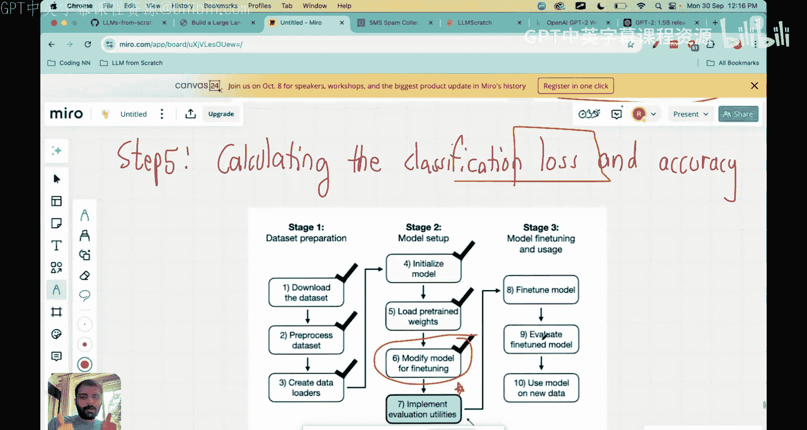

# 33：为LLM分类微调编写模型架构

在本节课中，我们将继续分类微调的实践项目。主要目标是使用预训练权重初始化模型，并对GPT/LLM架构进行修改，使其能够执行分类任务。

首先，让我们快速回顾一下这个LLM分类项目迄今为止的进展。我们从一个问题开始：给定一些文本数据，我们想使用大语言模型来分类它是否是垃圾邮件。这属于微调的范畴。我们在这个系列中已经构建了一个预训练的LLM模型，但尚未对其进行微调。微调对于使预训练模型适应特定任务至关重要。我们有两种微调类型：指令微调和分类微调。我们从这个电子邮件分类的实践项目开始。

以下是构建这个分类器要遵循的步骤。到目前为止，我们已经完成了标记为蓝色的前三个步骤：下载数据、预处理数据以及创建数据加载器。让我们快速回顾一下这三个步骤以及我们已经实现的内容。

这个数据集来自UC Irvine机器学习仓库，名为“SMS垃圾邮件收集”。下载后，你会看到标签为“ham”（非垃圾邮件）和“spam”（垃圾邮件）。数据集中，非垃圾邮件有4825条，垃圾邮件只有747条。因此，我们第一步是平衡数据集，使垃圾邮件和非垃圾邮件都有747条数据。这就是数据预处理。

接着，我们创建了数据加载器，以便能够批量输入数据。数据加载器的主要作用也是将数据集转换为一组输入和目标对。让我展示一下这些输入和目标对的实际样子。

在上节课中，我们将数据集转换成了这两个张量。第一个张量是输入张量，第二个张量是目标张量。你可以看到每个批次有8个输入样本。这里我展示了一个批次，它有8个文本样本。每一行对应一个样本，每一列对应一个令牌。我们使用字节对编码器将这些句子分解为令牌ID，并确保所有句子都转换为相同数量的令牌ID。对于较短的句子，我们用令牌ID 50256（文本结束符）进行填充。

输入张量有8行和120个令牌。这个120是根据数据中最长的文本消息确定的。输出张量则只是0或1，其中0代表非垃圾邮件，1代表垃圾邮件。现在，当我们想要在数据集上训练时，稍后定义的优化器将处理每个批次。在每个批次中，它将处理这8个文本样本，并利用这些输出进行工作。因此，数据加载器使我们在数据管理方面的工作变得非常容易。

到目前为止，我们已经完成了这三个步骤：下载数据、通过平衡非垃圾邮件和垃圾邮件类别来预处理数据集，最后我们还创建了训练数据加载器、测试数据加载器和验证数据加载器。我们使用了70%的数据进行训练，10%的数据进行验证，20%的数据进行测试。你可以在代码中看到这一点：0.7是训练数据，0.1是验证数据，0.2是测试数据。然后，我们有一个垃圾邮件数据集类，它作为输入提供给我们的数据加载器。这些数据加载器的输出是批处理格式，正如我在视觉表示中展示的那样。如果你想更详细地了解我们如何进行数据下载和预处理，我强烈建议你回顾前两节课。

现在，我们进入第二阶段。我们的目标首先是初始化将要使用的大语言模型，然后加载GPT-2的预训练权重，接着为了微调稍微修改模型架构，最后在本节课中实现评估工具。因此，我们将完成步骤四、步骤五和步骤六。这将是一节内容全面的课程。让我们开始吧。

现在我们已经有了训练、测试和验证数据加载器。接下来，我们来看GPT架构。在本系列课程中，到目前为止我们已经构建了这个架构，我现在在屏幕上放大了它。暂时忽略右边的两张图片，只看这个灰色的架构。这是我们迄今为止重点关注的LLM架构。

我们要做的第一件事是将预训练的GPT-2权重加载到这个架构中。如果你没有看过之前的课程，让我快速回顾一下：OpenAI已经免费向公众提供了GPT-2的权重，并且提供了多种参数规模的权重，如1.07亿、1.24亿、7.74亿等。OpenAI甚至为GPT-2发布了公开声明，宣布了这些权重。我们要做的是，与其自己进行预训练（这需要巨大的成本和计算资源），不如直接将预训练的GPT-2权重加载到这个GPT模型中。我们在之前训练大语言模型时已经这样做过。现在让我们进入代码，看看这部分是如何完成的，然后我们再进入第二步。

好的，我现在带你进入代码。今天我们要做的这节课大部分内容将涉及逐步讲解代码。我会一步一步地向你解释代码的每个部分。

现在，我们的第一个任务是准备用于分类微调的模型，以识别垃圾邮件。我们将使用之前用过的相同架构，然后加载预训练权重。稍后我们会在最后一层做一个小的修改，但现在先看看如何加载预训练权重。当你从GPT-2下载权重时，有小型、中型、大型和超大型模型。我们将选择GPT-2小型模型，它有1.24亿个参数。我们有一个基础配置，这意味着词汇表大小是50257，上下文长度是1024，丢弃率是0，查询/键/值偏置项设置为True。这些值与GPT-2训练时使用的值相同。由于我们正在重用这些预训练的GPT-2权重，我们保留了相同的配置。

我们将用我们选择的模型更新这个基础配置。在这里，我们从`model_config`字典中选择`choose_model = ‘gpt2-small’`。在最后这段代码中，我们做的是：如果我们的训练数据集中有一些文本消息的最大长度大于上下文长度（即1024），我们将设置最大长度等于上下文长度。简而言之，我们将删除所有长度超过上下文长度的令牌。这是因为我们的LLM只能处理最大长度等于上下文长度的令牌，在本例中就是1024。

很好，现在配置已经准备好了。接下来我们要做的是下载GPT-2参数。下载GPT-2参数有一个特定的方法，为此我现在要带你查看代码文件。

正如我提到的，下载GPT参数有一个特定的方法。我们编写了这个名为`download_and_load_gpt2`的代码。这段代码的作用是下载OpenAI在公开GPT-2权重时规定的所有权重和完整的模型细节。我们将下载所有这些文件，然后返回两样东西：设置和参数。

“设置”基本上就是这些配置：词汇表大小、上下文长度、嵌入维度、注意力头数和Transformer层数。“参数”基本上是一个字典，这个字典是以一种非常特定的格式构建的。当返回参数字典时，我们得到一个包含五个键的字典：令牌嵌入、位置嵌入、Transformer块中的所有参数（现在用蓝色标记）、最终归一化层的缩放和移位参数。有一节单独的课程我们实际解释了所有这些参数以及这些键是如何从GPT-2导入的。但现在你只需要知道，当你运行这个函数`download_and_load_gpt2`时，它会给你设置字典（GPT-2配置的列表）和参数字典（包含以特定格式组织的所有参数）。你得到令牌嵌入、位置嵌入、Transformer层参数以及最终的输出归一化层参数。本质上，参数字典包含了你需要的所有参数。

现在让我们回到代码。我们要做的是从这个名为`gpt_download_3`的文件中导入`download_and_load_gpt2`函数，也就是我刚才展示给你的函数。当你运行这个函数时，需要传递两个参数：第一个是模型大小，我们将从`choose_model`中获取，即1.24亿；第二个是你想要存储参数的目录，我传递的是`gpt2`。

当你运行这段代码时，你会得到两个字典：`settings`和`params`。`settings`将包含配置文件，`params`将包含GPT-2的所有不同参数。然后，我们初始化之前定义的GPT模型类的实例，并调用`load_weights_into_gpt`函数。这个函数的作用是获取`params`字典，然后将所有权重从`params`加载到我们的模型中。让我展示一下这个加载字典做了什么：它接收我们创建的模型，并在模型所有具有可训练参数的地方（如多头注意力层、归一化层、前馈神经网络、令牌嵌入、位置嵌入等，我现在用箭头标记的地方都有可训练参数），`load_weights_into_gpt`函数将GPT-2参数加载到这个模型中。基本上，你可以认为我们的模型已经完全装备了直接从GPT-2加载的最佳参数。

在之前一节名为“预训练”的课程中，我们解释了整个代码，包括`load_weights_into_gpt`函数和GPT模型类等。现在，你只需要理解我们正在将GPT-2的参数加载到我们的模型中，这样我们的模型就已经是预训练好的了。如果你之前已经加载过，这个运行会非常快，因为文件已经存在。如果你是第一次运行，请注意GPT-2提供的总参数文件大小（如果你看那七个文件，加起来大约500MB），所以根据网速可能需要一些时间。一旦下载完成，你会看到你的模型现在已经更新了来自GPT-2的所有权重。你甚至可以测试模型是否正确加载，可以传入输入文本“Every effort moves you”，然后使用我们之前定义的`generate_text_simple`输出函数。这个函数接收输入文本，将其通过我们的模型，然后生成输出。它生成了15个新令牌。

你可以看到，“Every effort moves you”是输入，然后15个新令牌是“for. The first step is to understand the importance of your work or summary right”。这意味着预训练参数正在工作，因为这段文本是合理的，是恰当的英语。

现在，我们处于GPT模型参数已加载到我们架构中的阶段。接下来，我们进入下一阶段，开始微调模型。但在我们开始将模型作为垃圾邮件分类器进行微调之前，让我们看看我们的模型是否已经能够通过指令提示来分类垃圾邮件。请注意，到目前为止，模型只是预测下一个令牌，我们还没有训练它预测是否是垃圾邮件。但让我们看看模型是否已经内在地学会了这些能力。我要做的是，不在文本提示中提供像“Every effort moves you”这样的文本，而是说“Is the following text spam? Answer with a yes or no.”，然后给出文本“You are a winner. You are specifically selected. You have been specifically selected to receive $1000 cash or $2000 reward.”。请注意，到目前为止我们还没有给模型任何关于垃圾邮件或非垃圾邮件的数据集。我们只是检查基于GPT-2训练本身，它是否能回答这个问题。

当你通过`generate_text_simple`函数传递它时，让我们看看答案。问题是“Is the following text spam? Answer with a yes or no. You are a winner.”。它显然失败了，模型在遵循指令方面很吃力。这是因为模型只经过了预训练，缺乏任何微调。正如我们所见，没有任何分类微调，模型无法正确执行，这是意料之中的。

现在让我们进入第二步。第一步是将预训练的GPT-2权重加载到模型中，这一步我们已经完成了。现在我们进入第二步：通过添加分类头来修改架构。让我详细解释一下。

你可能在想，我们的模型已经被训练来预测下一个令牌，我们如何进行分类？这就是魔法发生的地方。如果你还记得输出层，让我们看看这个线性输出层。在文本分类或文本生成任务中（LLM通常为此训练），这个输出层看起来是这样的：输入是嵌入维度大小768，输出等于50257，因为那是词汇表大小。所以，当输入是“Every effort moves you”时，对于每一行，输出将有50257列。因为那等于词汇表大小。所以“Every”有50257个条目，“effort”有50257个条目，“moves”有50257个条目，“you”有50257个条目。如果你想在“Every effort moves you”之后预测下一个令牌，你看最后一行，然后选择概率最大的那个令牌ID，这就给了你下一个令牌。这就是你预测下一个令牌的方式。但现在我们不需要下一个令牌预测。现在我们的工作只是分类是或否。

所以，我们现在要做的是同样的事情，但输出维度会改变。“Every effort moves you”是我的输入。现在对于每个令牌，我们想要两个输出：是或否。所以“Every”有两个输出，“effort”有两个输出，“moves”有两个输出，“you”有两个输出。为了得到最终答案，我们将看最后一行，也就是“you”，因为它包含了所有先前的信息，然后我们将看“yes”值和“no”值。这些值将表示概率。然后，根据哪个值更高，我们将分类是否是垃圾邮件。因此，我们不是让最终的神经网络输出层大小为50257，而是将原始的线性输出层替换为一个从768个隐藏单元映射到仅2个单元的层。这两个单元对应什么？它们简单地对应垃圾邮件与非垃圾邮件。

这是我们要在LLM架构中做的唯一改变。当我第一次看到这个时，我感到非常惊讶，因为我从未见过分类头。所以这可以被认为是分类头。我感到惊讶是因为我以前只用神经网络和决策树做过分类，从未想过可以在GPT架构之上添加这个分类头，并将其本身用作分类器。这可能有点大材小用，因为即使是决策树或神经网络也可能有效。但这只是一个有趣的应用，表明LLM实际上可以用来执行分类任务。LLM是否比神经网络或决策树表现更好，这是一个开放的研究问题，仍需探索。

好的，这就是现在添加到GPT模型架构顶部的分类头，用于分类答案是“是”还是“否”。在我们深入代码之前，我想提到的另一件事是，我们实际上可以选择要微调哪些层。当然，当你添加这个分类头时，它并不存在于原始的GPT-2架构中。所以这些参数我们需要微调。但我们有一个选项，可以在所有这些参数中进行选择。GPT-2已经给了我很多参数，那么我需要微调多少呢？这是一个你需要做的决定。这里我想提到的一点是，由于我们已经从一个预训练模型开始（加载了GPT-2权重），实际上没有必要微调所有层。这是因为较低层，如令牌嵌入层、位置嵌入层、层归一化层等，这些较低层真正捕获了适用于广泛任务和数据集的基本语言结构和语义。这非常重要。如果你看较低层，有捕获语义含义的令牌嵌入，有位置嵌入，然后我们有一定数量的多头注意力等，其中令牌嵌入被转换为上下文向量，或者输入嵌入被转换为包含一个令牌对所有其他令牌关注度信息的上下文向量。GPT-2已经在大量文本上进行了训练，所以它已经包含了一些关于含义等信息。因此，如果你给出一封电子邮件，关于这封电子邮件是否是垃圾邮件或者它代表什么信息，这些信息已经以某种方式被捕获在这个较低层中，因为GPT-2是一个非常聪明和智能的模型，它确实捕获了这些信息。所以我们可以选择要微调哪些层。我们在这里做出的选择是，我们只微调最后几层。我们肯定会微调这个分类头，我们肯定会微调最终的线性归一化层（即缩放和移位参数），并且我们将微调最终的Transformer块。

请记住，GPT-2架构有12个这样的Transformer块。我们不是微调所有12个Transformer块，而是只微调最后一个Transformer块。我们假设所有其他Transformer块内在地包含了一些关于数据中文本代表什么的信息。因此，这是在实现良好准确性和降低计算成本之间的一个良好折衷。记住，如果你要再次微调所有东西，那么加载预训练权重的目的是什么？我们加载GPT-2预训练权重的原因是因为它有望捕获一些关于文本代表什么的语义含义。

所以我们要做的是只微调三样东西：我们将微调最终的输出头（即这里的分类头，因为它当然不存在于GPT-2中），然后我们将微调最终的Transformer块（第12个Transformer块），以及我们将微调最终的层归一化模块。这就是我们要做的三件事。我们将微调这些，其余所有其他参数我们将冻结，这意味着我们不会训练剩余的参数。

好的。在我们进入代码之前，我想解释的另一件事是：每个令牌将产生两个输出，对吧？假设我的句子是“Every effort moves you”。输出是垃圾邮件还是非垃圾邮件？我应该看这四个令牌中的哪一个？我应该看第一个令牌、第二个、第三个还是第四个？因为它们都会有“是/否”值。我应该看哪个令牌？这里有一个很好的示意图来说明为什么我们应该总是提取最后一个输出令牌。我们应该总是提取最后一个输出令牌，因为最后一个令牌是唯一一个对所有其他令牌都有注意力分数的令牌。如果你看第二个令牌，它只包含相对于第一个令牌的注意力。如果你看第三个令牌，它只包含相对于前两个令牌的注意力。而最后一个令牌拥有所有信息，它包含相对于所有先前令牌的注意力。因此，如果你想预测是否是垃圾邮件，你想从包含句子中最大信息量的那一行进行预测，这等于最后一个令牌。所以我们将提取最后一个令牌的输出行，并用它来预测电子邮件是否是垃圾邮件。

因此，所有这些正是我现在要在代码中向你展示的内容。让我们进入代码。我们要做的第一件事是在顶部添加一个分类头，正如我在这张图中向你展示的。我们将用这个新的输出头替换原始的输头。

在这一部分，我们修改预训练的大语言模型，为分类微调做准备。为此，我们将原始的将隐藏表示映射到词汇表大小50257的输出层，替换为一个更小的、仅映射到两个类（0和1）的输出层。所以你看，我们想要这种只有两个输出的输出层，即末尾有两个神经元。

我想提到的一点是，从技术上讲，我们可以使用单个输出节点，因为我们处理的是二元分类任务。然而，这不是一个通用的方法。如果我们使用单个输出，那就不通用，如果我们有更多的类别。所以这里我们做的是一个更通用的方法。当我们编写模型架构代码时，我们会说最终输出节点的数量应该等于类别的数量。我们没有硬编码输出节点，而是获取类别的数量，并将最终输出节点的数量设置为那个值。例如，如果我们有三个类别，如技术、体育或医学，我们的相同代码将适用于这个修改，因为那时最终输出节点的数量将等于三。这只是我想提到的一个小细节。

在构建模型架构之前，我们可以打印原始模型架构。我们打印出原始模型架构，你可以看到有12个Transformer块。Transformer块的数量从0到11，这就是为什么有12个Transformer块，并且在末尾有一个输出投影层。

很好，这就是输出头。这里你可以看到输入维度为768，输出特征维度为50257。这是我们计划改为2而不是50257的部分，我们只想要2作为输出特征。

如前所述，GPT模型由嵌入层（令牌嵌入和位置嵌入）、12个相同的Transformer块、一个最终的层归一化和输出层（输出头）组成。所以，我们要做的是用一个新的输出层替换输出头，正如我们在这里的图中说明的那样。

为了做到这一点，让模型为分类微调做好准备，我们首先冻结模型。这意味着我们将首先使所有层不可训练。冻结整个模型的方法是：对于`model.parameters()`中的所有参数，我们设置`requires_grad = False`，这意味着我们根本不会更新这个参数，也就是冻结所有模型参数。

然后，我们将告诉这个模型哪些参数我们要微调。正如我提到的，有三组参数我们要微调：最终的输出头、最终的Transformer块和最终的层归一化模块。首先，让我们修改最终的输出头架构。我们将设置`model.output_head`，现在的大小是：输入特征仍然是嵌入维度768，输出特征现在等于类别数量。所以如果类别数量等于2，输出特征将是2（在本例中是垃圾邮件与非垃圾邮件）。如果类别数量是3，输出特征将等于3。这就是你做的简单更改。这向Py