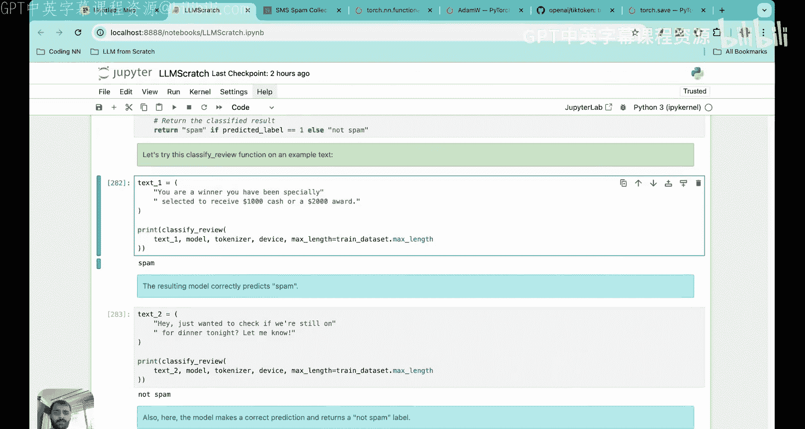

# 34：微调LLM垃圾邮件分类模型

在本节课中，我们将继续基于微调的分类项目。我们将学习如何计算分类损失和准确率，并实现训练循环、测试循环，从而完成整个微调项目。

## 项目回顾

上一节我们介绍了数据加载器的实现，本节我们来看看如何评估和优化模型。首先，让我们回顾一下到目前为止在这个基于微调的分类实践项目中涵盖的所有内容。

我们最初下载了数据集，然后对数据集进行了预处理，并创建了数据加载器。为了让你了解数据集的实际内容，让我向上滚动一下代码来展示数据集的样子。

数据集本质上是一个垃圾邮件/非垃圾邮件分类任务。我们从UCI机器学习仓库下载了SMS垃圾邮件收集数据集，该数据集包含被标记为垃圾邮件或非垃圾邮件的短信。

下载数据后，我们发现数据集是不平衡的：大约有40800条非垃圾邮件，但只有747条垃圾邮件。因此，我们平衡了数据集，使非垃圾邮件类别和垃圾邮件类别都有747条消息。这是我们做的第一个数据预处理步骤。

之后，我们实现了数据加载器。当我们实现数据加载器时，整个数据集被分批处理为输入和目标。数据集被分割为训练集、测试集和验证集，其中70%用于训练，20%用于测试，10%用于验证。

如果你查看70%的训练数据，由于数据加载器的作用，这些数据将被分割为输入和目标。在输入中，我们定义了批次，每个批次包含8个样本。大约有130个这样的训练数据批次。列数等于120，这是每条短信对应的标记ID数量。

为了确保所有短信具有相似或完全相同的标记ID数量，我们用标记ID 50256（对应文本结束标记）填充了较短的短信。这就是输入张量。这里展示的是目标张量，它只包含0和1，其中0表示非垃圾邮件，1表示垃圾邮件。

因此，当你为训练数据实现数据加载器时，它看起来像这样，有130个批次。当你为验证和测试数据实现数据加载器时，数据也被分批成类似的批次。所以我们有130个训练批次、19个验证批次和38个测试批次。这就是我们在前三个步骤中实现的内容：下载数据集、预处理数据和创建数据加载器。

在接下来的步骤中，我们处理了模型架构。模型架构最初看起来是这样的。我们查看了最终的输出层，该输出层最初是一个神经网络，输入大小为嵌入维度768，输出为50257（词汇表大小）。由于我们正在进行分类任务，我们将这个神经网络替换为这种分类头作为输出，其中神经网络的输入数量为768，但输出数量等于2（垃圾邮件或非垃圾邮件）。

到上一讲结束时，我们看到如果将任何输入传递给这个修改后的架构，例如输入“do you have time”，并将其传递给这个修改后的架构，输出将类似于这样：`do`、`you`、`have`、`time`。对于每个标记，将有两个输出，分别对应垃圾邮件或非垃圾邮件。

然后我们看到，我们不是查看所有这些输出，而是只查看最后一个标记（本例中为`time`）对应的输出，因为通过其注意力权重，最后一个标记包含了所有其他标记的信息。

我们已经进行到这个阶段：传入这个输入，得到一个形状为 `1 x 4 x 2` 的输出张量。因为这是一个批次，批次大小为1，所以是1；4是因为有四个标记；2是因为每个标记有两个输出，分别对应垃圾邮件或非垃圾邮件。然后我们看到，我们将查看最后一个输出标记，最后一个输出标记将给我们两个值。我们已经进行到这个阶段。

在今天的课程中，我们将看到，一旦你从最后一个标记得到最终的两个输出，你将如何处理这些输出？我们将首先实现两个指标：获取准确率，获取损失函数。然后我们将实现反向传播，以便我们可以训练我们的架构以最小化损失函数。我们将修改所有参数以使损失最小化，然后我们将在模型未见过的一些新数据上进行测试。

## 将模型输出转换为类别标签预测

首先我们需要讨论如何将模型输出转换为类别标签预测。假设你有输入短信“you won the lottery”。到目前为止，我们已经看到我们可以提取最后一行对应的输出。假设输出看起来像这样，基于这个输出，我们如何判断它是否是垃圾邮件？

在实践中，我们可以对此应用一个softmax函数，以便将这两个输出转换为一组概率。那么第一个值将是0.99，第二个将是0.01。然后我们查看具有最高概率值的索引。由于0.99是更高的概率，这意味着索引号0更可能是答案，而索引号0对应非垃圾邮件，因此这条短信将被分类为非垃圾邮件。

类似地，如果你有第二条短信“do you have time”，如果最后一行对应的输出是这两个标记，我们再次应用softmax，然后我们将得到一个概率张量：0.01和0.99。那么索引号1更高，因此我们的模型预测的输出将是1，即垃圾邮件。这些是我们要在代码中实现的步骤。

你稍后会看到，实际上甚至不需要实现softmax，因为我们只查看值较高的索引。例如，即使你看这些值，这个索引更高，所以索引0更高，因此它是非垃圾邮件。如果你看这两个，索引1会更高，所以它是垃圾邮件。

现在让我们转到代码，讨论如何将模型输出转换为类别标签预测。

假设现在我们有一个最后标记的输出，看起来像这样：-3.5983 和 3.9902。正如我们讨论的，首先我们将应用softmax，将其转换为一组概率。假设我们对这些输出应用softmax并打印softmax值，你会看到当你对这两个应用softmax时，输出张量有两个值：0.0005 和 0.9995。由于0.9995更高，我们接下来要做的是查看argmax，即查看具有较高值的索引，那将是索引号1，所以我们的类别标签预测将是数字1。

在这种情况下，代码返回1，意味着模型预测输入文本是垃圾邮件。正如我提到的，使用softmax是可选的，因为最大的输出直接对应于最高的概率分数。所以我们可以直接查看这些输出并找到argmax。

这就是我们要做的。假设我们查看最终标记并查看其输出，我们将取argmax，它将给我具有较高值的索引，那将是索引号1，所以我的类别标签将只是那个标签。然后我们将得到输出。

## 计算分类准确率

现在这是我的分类准确率，它衡量数据集中正确预测的百分比。假设正确答案是类别标签1，如果我得到类别标签1，那就很好。我们将比较模型预测和正确的标签预测，然后那将给出我的准确率。

为了确定分类准确率，我们将基于argmax的预测代码应用于数据中的所有示例，然后我们将把它与数据集中的实际值进行比较。然后我们将找到准确率。

为了说明这一点，假设我们的批次看起来像这样。我要做的是，假设这是我的第一个输入，我将通过我的模型传递它，得到那两个逻辑值，然后我将应用Argmax函数并预测它是否是垃圾邮件。假设它被预测为垃圾邮件。类似于这些输出标签，我将有另一个标签，即预测标签。这些输出标签也称为目标标签，是我的真实值，这里我有我的预测标签。然后我只需比较这两者，就能得到准确率分数。

这正是我们现在要在代码中做的。你可以看到我们将定义这个`calculate_accuracy`函数，给定一个加载器。假设给你一个训练数据加载器，我们首先要做的是，如果未指定批次数量，我们将只使用数据加载器的长度作为批次数量或批次大小。

每个批次由8个训练示例组成。因此，对于训练数据样本，批次数量将等于130。如果我们在这里指定了批次数量，那么批次数量将是我们在这里指定的最小值（比如50）和130之间的较小值，那么它将考虑批次数量等于50，并且只计算那么多批次的准确率。

这段代码将发生的情况是，我们查看数据加载器中的每个批次。假设我们正在查看第一个批次，第一个批次有8个样本。当我们查看每个批次时，我们将传入一个批次的所有样本，并找到逻辑值，即两个输出值，最后一个输出标记的逻辑值。但现在想象一个批次有8个样本，所以我将有8个这样的张量。

然后我将做的是，我将找到整个批次的argmax值。然后我将比较预测标签与目标标签，即我的实际答案。如果预测正确，即如果它们相等，我将更新正确预测的数量，将正确预测的数量增加一。

当我遍历示例时，每当我做出预测时，我也会将示例数量增加一。所以如果我在这里遍历第一个示例并做出预测，示例数量将增加一。当我做出第二个预测时，它将再次增加一。我只是在跟踪示例数量和正确预测数量。

最后，为了找到准确率分数，我将只取正确预测数除以示例总数。如果示例总数是1000，正确预测是600，我的准确率将是600除以1000。

我们在这里做一件非常简单的事情。我们只是计算模型的预测，并将其与实际值进行比较，然后累加我们得到了多少正确预测。这是找到准确率的最简单方法。

这就是`calculate_accuracy_loader`函数的代码。现在我们要做的是使用这个函数`calculate_accuracy_loader`，并且为了简单起见，我将指定批次数量等于10。我们的训练数据加载器实际上有130个批次，但我指定批次数量等于10，以便你可以看到我们是否能够计算整个数据集上的训练、验证和测试准确率。

当然，这里没有任何优化。所以我们的值不会很好。但我只是想向你展示这段代码确实可以运行。你有这个函数`calculate_accuracy_loader`，首先你传入训练加载器，那将包含来自训练数据集的数据，即我们数据的70%。然后你传入验证加载器，那是你数据的10%。然后你传入测试加载器，那是你数据的20%。在每种情况下，我们都指定批次数量等于10。

然后我们打印出训练准确率、验证准确率和测试准确率。模型尚未优化，我们尚未实现反向传播，所以这些准确率指标不会很好，但让我们看看它们是多少。当你打印出训练准确率、验证准确率和测试准确率时，你得到训练准确率是46%，验证准确率是45%，测试准确率是48%。这相当糟糕，甚至比抛硬币还差。我本可以只是抛硬币并随机预测正确值，我会有50%的正确率。

## 定义损失函数以优化模型

为了提高预测准确率，我们需要微调模型。记住我们如何微调或优化模型参数？优化模型参数的方法是，我们现在可以做两件事：我们有目标值（真实值）和预测值。现在我们需要做的是，基于真实值和预测值，我们需要定义一个损失函数。

一旦定义了损失函数，那么我们将简单地计算损失函数对所有可训练权重的偏导数。我们将计算关于可训练权重的梯度，然后进行更新。所以新权重等于旧权重减去损失关于该权重的偏导数。我们将使用一种称为Adam或AdamW的简单梯度下降变体，然后我们将继续更新这些参数，直到损失函数最小化。

目前，假设损失函数看起来像这样（当然不会这么简单，但我举一个简化的例子）。最初我们从这里开始，损失不是那么低，然后我们沿着这个损失函数向下移动，希望达到这个全局最小值，在那里损失被最小化。一旦损失最小化，那么我们将确保准确率也自动提高。

那么问题来了：如何定义损失函数？使用什么损失函数？如果你以前学习过神经网络和机器学习，我们知道如果我们有目标值Y_i，我的预测是P，那么在这种情况下使用的损失函数是分类交叉熵损失，定义为负的Σ（对所有类别标签求和）Y_i * log(P)。

让我用一个简单的例子来说明。假设我们有一个文本数据，其真实值是非垃圾邮件，这意味着它的one-hot编码是1和0。假设这是非垃圾邮件，但我们的预测值（经过预测后）是0.8和0.2。那么交叉熵损失是负的，我们需要对所有类别求和Y_i * log(P_i)。Y_i是真实值，P是预测值。

让我们计算：我们将1（真实值）乘以log(0.8)，0乘以log(0.2)，然后取这个的负值。0乘以log(0.2)是0，然后1乘以log(0.8)是某个值，取负值后大约是0.2231。为什么这是一个好的损失度量？因为如果我们的预测值是1和0，正好等于真实值，那么第二项无论如何都是0，但第一项将是1 * log(1)，等于0。所以如果预测值等于真实值，那么我们的损失将是0，这正是我们想要的。因此，这个负的y*log(p)是在分类任务中计算损失的一个非常好的损失函数。

为了给你一个直观的理解，-log(x)的图形看起来像这样。这是x，这是-log(x)。我们希望x尽可能接近1，即正确类别的概率。最终，我们将从某个高损失开始，我们的目标是使损失尽可能接近0。

交叉熵损失的另一个优点是它是可微的，因此在我们进行反向传播时非常有用。

现在，让我们实际定义交叉熵损失。除了这个`calculate_accuracy_loader`，我们还要做的是定义一个损失函数，即交叉熵损失。为什么我们不能只使用分类准确率并取该准确率的倒数来得到损失？因为分类准确率不是可微函数。所以我们将使用交叉熵损失作为最大化准确率的代理。这与我们在预训练大语言模型中使用的交叉熵损失相同。

现在我们要做的是，假设我们得到一个输入批次和一个目标批次。每当给出输入和目标批次时，你的脑海中应该浮现出这个图：我们有一个输入批次和一个目标批次。

这里需要做的是，一旦你得到输入批次，你通过模型传递它，然后你只查看最后一个输出标记的逻辑值，因为它包含最多的信息，然后你找到这个逻辑值张量（最后一个标记的输出）和目标批次之间的分类交叉熵损失。

逻辑张量输出可以是类似0.8和0.2的东西，目标输出是1和0。当你计算交叉熵时，你将得到损失函数的某个值。

我将在这里展示`torch.nn.functional.cross_entropy`，这是我们用来找到交叉熵损失的PyTorch功能。

这太棒了，这是可微的，所以当我们进行反向传播时，它将非常有用。

我们将使用这个`calculate_loss_batch`函数来计算单个批次的损失，我们也可以用它来计算多个批次的损失。要计算多个批次的损失，我们必须使用与这里类似的代码行。

如果未指定批次数量，那么我们将批次数量设置为等于数据加载器的长度。如果指定了批次数量，那么它等于指定的批次数量与数据加载器长度的最小值，与我们看到的准确率分类代码非常相似。

然后我们要做的是，我们将取一个输入批次，一个目标批次，使用这个`calculate_loss_batch`（它将实现分类交叉熵）计算输入批次所有样本和目标批次之间的损失。每当我们得到一个损失时，我们将累加损失，那就是总损失。

最后，我们将用总损失除以批次数量，这样会给我们每个批次的平均损失。这就是我们最终将尝试通过反向传播最小化的损失。这就是我们将要遵循的整个工作流程。

现在我们可以做的是，在我们的数据集上实现这个损失函数。我们还没有实现反向传播，所以损失会很高，但我只想向你展示训练损失、验证损失和测试损失的初始值。这里我再次将批次数量设置为5，因为实际上训练数据加载器有130个批次，计算需要很长时间。无论如何，我们还没有在这里进行训练，我只是想说明可以在五个批次上找到损失。

所以你实现`calculate_loss_loader`函数，并传入训练加载器、验证加载器和测试加载器，然后你还传入批次数量。然后你可以打印出训练损失、验证损失和测试损失。你可以看到这些值相当高。在准确率中我们看到准确率非常差，这也反映在损失值中。

## 实现训练循环以微调模型

现在我们将实现一个训练函数来微调模型，这意味着你将调整参数以最小化训练损失，然后你还将打印验证损失和测试损失。

现在让我们开始查看这部分代码。

到目前为止，我们已经完成了许多步骤：下载数据集、预处理数据、创建数据加载器、初始化模型、加载预训练权重、修改模型以进行微调、实现评估工具（基本上是损失和准确率）。

现在我们处于这个阶段，我们将实际对模型进行微调，这意味着我们将定义训练循环并实现反向传播。

这是我们将要定义的训练循环。首先，我们将有周期数，这意味着一个周期是遍历整个数据集一次。假设你正在运行一个特定的周期，第二个循环是你必须遍历每个批次。每个批次有8个样本，至少我们是这样定义训练数据加载器的。

然后我们将查看每个特定样本，然后计算当前批次的损失，并实现反向传播以计算损失梯度，然后使用损失梯度更新模型权重。这里我们要做的是：新权重等于旧权重减去学习率乘以偏导数，这正是我们在这里写的。

一旦权重更新，我们打印训练和验证损失，然后我们对多个周期继续做同样的事情，以便参数不断更新。思考这个问题的最简单方式是，最重要的步骤是这个反向传播。一旦我们进行反向传播，我们就得到损失梯度，这就是为什么我们需要损失函数是可微的。

一旦我们得到关于参数的损失梯度，我们就可以实际更新参数。一旦我们进行足够多次，参数将被更新，并希望达到损失函数最小化的损失值。

这与我们为预训练LLM实现的训练函数完全相同。我想向你展示的是，当我们在监督数据上微调模型时（比如我展示给你的垃圾邮件/非垃圾邮件标签数据集），我们需要再次训练模型。因此，预训练中涉及训练过程，微调中也涉及训练过程，这就是为什么它被称为预训练——因为它是在这个需要实现的第二次训练过程之前。

现在让我们看看训练过程是如何在代码中实现的。我将这部分命名为“在监督数据上微调模型”。

到目前为止，我们实际上还没有在数据集上训练模型，这意味着参数尚未优化。

在本节中，我们将定义并使用训练函数来微调预训练的LLM，并提高其垃圾邮件分类准确率。

需要注意的是，如果你一直跟着这些课程，你会发现训练函数非常接近我们之前用于预训练的`train_model_simple`函数。唯一的区别是，我们在这里跟踪示例数量（文本样本数量），而不是我们之前计算的标记数量。

在代码中，我们将做七步。第一步是将模型设置为训练模式。你可以看到我们将模型设置为训练模式。这是第一步。

第二步是重置先前批次的损失梯度。当我们查看每个批次时，我们必须再次重置损失梯度。假设我们现在正在查看一个批次，我们重置先前批次迭代的损失梯度。

第三步是计算损失梯度和更新模型权重。这些是最重要的步骤。然后你做的是找到该批次的损失，然后通过反向传播计算损失梯度，然后执行`optimizer.step()`。这就是优化器发挥作用的地方。在白板上，我向你展示了简单的普通梯度下降，但在实践中，我们将使用一个更复杂的优化算法，它跟踪先前的梯度、先前的梯度平方等，以便优化以更好的方式进行，并且模型不会陷入局部最小值。

下一步是跟踪示例数量。我们只是跟踪我们看到的示例数量。`input_batch.shape[0]`是批次中的样本数量。例如，如果批次有8个样本，标记数量是120，那么我们将在这里得到8。`input_batch.shape[0]`将给我们这里的样本数量。

然后我们跟踪看到的示例数量。你可以把这个“看到的示例”理解为：当你查看一条短信时，那就是一个看到的示例；当你查看第二条短信时，你将看到的示例数量增加一。每当你遍历一个完整的批次时，你将全局步数增加一。

现在这里我们有