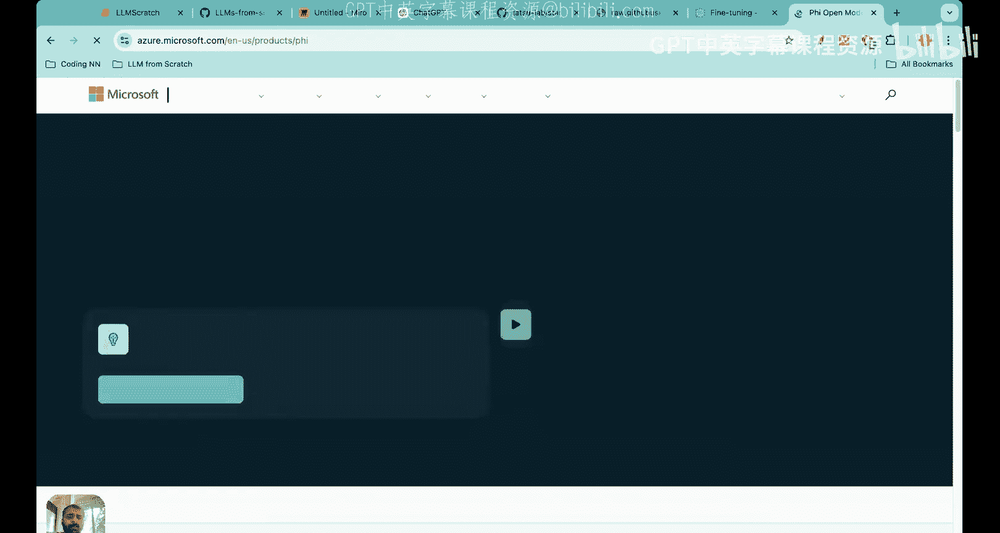
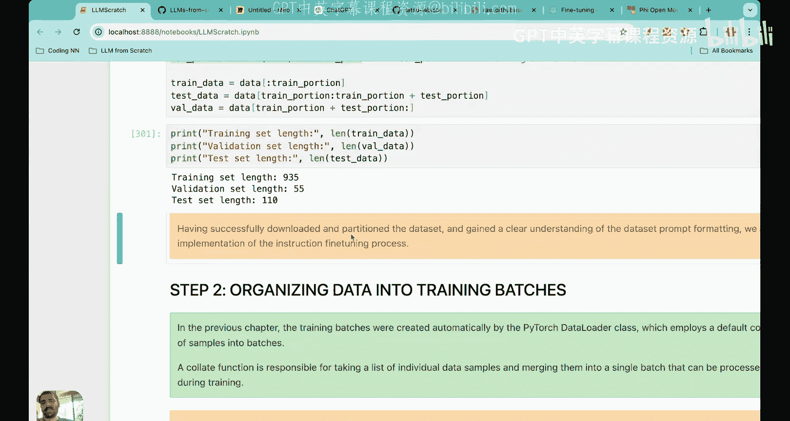

# 35：指令微调简介、数据集加载与提示词格式化


在本节课中，我们将学习一个名为“指令微调”的主题。我们将了解为什么需要对预训练的大语言模型进行微调，并开始动手准备用于指令微调的数据集。

## 课程概述

在之前的课程中，我们已经完成了大语言模型构建的第一阶段（数据处理、注意力机制、模型架构）和第二阶段（预训练循环、模型评估、加载预训练权重以构建基础模型）。我们还学习了一种基于分类的微调方法。

现在，我们将开始学习另一种更常见的微调类别：**基于指令的微调**。在本系列接下来的5-6节课中，我们将从零开始构建一个属于我们自己的个人助手。我们已经有了一个预训练模型，但它需要进一步改进和微调，才能胜任个人助手的角色。

## 为什么需要指令微调？

预训练的大型语言模型（如我们目前构建的模型）在文本补全方面表现不错，但在遵循指令方面却存在困难。

例如，如果你要求一个未经微调的预训练LLM“修正这段文本的语法”或“将文本从主动语态转换为被动语态”，它将无法完成这些任务。未经微调的LLM可以生成新的词元和句子，但它无法遵循特定的指令。

如果我们想构建一个个人助手，就需要LLM能够遵循指令。无论是“修正我的句子语法”、“删除句子中所有的‘the’和‘a’”，还是“让句子更简洁、语气更专业”，模型都需要通过微调来理解这些指令。

以下是两个需要指令微调的实际例子：

**1. 电商客服聊天机器人**
一家电商公司希望部署一个客服聊天机器人来处理订单状态、退货和产品推荐等查询。如果仅使用预训练模型，模型将难以理解基于公司特定政策、产品和服务的客户查询。通过指令微调，公司可以提供领域特定的指令（例如：“如果用户询问退货政策，请提供发起退货的步骤”），从而确保聊天机器人不仅能理解通用语言，还能用公司特定的信息进行准确回复。

**2. 个性化医疗保健助手**
医疗环境中的虚拟助手旨在帮助患者预约、提醒服药等。预训练模型可能具备一般的医疗知识，但缺乏对特定医疗机构实践、治疗方案等的了解。通过使用特定医疗指南和患者历史数据进行指令微调，可以确保助手理解医学术语，遵循特定指南，并提供个性化的建议。

## 指令微调的核心概念

指令微调，也称为**监督式指令微调**，其核心在于我们为模型提供大量的“指令-响应”配对数据。模型通过学习这些配对，学会如何根据给定的指令生成合适的响应。

以下是几个指令微调数据集的例子：
*   **指令**：将45公里转换为米。
    **期望响应**：45公里等于45000米。
*   **指令**：为“bright”提供一个同义词。
    **期望响应**：“bright”的一个同义词是“radiant”。
*   **指令**：编辑以下句子以去除所有被动语态。“The song was composed by the artist.”
    **期望响应**：The artist composed the song.

我们的目标就是在一个由这类“指令-输入-输出”三元组组成的数据集上训练LLM，使其学会遵循指令。

## 构建个人助手的工作流程

我们将遵循以下顺序工作流来构建我们的个人助手：
1.  加载包含指令和响应的训练数据集。
2.  对数据集进行批处理，创建数据加载器。
3.  加载预训练的LLM。
4.  微调LLM。
5.  检查损失，提取响应，进行评估并评分。

在今天的课程中，我们将完成第一步：**数据集的下载与格式化**。这一步与我们之前所做的有所不同，会非常有趣。

## 动手实践：下载与格式化数据集

现在，让我们开始代码部分。在本节中，我们将下载并格式化用于指令微调预训练LLM的数据。

### 第一步：下载数据集

我们将使用一个包含约1100个“指令-响应”配对的数据集。首先，我们定义一个函数来从指定的URL下载并加载这个JSON格式的数据集。

```python
def download_and_load_file(url):
    # 代码从指定URL下载并加载JSON数据
    # ...
    print(f"Number of entries: {len(data)}")
    return data
```

运行此函数后，我们可以确认数据集已正确下载，包含1100个条目。

### 第二步：查看数据格式

加载的数据列表中的每个条目都是一个字典，包含三个键：`instruction`（指令）、`input`（输入，可能为空）和`output`（输出/响应）。

让我们打印几个条目来查看其结构：

```python
# 打印第50个条目
print(data[49])
# 输出示例: {'instruction': 'Identify the correct spelling of the following word.', 'input': 'occasion', 'output': 'The correct spelling is occasion.'}

# 打印第999个条目（无输入的例子）
print(data[998])
# 输出示例: {'instruction': 'What is the antonym of complicated?', 'input': '', 'output': 'The antonym of complicated is simple.'}
```

### 第三步：将数据格式化为提示词（Prompt）

我们不能直接将原始的`instruction`、`input`、`output`格式输入给LLM。研究发现，在训练过程中，需要以特定的格式向LLM提供提示词才能达到最佳效果。最常用的格式之一是**斯坦福Alpaca模型使用的格式**。

Alpaca提示词格式如下：
```
Below is an instruction that describes a task. Write a response that appropriately completes the request.


### Instruction:
{instruction}

### Input:
{input}



### Response:
{output}
```

如果某个条目没有`input`，则`### Input:`部分留空。

我们将定义一个函数`format_input`，将原始的条目字典转换为这种Alpaca格式的提示词。

```python
def format_input(entry):
    instruction_text = entry.get('instruction', '')
    input_text = entry.get('input', '')
    
    # 构建Alpaca格式提示词
    prompt = f"Below is an instruction that describes a task. Write a response that appropriately completes the request.\n\n### Instruction:\n{instruction_text}"
    if input_text:
        prompt += f"\n\n### Input:\n{input_text}"
    prompt += "\n\n### Response:\n"
    
    return prompt
```

让我们用之前的数据测试这个函数：

```python
# 测试有输入的例子
formatted_prompt = format_input(data[49])
desired_response = data[49]['output']
full_example = formatted_prompt + desired_response
print(full_example)
```

输出将类似于：
```
Below is an instruction that describes a task. Write a response that appropriately completes the request.

### Instruction:
Identify the correct spelling of the following word.

### Input:
occasion

### Response:
The correct spelling is occasion.
```

```python
# 测试无输入的例子
formatted_prompt = format_input(data[998])
desired_response = data[998]['output']
full_example = formatted_prompt + desired_response
print(full_example)
```

输出将类似于：
```
Below is an instruction that describes a task. Write a response that appropriately completes the request.

### Instruction:
What is the antonym of complicated?

### Input:


### Response:
The antonym of complicated is simple.
```

这个完整的字符串（提示词 + 期望响应）将在后续微调过程中作为输入提供给大语言模型。

### 第四步：划分数据集

接下来，我们需要将数据集划分为训练集、测试集和验证集。我们将使用85%的数据进行训练，10%进行测试，5%进行验证。

```python
total_size = len(data)
train_size = int(0.85 * total_size)
test_size = int(0.10 * total_size)
val_size = total_size - train_size - test_size # 剩余5%

train_data = data[:train_size]
test_data = data[train_size:train_size + test_size]
val_data = data[train_size + test_size:]

print(f"Training set size: {len(train_data)}")
print(f"Testing set size: {len(test_data)}")
print(f"Validation set size: {len(val_data)}")
```

运行后，你将看到类似这样的输出：
```
Training set size: 935
Testing set size: 110
Validation set size: 55
```

## 总结与下节预告

在本节课中，我们一起学习了：
1.  **指令微调的必要性**：使预训练LLM能够遵循特定指令并适应领域特定数据。
2.  **指令微调数据集的结构**：由“指令-输入-输出”三元组组成。
3.  **Alpaca提示词格式**：一种将原始数据转换为LLM训练所需的标准提示词格式。
4.  **数据准备流程**：我们完成了数据集的下载、查看、格式化（转换为Alpaca提示词）以及划分（训练/测试/验证集）。

目前，我们的数据已经准备好了，但还不能直接用于训练。在下一节课中，我们将进入关键步骤：**将数据组织成训练批次**。这涉及到确保所有输入长度一致、将文本转换为词元ID、创建数据加载器等具体操作。

通过接下来的4-5节课，我们将最终构建出属于自己的个人助手聊天机器人。这将使你从ChatGPT的“消费者”转变为“创造者”，并让你有信心为任何公司构建定制的聊天机器人解决方案。



请尝试跟随课程并做好笔记。如果你是第一次观看本课程，我鼓励你观看之前的所有课程以巩固理解。感谢大家，我们下节课再见！


