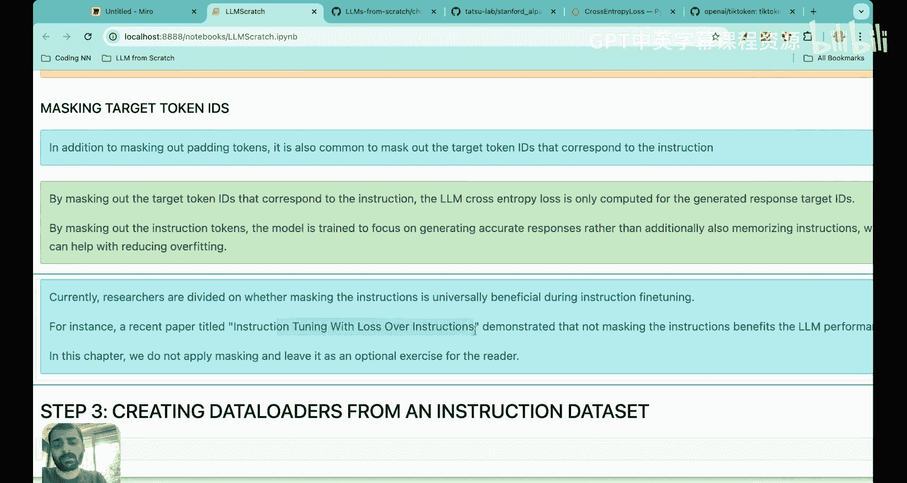
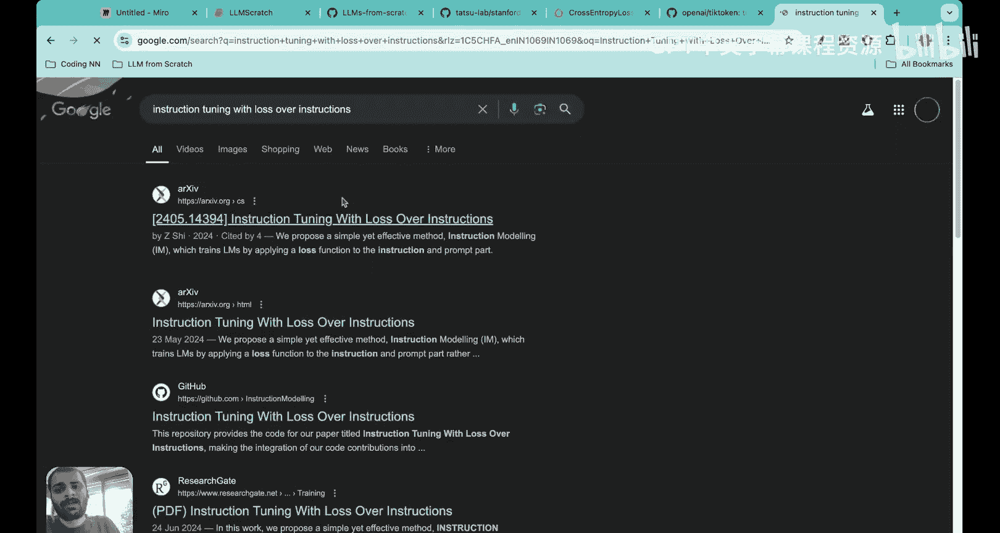
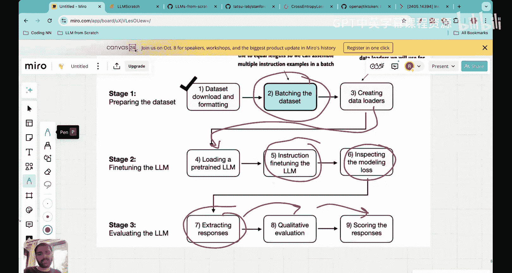

# 36：指令微调中的数据批处理 🧱


在本节课中，我们将继续上一讲开始的指令微调实践项目，重点学习如何将数据组织成训练批次。数据批处理是模型训练的关键步骤，它涉及将不同长度的文本样本转换为统一格式的数值张量，以便模型能够高效地进行批量学习。

## 概述

上一讲我们介绍了指令微调的基本概念。预训练的大语言模型擅长文本补全，但在遵循特定指令（如“修正语法”或“转换为被动语态”）方面表现不佳。因此，我们需要通过指令微调来教会模型遵循指令。这个过程需要一个由“指令-输入-输出”对组成的数据集。

我们使用的数据集包含1100个这样的配对。上一讲中，我们完成了数据下载，并将其格式化为 **Alpaca 提示风格**，然后将数据集划分为训练集（85%）、测试集（10%）和验证集（5%）。

本节课，我们将深入探讨数据批处理的五个核心步骤，这是指令微调中至关重要且细节丰富的一环。

## 数据批处理的五个步骤

数据批处理的目标是将不同长度的文本提示转换为具有相同维度的数值张量。以下是实现此目标的完整流程：

### 步骤一：使用提示模板格式化数据

首先，我们需要将原始的“指令-输入-输出”数据对转换为模型可以理解的统一提示格式。我们采用 Alpaca 提示风格。

**代码示例：格式化函数**
```python
def format_input(entry):
    # entry 包含 instruction, input, output 三个键
    if entry['input']:
        prompt = f"Below is an instruction that describes a task, paired with an input that provides further context. Write a response that appropriately completes the request.\n\n### Instruction:\n{entry['instruction']}\n\n### Input:\n{entry['input']}\n\n### Response:\n"
    else:
        prompt = f"Below is an instruction that describes a task. Write a response that appropriately completes the request.\n\n### Instruction:\n{entry['instruction']}\n\n### Response:\n"
    # 将输出（响应）附加到提示后面，构成完整的训练文本
    full_text = prompt + entry['output']
    return full_text
```

### 步骤二：将格式化数据转换为词元ID

接下来，使用分词器（如 OpenAI 的 BPE 分词器 `tiktoken`）将文本提示转换为一系列词元ID（Token IDs）。每个词元ID对应词汇表中的一个特定词或子词。

**核心概念：词元化**
`词元ID序列 = 分词器(格式化后的文本提示)`

### 步骤三：通过填充使批次内样本长度一致

在一个训练批次中，不同样本的词元ID序列长度可能不同。为了进行批量矩阵运算，我们需要将它们填充到相同的长度。

具体做法是：
1.  找出当前批次中最长的词元ID序列长度 `max_len`。
2.  对于批次中其他较短的序列，在末尾添加特殊的 **填充词元ID**，直到其长度等于 `max_len`。

我们使用的填充词元ID是 **50256**，它对应于 GPT-2 词汇表中的 **`<|endoftext|>`**（文本结束）标记。使用这个特殊标记进行填充，可以避免引入无意义的词汇信息。

### 步骤四：创建目标词元ID

这是指令微调中关键且可能反直觉的一步。我们不是简单地将“输出”部分作为目标，而是采用与预训练类似的 **下一个词元预测** 任务。

**目标词元ID的构建方法：**
`目标序列 = 输入序列[1:] + [<|endoftext|>]`

也就是说，目标序列是输入序列向右移动一位，并额外在末尾添加一个 `<|endoftext|>` 标记。

**为什么这样做？**
通过让模型学习预测输入序列中的“下一个词元”，模型会在自回归生成过程中，逐步学会在看到完整的指令和输入后，生成正确的响应。虽然指令和输入部分也出现在目标中看似冗余，但这种设置能让模型在统一的“预测下一个词元”框架下，隐式地学会指令跟随。

### 步骤五：用占位符替换目标中的填充词元

在步骤三中，我们为了对齐长度添加了许多填充标记（50256）。在计算损失时，我们不希望这些人为添加的填充标记影响模型的学习。

因此，在目标张量中，我们将**除了第一个 50256（它标志着真实文本的结束）之外的所有 50256** 替换为一个特殊值：**-100**。

**为什么是 -100？**
在 PyTorch 的 `CrossEntropyLoss` 函数中，参数 `ignore_index` 的默认值就是 **-100**。所有标签值为 `ignore_index` 的位置都会被损失函数忽略，不参与梯度计算。这确保了只有真实的文本词元（以及第一个标志文本结束的 `<|endoftext|>`）才对模型训练有贡献。

## 代码实现详解

以下是实现上述批处理逻辑的自定义整理函数（Custom Collate Function）的核心部分：

**代码示例：自定义整理函数**
```python
def custom_collate_fn(batch, pad_token_id=50256, ignore_index=-100):
    # batch 是一个列表，包含多个词元ID列表
    # 1. 找到批次中最长的序列长度
    max_len = max(len(item) for item in batch) + 1 # 额外加1以便后续构造目标

    # 2. 对每个序列进行填充
    padded_inputs = []
    for item in batch:
        # 先添加一个 <|endoftext|>，便于后续构造目标时直接移位
        padded = [pad_token_id] + item
        # 再填充到最大长度
        padded = padded + [pad_token_id] * (max_len - len(padded))
        padded_inputs.append(padded)

    # 3. 转换为张量
    input_tensor = torch.tensor(padded_inputs)

    # 4. 创建目标张量：输入张量右移一位
    target_tensor = input_tensor[:, 1:].contiguous()
    # 调整输入张量，去掉最后一个多余的列，使其与目标长度一致
    input_tensor = input_tensor[:, :-1].contiguous()

    # 5. 将目标张量中多余的填充标记替换为 ignore_index (-100)
    # 创建掩码：找出所有是填充标记的位置
    pad_mask = target_tensor == pad_token_id
    # 找出每个序列中第一个填充标记的位置（即真实的文本结束位置）
    first_eos_mask = (target_tensor == pad_token_id).cumsum(dim=1) == 1
    # 保留第一个填充标记，将其他填充标记替换为 ignore_index
    target_tensor[pad_mask & ~first_eos_mask] = ignore_index

    return input_tensor, target_tensor
```

## 关于目标掩码的讨论

一个进阶问题是：是否应该在目标中**掩码掉指令和输入部分对应的词元**，只让模型学习响应部分？

*   **支持掩码的观点**：这可以迫使模型专注于生成响应，而不是记忆指令，可能有助于减少过拟合。
*   **反对掩码的观点**：一些研究（如论文《Instruction Tuning with Loss Over Instructions》）表明，不进行掩码反而能带来更好的模型性能。

目前这仍是一个开放的研究问题。在我们的基础实现中，我们采用**不掩码指令和输入**的标准做法。你可以将此作为扩展练习，尝试实现掩码并比较结果。

## 总结





本节课我们一起深入学习了指令微调中数据批处理的完整流程。我们了解到，这并非简单的数据打包，而是一个包含**格式化、词元化、填充、构建目标、掩码处理**五个步骤的精细过程。其中，以“下一个词元预测”方式构建目标张量，以及使用 `-100` 忽略填充标记的损失计算，是理解指令微调如何工作的关键。




掌握这些“螺母与螺栓”般的细节，是成为一名扎实的机器学习工程师或大语言模型开发者的坚实基础。在接下来的课程中，我们将利用处理好的批次数据创建数据加载器，加载预训练模型，并开始真正的指令微调训练。